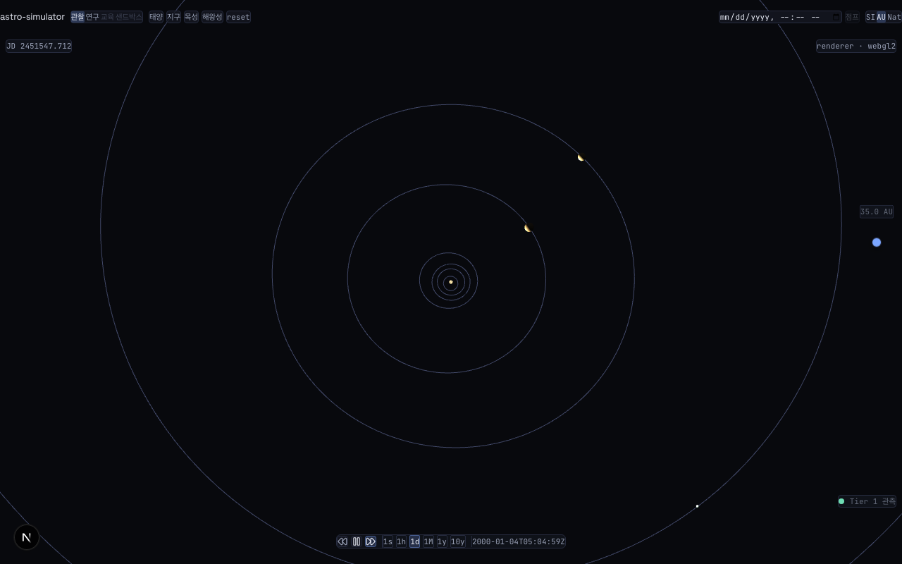
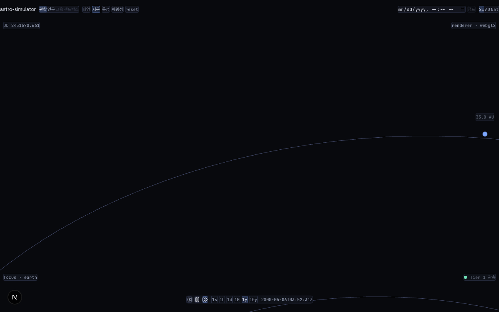
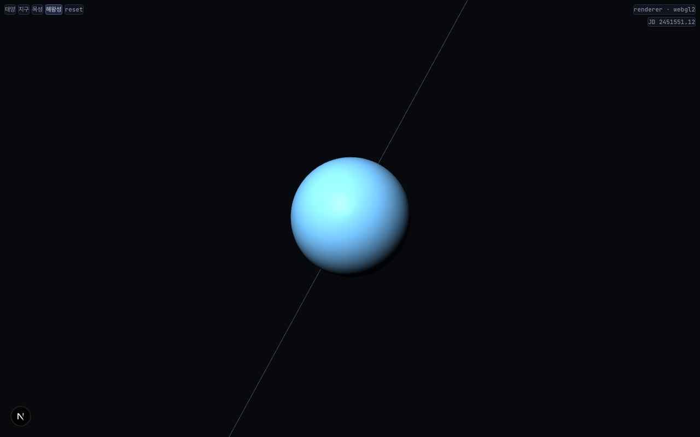
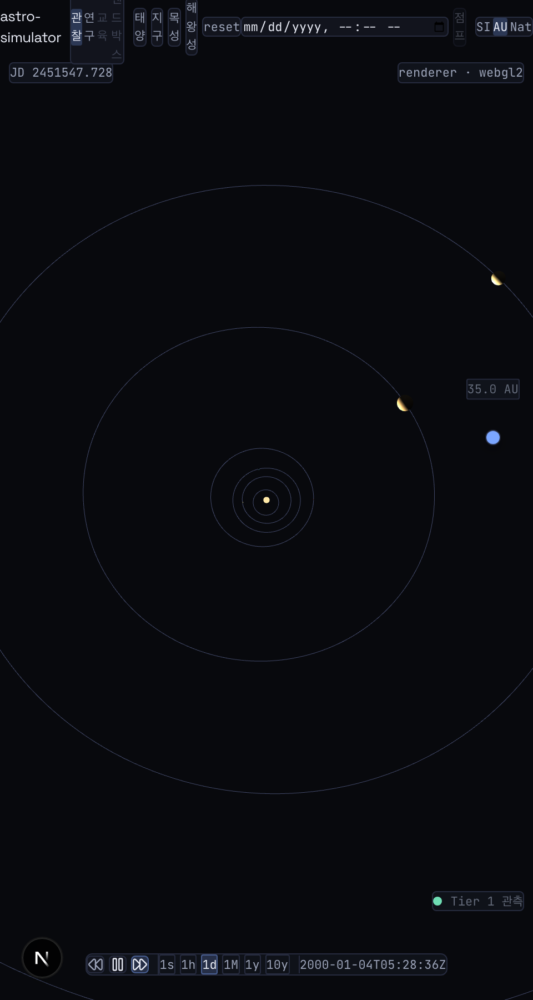

# astro-simulator

웹 기반 천체물리 시뮬레이터 — Babylon.js WebGPU 기반 멀티스케일 우주 탐험.

태양계를 기점으로 근거리 항성, 은하, 관측가능우주까지 연속 스케일로 탐험 가능하며, 관측 데이터 기반의 정확성과 가상 실험의 자유도를 동시에 제공한다.



---

## 현재 상태

**v0.3.0-p3** — P3 Barnes-Hut + WebGPU compute 완료 (2026-04-15)

- 태양계 18 바디 (행성 8 + 달 + 왜소행성 5 + 혜성 3 + 태양) 실시간 적분
- 5-mode 물리 엔진 토글: `kepler` / `newton` / `barnes-hut` / `webgpu` / `auto`
  - Kepler 2-body 해석해 (P1)
  - Newton N-body Velocity-Verlet, WASM (P2-A)
  - Barnes-Hut O(N log N) octree, WASM (P3-A) — theta=0.5 max err 4.99e-9
  - WebGPU compute shader (P3-B) — capability 미지원 시 자동 폴백
  - Auto: 환경/N에 따라 최적 엔진 자동 선택
- 소행성대 ThinInstances `?belt=N` 1~10000 (Kepler 해석해)
- 시간 제어 (재생/역행, ×1d/×1y 프리셋, julian date 정밀 jump)
- 질량 슬라이더 + "만약에" 시나리오 + URL 북마크 + 4-mode UI

## 스크린샷

| 전체 태양계                                 | 지구 포커스                                | 해왕성 30 AU                           | 모바일 480×900                        |
| ------------------------------------------- | ------------------------------------------ | -------------------------------------- | ------------------------------------- |
|  |  |  |  |

---

## 지향점

- **교육 도구** — 정확한 시각화로 천체물리 개념 전달
- **연구 시각화** — 실제 카탈로그 기반 데이터 탐색
- **몰입형 탐험** — 스케일 연속성, 시각적 완성도
- **물리 샌드박스** — 사용자 실험, 가상 시나리오

---

## 기술 스택

| 영역          | 선택                                         |
| ------------- | -------------------------------------------- |
| 렌더 엔진     | Babylon.js (WebGPU-first, WebGL2 폴백)       |
| UI 프레임워크 | Next.js 16 (App Router)                      |
| 언어          | TypeScript (strict + exactOptional)          |
| 패키지 매니저 | pnpm 10 (workspace 모노레포)                 |
| 상태 관리     | Zustand + nuqs + mitt + TanStack Query + zod |
| 스타일        | Tailwind v4 + Radix Primitives + CVA         |
| 애니메이션    | Framer Motion (LazyMotion)                   |
| 테스트        | Vitest + Playwright + @axe-core/playwright   |

---

## 아키텍처 원칙

- **이중 레이어 분리** — 순수 TS 시뮬레이션 코어 + Next.js UI 레이어
- **좌표계** — CPU float64 월드 + GPU RTE(Relative-to-Eye) float32
- **물리 적분기** — Leapfrog/Verlet 심플렉틱 (P2+, P1은 Kepler 해석해)
- **GPU 전략** — GPU-resident state, readback 최소화
- **데이터 신뢰성 Tier** — 모든 수치에 T1(관측)~T4(예술) 배지

상세: [`docs/phases/architecture.md`](./docs/phases/architecture.md)

---

## 프로젝트 구조

```
/apps
  /web                  Next.js 애플리케이션 (UI 레이어)
/packages
  /core                 @astro-simulator/core — 순수 TS 시뮬레이션 코어
                        (engine/coords/physics/scene/ephemeris/time/gpu)
  /shared               공용 타입/상수/이벤트 정의
/docs
  /phases               기획/아키텍처/Phase 문서
  /retrospectives       Phase 회고 + 성능/접근성/호환성 보고서
  /screenshots          릴리스 스크린샷
/scripts                검증 스크립트 (browser-verify-*.mjs)
```

---

## 시작하기

### 요구사항

- Node.js 20 이상 (권장: 24)
- pnpm 10 이상

### 설치 및 실행

```bash
pnpm install
pnpm dev        # apps/web 개발 서버 → http://localhost:3000
```

### 스크립트

```bash
# 개발
pnpm dev                  # Next.js dev server
pnpm build                # 전체 빌드 (core, shared, web)
pnpm typecheck            # 타입 체크
pnpm lint                 # ESLint
pnpm test                 # Vitest 전체 (core + shared + web)
pnpm format               # Prettier 포맷

# 브라우저 검증 (CRITICAL #3 준수)
pnpm verify:browser       # 데스크톱 1280×800 — 3단계 검증
pnpm verify:mobile        # 모바일 480×900
pnpm verify:scale         # 스케일 전환 (태양~해왕성)
pnpm verify:perf          # FPS 측정 (5 시나리오)
pnpm verify:a11y          # axe-core + 키보드 + 색약
pnpm verify:all           # 위 5개 순차 실행
```

---

## 테스트 현황

v0.3.0 종합 회귀 287/287 통과 — `docs/benchmarks/p3d-comprehensive-verify.md` 참조.

- **단위 테스트**: 211 (vitest)
  - core: 153 (gpu, physics, scene, coords, ephemeris, time)
  - web: 57 (store, layout, panels)
  - physics-wasm: 1 (binding smoke)
- **Rust**: 22
  - unit 18 (nbody + barnes_hut + capability)
  - integration 2 (barnes_hut_accuracy theta sweep + 1-year)
  - cargo doc-tests 0
- **E2E (Playwright)**:
  - verify:browser — 25 PASS
  - verify:scale — 9 PASS
  - verify:mobile — 7 PASS
  - verify:perf — 5 PASS (평균 ≥ 30 fps)
  - verify:a11y — 8 PASS (axe 위반 0건)
- **성능 (실 GPU, M1 Pro Metal, #116)**:
  - N=1000 / N=10000 모두 vsync cap 120 fps
  - 헤드리스는 software renderer 한계로 N에 비례 감소

---

## 로드맵

- **P1 — 태양계 MVP** ✅ (Kepler 해석해, 8행성 + 달)
- **P2 — N-body 전환** ✅ (Velocity-Verlet WASM, 18 바디, 소행성대)
- **P3 — Barnes-Hut + WebGPU** ✅ (octree O(N log N), WGSL compute, 5-mode 토글)
- **P4 — 소행성대 N-body 통합 + 일반상대론 + 모바일** (BH/GPU 가속비 실측, 수성 근일점)
- **P5 — 항성 진화 + 외계행성**
- **P6 — 은하·은하단**
- **P7 — 관측가능우주**
- **P8 — 물리 샌드박스 확장**

상세: [`docs/phases/roadmap.md`](./docs/phases/roadmap.md)

---

## 문서

### 기획

- [개발 기획서](./docs/phases/product-spec.md)
- [아키텍처 결정서](./docs/phases/architecture.md)
- [디자인 토큰](./docs/phases/design-tokens.md)
- [UI 아키텍처](./docs/phases/ui-architecture.md)
- [확장 로드맵](./docs/phases/roadmap.md)

### Phase별

- [P1 스프린트 계약](./docs/phases/P1-solar-system-mvp.md)

### 회고/보고서

- [P1 성능 측정](./docs/retrospectives/P1-perf.md)
- [P1 접근성](./docs/retrospectives/P1-a11y.md)
- [P1 브라우저 호환성](./docs/retrospectives/P1-browser-compat.md)
- [P1 회고](./docs/retrospectives/P1-retrospective.md)
- [P3 회고](./docs/retrospectives/p3-retrospective.md) — Barnes-Hut + WebGPU
- [harness v2.2.0 업데이트 회고](./docs/retrospectives/harness-update-2.2.0-retrospective.md)

### 벤치마크/측정

- [P2-D 실 GPU 성능](./docs/benchmarks/p2d-perf.md)
- [P3-A Barnes-Hut 정확도](./docs/benchmarks/p3a-barnes-hut-accuracy.md)
- [P3-A 성능 비교](./docs/benchmarks/p3a-perf.md)
- [P3-B WebGPU 측정](./docs/benchmarks/p3b-perf.md)
- [P3-D 종합 회귀](./docs/benchmarks/p3d-comprehensive-verify.md)

### ADR (아키텍처 결정)

- [WebGPU N-body 적분 스킴 (GPU-resident)](./docs/decisions/20260415-webgpu-integration-scheme.md)
- [decisions/](./docs/decisions/)

---

## 데이터 출처

- **궤도 요소**: Standish 1992 mean elements (JPL)
- **천문학 상수**: CODATA 2018, IAU 2012
- **Tier 1 표기**: 모든 수치가 관측/표준 레퍼런스 기반

이후 단계에서 JPL Horizons API, NASA Exoplanet Archive, Gaia DR3 추가 예정.

---

## 라이선스

MIT
