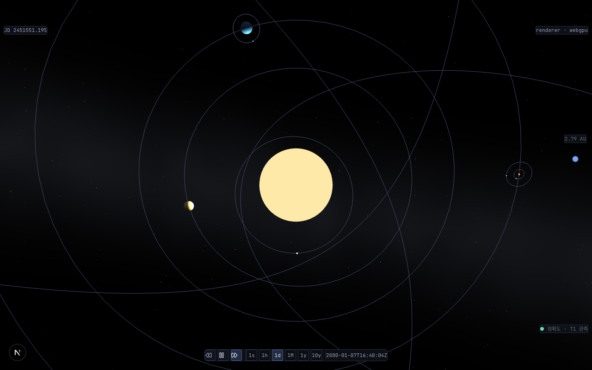
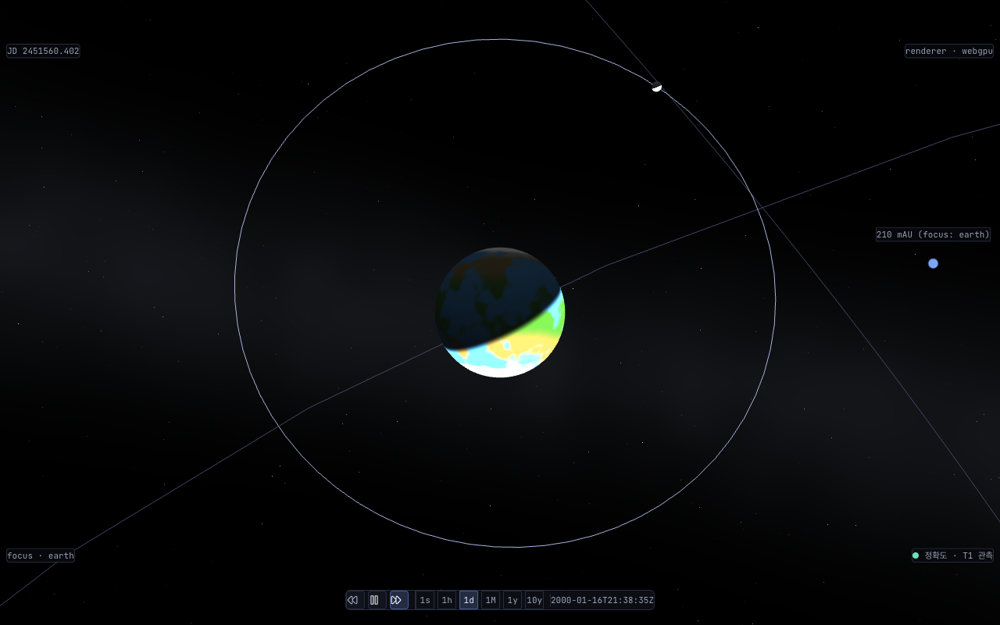
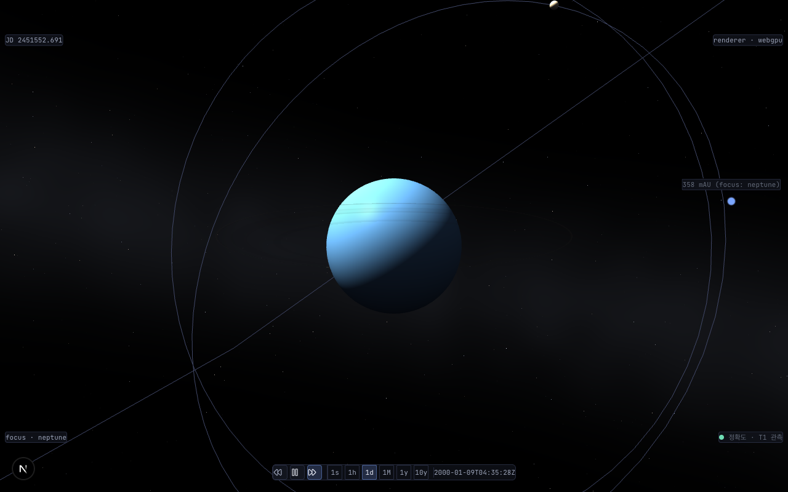
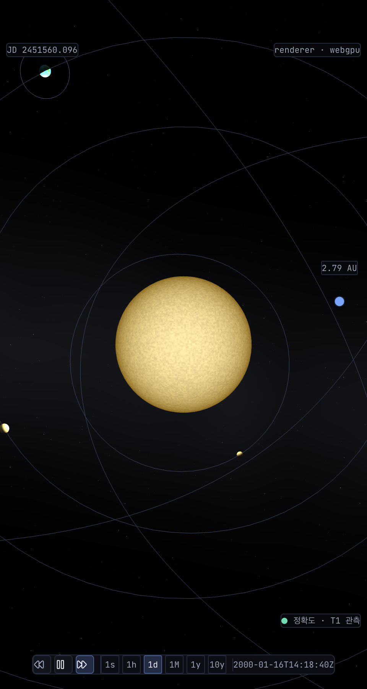

# astro-simulator

웹 기반 천체물리 시뮬레이터 — Babylon.js WebGPU 기반 멀티스케일 우주 탐험.

태양계를 기점으로 근거리 항성, 은하, 관측가능우주까지 연속 스케일로 탐험 가능하며, 관측 데이터 기반의 정확성과 가상 실험의 자유도를 동시에 제공한다.

**🌐 라이브 데모: <https://astro-simulator-web.vercel.app/ko>**



---

## 현재 상태

**v0.46.0** — 로드맵 v3 (Incremental Body-by-Body Build) 완주 + 트랙 A/B (몰입·온보딩) — 절차적 표면·태양 셰이더 + 자전·실광원 (2026-07-05)

- **태양계 32 body** — 태양 + 행성 8 + 위성 15 + 왜소행성 5 + 혜성 3, 실시간 적분 + 관측 데이터 기반 궤도/크기 시각화
  - 위성 15: 달 / 포보스·데이모스 / 갈릴레이 4 (이오·유로파·가니메데·칼리스토) / 타이탄·레아·이아페투스·엔셀라두스 / 티타니아·오베론 / 트리톤·프로테우스
  - 토성·천왕성·해왕성 고리 + 위성 궤도 per-body 시각 스케일 (작은 위성 가독성 보존)
- **body 탐색 인터랙션** — canvas 클릭/터치로 body·위성 직접 선택, 겹친 body 반복 클릭 순환(cycle), free-fly 카메라(WASD·패닝·줌 감도 조정), 작은 body glow pixel marker, 궤도선 toggle
- **5-mode 물리 엔진** 토글: `kepler` / `newton` / `barnes-hut` / `webgpu` / `auto`
  - Kepler 2-body 해석해 / Newton N-body Velocity-Verlet WASM / Barnes-Hut O(N log N) octree (theta=0.5 max err 4.99e-9) / WebGPU compute shader (미지원 시 자동 폴백) / Auto 최적 엔진 선택
- 소행성대 ThinInstances `?belt=N` 1~10000 (Kepler 해석해)
- 시간 제어 (재생/역행, ×1d/×1y 프리셋, julian date 정밀 jump) + 질량 슬라이더 + "만약에" 시나리오 + URL 북마크
- **우주 환경 + 온보딩** — 절차적 별 배경 + 은하수 (`infiniteDistance` 천구 + 단일 draw call shader, 신규 에셋 0, `?stars=off` 토글) / 첫 진입 온보딩 + 조작 가이드 모달 (소프트웨어 렌더 환경은 별 배경 자동 비활성 — fill-rate graceful degradation)
- **절차적 표면 & 광원 (전부 에셋 0 셰이더)** — 행성 표면 4종 (지구 대륙·극관·biome 위도색 / 화성 dust / 목성 밴드 / 달 크레이터) + 태양 emissive granulation·limb darkening·색온도 + 행성 자전 (NASA sidereal period + IAU 자전축, 금성·천왕성 역행) + 실제 태양 광원 밤면/terminator 명암 + 천체 표시 크기 비율 단조 보존 (sqrt 압축, `?surface=off`/`?rotate=off` 토글)

## 스크린샷

| 전체 태양계                                 | 지구 포커스                                | 해왕성 30 AU                           | 모바일 480×900                        |
| ------------------------------------------- | ------------------------------------------ | -------------------------------------- | ------------------------------------- |
|  |  |  |  |

---

## 지향점

- **교육 도구** — 정확한 시각화로 천체물리 개념 전달
- **연구 시각화** — 실제 카탈로그 기반 데이터 탐색
- **몰입형 탐험** — 스케일 연속성, 시각적 완성도
- **물리 샌드박스** — 사용자 실험, 가상 시나리오

---

## 기술 스택

| 영역          | 선택                                         |
| ------------- | -------------------------------------------- |
| 렌더 엔진     | Babylon.js (WebGPU-first, WebGL2 폴백)       |
| UI 프레임워크 | Next.js 16 (App Router)                      |
| 언어          | TypeScript (strict + exactOptional)          |
| 패키지 매니저 | pnpm 10 (workspace 모노레포)                 |
| 상태 관리     | Zustand + nuqs + mitt + TanStack Query + zod |
| 스타일        | Tailwind v4 + Radix Primitives + CVA         |
| 애니메이션    | Framer Motion (LazyMotion)                   |
| 테스트        | Vitest + Playwright + @axe-core/playwright   |

---

## 아키텍처 원칙

- **이중 레이어 분리** — 순수 TS 시뮬레이션 코어 + Next.js UI 레이어
- **좌표계** — CPU float64 월드 + GPU RTE(Relative-to-Eye) float32
- **물리 적분기** — Leapfrog/Verlet 심플렉틱 (P2+, P1은 Kepler 해석해)
- **GPU 전략** — GPU-resident state, readback 최소화
- **데이터 신뢰성 Tier** — 모든 수치에 T1(관측)~T4(예술) 배지

상세: [`docs/phases/architecture.md`](./docs/phases/architecture.md)

---

## 프로젝트 구조

```
/apps
  /web                  Next.js 애플리케이션 (UI 레이어)
/packages
  /core                 @astro-simulator/core — 순수 TS 시뮬레이션 코어
                        (engine/coords/physics/scene/ephemeris/time/gpu)
  /shared               공용 타입/상수/이벤트 정의
/docs
  /phases               기획/아키텍처/Phase 문서
  /retrospectives       Phase 회고 + 성능/접근성/호환성 보고서
  /screenshots          릴리스 스크린샷
/scripts                검증 스크립트 (legacy — 신규 verify 는 apps/web/scripts, #793 규약)
```

---

## 시작하기

### 요구사항

- Node.js **22.16.0** (`.node-version` 고정 — Playwright extract deadlock 회피, [#606](https://github.com/coseo12/astro-simulator/issues/606))
- pnpm 10 이상

### 설치 및 실행

```bash
pnpm install
pnpm dev        # apps/web 개발 서버 → http://localhost:3000
```

### 스크립트

```bash
# 개발
pnpm dev                  # Next.js dev server
pnpm build                # 전체 빌드 (core, shared, web)
pnpm typecheck            # 타입 체크
pnpm lint                 # ESLint
pnpm test:unit            # Vitest 전체 (core + shared + web + physics-wasm)
pnpm format               # Prettier 포맷

# 브라우저 검증 (CRITICAL #3 준수)
pnpm verify:browser       # 데스크톱 1280×800 — 3단계 검증
pnpm verify:mobile        # 모바일 480×900
pnpm verify:scale         # 스케일 전환 (태양~해왕성)
pnpm verify:perf          # FPS 측정 (5 시나리오)
pnpm verify:a11y          # axe-core + 키보드 + 색약
pnpm verify:all           # 위 5개 순차 실행
```

---

## 테스트 현황

- **단위 테스트** (Vitest): core 710+ / web 390+ / shared / physics-wasm — scene·physics·coords·ephemeris·gpu·time + store·panels·picking + 셰이더 GLSL↔JS 미러 parity
- **Rust** (cargo): nbody + barnes_hut + capability (unit + integration theta sweep / 1-year)
- **브라우저 검증** (Playwright + agent-browser): `browser-verify-*.mjs` — body 선택/궤도/focus 정합/fps/a11y 3단계 검증
- **CI 가드**: r1-ui-regression / fps-baseline (fresh-runner escalation) / a11y-baseline / shader-pixel (표면·광원·자전 verify 6종) / R-Phase allowlist 정합 / per-body orbit scale
- **성능** (실 GPU, M1 Pro Metal): N=1000/10000 vsync cap 120 fps (헤드리스 software renderer 는 N 비례 감소)

---

## 로드맵

### 기반 — 물리 엔진 (P1~P3) ✅

- **P1 — 태양계 MVP** (Kepler 해석해, 8행성 + 달)
- **P2 — N-body 전환** (Velocity-Verlet WASM, 소행성대)
- **P3 — Barnes-Hut + WebGPU** (octree O(N log N), WGSL compute, 5-mode 토글)

### 로드맵 v3: Incremental Body-by-Body Build ✅ 완주

태양부터 하나씩 사용자가 실제로 보이는 body 를 점진 추가하는 재구성. (v2 Fact-First 기반 P10~P17 은 기본 진입 화면 UX 회귀로 전면 폐기 — [volt #74](https://github.com/coseo12/volt/issues/74))

- **R1~R10** — 태양 → 행성 8 + 고리 → 위성 → 왜소행성 5 → 혜성 3 (27 body)
- **R11~R12** — 토성 위성 3 (Rhea/Iapetus/Enceladus) + 거성 위성 2 (Oberon/Proteus) → 32 body
- **인터랙션** — 클릭/터치 선택, 겹침 cycle, free-fly 카메라, glow pixel marker, 궤도선 toggle

상세: [`docs/phases/roadmap-v3-incremental.md`](./docs/phases/roadmap-v3-incremental.md). 폐기된 v1/v2 구상은 [`docs/deprecated/`](./docs/deprecated/) 참조.

### 현행 — 트랙 A/B (v3 완주 이후 작업 축)

- **트랙 A 몰입** — 별 배경·은하수 → 표면 셰이더 4종 → 광원 일관성·대륙 → 자전 → 태양 셰이더 → 지구 극관·biome (완료 9건). 후보 백로그: 바다 깊이색 / 대기 fresnel / 구름 / 야간 불빛 / 코로나 / sunspot / 사운드
- **트랙 B 온보딩** — 첫 진입 온보딩 + 조작 가이드, a11y AA 대비 전수 (1라운드 완료)

상세: [`docs/phases/roadmap-track-ab.md`](./docs/phases/roadmap-track-ab.md)

---

## 문서

### 기획

- [개발 기획서](./docs/phases/product-spec.md)
- [아키텍처 결정서](./docs/phases/architecture.md)
- [디자인 토큰](./docs/phases/design-tokens.md)
- [UI 아키텍처](./docs/phases/ui-architecture.md)
- [로드맵 v3 — Incremental Body-by-Body Build (완주)](./docs/phases/roadmap-v3-incremental.md)
- [로드맵 트랙 A/B — v3 완주 이후 작업 축 (현행)](./docs/phases/roadmap-track-ab.md)
- [아키텍처 원칙](./docs/architecture/principles.md) — §1 Visual Fidelity (데이터 SSoT 보존 + 렌더링 왜곡 허용)
- [용어집](./docs/glossary.md) — R-Phase / Tier / Floating Origin / focus 등
- 폐기된 v1/v2 구상 + Fact-First 원칙: [`docs/deprecated/`](./docs/deprecated/)

### Phase별

- [P1 스프린트 계약](./docs/phases/P1-solar-system-mvp.md)

### 회고/보고서

- [P1 성능 측정](./docs/retrospectives/P1-perf.md)
- [P1 접근성](./docs/retrospectives/P1-a11y.md)
- [P1 브라우저 호환성](./docs/retrospectives/P1-browser-compat.md)
- [P1 회고](./docs/retrospectives/P1-retrospective.md)
- [P3 회고](./docs/retrospectives/p3-retrospective.md) — Barnes-Hut + WebGPU
- [harness v2.2.0 업데이트 회고](./docs/retrospectives/harness-update-2.2.0-retrospective.md)

### 벤치마크/측정

- [P2-D 실 GPU 성능](./docs/benchmarks/p2d-perf.md)
- [P3-A Barnes-Hut 정확도](./docs/benchmarks/p3a-barnes-hut-accuracy.md)
- [P3-A 성능 비교](./docs/benchmarks/p3a-perf.md)
- [P3-B WebGPU 측정](./docs/benchmarks/p3b-perf.md)
- [P3-D 종합 회귀](./docs/benchmarks/p3d-comprehensive-verify.md)

### ADR (아키텍처 결정)

- [WebGPU N-body 적분 스킴 (GPU-resident)](./docs/decisions/20260415-webgpu-integration-scheme.md)
- [decisions/](./docs/decisions/)

---

## 데이터 출처

- **행성 궤도 요소**: Standish 1992 mean elements (JPL)
- **위성 궤도 요소**: JPL Horizons API (parent-centric J2000 Ecliptic osculating, 2026-01-01 TDB epoch) + NASA Planetary Fact Sheet (반장축·이심률)
- **천문학 상수**: CODATA 2018, IAU 2012
- **데이터 신뢰성 Tier**: 모든 수치에 T1(관측)~T4(예술) 배지

이후 단계에서 NASA Exoplanet Archive, Gaia DR3 추가 예정.

---

## 라이선스

MIT
