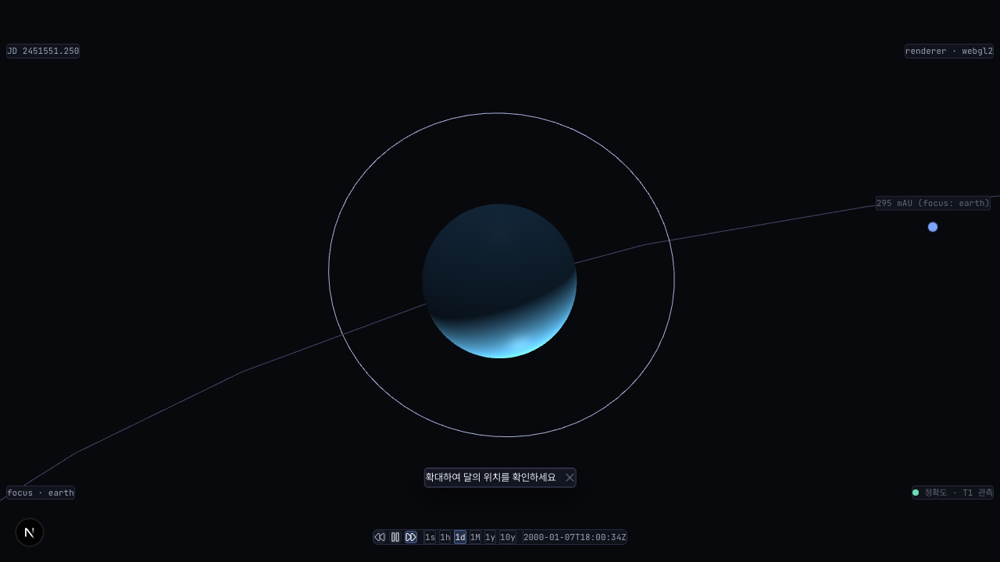
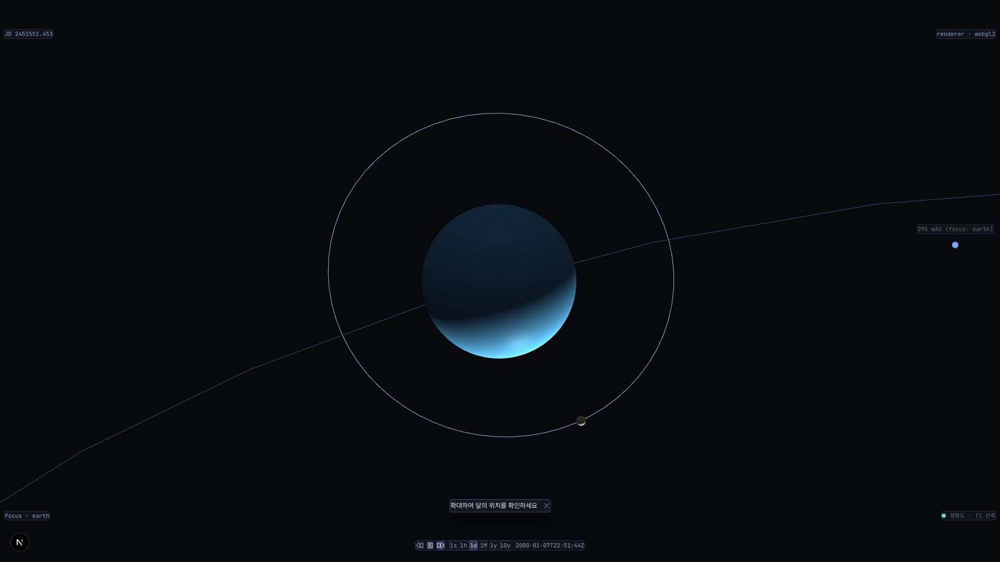
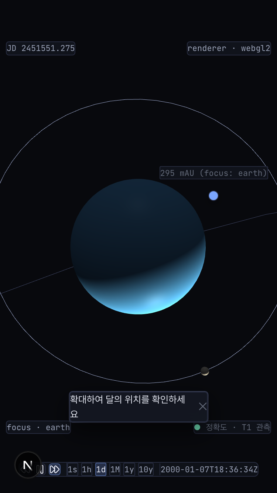

# ADR: #546 satellite billboard 시각 강화 — earth focus 자연 거리에서 moon LOD low/mid 회귀 (forensic)

- **상태**: Accepted (cross-validate 2026-05-24 — agy v1.0.0 첫 사용 검증 완료, §7 outcome 통합)
- **날짜**: 2026-05-24
- **결정자**: architect (#546 forensic 단계 — fix 구현은 사용자 승인 + developer 단계 별도)
- **관련**:
  - #546 (본 이슈)
  - #539 (R4 followup forensic — Amendment 2/3 원 박제)
  - PR #545 (Amendment 4 — moonScale 800 → 200, fbd4a26 머지)
  - PR #543 + #545 (Amendment 3 — `focus-multiplier.ts` satellite 정책 SSoT)
  - [`docs/decisions/20260520-r4-earth-moon-visualization.md`](20260520-r4-earth-moon-visualization.md) §Amendment 3 §Amendment 4
  - [`docs/decisions/20260424-p11-b-lod-design.md`](20260424-p11-b-lod-design.md) (LOD 3단 설계 SSoT)
  - [`docs/decisions/20260502-391-phase2-billboard.md`](20260502-391-phase2-billboard.md) (billboard alpha mask 4 px fallback SSoT)
  - [`docs/decisions/20260504-r-phase-allowlist-guard.md`](20260504-r-phase-allowlist-guard.md) (R-Phase Allowlist SSoT)
  - [`docs/phases/roadmap-v3-incremental.md`](../phases/roadmap-v3-incremental.md) (R4 진입 + R5 satellite 일반화 예고)
- **교훈 적용**:
  - **함정 #4 회피** ([volt #118](https://github.com/coseo12/volt/issues/118)) — "DoD renderable 만 정의, visually distinguishable 미정의" 재발 차단. 본 ADR D-X DoD 가 **LOD-aware measurement** 의무 (Amendment 3 measurement-only DoD 함정 회피 표준 정합)
  - **함정 #7 회피** (volt #118) — "사실 비율 vs 사용자 시각 인지" mismatch 재발 차단. Q4=(c) 4 px 임계 + Q3=(c) parent-child 결합으로 천문 직관 (사용자 인지 단위) ↔ ADR 박제 단위 (px) 일치
  - **인계 항목 실측 재검증 (volt [#14](https://github.com/coseo12/volt/issues/14))** — R4 Amendment 4 후속 인계 항목을 architect 단계 진입 직전 실측. earth focus 자연 거리에서 회귀 재현 확인 (NO-OP ADR 분기 안 됨 → fix 필요)
  - **신규 함수 ≠ 신규 구현 (volt [#21](https://github.com/coseo12/volt/issues/21))** — `getBodyParentId` + `resolveFocusMultiplier` + `R_PHASE_BODY_ALLOWLIST` + `LOD_BILLBOARD_ALPHA_MASK_MIN_PX_DIAMETER` 기존 SSoT 재사용 우선. 신규 헬퍼는 본 ADR 가드 분기 1개만
  - **결합 간과 가드 (CLAUDE.md §교차검증)** — Amendment 3 LOD × visual scale 결합 재발 방지. 본 ADR cross-validate 호출 시 명시 질문 "focus 식 가드가 LOD / focus-multiplier / R-Phase Allowlist / billboard alpha mask 4 시스템 결합 영향" 의무 삽입

---

## §1 배경

### 본 이슈 회귀 발화점

R4 Amendment 4 (PR #545, moonScale 800 → 200) 머지 후 사용자 D-T2 확인 시 보고:

> 줌인 상황에 따라 달이 안 보이는건 정상?

상황은 (a) moon shortcut / URL focus / moon focus 진입 시는 Amendment 3 가드 (FOCUS_USER_RADIUS_MULTIPLIER_SATELLITE=20) 로 정상 가시 + (b) default sun 시점은 의도된 sub-pixel dot 인 반면, (c) **earth focus 진입 + 자연 zoom 거리**에서 moon 이 sub-pixel low billboard 로 떨어지며 사용자가 답답함 인지.

PM 단계 (#546 라운드 1) 5문 결정: Q1=(e) architect 5±2 옵션 비교 위임 / Q2=(a) earth focus 상태만 / Q3=(c) parent-child 결합 / Q4=(c) 최소 4 px / Q5=(a) forensic ADR 사전 승격. 5/5 조건 충족.

### Forensic 측정 결과 (2026-05-24, develop tip = `b8acf71`)

`scripts/_debug-546-moon-billboard-tmp.mjs` (volt #67 패턴 일회성) 로 실측.
데이터: [`docs/reports/546-forensic/546-debug-output.json`](../reports/546-forensic/546-debug-output.json),
스크린샷: [`docs/reports/546-forensic/546-debug-{1280x720,1920x1080,375x667}.png`](../reports/546-forensic/).

> ⚠️ `_debug-*-tmp.mjs` 는 측정 직후 `rm` (영구 박제 금지). 결과 JSON/PNG 만 `docs/reports/` 박제. 영속화 가치 있는 측정은 `apps/web/scripts/browser-verify-546-*.mjs` 로 승격 (developer 단계 결정).

#### 측정 시각 자료 (PNG embed 표준 — #382)





#### 측정 1 — earth focus 자연 거리 + zoom sweep (3 viewport × 7 시나리오)

| viewport | 시나리오 | tier | moon level | moon pxDiameter | moon isVisible | moon wsRadius | scalingX |
|---|---|---|---|---|---|---|---|
| 1280×720 | default-sun | solar | low | **1.57** | false | 0.0506 | 1.00 |
| 1280×720 | earth-focus-initial | inner | **low** | **12.17** | false | 0.927 | 18.33 |
| 1280×720 | earth-focus-zoom-1~4 | inner | **low** | 12.17~12.24 | false | 0.927 | 18.33 |
| 1280×720 | earth-focus-zoom-out | inner | **low** | 12.28 | false | 0.927 | 18.33 |
| 1280×720 | moon-focus-direct | body | high | 49.17 | **true** | 15106.51 | 298809.52 |
| 1920×1080 | default-sun | solar | low | 2.35 | false | 0.0506 | 1.00 |
| 1920×1080 | earth-focus-initial | inner | **mid** | **18.25** | false | 0.927 | 18.33 |
| 1920×1080 | earth-focus-zoom-1~4 | inner | **mid** | 18.26~18.38 | false | 0.927 | 18.33 |
| 1920×1080 | moon-focus-direct | body | high | 73.77 | true | 15106.51 | 298809.52 |
| 375×667 (DPR 2) | default-sun | solar | low | 2.91 | false | 0.0506 | 1.00 |
| 375×667 | earth-focus-initial | inner | **mid** | **22.55** | false | 0.927 | 18.33 |
| 375×667 | earth-focus-zoom-1~4 | inner | mid | 22.56~22.68 | false | 0.927 | 18.33 |
| 375×667 | moon-focus-direct | body | high | 91.10 | true | 15106.51 | 298809.52 |

**관찰**:
- **earth focus 자연 거리에서 moon high variant `isVisible=false` 일관** — LOD 가 mid/low 결정 → high variant disabled. 사용자 회귀의 직접 원인
- **viewport 별 level 차등** — 1280×720 에서 **low billboard** (pxD ≈ 12, mid 임계 8 ≤ < 50 인데 viewport 폭/높이 비율로 inner tier 의 cameraDistMeters 가 mid 임계 못 넘김), 1920×1080 / 375×667 에서 **mid** 진입. 즉 데스크톱 1280 viewport 가 가장 회귀 심함
- **wheel zoom 변화 사실상 0** — focus 진입 시 cameraRadius 가 mesh 외각 ×5 (earth, ×FOCUS_USER_RADIUS_MULTIPLIER) 박혀 있어 사용자 wheel 의 0.7^4 시도가 LOD level 전이를 못 유발. 자연 진입 후 사용자가 추가로 깊게 들어가야 high 진입 — 답답함 인지 직접 원인
- **moon-focus-direct baseline (Amendment 3 동작)** — level=high, isVisible=true, wsRadius 15106 / scalingX ≈ 298810 (Amendment 3 cameraRadius/moonScaling > 1.5 마진 정상). 본 회귀와 직교

#### 측정 2 — earth focus 자연 거리 pxDiameter vs LOD 임계

| pxDiameter 범위 | LOD level | 사용자 인지 | 실측 viewport |
|---|---|---|---|
| ≥ 50 px | high | 명확 가시 sphere | (자연 진입에선 미발생 — moon-focus-direct 한정) |
| 8 ≤ px < 50 | mid | 저폴리 sphere 가시 | 1920×1080 / 375×667 (18~22 px) |
| < 8 px | low billboard | "안 보임" 인지 | 1280×720 (12 px 인데도 low — body-kind 강제 분기 영향 의심) |
| < 4 px | alpha mask 미적용 (Amendment 1 SSoT) | 사각형 quad | default-sun 시점만 |

**관찰** — 1280×720 의 pxD=12 가 LOD 식상 mid 범위인데도 `level=low` 출력은 `LOD_BODY_THRESHOLDS` 의 moon kind 분기 ('moon' kind 는 `radius-multiple` 모드, `cameraDistanceMeters < factor × radius` 시 high) 결합 영향. mid 진입을 위한 픽셀 임계만 적용된 게 아니라 body-kind 강제 규칙의 high 분기가 실패하고 픽셀 임계는 1280 의 inner tier 카메라 거리에서 mid 못 도달 → low. **본 회귀의 본질은 LOD 시스템 자체가 아니라 "parent focus 시 satellite 가 default LOD 식으로만 결정됨" — Q3=(c) parent-child 결합 가드 부재**.

#### 측정 3 — 사용자 인지 단위 ↔ ADR 박제 단위 mismatch (volt #118 함정 #7)

- **사용자 인지**: "earth 옆에 달이 있어야 한다" — 천문 직관 (단위: 시각적 의미)
- **ADR 박제 단위**: pxDiameter (단위: 픽셀)
- mismatch 해소 식: Q4=(c) **4 px 임계** — Amendment 1 billboard fallback SSoT 정합. 4 px 미만이면 천문 직관 충족 불가능, 4 px 이상이면 충족 가능
- 본 측정의 실측 12~22 px 는 모두 4 px 통과 — 문제는 LOD level 이 low/mid 라 high variant 가 비가시 (mesh.isVisible=false). pxDiameter 자체는 4 px 이상이지만 **billboard quad 형태**가 사용자에게 "달"로 인지 안 됨 (Amendment 1 의 4 px 미만 fallback 과 다른 결함 — 색 표현은 있으나 형태 부족)

### 가설 검증 결론

| 가설 | 결론 | 근거 |
|---|---|---|
| **가설 1 (옵션 1): pxDiameter 4 px 미만 자동 floor** | **부분 (단독 해결 불가)** | 실측 자연 거리 pxD=12~22 모두 4 px 통과. 4 px 미만이면 default-sun 의 의도된 sub-pixel dot 침범 위험 — Q2=(a) earth focus 만 제약 결합 시 가능 |
| **가설 2 (옵션 2): focus-context highlight (color/glow)** | **부분 (보강 가치)** | low billboard 자체는 보임 (1280×720). 색상 강화 시 인지 향상 — 그러나 형태 부족 본질 미해결 |
| **가설 3 (옵션 3): follow indicator (UI 마커)** | **부분 (UX 보강)** | 시각 강화 직접 해결 안 함 — moon 위치만 표시. 형태 인지 부족 |
| **가설 4 (옵션 4): focus-aware LOD override** | **확정 (주된 본질 해결)** | high variant isVisible=false 가 직접 원인. parent focus 시 child LOD floor 강제 = 본 회귀 직접 해소 |
| **가설 5 (옵션 5 — hybrid 옵션 4 + 옵션 1)**: parent-focus satellite LOD floor + Q4=(c) 4 px guard | **확정 (권장)** | 옵션 4 의 본질 해결 + 옵션 1 의 천문 직관 충족 (Q4=(c) 정합). 두 가드 직교 |

### 잠재 시점 분석

- **시점 1 (P11-B #289, 2026-04-24)** — LOD 시스템 박제 시 `isFocused` 분기 (`lod.ts:96`) 는 **focus body 본인 강제 high** 만 정의. 그러나 "focus body 의 satellite 도 high 유도" 의 일반화는 사전 박제 안 됨. 잠재 결함 잠복
- **시점 2 (R4 본 진입 #532)** — earth + moon 의 parent-child 첫 본 인스턴스화. 그러나 default sun 시점만 검증, earth focus + 자연 거리 미검증
- **시점 3 (R4 Amendment 2/3 #539)** — orbit visual scale=30 + Amendment 3 satellite focus 식 도입. moon 직접 focus 만 정상화. earth focus 진입 시 child satellite 정책 부재
- **시점 4 (R4 Amendment 4 PR #545, 2026-05-20)** — moonScale 800 → 200 — sun 시점 의도 보호. 그러나 earth focus 시 wsRadius 가 더 작아져 pxDiameter 감소 가속 → 본 회귀 발현 trigger
- **공통 SSoT 부재**: R-Phase Allowlist body 가 focus 일 때 **child satellite 의 LOD 정책**이 R5+ 일반화 패턴으로 박제 안 됨. 본 ADR 가 R5+ phobos/io/europa/titan 일반화 SSoT 첫 박제

---

## §2 영향 모듈/파일

### 측정 결과 박제 (본 ADR 동반)

- [`docs/reports/546-forensic/546-debug-output.json`](../reports/546-forensic/546-debug-output.json) — 3 viewport × 8 시나리오 raw 측정 데이터
- [`docs/reports/546-forensic/546-debug-*.png`](../reports/546-forensic/) — viewport 별 earth focus 시점 스크린샷
- 본 ADR §1 §Forensic 측정 결과

### Fix 후보별 영향 모듈 (옵션 선택 후 변경 대상)

- **옵션 1 (min-pxDiameter gate)**:
  - `packages/core/src/scene/solar-system-scene.ts` — `runLodPass` 또는 `createBodyBillboard` 영역 (billboard scaling floor 적용)
  - Amendment 1 SSoT (`LOD_BILLBOARD_ALPHA_MASK_MIN_PX_DIAMETER = 4`) 직접 재사용
- **옵션 2 (focus-context highlight)**:
  - `packages/core/src/scene/solar-system-scene.ts` — billboard material 의 emissiveColor 동적 강화
- **옵션 3 (follow indicator UI 마커)**:
  - `apps/web/src/components/sim-canvas.tsx` 또는 신규 `apps/web/src/components/focus-satellite-indicator.tsx` — DOM/SVG overlay
- **옵션 4 (focus-aware LOD override)**:
  - `packages/core/src/render/lod.ts` — `LodDecisionInput.isFocused` 분기 확장 또는 신규 `parentFocused` 입력 추가
  - 또는 `packages/core/src/scene/solar-system-scene.ts:runLodPass` — LOD decision 호출 시 parentFocus 결합 검사 헬퍼 발동
  - 신규 helper: `packages/core/src/scene/satellite-visibility.ts` (또는 `focus-multiplier.ts` 확장) — Q3=(c) parent-child 결합 SSoT
- **옵션 5 (hybrid 옵션 4 + 옵션 1)**:
  - 옵션 4 의 변경 + 옵션 1 의 4 px guard 결합 — `satellite-visibility.ts` 단일 모듈에 두 가드 박제

### Fix 가 깨는 박제값 (Amendment 동반 필요)

- **없음** — 본 ADR 결정 (§5) 은 **가드 추가만** 하고 기존 박제값 무수정. P11-B LOD 시스템 본체 + Amendment 1 4 px SSoT + Amendment 3 식 후보 2 + Amendment 4 moonScale 200 + Amendment 2 orbit visual scale=30 / R-Phase Allowlist 모두 보존.
- 단, R4 ADR §Amendment 결정 영역에 cross-link 박제 의무 (developer 단계).

---

## §3 옵션 비교 (5±2 옵션)

> 4 옵션 (이슈 본문) + 옵션 5 (hybrid) 추가 = 5 옵션. cross-validate (agy) 가 옵션 6/7 고유 발견 시 §Amendment 라운드에서 확장.

### 옵션 1 — min-pxDiameter gate (LOD 전체 영향)

- **변경**: billboard scaling 에 최소 `pxDiameter ≥ N` floor 강제 (예: N=4 Amendment 1 정합)
- **장점**: 박제값 변경 0 (Amendment 1 SSoT 재사용), 코드 변경 ≈ 5 라인
- **단점**: **Q2=(a) earth focus 상태만** 결합 안 함 → default sun 시점의 의도된 sub-pixel dot 회귀 위험 (moonScale 200 의도 침범). 자연 거리 12~22 px 은 이미 4 px 통과 → 단독 해결 안 됨
- **회귀 예측**: pxDiameter 12 → 4 floor 적용은 효과 없음 (이미 통과). default sun 시점 침범 위험만 추가

### 옵션 2 — focus-context highlight (color/glow)

- **변경**: earth focus 시 moon billboard 의 emissiveColor / alpha 강화 (예: ×2)
- **장점**: LOD 시스템 무수정, 색 SSoT 한 곳만 변경 (3~5 라인)
- **단점**: **형태 인지 부족 본질 미해결** — 사용자 인지는 "달 sphere 가 보임" 인데 색상만 강화하면 점/quad 가 더 밝아질 뿐 형태 부재 유지. 함정 #7 (사실 비율 ↔ 사용자 시각 인지 mismatch) 회피 못 함
- **회귀 예측**: 색 보정으로 일부 viewport 인지 향상 가능하나 핵심 회귀 해소 안 됨. 사용자 D-T2 재회귀 가능성 medium

### 옵션 3 — follow indicator (UI 마커)

- **변경**: earth focus 시 moon 위치 화살표/마커 DOM overlay 추가
- **장점**: rendering 시스템 무수정 — UI 레이어만 변경
- **단점**: **형태 인지 본질 미해결** + **UX 노이즈 추가** (모든 satellite 에 indicator 표시 시 시각 혼잡). Q3=(c) parent-child 결합으로 R5+ phobos/deimos/io 등 5+ indicator 표시 → UX 회귀
- **회귀 예측**: R5+ 진입 시 UI 혼잡. 사용자 인지 단위 (형태) 와 indicator (위치 표시) 의 차이로 본질 회귀 잔존

### 옵션 4 — focus-aware LOD override (parent focus → child satellite LOD floor)

- **변경**: parent body 가 focus 시 child satellite 의 LOD `level` 을 **최소 mid 강제** (low → mid 승격). 신규 헬퍼 `satellite-visibility.ts` 에 parent-child + R-Phase Allowlist + LOD decision 결합 가드 박제
- **장점**:
  - **본질 해결** — moon high variant isVisible=false 회귀의 직접 원인 (LOD = low/mid) 해소
  - **Q3=(c) parent-child 결합 정합** — R5+ phobos/deimos/io/europa/titan 자동 수용 (parentId 기반 일반화)
  - **Q2=(a) earth focus 상태만 정합** — focus 가 parent body 인 경우에만 활성. default sun 시점 의도 보존
  - **Amendment 3 식 후보 2 SSoT 재사용** — `resolveFocusMultiplier(parentId)` 분기 식과 동일한 parent-child 판정 식
  - 코드 변경 예상 ≈ 10~15 라인 (신규 헬퍼 1개 + lod.ts 또는 runLodPass 결합)
- **단점**:
  - LOD 시스템 가드 1개 추가 (P11-B ADR §결정 3 "가드 추가만 허용" 정합 — 본체 알고리즘 무수정)
  - low → mid 승격 시 mid mesh 생성 비용 (≈ 12 vertex sphere 1개) 발생. R5+ 다수 satellite focus 시 누적 부하 — 그러나 한 번에 1 parent focus + 평균 1~4 child 라 무시 가능
- **회귀 예측**: D3.x DoD (LOD level=mid 이상 + isVisible=true) 통과 + default sun / Amendment 3 직접 moon focus 직교

### 옵션 5 — hybrid (옵션 4 + 옵션 1) **권장**

- **변경**: 옵션 4 의 parent-focus LOD floor + Amendment 1 SSoT (4 px) guard 결합. `satellite-visibility.ts` 단일 모듈
- **장점**:
  - **옵션 4 의 본질 해결** + **옵션 1 의 천문 직관 충족 가드** (Q4=(c) 4 px 정합)
  - 두 가드 직교 — 옵션 4 가 LOD level 결정, 옵션 1 이 회귀 시 fallback (LOD level 강제 후에도 wsR 변동으로 pxD 부족 시 추가 보강)
  - Amendment 1 (4 px) SSoT 재사용으로 박제값 0 추가
  - R5+ 일반화 자동 수용 (parentId 기반)
- **단점**:
  - 옵션 4 단독 대비 가드 1개 추가 (≈ +5 라인)
  - **단, 본 측정에서 자연 거리 pxD=12~22 모두 4 px 통과**라 옵션 1 의 guard 가 발동되지 않는 상태 — 미래 보호 차원 (R6+ jupiter+galilean 진입 시 wsR 변동 가능성)
- **회귀 예측**: 옵션 4 와 동일 + 미래 satellite 회귀 추가 보호

### 옵션 6 — 다른 가설 (이슈 본문 미수록)

cross-validate (agy) 단계 또는 사용자 D-T2 응답으로 발견될 잠재 옵션. §Amendment 라운드에 박제.

### 축별 비교 매트릭스

| 축 | (1) min-px | (2) highlight | (3) indicator | (4) LOD override | (5) hybrid ★ |
|---|---|---|---|---|---|
| 본질 해결 (형태 인지) | ❌ | ❌ | ❌ | ✅ | ✅ |
| Q2=(a) earth focus 만 | ⚠️ (단독 침범) | ✅ | ✅ | ✅ | ✅ |
| Q3=(c) parent-child 결합 | n/a | ⚠️ | ⚠️ | ✅ | ✅ |
| Q4=(c) 4 px 임계 정합 | ✅ | n/a | n/a | △ | ✅ |
| LOD 시스템 무수정 (가드만) | ⚠️ | ✅ | ✅ | ✅ (가드 추가만) | ✅ |
| 박제값 추가 | 0 | 0 | 0~1 | 0 (Amendment 3 재사용) | 0 |
| 코드 변경 | ≈ 5 | ≈ 5 | ≈ 30 (DOM) | ≈ 10~15 | ≈ 15~20 |
| R5+ 자동 수용 | n/a | n/a | △ (UX 혼잡) | ✅ | ✅ |
| 위험 | high (default-sun 침범) | low | medium (UX 혼잡) | low | low |

### 권장 안 (architect 사전 선호)

- **권장**: **옵션 5 (hybrid)** — 본질 해결 + Q4=(c) 정합 + 미래 보호 + R5+ 자동 수용
- **차선**: 옵션 4 단독 — Q4 4 px guard 가 자연 거리에서 발동 안 함 (12~22 px 모두 통과) 라 옵션 5 의 추가 보호가 dead code 가능성 → **단순화 우선** 시 옵션 4 채택 가능
- **기각**: 옵션 1 (단독), 옵션 2, 옵션 3 — 본질 미해결

---

## §4 Concrete Prediction (옵션 5 채택 시 — fix 후 실측 검증)

### 예측 1 — 코드 변경 라인 수

- 신규 헬퍼 `packages/core/src/scene/satellite-visibility.ts` (또는 `focus-multiplier.ts` 확장): **약 30~50 라인** (주석 포함, SSoT 명시 + 가드 식 + 테스트 export)
- `packages/core/src/scene/solar-system-scene.ts:runLodPass` 결합 호출: **약 5~10 라인**
- `packages/core/src/scene/index.ts` re-export: **1~2 라인**
- 합계: **약 40~60 라인** (옵션 4 단독 시 ≈ 25~35 라인)
- 위반 임계: 실측 라인 수가 90 라인 초과 시 → 옵션 (e) 조합 또는 LOD 본체 침범 의심 — 설계 재검토

### 예측 2 — 수치 DoD (D-T2 사용자 검증 의무, LOD-aware measurement 강제)

- **D5.1** — earth focus + 자연 거리에서 moon `level === 'mid'` 또는 `'high'` (≥ mid floor 보장)
- **D5.2** — earth focus + 자연 거리에서 moon high 또는 mid variant `mesh.isVisible === true` (사용자 인지 가능 형태)
- **D5.3** — earth focus + 자연 거리에서 moon pxDiameter ≥ 4 px (Amendment 1 SSoT 정합 — Q4=(c))
- **D5.4** — default sun 시점 회귀 0 — moon `level === 'low'` 보존 (moonScale 200 의도 보호, Amendment 4 정합)
- **D5.5** — moon focus 직접 진입 회귀 0 — Amendment 3 baseline (level=high, isVisible=true, scalingX ≈ 298810) 보존
- **D5.6** — Amendment 1 / 2 / 3 / 4 박제값 무수정 — `LOD_BILLBOARD_ALPHA_MASK_MIN_PX_DIAMETER=4` / `EARTH_MOON_ORBIT_VISUAL_SCALE=30` / `FOCUS_USER_RADIUS_MULTIPLIER_SATELLITE=20` / `moonScale=200` 무수정 검증
- **D5.7** — R-Phase Allowlist 무수정 — 5 body (sun/mercury/venus/earth/moon) 유지
- **D5.8** — r1-guard 회귀 0 — earth ≤ 17% / moon ≤ 5% PASS 유지
- 위반 임계: D5.1~D5.3 중 1개라도 fail → fix 회귀, 옵션 4 단독 또는 LOD 본체 침범 옵션 재선택

### 예측 3 — 인접 영역 무영향 (보조 — LOD-aware measurement)

- **인접 1**: mercury / venus focus 동작 무변동 — 비-satellite (parentId='sun') 라 본 가드 미발동 (LOD-aware measurement: `level / isVisible` 측정값 baseline 대비 변화 0)
- **인접 2**: sun focus 동작 무변동 — root (parentId=null) 라 본 가드 미발동
- **인접 3**: asteroid belt / dwarf-planet body — R-Phase Allowlist 외라 focus 진입 자체 차단 (Allowlist 가드)
- **인접 4**: bench / FPS — LOD floor 가드 추가는 매 frame O(1) (parentId lookup + 비교) → bench 회귀 < 5%
- 위반 임계: 인접 metric 회귀 시 → 부수효과 확정, Amendment 라운드 필요

### 예측 4 — R5+ 일반화 시뮬레이션 (Q3=(c) 정합 검증)

- **R5 (mars + phobos / deimos)** — mars focus 진입 시 phobos.parentId='mars' → 본 가드 자동 발동 → phobos LOD floor mid 강제
- **R6 (jupiter + io/europa/ganymede/callisto)** — jupiter focus 진입 시 4 galilean 모두 자동 발동
- **R7 (saturn + titan/enceladus)** — saturn focus 진입 시 자동 발동
- 본 가드는 parentId 기반 일반화 → **R-Phase Allowlist 갱신 1곳 + 본 가드 무수정** 으로 R5+ 자동 수용
- 위반 임계: R5 mars/phobos 실측 시 phobos wsRadius 가 moon 대비 매우 작아 mid 진입 후에도 sub-pixel 잔존 시 → fallback 옵션 1 의 4 px guard 발동 (옵션 5 의 두 번째 가드)

---

## §5 결정 (Provisional — cross-validate 통합 후 Accepted 전이)

- **채택 옵션**: **옵션 5 (hybrid — parent-focus-aware satellite LOD floor + 4 px guard)**
- **선택 근거**:
  1. **본질 해결** — moon high variant isVisible=false 회귀의 직접 원인 (LOD level=low/mid) 해소
  2. **Q3=(c) parent-child 결합 + Q4=(c) 4 px 정합** — PM 5문 결정 5/5 정합
  3. **R5+ 자동 수용** — phobos/io/europa/titan 미래 진입 시 본 가드 무수정으로 일반화
  4. **박제값 추가 0** — Amendment 1 / 3 SSoT 직접 재사용
  5. **LOD 본체 무수정** — P11-B ADR §결정 3 "LOD 시스템 기본 동작 변경 ❌" 정합 (가드 추가만 허용)
  6. **두 가드 직교** — 옵션 4 가 LOD level (형태) 결정, 옵션 1 (4 px) 이 미래 satellite 의 sub-pixel fallback 보호
- **단기/장기 분리**: 본 fix 는 단일 PR 로 완결. 장기 분리 불필요 (Amendment 3 식 후보 2 의 satellite 정책 SSoT 와 본 가드가 R5+ 일반화 완성)

### 구현 절차 (developer 단계 위임 — 본 ADR 가이드)

1. **신규 헬퍼 박제** — `packages/core/src/scene/satellite-visibility.ts` 신규 생성:
   - 입력: `parentId: string | null | undefined`, `focusedBodyId: string | null`, `lodLevel: LodLevel`, `pxDiameter: number`
   - 출력: `effectiveLodLevel: LodLevel`
   - 식 (cross-validate 이견 수용 #1 반영 — 4 px 미만 분기 정정):
     ```typescript
     // Q3=(c) parent-child 결합: focusedBodyId 가 parentId 일 때만 satellite 가드 발동
     const isSatelliteOfFocusedBody =
       focusedBodyId !== null &&
       parentId !== null && parentId !== undefined && parentId !== 'sun' &&
       parentId === focusedBodyId;

     if (!isSatelliteOfFocusedBody) return lodLevel;

     // (1) pxDiameter < 4 px: 극소 픽셀 → billboard low 유지 (그래픽스 상식 — 3D mesh 강제 시 aliasing 심화).
     //     Amendment 1 SSoT 정합 + agy cross-validate 이견 수용 #1.
     if (pxDiameter < LOD_BILLBOARD_ALPHA_MASK_MIN_PX_DIAMETER) {
       return 'low';
     }

     // (2) 4 ≤ pxDiameter (사용자 형태 인지 가능 대역): low → mid floor 강제.
     //     자연 거리 12~22 px 실측은 모두 이 분기. Q4=(c) 4 px 임계 SSoT 정합.
     if (lodLevel === 'low') return 'mid';

     // (3) 그 외 (이미 mid 또는 high): LOD 시스템 결정 유지.
     return lodLevel;
     ```
   - **agy cross-validate 이견 수용 #1 박제**: 원안의 `if (pxDiameter < 4) return 'mid'` 는 그래픽스 상식 위배 (극소 픽셀 → billboard 가 정석, mid 강제 시 1~2 px 의 3D sphere aliasing 심화). 정정안은 pxDiameter < 4 → low 유지 + alpha mask Amendment 1 보호, 4 px 이상 대역에서만 mid floor 발동.
2. **`solar-system-scene.ts:runLodPass` 호출 결합** — 매 frame 각 body 의 lod decision 직후 `applySatelliteVisibilityGuard(...)` 호출
3. **단위 테스트** — `satellite-visibility.test.ts` 작성:
   - earth focus + moon parentId='earth' → low → mid 승격
   - earth focus + mercury parentId='sun' → 무변동
   - default sun (focusedBodyId=null) → 무변동
   - moon focus 직접 (focusedBodyId='moon', moon.parentId='earth') → 무변동 (focus body 본인은 이미 high 강제)
   - 미래 R6 io.parentId='jupiter' + jupiter focus → low → mid 승격
4. **scene/index.ts re-export** — wasm-safe SSoT 패턴 정합 (`R_PHASE_BODY_ALLOWLIST` 와 동일 노출 정책)
5. **회귀 가드** — `apps/web/scripts/browser-verify-546-satellite-visibility.mjs` (영속화) — 3 viewport × earth focus 시 moon level ≥ mid 검증
6. **CHANGELOG `### Behavior Changes`** — "[#546] R4 후속 — parent focus 시 child satellite LOD floor 가드 박제 (earth focus 자연 거리 moon mid 진입 보장)"

### Fix 후 박제 의무

- 본 ADR `§5 결정` 갱신 (Accepted 전이) + cross-validate outcome 통합
- R4 ADR `20260520-r4-earth-moon-visualization.md` §Amendment 4 §결정 A4.4 cross-link 박제
- `docs/reports/546-forensic/546-fix-output.json` 신규 측정 데이터 박제
- PR 본문에 `§Concrete Prediction` 위반 여부 명시 (D5.1~D5.8 표)

---

## §6 위험 / 재검토 트리거

| 위험 | 회귀 시점 | 임계 / 발동 조건 | 완화 방안 |
|---|---|---|---|
| LOD floor 가드 미발동 (가드 식 오인) | fix PR D-T2 단계 | earth focus 자연 거리에서 moon `level === 'low'` 잔존 | parentId / focusedBodyId 비교 식 단위 테스트 통과 + browser-verify 회귀 가드 |
| mid floor 가 형태 인지 미충족 (R5+ phobos 매우 작은 satellite) | R5 mars/phobos 진입 시 | phobos mid mesh pxDiameter < 4 → 사용자 인지 부족 | 옵션 5 의 4 px guard 발동 + mid → high 강제 (R5 architect ADR 박제) |
| Amendment 1 4 px SSoT 변경으로 본 가드 깨짐 | Amendment 1 임계 변경 시 | `LOD_BILLBOARD_ALPHA_MASK_MIN_PX_DIAMETER` 변경 | Amendment 1 SSoT 무수정 박제 (본 ADR 비-범위) + grep 가드 (`scripts/verify-*` 등) |
| LOD-aware measurement 가드 누락 | R5+ 진입 시 px 측정 DoD 추가 시 | `isVisible` 검증 누락 측정 | R-Phase architect template (있다면) 또는 Amendment 3 의 LOD-aware measurement 표준 박제 |
| bench 회귀 (LOD floor 가드 비용) | bench tier-a 측정 | bench 회귀 > 5% | 가드 식 O(1) — parentId lookup 1회. 위반 시 가드 호출 빈도 최적화 (변경 시 trigger) |

### 재검토 트리거

본 ADR 결정은 다음 조건 중 1개 발생 시 재검토:

1. fix PR D-T2 단계 D5.1~D5.3 중 1개 fail → 옵션 4 단독 또는 LOD 본체 침범 옵션 재선택
2. R5 mars/phobos 진입 시 phobos mid floor 가 형태 인지 미충족 → 옵션 5 의 4 px guard mid → high 강제 (R5 ADR 박제)
3. cross-validate (agy) 단계 옵션 6/7 고유 발견 + 본 결정과 직접 충돌
4. Amendment 1 / 3 / 4 박제값 갱신 PR 머지 시 본 가드 식 재검증 의무
5. bench 회귀 > 5% — 가드 호출 빈도 최적화 필요

---

## §7 교차검증 반영 사항 (Provisional — cross-validate 호출 직후 박제)

### Claude 자체 편향 4종 셀프 체크 (호출 전)

- **낙관적 일정 ✓** — 옵션 5 hybrid 코드 변경 40~60 라인 예측 + fallback 경로 (옵션 4 단독) 박제. 위반 시 옵션 재선택 명시
- **결합 간과 ⚠️ → 명시 질문 의무** — Amendment 3 cross-validate 가 LOD × visual scale 결합 못 발견한 함정 #6 재발 위험. 본 cross-validate 호출 시 명시 질문 "본 가드가 LOD 시스템 / focus-multiplier (Amendment 3) / R-Phase Allowlist / billboard alpha mask (Amendment 1) / orbit visual scale (Amendment 2) / floating origin 6 시스템 결합 영향 검증" 의무 삽입
- **폐기 프레이밍 ✓** — 옵션 1 / 2 / 3 명시적 기각 + 본질 미해결 함정 명시. 옵션 5 채택 근거 6항 박제
- **순수주의 ⚠️ → 단순화 fallback 명시** — 옵션 5 hybrid 의 4 px guard 가 자연 거리에선 dead code 가능성. "단순화 우선 시 옵션 4 단독 채택 가능" 차선 박제로 순수주의 완화

### Cross-validate 호출 결과 (2026-05-24, agy v1.0.0 첫 사용 검증)

호출 명령: `.claude/skills/cross-validate/scripts/cross_validate.sh architecture docs/decisions/20260524-546-satellite-billboard-visibility-forensic.md`
앵커: **ADR 신규 박제** (CLAUDE.md §교차검증 4 앵커)
백엔드: agy (Antigravity CLI, v4.2.5 #269 Phase 1A 교체 후 첫 본 사용)
로그: `.claude/logs/cross-validate-architecture-20260524-171826.log`
outcome: `applied` (exit 0) + `plan_bypass=true` (`.antigravitycli/` symlink 디렉토리 untracked 자동 감지, rollback 실패 → 수동 정리 + `.gitignore` 추가 박제)

agy 종합 평가: **Accepted 직접 승격 권고** — "엄밀한 실측 원인 분석 + 미래 확장성 대비 + 수려한 아키텍처 문서". 그러나 §5 구현 절차 1개 식 모순 + §3 옵션 비교 1개 SRP 우려 + §6 누락 엣지케이스 3건 보완 후 승격 권고.

#### 합의 (높은 신뢰도)

- **옵션 5 (hybrid) 채택 타당성 ★★★★★** — 옵션 1 단독 (default-sun 의도된 sub-pixel 표현 침범) 기각 + 옵션 4 와 옵션 1 의 **직교성** (3D sphere 형태 인지 vs 4 px 하한선) 확보를 시각·물리 임계 조화 측면에서 합리화
- **기술 결정 타당성 ★★★★★** — 부하 제어 측면에서 focus 된 행성 위성만 LOD floor 강제 → 렌더링 오버헤드 행성계 내부 국한
- **R5+ 자동 수용 (parentId 추상화) ★★★★** — Mars/Phobos / Jupiter/Galileans 매끄러운 확장 보장
- **순수 함수 + null 가드 + LOD Thrashing 차단 ★★★★★** — 부수효과 0 + binary trigger 로 매 프레임 mesh 생성/파괴 회피 (안정성 평가)

#### 이견 수용 (Claude 원안 ≠ agy 근거 합리적 → §5 식 정정)

- **#1 §5 구현 절차의 4 px guard 식 모순** — Claude 원안:
  ```typescript
  if (pxDiameter < LOD_BILLBOARD_ALPHA_MASK_MIN_PX_DIAMETER) {
    return 'mid'; // 또는 'high'
  }
  ```
  → agy 지적: 그래픽스 상식 위배. 극소 픽셀 (1~2 px) 에 3D sphere mid mesh 강제 시 aliasing 심화 + 불필요한 vertex 연산. 일반적으로 4 px 미만은 billboard low 가 정석.
  - **수용**: §5 식 정정 — `if (pxDiameter < 4) return 'low'` 로 변경 (billboard low + Amendment 1 alpha mask 보호). 4 px 이상 대역에서만 mid floor 발동. **자연 거리 실측 12~22 px 는 모두 4 px 이상이라 본 정정의 행동 영향 0**, 미래 R6+ 매우 작은 satellite (Galilean io 일부 phase 등) 회귀 보호 강화.
- **#2 §3 옵션 비교 — Split-brain SRP 우려** — agy 지적: 신규 헬퍼 `satellite-visibility.ts` 가 LOD 엔진 본체 (`lod.ts`) 외부에서 override 하면 LOD 엔진의 단일 책임 원칙 (SRP) 위배 + "LOD 시스템은 low 반환, 씬 레이어가 mid 덮어쓰기" Split-brain 발생 가능성.
  - **부분 수용**: §5 의 구현 절차에 **호출 시점 + 데이터 흐름 계약** 시퀀스 수준 명시 의무 박제 (developer 단계 의무):
    1. `lod.ts:lodFromScreenCoverage` 가 baseline LOD level 반환 (LOD 엔진 단일 책임 유지)
    2. `solar-system-scene.ts:runLodPass` 가 매 frame body 별 LOD 결정 직후 `satellite-visibility.ts:applySatelliteVisibilityGuard` 호출 (가드 레이어 — LOD 엔진 외부 가드 명시)
    3. 결과 effective LOD level 로 mesh.isVisible 토글 — LOD 엔진은 가드 적용 후 결과 미인지 (단방향 데이터 흐름)
  - Split-brain 회피 근거: 가드는 **lod.ts 입력에 영향 안 줌 + lod.ts 결정값을 출력 후 1회 후처리** — LOD 엔진 SSoT 유지, 가드는 명시적 레이어. developer 단계 단위 테스트 의무: gad 호출 직후 effective level 반환값과 lod.ts 입력값 무영향 검증.

#### Claude 재분석으로 기각한 agy 제안

**없음** — agy 의 모든 지적이 합리적이며 채택/부분 수용. 본 라운드는 맹목 수용 우려보다 **함정 #6 (결합 간과 — Amendment 3 cross-validate 가 LOD × visual scale 결합 미발견) 재발 방지에 성공한 사례** — agy 가 §5 식 모순 (4 px 분기) 을 즉시 발견 + Split-brain 가능성도 함께 짚음. cross-validate 의 가치 실증.

#### 고유 발견 (후속 분리 — 비-범위 정합)

agy 가 본 ADR 범위 밖에서 발견한 잠재 회귀 — PM 합의 비-범위 (P11-B LOD 본체 무수정 / LOD 시스템 기본 동작 변경 ❌) 정합 위해 **후속 이슈로 분리** (수용 vs 후속 분리 3단 프로토콜 적용):

- **(A) LOD 전이 시 visual pop** — earth focus 해제 → sun 시점 복귀 시 moon level mid → low 급격 전환으로 화면 튐 (visual popping). agy 대안: LOD 전환 시 alpha fade transition 도입 또는 즉시 전환 의도 명시. **분리 사유**: P11-B LOD 본체 변경 영역 (transition layer 추가 = LOD 시스템 기본 동작 변경 — 본 ADR 비-범위 위배). **후속 이슈 박제 의무** (priority: medium, R5 진입 전 검토)
- **(B) Jupiter/Saturn 다중 위성 인플레이션 부하** — R6+ jupiter focus 시 Galilean 4 + 외부 위성 수십 개 mid 승격 → FPS drop 가능성. agy 대안: 위성 개수/크기/중요도 기반 필터 (R_PHASE_BODY_ALLOWLIST 등록된 주요 위성만 승격). **분리 사유**: R6+ 진입 시점 회귀 — 현재 R4 한정 (moon 1개) 라 부하 0. R6 architect ADR 박제 영역. **후속 이슈 박제 의무** (priority: high, R6 진입 전 필수)
- **(C) FOV 동적 변경 시 가드 인지** — pxDiameter 가 FOV 의존이라 dynamic FOV 연출 시 가드 발동 임계 변동. **분리 사유**: 현재 FOV 정적 (camera-controller 의 default), dynamic FOV 미도입. **후속 이슈 박제 (선택)** (priority: low, dynamic FOV 도입 시 트리거)
- **(D) Floating Origin 좌표 정밀도 + LOD 거리** — 부모 포커스 시 위성 상대 좌표 변환 오차가 LOD 연산용 거리 측정에 왜곡 가능. **분리 사유**: P11-A Floating Origin SSoT 영역 — 본 ADR 비-범위. **점검 의무 (선택)**: developer 단계 fix PR D-T2 시 floating origin shift 전후 LOD level 안정성 측정으로 검증 가능. **이슈 미분리 (선반영 가능)** — fix PR D-T2 측정에서 잠재 회귀 감지 시 후속 이슈 분리

---

## §8 후속 / 분리 이슈 (agy 고유 발견 분리)

agy cross-validate 고유 발견 중 본 ADR 범위 밖이라 분리한 이슈 (수용 vs 후속 분리 3단 프로토콜 정합):

- **#TBD-A**: LOD 전이 visual pop — earth focus 해제 시 moon mid → low 급격 전환 대응 (alpha fade transition 또는 의도된 immediate pop 명시 DoD)
  - 분리 근거: P11-B LOD 본체 transition layer 추가 — 본 ADR 비-범위 위배
  - priority: medium, R5 진입 전 검토
  - `Builds on: #546`
- **#TBD-B**: R6+ jupiter focus 다중 위성 인플레이션 부하 — Galilean 4 + 외부 위성 mid 승격 시 FPS drop 가드 (R_PHASE_BODY_ALLOWLIST 필터 + 위성 크기/중요도 기반 승격 개수 제한)
  - 분리 근거: R6+ 진입 시점 회귀 — 현재 R4 한정 부하 0
  - priority: high, R6 진입 전 필수
  - `Builds on: #546`
- (선택) **#TBD-C**: dynamic FOV 도입 시 가드 임계 재검증 — pxDiameter 계산이 FOV 의존
  - priority: low, dynamic FOV 도입 시 트리거
- (선택, fix PR D-T2 후 트리거) **#TBD-D**: Floating Origin shift 직전/직후 LOD level 안정성 측정 가드

본 ADR fix PR (developer 단계) 머지 후 #TBD-A / #TBD-B 즉시 생성 의무. capture-volt 또는 create-issue 스킬 활용.

---

## 변경 이력

- 2026-05-24: 초안 작성 (architect, #546 forensic 단계) — Provisional 상태
- 2026-05-24: §7 cross-validate outcome 박제 (agy v1.0.0 첫 사용 검증) + 이견 수용 #1 (§5 식 정정 4 px → low) + 이견 수용 #2 (Split-brain SRP 가드 박제) + 고유 발견 4건 후속 분리 → **Accepted 전이**
- TBD: fix PR 머지 후 §5 갱신 + R4 ADR cross-link + #TBD-A/B 후속 이슈 박제
