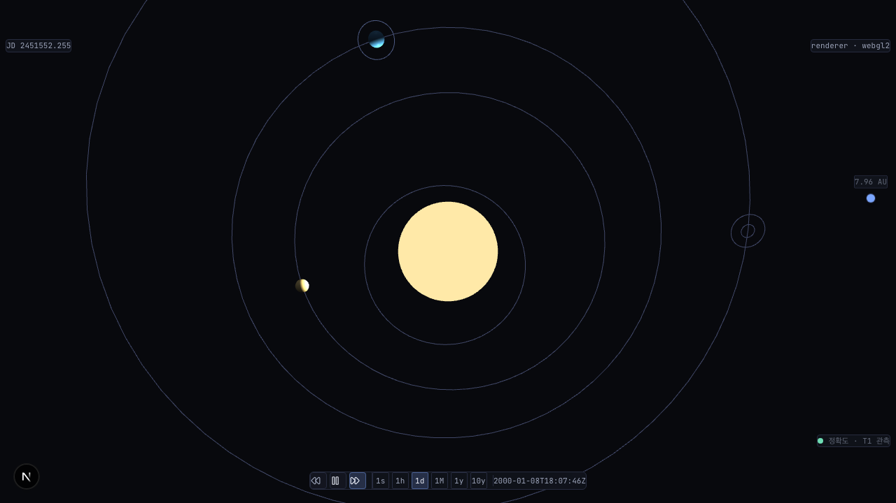

# ADR: free-fly deep-tier 줌아웃 "허공" — cameraFromSunMeters floating-origin 오프셋 누락 + target stranding (#629 D-T2 표면화)

- **상태**: **Accepted** (cross-validate 2026-06-08 agy outcome=applied — §교차검증 반영 사항 본문 통합 완료. 옵션 (가) 채택 + fix 구현 + 3중 시뮬레이션 + 매직 넘버 제거)
- **날짜**: 2026-06-08
- **결정자**: developer (#631 fix 단계, forensic 실측 선행)
- **관련**:
  - [#631](https://github.com/coseo12/astro-simulator/issues/631) (본 이슈 — #629 PR #630 D-T2 발견)
  - [`20260607-629-freefly-camera-zoom-forensic.md`](20260607-629-freefly-camera-zoom-forensic.md) §8 (본 회귀 분리 출발점 — "부 원인(먼 빈 점 공전)" 표면화)
  - [#509](https://github.com/coseo12/astro-simulator/issues/509) (free-fly 진입 설계 — tier/origin/시점 보존 의도. 본 fix 가 deep tier 한정 예외 추가)
  - [`20260422-floating-origin.md`](20260422-floating-origin.md) (Floating Origin SSoT — originOffset 좌표계)
  - [`docs/glossary.md`](../glossary.md) — [free-fly](../glossary.md) / [Tier](../glossary.md) / [Floating Origin](../glossary.md)
- **교훈 적용**:
  - **measurement-first** (volt [#32](https://github.com/coseo12/volt/issues/32)) — "tier escalation 만 고치면 해결" 가설을 실측이 정정 (core fix 단독 시 보이는 mesh 1→0 으로 **악화**). 추가로 target stranding 해소 필수임을 측정으로 확정.
  - "DoD PASS ≠ 제품 동작" (volt [#74](https://github.com/coseo12/volt/issues/74)) — #629 fix 가 줌 응답을 복구하자 가려졌던 부 원인(stranded target)이 표면화.
  - "headless 브라우저 검증 ≠ 실 브라우저" (volt [#77](https://github.com/coseo12/volt/issues/77)) — 본 fix 의 pull-back 뷰는 스크린샷으로 시각 확인 (frustum mesh 카운트는 불안정).

---

## §1 배경

### 본 이슈 핵심

#629 PR #630 D-T2 실 Chrome 에서 사용자 보고: **"탐색 모드에서 줌 아웃시 갑자기 너무 멀어져서 허공을 보게됨"**. #629 fix(wheelDeltaPercentage)로 줌 **응답**은 복구됐으나, 줌아웃 시 위성 주변 빈 공간으로 비행하는 별개 결함.

- **회귀 발화점**: #630 머지 후 D-T2. 단 **#629 와 메커니즘 독립** — #629=wheel 절대델타 / 본 건=tier escalation under floating origin + target stranding.
- **영향 범위**: tier=body 로 진입하는 body(위성/근접) focus → free-fly.

### Forensic 측정 결과 (2026-06-08, develop tip `7223a28`, 1280×720, headless)

dev 핸들 `window.__solarScene`(getTier) / `window.__simStore`(setSelectedBody/enterFreeFly)로 io(galilean) focus → free-fly → 줌아웃 궤적 실측 (`_debug-631*-tmp.mjs`, volt #67 패턴, 실행 후 `rm`).

#### 측정 1 — io free-fly 후 줌아웃 (fix 전)

|               | tier           | targetDist | 보이는 mesh |
| ------------- | -------------- | ---------- | ----------- |
| free-fly 직후 | **body 고정**  | 8124 (io)  | 1           |
| 줌아웃 12틱   | body 내내 고정 | 8124 내내  | 1 내내      |

- **메커니즘 (1) — cameraFromSunMeters 오류**: `sim-canvas.tsx:481-484` 의 `cameraFromSunMeters = |activeCam.globalPosition| × metersPerSceneUnit` 가 floating origin 오프셋을 누락. body tier 에서 floatingOrigin 이 focus body(io)로 이동(`originOffset ≠ 0`)하므로, globalPosition(shifted-origin local) 만으로는 **sun 이 아닌 io 로부터의 거리**를 측정 → 줌아웃해도 값이 작게 유지 → `tierFromCameraDistance` 가 body 유지(escalate 안 됨). 씬 자체의 `updateAt`(solar-system-scene.ts:1093-1098)은 `cameraWorldMeters = cameraLocalMeters + origin` 으로 **올바르게** 계산하는데 sim-canvas 만 누락.
- **메커니즘 (2) — target stranding**: free-fly 진입 시 target 이 io 의 먼 위치에 동결(#509 시점 보존). tier 가 escalate 해도 target 이 그대로면 빈 점 공전.

#### 측정 2 — core fix(originOffset 가산)만 적용 → 가설 정정

|               | tier                  | targetDist              | 보이는 mesh  |
| ------------- | --------------------- | ----------------------- | ------------ |
| free-fly 직후 | **solar (escalate!)** | 53839 (io, solar scale) | **0 (악화)** |

- **measurement-first 정정**: cameraFromSunMeters 보정으로 tier 는 정상 escalate 하나, **target 이 io 의 먼 위치에 stranded → solar tier 에서도 빈 점(mesh 0)**. "tier escalation 만으로 해결" 가설 기각 → **target 재앵커 필수** 확정.

#### 측정 3 — core fix + target 재앵커(채택) → 해소

| 시나리오           | focus                       | **free-fly 후**             | 판정         |
| ------------------ | --------------------------- | --------------------------- | ------------ |
| io (body tier)     | body / r158386 / target8385 | **solar / r35 / target0**   | ✅ pull-back |
| earth (inner tier) | inner / r68 / target226     | **inner / r68 / target226** | ✅ #509 보존 |

- io free-fly → 태양계 개요(태양+행성+궤도선)로 pull-back, "허공" 해소 (스크린샷 시각 확인).
- earth(inner tier) free-fly → tier/target 불변 = **#509 시점 보존 유지** (deep tier 한정 예외).

### 가설 검증 결론

| 가설                                                                                   | 결론                         | 근거                                                        |
| -------------------------------------------------------------------------------------- | ---------------------------- | ----------------------------------------------------------- |
| **가설 1: cameraFromSunMeters 가 floating origin 오프셋 누락으로 tier escalate 안 됨** | **확정 (1차)**               | 측정 1 (body 고정) → 측정 2 (originOffset 가산 시 escalate) |
| **가설 2: tier escalation 만 고치면 해결**                                             | **기각 (measurement-first)** | 측정 2 (core fix 단독 시 mesh 1→0 악화)                     |
| **가설 3: target stranding 이 핵심 부 원인**                                           | **확정 (2차)**               | 측정 2 (target 53839 stranded) → 측정 3 (재앵커 시 해소)    |

---

## §2 영향 모듈/파일

- `apps/web/src/components/sim-canvas.tsx` — (core) `cameraFromSunMeters` 에 `originOffset` 가산 / (UX) `detachToFreeFly` 에 body tier pull-back 분기.
- `apps/web/scripts/browser-verify-631-freefly-tier.mjs` — 회귀 가드 (verify:631-freefly-tier).
- `.github/workflows/ci.yml` — detect-and-test 통합 (port 3007).
- `docs/reports/631-io-freefly-pullback.png` — pull-back 시각 증거.

---

## §3 옵션 비교

| 축                 | **(가) core fix + body tier pull-back** | (나) target 을 io 에 두고 점진 가시화 | (다) core fix만 + upperRadiusLimit 캡 |
| ------------------ | --------------------------------------- | ------------------------------------- | ------------------------------------- |
| "허공" 해소        | ✅ 완전 (태양계 개요)                   | △ (복잡)                              | ❌ (stranding 잔존, mesh 0)           |
| #509 보존 (planet) | ✅ inner/solar 불변                     | ✅                                    | ✅                                    |
| 구현 복잡도        | 낮음 (기존 clearFocus+reset 재사용)     | **높음** (위성/모체 렌더 + 점진 전환) | 낮음                                  |
| 부수 회귀 위험     | low (검증된 deselect 경로)              | 중~고                                 | low (단 미해결)                       |

### 결정 — (가)

- **채택**: (core) `cameraFromSunMeters` 에 `originOffset` 가산 (씬 updateAt 패턴 정합, 정확성). + (UX) `detachToFreeFly` 에서 **tier=body 면 태양계 개요로 pull-back**(`clearFocus` + `controller.reset(35)`). `reset` 은 alpha/beta(시점 방향) 유지 → "현재 각도로 태양계 전체를 보는" 자연스러운 탐색.
- **deep tier 한정 예외**: inner/solar tier(행성)는 기존 #509 시점 보존 유지. 규칙 = "close-up(body)에서 탐색 → 개요 pull-back / 넓은 뷰에서 탐색 → 시점 보존".
- (나) 기각: 복잡도/위험 대비 이득 불명. (다) 기각: stranding 미해결로 "허공" 잔존.

---

## §4 Concrete Prediction → 실측 대조

| 예측                                  | 임계                     | 실측                        | 정합 |
| ------------------------------------- | ------------------------ | --------------------------- | ---- |
| 변경 라인 수                          | sim-canvas 소규모 (~20)  | core 8 + 재앵커 분기 8 ≈ 16 | ✅   |
| D-631-1 (body free-fly tier escalate) | tier=solar               | solar                       | ✅   |
| D-631-2 (허공 해소)                   | targetDist≈0 + 시각 개요 | target 0 + 스크린샷 개요    | ✅   |
| D-631-4 (#509 보존)                   | earth tier/target 불변   | 불변 (inner/226)            | ✅   |

---

## §5 결정 (구현 완료) — 회귀 가드 + 무회귀

### 회귀 가드 — 3중 시뮬레이션 (guard-pr-dod)

| 단계                    | S1(io pull-back)   | S2(#509)       | overall           |
| ----------------------- | ------------------ | -------------- | ----------------- |
| Positive (fix)          | tier=solar target0 | inner 226 보존 | **PASS**          |
| Negative (develop 환원) | —                  | —              | **FAIL (exit 1)** |
| Recovery (복원)         | tier=solar target0 | inner 226 보존 | **PASS**          |

가드: `browser-verify-631-freefly-tier.mjs` (S1 body pull-back: tier=solar + targetDist≤5 / S2 inner 보존: tier 불변 + target 보존). CI `detect-and-test` 통합 (port 3007).

### 무회귀 실측

- #629 줌 가드: PASS (선행 fix 보존) / #378 focus follow: 26/26 PASS.
- #380: develop baseline 동일 (`S1/S3/S4 PASS, S2 기존 50ms race window flaky, CI 미포함`).
- core 437/437 + web 296/296 단위 테스트 PASS.

### Fix 후 박제 의무

- #629 ADR §8 — 본 #631 fix 완료 cross-link 갱신.

---

## §6 위험 / 재검토 트리거

| 위험                                                     | 회귀 시점  | 임계                               | 완화                                                      |
| -------------------------------------------------------- | ---------- | ---------------------------------- | --------------------------------------------------------- |
| body tier 판정 경계 — 일부 행성도 body 진입 시 pull-back | 근접 focus | 사용자가 "행성 탐색인데 개요로 튐" | tier 기준은 일관 규칙(close-up→개요). D-T2 피드백 시 조정 |
| reset(35) tier 전환 mid-animation jank                   | fix 직후   | 시각 끊김                          | 기존 deselect 경로 재사용(검증됨). D-T2 육안              |
| core fix 가 다른 tier 판정에 영향                        | 광범위     | inner/solar tier 오판              | T1/T2 originOffset=0 이라 무영향(측정 3 earth 불변 확인)  |

### 재검토 트리거

1. D-T2 에서 pull-back 이 과하다/부족하다 피드백 → reset radius 또는 tier 기준 조정.
2. body tier 한정 분기가 특정 근접 행성에서 의도와 다름 → 분기 조건 정밀화.

---

## §교차검증 반영 사항 (cross-validate 2026-06-08 agy outcome=applied)

agy 가 옵션 (가)를 "문제 본질(originOffset 보정 + target 재앵커)을 모두 해소하는 모범적 결정" 으로 지지. 4축 분류:

- **합의 (3)**: ① measurement-first 로 2차 원인(target stranding)까지 실측한 완결성 ② (가) 채택 — (나)는 셰이더/렌더큐 복잡도, (다)는 stranding 방치라 본질 미해결 ③ cameraFromSunMeters 를 씬 updateAt 수식과 정합시킨 좌표계 계약 수정.
- **고유 발견 수용 (1, 본 PR 반영)**: **매직 넘버 35 제거** — `controller.reset(35)` → `controller.reset()` (camera-controller.ts:194 의 문서화된 default `radius=35, target=Vector3.Zero()` 사용). 매직 넘버 없이 의도 표현.
- **반려/과대 대응 필터 (2)**:
  - ① **debug 전역 핸들(`__solarScene`/`__simStore`) production 노출** — **기존 결정** (sim-canvas.tsx 주석 "테스트 목적 전역 노출, 민감 데이터 아님" 박제). browser-verify 의존이며 본 #631 범위 밖. 변경 시 전 가드 스크립트 영향 → 별도 검토 사항.
  - ② **S2 race condition 근본 해결(setTimeout→상태 동기화 헬퍼)** — #380 S2 의 기존 50ms race window flaky 로 본 #631 과 무관(별개 이슈, CI 미포함).
- **고유 발견 후속 분리 (2)**:
  - ① **tier별 `freeFlyBehavior` 정책 메타데이터** — 현재 body 1개만 예외라 YAGNI. 신규 tier(asteroid_belt/interstellar) 추가 시 선언적 정책화 검토 (R-Phase 메타데이터 SSoT #613 연장 후보).
  - ② **pull-back 애니메이션 중 사용자 입력 인터럽트 정책** — 현 구현은 기존 deselect 경로(`reset`) 재사용이라 동일 동작(일관). 별도 연출 고도화 시 검토. D-T2 육안 관찰 항목(§6).
- **Claude 편향 셀프 체크**: body tier 한정 분기가 "근접 행성도 body 진입 시 pull-back" 할 수 있다는 우려 — 측정 3 (earth=inner tier 불변)로 일반 행성 focus 는 body 아님 확인. 규칙(close-up→개요)이 일관되므로 의도된 동작. D-T2 피드백 시 조정(§6).

## §7 Amendment 라운드 N

(현재 없음 — D-T2 사용자 피드백 또는 후속 발견 시 추가)

---

## §8 후속 / 분리 이슈

- **free-fly 패닝 (F3)** — "진짜 자유 이동(WASD/패닝)" 은 본 pull-back 과 별개 UX. 사용자 수요 확인 후 후속.

---

## 변경 이력

- 2026-06-08: 초안 (developer, #631 fix). Provisional — cameraFromSunMeters floating-origin 오프셋 누락(1차) + target stranding(2차) 실측 확정. core fix 단독 시 mesh 1→0 악화로 "tier escalation 만으로 해결" 가설 기각(measurement-first). core fix + body tier pull-back 채택 + 3중 시뮬레이션 + #509 보존 확인. cross-validate 후 Accepted 전이 예정.
