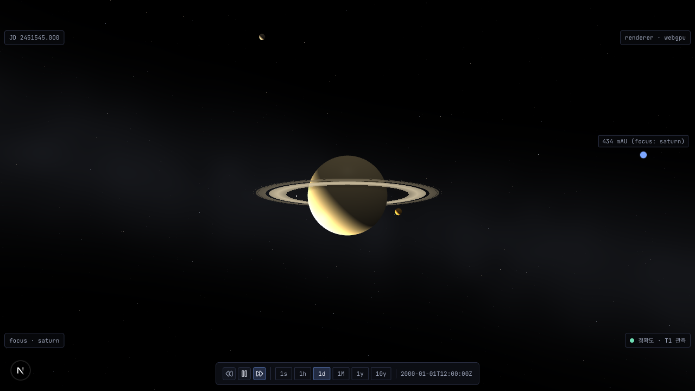
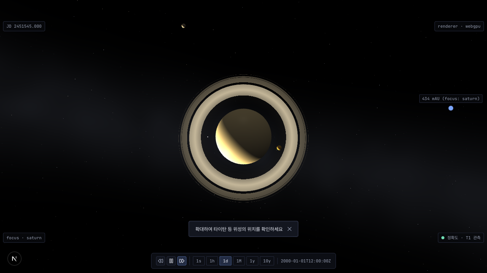
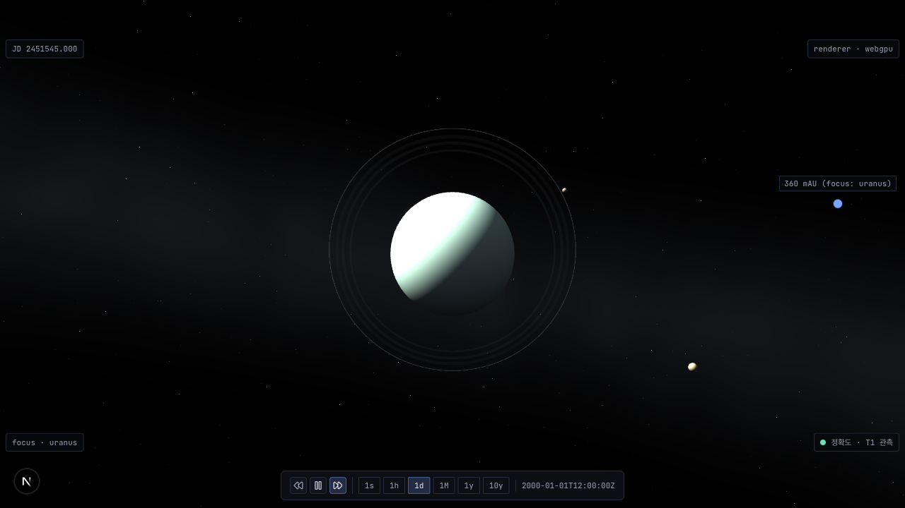
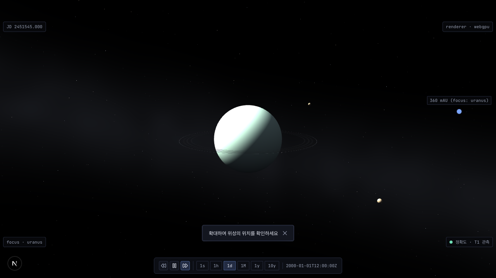
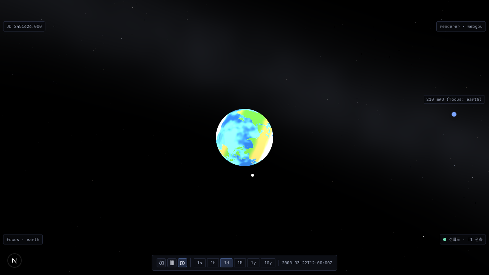
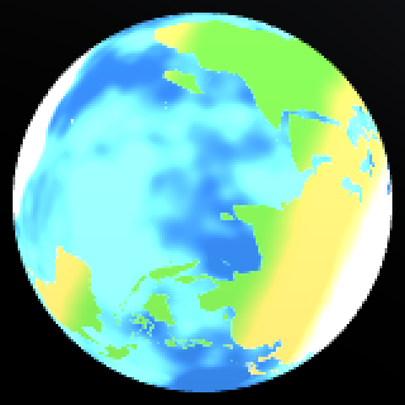
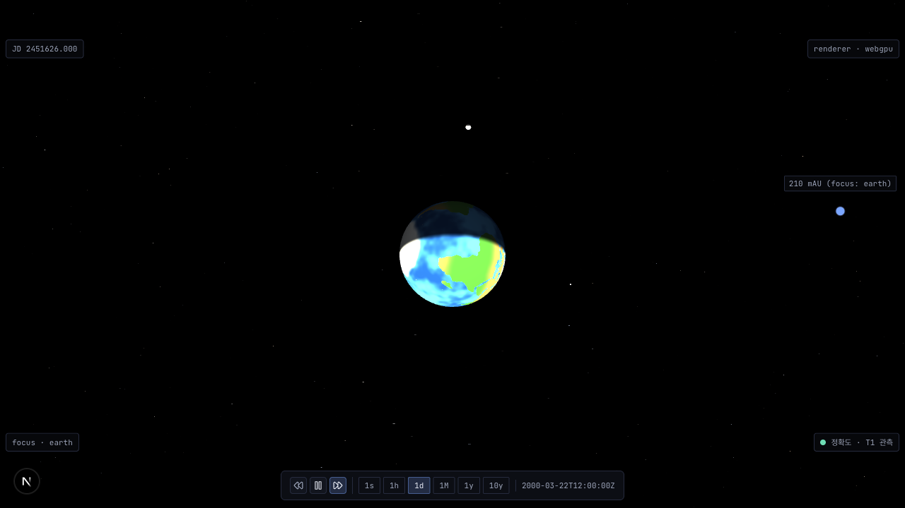

# ADR 20260628-756 — 절차적 행성 표면 셰이더 (1차: 인프라 + 대표 4개)

- **상태**: Accepted (cross-validate 2026-06-28) — **Amendment 1 (#773/#775): Accepted (cross-validate 2026-06-30)** — **Amendment 2 (#782): Accepted (cross-validate 2026-07-01)** — **Amendment 3 (#783): Accepted (cross-validate 2026-07-04)** — **Amendment 4 (#1119): Accepted (cross-validate agy 2026-08-17 — §A4.8 4축 통합 완료)** — **Amendment 5 (#1130): Accepted (2026-08-18 — 자전 기준면 정정)** — **Amendment 6 (#1157): Accepted (2026-08-27 — 마스크 LOD 반경 회전 불변화. ⚠️ 본 항목은 #1197 에서 backfill 됐다 — Amendment 6 머지 시 상태 라인 갱신이 누락된 선재 drift)** — **Amendment 7 (#1197): Accepted (cross-validate agy 2026-09-05 — §A7.8 4축 통합 완료)**
- **날짜**: 2026-06-28 (Amendment 1: 2026-06-30, Amendment 2: 2026-07-01, Amendment 3: 2026-07-04, Amendment 4: 2026-08-17)
- **이슈**: [#756](https://github.com/coseo12/astro-simulator/issues/756) / Amendment 1: [#773](https://github.com/coseo12/astro-simulator/issues/773) (광원 일관성 회귀, high) + [#775](https://github.com/coseo12/astro-simulator/issues/775) (지구 대륙 mix, low) / Amendment 2: [#782](https://github.com/coseo12/astro-simulator/issues/782) (self-rotation 자전 + 광원 world normal 옵션 e 전환, medium) / Amendment 3: [#783](https://github.com/coseo12/astro-simulator/issues/783) (지구 디테일 — 극관 + biome 위도 색 변화, medium) / Amendment 4: [#1119](https://github.com/coseo12/astro-simulator/issues/1119) (지구 대륙 윤곽 실제화 — 「에셋 0」 조건부 예외, high)
- **관련**: [#738 절차적 별 배경](20260624-738-procedural-starfield.md) (트랙 A 선행), [`docs/architecture/principles.md` §1 Visual Fidelity](../architecture/principles.md)
- **용어**: [Tier](../glossary.md#tier-t1--t2--t3), [R-Phase](../glossary.md#r-phase-roadmap-v3-phase), [LOD](../glossary.md) (high/mid/low variant)

---

## 배경

현재 모든 천체는 단색 `StandardMaterial.diffuseColor` (`solar-system-scene.ts` `createBodyMesh`/`createBodyMeshMid`/`createBodyBillboard`) 로 렌더된다. 표면 디테일이 0이라 행성이 "공" 처럼 밋밋하다. 방향성 기획 트랙 A (몰입 강화) 의 잔여 항목으로, 별 배경 (#738) 에 이어 행성 표면에 절차적 디테일을 부여해 몰입을 강화한다.

핵심 제약 (이슈 계약):

- **에셋 0** — 외부 텍스처 이미지 도입은 에셋 파이프라인 신설 + 번들 증가 + WebGPU 호환 리스크를 동반한다. 이 코드베이스는 `ring-shader.ts` / `starfield.ts` 모두 절차적 `ShaderMaterial` 로 확립돼 있어, 절차적 셰이더가 구조 정합 + 에셋 0.
  > ⏩ **전방 포인터 (2026-08-17, #1119)**: 본 제약은 **본 문서 하단 §Amendment 4 (2026-08-17, #1119) 에서 조건부 예외가 열렸다** — 저해상도 육지 마스크 **1장**에 한한다. 위 문장은 **소급 수정하지 않으며** (당시 결정의 원문), 현행 정본은 Amendment 4 다. 색·고도·구름·야간불빛 텍스처는 **여전히 비목표**.
- **데이터 SSoT 보존** — 물리 반경/색상 (`solar-system.json`) 불변. 표면 디테일은 rendering 시점 변조만 (Visual Fidelity 원칙).
- **Incremental Body-by-Body / R-Phase 철학** — 1차는 인프라 + 대표 4개 (rocky=지구 / desert=화성 / gas-bands=목성 / cratered=달) 로 좁힌다. 나머지 23개는 단색 유지, 이후 점진 확장.

기존 셰이더 인프라가 본 결정의 직접 선례를 제공한다:

- `ring-shader.ts` — `ShaderMaterial` + GLSL + `Effect.ShadersStore` 1회 등록 + log-depth `gl_FragDepth` 정합 + GLSL↔JS 미러 함수로 단위 테스트 (`computeArcFactor`) + uniform 패킹 헬퍼 + fallback 경로.
- `starfield.ts` — sin-free hash / value noise / fbm 절차 생성 + 미학 상수 SSoT (re-export) + GLSL 미러 (`starColorMirror`) + 디자인 루브릭 anti-pattern (보라/마젠타 금지) 가드.

---

## 후보 비교

### 결정 1 — 셰이더 모듈 구조

| 축            | A. 신규 `procedural-planet-shader.ts` (ring/starfield 답습) | B. `ring-shader.ts` 에 표면 셰이더 합류        | C. body 별 인라인 GLSL (`solar-system-scene.ts` 내) |
| ------------- | ----------------------------------------------------------- | ---------------------------------------------- | --------------------------------------------------- |
| 구조 정합     | ✓ ring/starfield 와 동형 (1 모듈 = 1 셰이더군)              | ✗ ring 과 표면은 책임 다름 (annulus vs sphere) | ✗ scene 파일 비대 (이미 2100+ 줄)                   |
| 단위 테스트   | ✓ GLSL 미러 함수 export 가능                                | △ ring 테스트와 혼재                           | ✗ scene 통합 테스트만                               |
| WebGPU parity | ✓ GLSL→WGSL 자동 변환 (ring/starfield 실증)                 | ✓ 동일                                         | ✓ 동일                                              |
| 격리성        | ✓ `?surface=off` 시 모듈 통째 미사용                        | ✗ ring 과 결합                                 | ✗                                                   |

→ **A 채택**. 신규 `packages/core/src/scene/procedural-planet-shader.ts`. ring-shader 의 모듈 구조 (ShaderMaterial 팩토리 + GLSL 미러 + 상수 SSoT re-export) 를 답습.

**high/mid LOD 공유 머티리얼**: high (segments=32) / mid (segments=12) 는 **동일 ShaderMaterial 팩토리** 를 쓴다 (segments 만 다름). 절차 디테일은 fragment 단계라 vertex 밀도와 무관하므로, mid 에서도 동일 표면이 보인다 (LOD 전환 시 사용자가 표면 변화를 인지하지 않음 — `createBodyMeshMid` 의 "동일 식 비율 보존" 계약 정합). low (billboard) 는 적용 제외 (결정 3).

### 결정 2 — 표면 타입 4종 분기의 데이터 소스

| 축                      | A. `colorHint` 확장 (`colorHint.surfaceType`)    | B. 신규 데이터 필드 (`CelestialBody.surfaceType`)                                  | C. 코드 상수 테이블 (`body.id → surfaceType`)                              |
| ----------------------- | ------------------------------------------------ | ---------------------------------------------------------------------------------- | -------------------------------------------------------------------------- |
| 데이터 SSoT 정합        | △ colorHint 는 색상 힌트 — 표면 타입은 의미 다름 | ✗ "표면 타입" 은 물리 데이터 아님 (rendering 분류) — SSoT 에 rendering 관심사 누수 | ✓ rendering-only 관심사를 scene 레이어에 격리 (Visual Fidelity §적용 위치) |
| 신규 데이터 ≠ 신규 코드 | △ 데이터 42 레코드 중 4개 수정                   | △ 데이터 스키마 + 42 레코드                                                        | ✓ 4-entry 상수 테이블 1곳 (이후 확장 = 데이터 추가 아닌 상수 추가)         |
| 미지정 fallback         | colorHint 옵셔널 → undefined 처리                | 옵셔널 필드 → undefined                                                            | 테이블 미등록 → 단색 (명시적)                                              |
| 확장 비용 (R-Phase)     | 데이터 파일 수정                                 | 데이터 파일 수정                                                                   | 상수 테이블 1줄 추가                                                       |

→ **C 채택**. `procedural-planet-shader.ts` 내 `SURFACE_TYPE_BY_BODY: Record<string, SurfaceType>` 상수 테이블. 근거:

- **데이터 SSoT 원칙** (principles.md §적용 위치): "표면 타입" 은 물리 데이터가 아니라 **rendering 분류** 다. `solar-system.json` 은 NASA/JPL 실측 (반경/색상/궤도) 의 SSoT 이므로 rendering 관심사를 누수시키지 않는다. ring-shader 의 `arcs` 데이터도 loader 레벨이지만, 표면 타입은 더 순수한 "시각 표현 선택" 이라 scene 레이어 상수가 정합.
- **"신규 데이터 ≠ 신규 코드"** 의 변형 적용 — 여기선 반대로 "신규 rendering 분류 = 신규 코드 (상수)" 가 올바르다. 데이터 파일을 건드리지 않으므로 physics 적분 / Info 패널 표기 / cross-link 무영향.
- 미등록 body 는 자동으로 단색 (StandardMaterial) — 23개 비-범위 body 무회귀가 **테이블 부재로 자동 보장** (명시적 opt-in).

**셰이더 내부 분기**: `uniform int surfaceType` + fragment switch (A) vs 타입별 셰이더 인스턴스 (B).

| 축                  | A. 단일 셰이더 + `uniform int surfaceType`                                      | B. 타입별 4 셰이더 |
| ------------------- | ------------------------------------------------------------------------------- | ------------------ |
| ShadersStore 등록   | 1회 (충돌 0)                                                                    | 4회 (key 관리)     |
| 컴파일 비용         | 1 컴파일 (브랜치 포함)                                                          | 4 컴파일           |
| 단위 테스트 미러    | 1 함수 (surfaceType 인자)                                                       | 4 함수             |
| GPU warp divergence | △ 같은 draw 안에서 같은 body = 같은 surfaceType → divergence 0 (body 단위 draw) | ✓ 없음             |

→ **A 채택**. 단일 셰이더 + `uniform int surfaceType`. body 1개 = draw 1개 = 동일 surfaceType 이므로 warp divergence 0 (starfield 의 `if (bandFactor>0)` 분기 선례 — fragment 분기 자체는 수용 가능). ShadersStore 1회 등록 (ring/starfield 패턴).

### 결정 3 — tier / LOD 차등

| variant                         | 적용                               | 근거                                                                                                                                         |
| ------------------------------- | ---------------------------------- | -------------------------------------------------------------------------------------------------------------------------------------------- |
| high (sphere seg=32)            | ✓ 절차 셰이더                      | 표면 디테일 가시 (가까이서 관찰)                                                                                                             |
| mid (sphere seg=12)             | ✓ 동일 셰이더 (결정 1)             | LOD 전환 시 표면 연속성 (사용자 인지 불변)                                                                                                   |
| low (billboard quad)            | ✗ 단색 유지 (현행 alpha-mask quad) | sub-pixel draw call 절감이 책임 (`createBodyBillboard` 의 bodyScale 미적용 책임 분리 정합) — 표면 셰이더는 px<4 에서 무의미 + fill-rate 부담 |
| tier-c (`forceOverride: 'low'`) | ✗ 자동 단색                        | tier-c 는 `TIER_PROFILES.c.lod.forceOverride='low'` 로 전 body low variant 강제 → 표면 셰이더 자동 미진입 (fps 보호 자동 달성)               |

→ **high/mid 적용, low 미적용**. tier-c 는 **별도 코드 없이** `forceOverride:'low'` 가 자동으로 표면 셰이더를 우회 (low variant = 단색). 이는 별 배경 #738 에서 tier-c fill-rate 회귀를 "소프트웨어 렌더 직접 감지" 로 비활성한 교훈 (메모리 2026-06-24) 의 **구조적 사전 회피** — 표면 셰이더는 그보다 부담이 작지만 (전체화면 fill 아님, body 표면만), 동일 원리로 tier-c 진입 자체가 차단된다.

**detailLevel uniform 차등 훅 (선택, YAGNI 경계)**: high/mid 모두 full detail. starfield `gridDensity` override 처럼 tier 별 detail 약화 훅은 **fps 실측이 필요를 증명한 만큼만** 도입 (starfield ADR §교차검증 기각 2 YAGNI 정합). 1차는 detailLevel uniform 을 셰이더 인터페이스에 **예약** (옵션 인자) 하되 호출부는 full 고정 — 후속 fps 측정에서 tier-b 약화가 필요하면 그때 배선.

### 결정 4 — `?surface=off` URL 플래그

| 축             | A. `?marker` 패턴 (scene 생성 옵션, URL-only, UI 토글 없음) | B. `?orbits` 패턴 (command/handler + store + 런타임 토글) |
| -------------- | ----------------------------------------------------------- | --------------------------------------------------------- |
| 이슈 범위 정합 | ✓ 계약은 URL 플래그만 요구 (UI 토글 비목표)                 | ✗ 런타임 토글 버튼은 비목표 (scope creep)                 |
| 코드 표면      | ✓ parse 함수 + scene 옵션 1개 + sim-canvas 1곳              | ✗ + command 타입 + handler + store action + 토글 버튼     |
| OFF 메커니즘   | ✓ 생성 시점 단색 StandardMaterial 선택                      | △ 런타임 머티리얼 교체 (복잡)                             |

→ **A 채택** (`?marker` 패턴). 이슈 계약은 `?surface=off` URL 플래그만 요구하고 런타임 UI 토글은 비목표다. `?marker=off` (glowMarker 비활성) 와 동형:

- 신규 `apps/web/src/core/parse-surface-mode.ts` — `parseSurfaceVisible(urlParam): boolean` (parse-orbits-mode 동형, 기본 true).
- `createSolarSystemScene` 옵션에 `surfaceDetail?: boolean` 추가 (`glowMarker?: boolean` 동형, 기본 true).
- sim-canvas 가 `parseSurfaceVisible(...)` → 옵션 전달.
- **OFF 메커니즘**: `surfaceDetail=false` 면 `createBodyMesh`/`createBodyMeshMid` 가 **기존 StandardMaterial 경로** 를 그대로 탄다 (절차 셰이더 미적용). 즉 OFF = 현행 동작 100% 복귀 (회귀 가드 baseline). 생성 시점 분기라 런타임 머티리얼 교체 불필요.

> **`?orbits` 가 command/handler 인 이유**: orbits 는 런타임 토글 버튼 (focus-quick-buttons) 이 있어 command 경유가 필수다. surface 는 토글 버튼이 비목표이므로 `?marker` 의 생성 옵션 패턴이 최소 정합 표면이다.

### 결정 5 — 데이터 SSoT: base color uniform 전달

`colorHint.hex` (base 색상) 를 셰이더 `uniform vec3 baseColor` 로 전달하고, 절차적 변조 (명암 / 밴드 / 크레이터 / dust) 는 그 위에 합성한다. 물리 반경/색상 데이터는 불변. 변조 강도 상수는 `procedural-planet-shader.ts` 의 rendering-only 미학 상수 SSoT (starfield 패턴 — re-export + 단위 테스트 가드).

- rocky (지구) — base color 위 대륙/해양 대비 (저주파 noise) + 미세 명암.
- desert (화성) — base 위 dust/협곡 결 (fbm) + 산화철 톤 변조.
- gas-bands (목성) — base 위 위도 밴드 (sin(latitude) 변조) + 난류 결.
- cratered (달) — base 위 크레이터 (cell noise 점 분포 — starfield 별 셀 패턴 재사용) + 명암.

---

## 결정 (요약)

1. **모듈** — 신규 `packages/core/src/scene/procedural-planet-shader.ts` (ring/starfield 답습). high/mid 공유 ShaderMaterial, low 미적용.
2. **표면 타입 소스** — 코드 상수 테이블 `SURFACE_TYPE_BY_BODY` (데이터 SSoT 불변). 셰이더 내부는 단일 셰이더 + `uniform int surfaceType` 분기.
3. **tier/LOD** — high/mid 적용. low + tier-c 는 `forceOverride:'low'` 로 자동 단색 (fps 보호, 별도 코드 0). detailLevel 약화 훅은 예약만 (YAGNI).
4. **`?surface=off`** — `?marker` 패턴 (parse-surface-mode + scene 생성 옵션 `surfaceDetail`, URL-only). OFF = StandardMaterial 현행 복귀.
5. **데이터 SSoT** — `colorHint.hex` → `uniform baseColor`, 절차 변조는 그 위. `solar-system.json` 불변.

---

## Visual Fidelity §의무 체크리스트 4항목 (principles.md §1)

- [x] **데이터 SSoT 보존 확인** — 표면 타입 매핑 (`SURFACE_TYPE_BY_BODY`) + 변조 강도 상수는 `procedural-planet-shader.ts` 의 **rendering-only 상수** 다. `solar-system.json` 의 `radius`/`colorHint.hex`/궤도 요소 **직접 수정 0**. base color 는 기존 `colorHint.hex` 를 read-only 로 uniform 전달.
- [x] **rendering 시점 분리** — physics 엔진 (`packages/core/physics-engine`, Rust+wasm) 은 표면 셰이더에 의존하지 않는다. 적분기는 heliocentric 절대 m 좌표만 사용 — 표면 디테일은 `packages/core/src/scene` 레이어 단독. P11-A 좌표 계약 위반 0.
- [x] **사용자 D-T2 가이드** — 표면 디테일은 순수 시각 표현 (왜곡) 이며, focus 패널 / Info 패널은 여전히 실측값 (반경 km / 색상 출처) 을 표기한다. 절차 변조는 표기 대상 아님 (별 배경 #738 동일 — 미학 표현).
- [x] **점유율 / 사실 비율 baseline 박제** — 표면 셰이더는 mesh 크기/위치를 변경하지 않으므로 (diameter 식 불변) px diameter / 점유율 / mesh-orbit 분리 마진에 **영향 0**. r1-guard baseline 은 표면 픽셀 변경 (색/명암) 으로 재생성되며, 4 target body 의 화면 표면 픽셀 분산 (단색 대비 디테일 존재) 을 qa 가 실 Chrome GUI 로 박제 (DoD).

---

## Concrete Prediction

"신규 데이터 ≠ 신규 코드" + ring/starfield 선례 기반 라인 수 예측 (구현 후 `git diff --stat` 실측 재현):

| 영역                 | 파일                                              | 예측 라인 (신규/변경) | 근거                                                                                                                                                                                     |
| -------------------- | ------------------------------------------------- | --------------------- | ---------------------------------------------------------------------------------------------------------------------------------------------------------------------------------------- |
| **core 셰이더 신설** | `procedural-planet-shader.ts` (신규)              | ~280–360 신규         | starfield.ts (403줄) 보다 적음 — 은하수 fbm 미포함. GLSL (vertex+fragment 4타입 분기) + 팩토리 + 상수 SSoT + GLSL 미러 (단위 테스트용)                                                   |
| **core 배선**        | `solar-system-scene.ts`                           | ~25–45 변경           | `createBodyMesh`/`createBodyMeshMid` 에 surfaceDetail 분기 (셰이더 vs StandardMaterial) + 옵션 `surfaceDetail` 수신. ring-shader 배선 (#641) 선례 대비 작음 (mesh 생성 함수 내부 분기만) |
| **core 타입**        | `solar-system-scene.ts` `SolarSystemSceneOptions` | ~3 변경               | `surfaceDetail?: boolean` 옵션 1개 (glowMarker 동형)                                                                                                                                     |
| **web URL 플래그**   | `parse-surface-mode.ts` (신규)                    | ~30 신규              | parse-orbits-mode.ts (33줄) 동형 복제                                                                                                                                                    |
| **web 배선**         | `sim-canvas.tsx`                                  | ~5–8 변경             | `parseSurfaceVisible` → 옵션 전달 (marker 패턴)                                                                                                                                          |
| **데이터**           | `solar-system.json`                               | **0**                 | 표면 타입 = 코드 상수 (결정 2). 데이터 불변                                                                                                                                              |
| **단위 테스트**      | `procedural-planet-shader.test.ts` (신규)         | ~80–140 신규          | GLSL 미러 결정성 / surfaceType enum 완비 / 보라-마젠타 부재 (디자인 루브릭) / 상수 SSoT drift 가드                                                                                       |

**핵심 예측**:

- **데이터 파일 변경 0** — 표면 타입이 코드 상수로 수렴 (결정 2 C). 예측 실패 (데이터 수정 발생) 시 = SSoT 누수 신호.
- **core 배선 ≤ 45 줄** — mesh 생성 함수 내부 분기만 (tier-c 자동 우회로 LOD pass / camera / picking 무변경). 예측 초과 시 = 표면 셰이더가 LOD/tier 레이어를 침범 (재검토).
- **picking / camera / orbit / tier-transition 변경 0** — 표면은 머티리얼만 바꾸고 mesh 기하/메타데이터 불변 (#713 bodyId 역매핑 무영향).

---

## 결과 · 재검토 조건

**기대 결과**:

- 지구/화성/목성/달 4개에 절차 표면 디테일 (실 Chrome GUI 확인).
- 나머지 23 + 태양 + 고리 + 별 배경 무회귀 (단색/기존 유지 — 테이블 미등록 자동 단색).
- high/mid 적용, low/tier-c 자동 단색 (fps 보호).
- `?surface=off` 전체 단색 복귀, 기본 ON.
- fps 회귀 0 (tier-a/b/c fps-baseline-guard PASS, CI swiftshader 포함).

**재검토 조건**:

1. **fps 회귀 발생** (tier-b 에서 표면 셰이더 fragment 비용 초과) — detailLevel uniform 약화 훅을 측정 기반 도입 (Amendment). 1차 예약만 한 인터페이스 활성화.
2. **gas-bands 위도 밴드 부정확** — 자전축 기울기 (axialTiltDeg, ring-shader #647 인프라) 미반영으로 목성 밴드가 공전면 기준일 수 있음. 1차는 mesh local Y 기준 근사 (Visual Fidelity rendering-only) — 사실성 요구 시 후속.
3. **표면 타입 확장 요구** (ice giant / 위성 추가) — `SURFACE_TYPE_BY_BODY` 테이블 + surfaceType enum 추가 (R-Phase). 데이터 변경 0 예측 재현.
4. **WebGPU↔WebGL parity 결함** — ring/starfield 가 실증했으나, 표면 셰이더 특정 함수 (cell noise / fbm) 의 백엔드 차이 발견 시 qa 실 Chrome (WebGPU) + CI swiftshader (WebGL) 양 경로 박제.

---

## 교차검증 반영 사항

cross-validate (Antigravity `agy`) 1회 수행 (2026-06-28, outcome=applied, exit 0, plan_bypass=false). 로그: `.claude/logs/cross-validate-architecture-20260628-193425.log`. **호출 전 Claude 편향 셀프 체크**: 4종 (낙관적 일정 / 결합 간과 / 폐기 프레이밍 / 순수주의) 중 결합 간과 (tier-c 우회 단정) + 폐기 프레이밍 (외부 텍스처 폐기) 2축 미통과 의심 → cross-validate 프롬프트에 명시 질문 삽입 (이하 합의 1·2 에서 통과 확인).

### 합의 (현재 PR 즉시 반영 / 통과 확인)

1. **tier-c 우회 + `?surface=off` 100% 회귀 = 엔지니어링 절제** [결합 간과 축 검증 통과] — agy 가 "`forceOverride:'low'` 구조로 별도 코드 없이 tier-c 우회 + `?surface=off` 100% 회귀 baseline 확보 = 오버헤드/리스크 최소화 절제력" 으로 결정 3·4 를 명시 호평. Claude 의 "별도 코드 0 자동 우회" 단정이 외부 모델로 교차 확인됨 (셀프 체크 결합 간과 축 통과). 단 구현 시 developer 가 **실측 의무** (결정 3 의 tier-c low variant = StandardMaterial 경로를 실 진입 확인).
2. **표면 타입 코드 상수 = 데이터 SSoT 부합** — 결정 2 (C) 를 "물리 데이터에 rendering 관심사 미누수, SSoT 원칙 완벽 부합" 으로 합의.
3. **high/mid 공유 머티리얼 = popping 방지** — 결정 1 의 LOD 전환 시 표면 연속성을 호평.
4. **절차 셰이더 = 구조 정합** [폐기 프레이밍 축 검증 통과] — agy 가 절차 셰이더 채택을 "관심사 분리 + 단위 테스트 용이 + 인젝션/누수 리스크 0" 으로 타당 확인. 외부 텍스처 폐기가 패턴 답습 편향이 아니라 구조 정합임이 교차 확인됨 (셀프 체크 폐기 프레이밍 축 통과).

### 이견 수용 (원안 수정)

1. **GLSL 분기 `switch-case` → `if-else`** — 원안은 셰이더 내부 분기 방식을 미명시 (uniform int surfaceType 분기만 언급). agy 가 "Babylon GLSL→WGSL 변환기가 `switch-case` 에서 컴파일 에러/최적화 깨짐 보고 사례" 를 지적. **수용** — 구현은 `if (uSurfaceType==0) ... else if ...` 형태로 보수적 분기 (ring-shader/starfield 모두 `if` 만 사용, `switch` 미사용 — 기존 선례 정합). developer 인수인계에 명시.
2. **surfaceType enum JS↔GLSL int 동기화 가드** — 원안은 GLSL 미러 함수만 언급, surfaceType 정수 매핑의 JS↔GLSL drift 가드를 명시 누락. agy 가 "셰이더 내부 enum 정수 ↔ JS 코드 정수 비동기 정합성 오류" 리스크 지적. **수용** — `procedural-planet-shader.test.ts` 에 surfaceType enum ↔ uniform int 매핑 SSoT 가드 (ring-shader `MAX_ARCS` parity 가드 #728 패턴) 추가. Concrete Prediction 단위 테스트 항목에 흡수.

### Claude 재분석으로 기각한 외부 모델 제안

1. **자전축 기울기 (`axialTiltDeg`) uniform 1차 반영** (agy 누락요소 ①) — **기각 (후속 유지)**. 이미 §재검토 조건 2 에 명시한 후속 항목이다. 1차 비목표 (목성 위도 밴드 사실성 정밀) 와 상충 (CRITICAL #6 비목표 우선). 1차는 mesh local Y 근사 (Visual Fidelity rendering-only — 감상용 밴드면 충분, 사실 자전축 정렬은 후속). agy 도 "향후 확장 대상 (천왕성 등)" 으로 미래 시제로 제안 — 1차 범위 밖 확인. ring-shader 의 `axialTiltRad` 인프라 (#647) 가 이미 존재하므로 후속 배선 비용도 낮음.

### 고유 발견 (범위 판정)

1. **WebGL1 `highp float` 미지원 precision fallback** (agy 보안 ⑤) — **비대상** (후속 분리 불요). 이 프로젝트는 Babylon v9 + WebGPU/WebGL2 + tier 시스템 기반으로 WebGL1 을 지원 대상에서 제외한다 (starfield/ring-shader 도 `precision highp float;` 고정, WebGL1 fallback 없음 — 동일 선례). WebGL1 미지원 기기는 tier 감지 자체가 별도 경로. 범위 밖이며 기존 셰이더 정책과 정합하므로 후속 이슈 불요 (비대상 명시로 맥락 박제).
2. **표면 타입 8종+ 초과 시 타입별 셰이더 인스턴스 전환** (agy 확장성) — **비대상** (1차 4종, 재검토 조건 3 에 흡수). agy 도 "임계치 (8종 이상) 초과 시" 미래 조건부 제안. 1차 단일 셰이더 + if-else 분기는 4종에서 divergence 0. 8종+ 도달 시 팩토리 전환은 재검토 조건 3 (표면 타입 확장) 의 자연 연장.
3. **anti-pattern (보라/마젠타) 출력 색역 어서션** (agy 누락요소 ③) — **수용 (단위 테스트 흡수)**. starfield `starColorMirror` 의 보라/마젠타 부재 가드 패턴을 표면 셰이더 미러에도 적용 (baseColor 위 변조 후 출력 RGB 가 기괴 색역 미진입 어서션). Concrete Prediction 단위 테스트 항목에 이미 "보라-마젠타 부재" 명시 — 강화 확정.

---

## Amendment 1 (2026-06-30) — 광원 일관성 회귀 (#773) + 지구 대륙 mix (#775)

- **상태**: Accepted (cross-validate 2026-06-30 — §A1.7 4축 박제 완료)
- **이슈**: [#773](https://github.com/coseo12/astro-simulator/issues/773) (bug/회귀, high), [#775](https://github.com/coseo12/astro-simulator/issues/775) (type:feat, low)
- **형식**: 본 Amendment 는 #756 셰이더의 **직접 보강 + 회귀 수정** 이라 신규 ADR 이 아닌 Amendment 로 박제 (광원 모델이 §결정 5 의 "간이 명암 shade" 를 대체하는 본문 결정의 갱신). **forensic 변형 채택** — 회귀 사실 확인 + runtime 측정 + DoD PASS 인데 사용자 회귀 + N≥2 옵션 비교 + cross-validate Amendment 라운드 예상 → [Forensic ADR 5조건](../../CLAUDE.md) 5/5 충족 (§Forensic 측정 결과 박제).

### A1.1 배경 — #756 부작용 (광원 회귀)

#756 §결정 5 가 도입한 fragment "간이 명암" 식이 회귀의 근원이다:

```glsl
// procedural-planet-shader.ts:223 (현행)
float shade = 0.85 + 0.15 * clamp(dot(vNormal, normalize(vec3(0.5, 0.7, 0.5))), 0.0, 1.0);
```

- **고정 방향 벡터** `(0.5,0.7,0.5)` — 태양 실제 위치 무관 (공전/회전해도 명암 불변).
- **범위 [0.85, 1.0]** — 밤면조차 0.85 이상 → **밤면 없음 / terminator 없음**.
- 반면 단색 행성 (StandardMaterial + `disableLighting=false`) 은 태양 `PointLight` (원점, intensity 2.5) + `HemisphericLight` (ambient floor) 의 실제 명암을 받는다.

→ 지구/화성/목성/달 (표면 셰이더) 은 균일하게 밝고, 금성/토성/천왕성/해왕성/수성 (단색) 은 낮/밤 terminator 가 뚜렷 → **시각적 이원화 회귀**.

### A1.2 Forensic 측정 결과 (단색 행성 명암 모델 실측)

`scripts/_debug-773-tmp.mjs` (volt #67 패턴, 측정 후 즉시 rm) 로 단색 행성의 Babylon StandardMaterial 라이팅 식을 재현 측정. 태양 방향 = +X 가정, 라이팅 계수 = `PointLight diffuseTerm + HemisphericLight diffuseTerm` (diffuseColor 곱 전).

| 표면점 (world normal) | 단색행성 라이팅계수 (R,G,B) | 휘도 (Rec.709) | 현행 셰이더 shade |
| --------------------- | --------------------------- | -------------- | ----------------- |
| 낮면 중심 (N=+X)      | (2.67, 2.55, 2.18)          | **2.547**      | 0.925             |
| terminator (N=+Z)     | (0.17, 0.17, 0.18)          | 0.173          | 0.925             |
| 극/측면 (N=+Y)        | (0.30, 0.30, 0.30)          | 0.300          | 0.956             |
| 밤면 중심 (N=−X)      | (0.17, 0.17, 0.18)          | **0.173**      | 0.850             |
| 밤면 하단 (N=−Y)      | (0.04, 0.04, 0.05)          | 0.046          | 0.850             |

**핵심 측정**:

1. **단색 행성 낮/밤 대비비 = 14.74x** (낮면 휘도 2.547 / 밤면 휘도 0.173). 현행 셰이더 대비비 ≈ 1.12x ([0.85, 0.956]) → 거의 균일 = "밤면 없음" 정량 확정.
2. **밤면 floor = HemisphericLight ground 단독** — `AMBIENT_INTENSITY(0.3) × groundColor(0.15,0.15,0.18) ≈ (0.045, 0.045, 0.054)` 이 **순수 ground 기여**. 단, HemisphericLight 은 `mix(ground, sky, dot(N,up)*0.5+0.5)` 라 **밤면이 균일하지 않다** — 위쪽 향한 밤면 (+Y, 0.30) vs 아래쪽 밤면 (−Y, 0.046) 이 다르다 (hemispheric 그라데이션).
3. **미묘함 (설계 분기점)** — 단순 스칼라 ambient floor 로는 terminator (N=+Z, 단색 0.173 vs 스칼라 제안 0.046) 와 극지점 (N=+Y, 단색 0.300) 의 hemispheric 그라데이션을 재현 못 함. **단색 행성과 "완전 일치" 하려면 HemisphericLight 식 (`mix(ground, sky, ndl_up)`) 까지 재현해야 한다** → 결정 A1.3-결정 2 에서 비교.

### A1.3 결정

#### 결정 1 — sun direction 갱신 경로 (5 옵션 비교)

표면 셰이더에 **실제 태양 방향**을 전달하는 메커니즘. scene 의 모든 mesh 와 `sunLight` 은 매 프레임 **동일 좌표계** (floating-origin shift + tier scale 적용된 scene-unit world) 로 갱신됨 (`solar-system-scene.ts:1159–1163` mesh, `:1208–1212` sunLight). body mesh 는 **회전 0 (self-rotation 미구현) + uniform scaling** → **world normal == local normal** (정규화 후) — 이 단순화가 설계 핵심.

| 축                 | (a) world position uniform + fragment에서 `sunPos - fragWorldPos` | (b) CPU에서 sunDir(local) 계산 → uniform | (c) `material.onBindObservable` 에서 mesh별 sunDir uniform | (d) scene render loop 에서 material 추적 + uniform | (e) `world` matrix uniform + fragment world normal |
| ------------------ | ----------------------------------------------------------------- | ---------------------------------------- | ---------------------------------------------------------- | -------------------------------------------------- | -------------------------------------------------- |
| world normal 처리  | fragment world position 필요 (vertex 추가 전달)                   | **불필요** (local==world, 회전 0)        | **불필요** (local==world)                                  | **불필요**                                         | normalMatrix 필요 (회전 0 이라 과잉)               |
| sunDir 전달        | uniform vec3 (scene-unit)                                         | uniform vec3 (local)                     | uniform vec3 (mesh별)                                      | uniform vec3 (mesh별)                              | —                                                  |
| material 핸들 추적 | scene가 추적 필요                                                 | scene가 추적 필요                        | **불요** (onBind 자체 콜백)                                | **필요** (Map 보관)                                | scene가 추적 필요                                  |
| sun position 주입  | scene→material provider                                           | scene→material provider                  | scene→material provider                                    | scene loop 직접                                    | scene→material provider                            |
| 코드 표면          | 중 (vertex+fragment)                                              | 소                                       | **소 (onBind 1 클로저)**                                   | 중 (Map + loop)                                    | 중                                                 |
| 정합성             | floating-origin 좌표 직접                                         | local 변환 1회                           | local 변환 1회                                             | local 변환 1회                                     | 과잉                                               |

→ **(c) `onBindObservable` 채택 (보조: provider 콜백)**. 근거:

- ShaderMaterial 의 `onBindObservable.add((mesh) => {...})` 는 **각 draw 직전** mesh 핸들과 함께 호출됨 → scene 이 material 핸들을 별도 Map 으로 추적할 필요 없음 (옵션 d 대비 우월). high/mid 각 variant 의 material 이 자기 onBind 에서 자기 sunDir 을 설정.
- body mesh 회전 0 + uniform scaling → `world normal == local normal` → **normalMatrix / world matrix uniform 불필요** (옵션 e 과잉 회피). `vNormal` (local) 을 그대로 dot 에 사용 가능.
- sunDir = `normalize(sunPos_sceneUnit − meshPos_sceneUnit)` 을 CPU(JS)에서 계산 → `uniform vec3 uSunDirection` (mesh local 기준이지만 회전 0 이라 world 와 동일). 부동소수점/픽셀 비용 0 (per-mesh 벡터 1개).
- **sun position 주입**: `createProceduralPlanetMaterial` 이 sun position provider 콜백 `() => Vector3` 을 인자로 받아 onBind 에서 호출 (scene 이 `sunLight.position` 또는 worldPositions 변환값을 넘김). scene→core 단방향 의존 유지 (core 가 web 미참조).
- **satellite (달) 정합**: 달 mesh 는 parent(지구) 에 붙어 transform 상속하나 parent 도 회전 0 → `달 absolutePosition` 기준으로 sunDir 계산하면 동일. onBind 의 mesh 는 실제 그려지는 mesh 라 `mesh.getAbsolutePosition()` 이 정확.

> **회전 미구현 전제의 명시적 박제 (drift 가드)**: 본 결정은 "body mesh 회전 0" 에 의존한다. 후속에 self-rotation / axialTilt 가 도입되면 `vNormal` 을 world matrix 로 변환해야 한다 (옵션 e 로 전환). 셰이더 주석 + 단위 테스트에 "회전 도입 시 normalMatrix 필요" 계약 박제 의무 (§A1.5 DoD).

#### 결정 2 — ambient(밤면) 모델: 스칼라 floor vs HemisphericLight 재현 (3 옵션)

| 축                 | (A) 스칼라 ambient floor (`shade = floor + sun·ndl`)        | (B) HemisphericLight 식 완전 재현 (`mix(ground,sky,ndl_up)`) | (C) 단색 행성도 셰이더로 전환 (통합) |
| ------------------ | ----------------------------------------------------------- | ------------------------------------------------------------ | ------------------------------------ |
| 단색 행성과 일치도 | △ 밤면 균일 (terminator/극 그라데이션 미재현, 측정 §A1.2-3) | ✓ **완전 일치** (ground/sky/up uniform 재현)                 | ✓ (정의상 동일)                      |
| 셰이더 복잡도      | 소 (스칼라 1개)                                             | 중 (mix + up dir + ground/sky uniform 3개)                   | 대 (범위 폭증)                       |
| 상수 SSoT          | `AMBIENT_INTENSITY`/`SUN_INTENSITY` 재사용                  | + `AMBIENT_GROUND_COLOR_RGB`/sky/up 재사용                   | 전체 재구조화                        |
| 회귀 위험          | 밤면 톤 미세 차이 (사용자 인지 가능?)                       | 0 (식 동일)                                                  | 23개 단색 body 회귀 위험 (비범위)    |
| 범위 정합          | ✓                                                           | ✓                                                            | ✗ (#773 비목표 — 단색 유지)          |

→ **(B) HemisphericLight 식 재현 채택**. 근거:

- #773 의 본질은 "단색 행성과 **일관**" 이다. 측정 §A1.2-3 이 보인 hemispheric 그라데이션 (terminator 0.173, 극 0.300, 밤면하단 0.046) 차이는 스칼라 floor (A) 로는 재현 불가 → terminator 부근에서 단색 행성과 톤이 어긋나 **부분적 회귀 잔존** 위험. (B) 는 `mix(ground, sky, dot(N,up)*0.5+0.5)` 를 그대로 재현해 완전 일치.
- 상수 SSoT 재사용: `SUN_INTENSITY(2.5)`, `SUN_DIFFUSE(1,0.95,0.8)`, `AMBIENT_INTENSITY(0.3)`, `AMBIENT_GROUND_COLOR_RGB(0.15,0.15,0.18)`, sky(흰색), up `(0,1,0)` 을 scene 상수에서 uniform 으로 전달 (rendering-only, 데이터 SSoT 무관). **셰이더가 독립 상수를 재선언하면 drift** (volt #69) → scene 상수 SSoT 를 uniform 으로만 주입. **단, sunLight intensity 등 일부는 현재 scene 내 로컬 상수 (`sunLight.intensity = 2.5`) 라, 셰이더 일관성을 위해 이들을 export 상수로 승격 후 SSoT 재사용** (developer 인수인계 — 마법 숫자 중복 금지).
- (C) 는 #773 비목표 (단색 행성 23개는 현행 StandardMaterial 유지). 통합은 scope creep — 기각.

> **단순화 여지 (developer 실측 판단 위임)**: (B) 가 이론적 완전 일치이나, 실 Chrome GUI 에서 (A) 스칼라 floor 로도 사용자가 "일치" 로 인지하면 (B)의 up/sky uniform 2개는 과잉일 수 있다. **developer 는 (B) 를 1차 구현하되, qa 실 GUI 비교에서 (A) 대비 (B) 의 시각 이득이 인지 불가하면 (A) 로 단순화 가능** (measurement-first — ADR Amendment 박제). 단 §A1.2-3 측정상 terminator 차이 (0.173 vs 0.046, 3.7배) 는 인지 가능 영역이라 (B) 우선.

#### 결정 3 — 절차 변조 합성 순서 (회귀 0)

현행 fragment 는 `col = baseColor 변조` → `col *= shade` (line 268). 광원 모델 교체 후에도 **합성 순서 유지**:

1. baseColor 위 절차 변조 (대륙/밴드/크레이터/대륙mix) → `col`
2. `col *= shade_new(N, uSunDirection)` — 광원 명암을 변조 결과 위에 곱셈

→ 절차 디테일 (#756 고주파 엔트로피) 은 변조 단계에서 생성되고, 광원은 그 위에 곱해지므로 **디테일 무회귀** (밤면에서도 대륙/밴드 패턴은 존재하되 어두움). #756 DoD 고주파 엔트로피 가드 유지 (단, ON/OFF 측정 시 밤면이 어두워져 절대 엔트로피가 낮아질 수 있음 — qa 는 **낮면(태양 정면) 기준 측정** 으로 #756 가드 재현).

#### 결정 4 — #775 지구 대륙 색 mix + 육지색 SSoT

rocky 셰이더 (uSurfaceType==0) 의 현행 `col = baseColor * (1.0 + mod_)` (밝기 변조만) 를 **ocean ↔ land 색 mix** 로 교체:

```glsl
float continents = fbm(p * 2.4);
float landMask = smoothstep(LAND_THRESHOLD_LO, LAND_THRESHOLD_HI, continents);
col = mix(oceanColor, landColor, landMask);
// (선택, 후속 가능) 해안선 대비 / 극관 — 1차 비목표
```

**육지색 SSoT 결정 — 코드 상수 채택** (`colorHint` 데이터 확장 기각):

| 축               | (A) 코드 상수 (`procedural-planet-shader.ts` 미학 상수)         | (B) 데이터 `colorHint` 확장 (2색)                          |
| ---------------- | --------------------------------------------------------------- | ---------------------------------------------------------- |
| 데이터 SSoT 정합 | ✓ rocky 변조용 land 색 = rendering-only 미학 (§Visual Fidelity) | ✗ colorHint 는 단색 1개 SSoT — 2색은 rendering 관심사 누수 |
| #756 패턴 정합   | ✓ `ROCKY_CONTRAST` 등 변조 상수와 동일 레이어                   | △ 데이터 스키마 변경 (#756 §결정 2 C 와 상충)              |
| 확장 비용        | 상수 1줄                                                        | 데이터 파일 + 스키마                                       |

→ **(A) 코드 상수**. `LAND_COLOR_RGB` (갈색/녹색 — 예: 자연색 `(0.40, 0.45, 0.28)` 류 올리브-브라운, 실측 자연색 R/G 우세) + `LAND_THRESHOLD_LO/HI` 를 `procedural-planet-shader.ts` 미학 상수 SSoT 에 추가. ocean 색 = 기존 `baseColor` (colorHint.hex, 데이터 SSoT read-only) 유지. #756 §결정 2 (C) "표면 분류 = 코드 상수" 의 자연 연장 — 데이터 변경 0.

- **보라/마젠타 anti-pattern 가드 유지**: land 색은 R/G 우세 자연 톤 (B 결핍) → `surfaceColorMirror` 의 보라/마젠타 부재 어서션 자동 충족. 단위 테스트가 mix 출력 색역도 검증 (landMask 0/0.5/1 샘플).
- mix 는 색조(hue) 분리이므로 land/ocean 휘도 차이 + 색조 차이 둘 다 발생 → "바다만" 회귀 해소.

### A1.4 Concrete Prediction (구현 후 `git diff --stat` 실측 재현)

| 영역                      | 파일                                                           | 예측 라인        | 근거                                                                                                                                                                                                                                                             |
| ------------------------- | -------------------------------------------------------------- | ---------------- | ---------------------------------------------------------------------------------------------------------------------------------------------------------------------------------------------------------------------------------------------------------------- |
| **셰이더 광원식**         | `procedural-planet-shader.ts` (FRAGMENT_SHADER)                | ~15–30 변경      | `shade` 식 교체 (uSunDirection + ambient hemi mix + smoothstep soft terminator) + uniform 선언 (uSunDirection, ambientGround, ambientSky, ambientUp, sunIntensity, sunDiffuse) + `SOFT_TERMINATOR_WIDTH` 미학 상수                                               |
| **셰이더 대륙 mix**       | `procedural-planet-shader.ts` (rocky 분기 + 상수)              | ~10–18 변경/신규 | rocky 분기 mix 교체 + `LAND_COLOR_RGB`/`LAND_THRESHOLD_*` 상수 + uniform                                                                                                                                                                                         |
| **onBind sunDir 배선**    | `procedural-planet-shader.ts` (createProceduralPlanetMaterial) | ~18–30 변경      | sun position provider 인자 + onBindObservable 클로저 (sunDir 계산 + setVector3, **tmpVector 재사용 = alloc 0** cross-validate 이견 2) + ambient/sun 상수 uniform 전달 + **dev-only 회전 어서션** (mesh rotation non-zero 시 console.warn, cross-validate 이견 3) |
| **JS 미러 갱신**          | `procedural-planet-shader.ts` (surfaceColorMirror)             | ~15–25 변경      | rocky mix 미러 + 광원식 미러 (shade_new) — 단위 테스트 SSoT                                                                                                                                                                                                      |
| **scene sun 상수 export** | `solar-system-scene.ts`                                        | ~5–12 변경       | `sunLight.intensity/diffuse` 를 export 상수 승격 + provider 콜백 전달 (createProceduralPlanetMaterial 호출 2곳: createBodyMesh/createBodyMeshMid)                                                                                                                |
| **단위 테스트**           | `procedural-planet-shader.test.ts`                             | ~40–80 신규      | 광원식 미러 (밤면<낮면 단조) / 대륙 mix (landMask 0/1 색 분리) / 보라-마젠타 부재 / 상수 SSoT drift / 회전 도입 시 normalMatrix 계약                                                                                                                             |
| **데이터**                | `solar-system.json`                                            | **0**            | 육지색 = 코드 상수 (결정 4 A). 데이터 불변                                                                                                                                                                                                                       |

**핵심 예측**:

- **데이터 파일 변경 0** — 육지색 코드 상수 수렴. 실패 (데이터 수정) 시 = SSoT 누수 신호.
- **picking / camera / orbit / tier / LOD 변경 0** — 광원/색은 fragment uniform 만, mesh 기하/metadata/위치 불변. `mesh.position` 루프 (line 1159) / sunLight 갱신 (line 1208) 은 **기존 코드 그대로 재사용** (sunDir provider 가 그 값을 읽기만).
- **scene 배선 ≤ 12줄** — sun 상수 export + provider 콜백 2곳 전달. 초과 시 = 광원 모델이 scene 레이어를 침범 (재검토).

### A1.5 DoD (측정 가능 — 실 Chrome GUI 필수, CRITICAL #3 + #756 헤드리스 false positive 교훈)

1. **밤면/terminator 일관성** — 지구/화성/목성/달이 단색 행성 (금성/토성 등) 과 **동일하게 밤면 어두움 + terminator** 표시 (실 Chrome GUI 스크린샷). 낮/밤 휘도 대비비 ≥ 5x (단색 행성 14.74x 의 보수적 하한 — 변조 디테일이 밤면 휘도를 살짝 올릴 수 있어 완화).
2. **태양 추종 명암 + soft terminator** — 시간 진행 (공전) 또는 카메라 회전 시 명암 경계 (terminator) 가 **태양 위치를 따라 이동** (고정 방향 아님). focus=earth 에서 시간 가속 후 terminator 이동 관찰. 광원식은 `shade = ambient_hemi(N) + sun * smoothstep(0.0, SOFT_TERMINATOR_WIDTH, dot(N, uSunDirection))` (cross-validate 이견 수용 1 — segments 12/32 의 terminator 톱니 aliasing 완화). terminator 경계가 각지지 않고 부드럽게 전이.
3. **단색 행성 톤 일치** — terminator 부근에서 표면 셰이더 행성과 인접 단색 행성의 밤면/낮면 톤이 시각적으로 이질감 없음 (결정 2 B 검증 — qa 가 (A) 스칼라 대비 (B) 이득 인지 여부 측정 후 단순화 가능 판정).
4. **지구 대륙 시각 구분** — 지구에 갈색/녹색 대륙 + 파란 바다 명확 구분 (실 Chrome GUI). land/ocean 색조(hue) 차이 측정 가능.
5. **절차 표면 무회귀** — #756 고주파 엔트로피 가드 PASS (**낮면 기준 측정** — 밤면은 광원으로 어두워져 절대 엔트로피 하락 정상). 지구/화성/목성/달 ON > OFF 유지.
6. **보라/마젠타 0** — 출력 색역 anti-pattern 0 (단위 테스트 + 실 GUI). land 색 R/G 우세.
7. **fps 회귀 0** — tier-a/b/c (CI swiftshader 포함) fps-baseline-guard PASS. 광원식은 fragment 추가 dot/mix 수 개 (per-pixel 경량) — tier-c 는 #756 §결정 3 대로 `forceOverride:'low'` 자동 단색 우회 (표면 셰이더 미진입).
8. **회전 계약 박제** — 셰이더 주석 + 단위 테스트에 "world normal == local normal 은 회전 0 전제, self-rotation 도입 시 normalMatrix 필요" 계약 명시 (drift 가드).

### A1.6 §Visual Fidelity 의무 체크리스트 (회귀 수정이라 왜곡 도입 아님 — 일치 확인)

- [x] **데이터 SSoT 보존** — 광원 상수 (sun intensity/diffuse, ambient ground/sky/up) + 육지색 (`LAND_COLOR_RGB`) 은 **rendering-only 상수** (scene/셰이더 레이어). `solar-system.json` 의 radius/colorHint.hex/궤도 직접 수정 0. ocean 색 = colorHint.hex read-only.
- [x] **rendering 시점 분리** — 광원/색은 fragment 단계, physics 엔진 (Rust+wasm) 무의존. P11-A 좌표 계약 위반 0.
- [x] **사용자 D-T2 가이드** — 광원 명암/대륙 색은 순수 시각 표현. focus/Info 패널은 실측값 (반경 km / 색상 출처) 유지. 절차 변조/명암은 표기 대상 아님 (#756 동일).
- [x] **점유율 / 사실 비율 baseline** — 광원/색은 mesh 크기/위치 불변 (diameter 식 무변경) → px diameter / 점유율 / 분리 마진 영향 0. r1-guard baseline 은 표면 픽셀 명암 변경 (밤면 추가) 으로 재생성 — qa 가 실 Chrome GUI 로 박제.

### A1.7 교차검증 반영 사항

cross-validate (Antigravity `agy`) 1회 수행 (2026-06-30, outcome=applied, exit 0, plan_bypass=false, rollback_failed=false). 로그: `.claude/logs/cross-validate-architecture-20260630-233707.log`.

**호출 전 Claude 편향 셀프 체크** (4종): 낙관적 일정 (onBind 배선 ~12줄 과소평가 의심) / 결합 간과 ("회전 0 → world==local normal" 단정 + satellite/uniform scaling 의존) / 폐기 프레이밍 (기존 간이 shade 를 "회귀" 로 폐기 — 사용자 실측 회귀라 통과) / 순수주의 (결정 2 B HemisphericLight 완전 재현 선호가 과잉설계인가). **미통과 의심 3축 (결합 간과 / 순수주의 / 낙관적 일정) 을 cross-validate 프롬프트에 명시 질문으로 삽입** → 이하 합의/이견에서 검증.

#### 합의 (현재 PR 즉시 반영 / 셀프 체크 통과 확인)

1. **onBindObservable + provider 콜백 = 결합도 낮춤** [결정 1] — agy 가 "Scene 레이어가 셰이더 내부 uniform 을 직접 추적하지 않으면서 렌더 직전 데이터 주입 = 결합도 낮추는 훌륭한 패턴" 으로 호평. 옵션 (d) Map 추적 대비 우월성 교차 확인.
2. **HemisphericLight 완전 재현 = 시각 이질감 차단** [결정 2 B, 순수주의 축 통과] — agy 가 "단순 스칼라 floor 대신 hemispheric 공식 재현 = 낮/밤 경계 및 극지점 점진 톤 그라데이션 차이로 발생할 이질감을 완벽 차단하는 타당한 결정" 으로 (B) 를 명시 지지. **순수주의 의심 해소** — terminator/극 톤 차이 (측정 §A1.2-3, 0.173 vs 0.046) 가 인지 가능 영역이라 (B) 가 과잉설계 아님이 외부 모델로 교차 확인됨. 단 §A1.8 재검토 조건 1 (qa 실 GUI 단순화 판정) 은 유지.
3. **데이터 SSoT 코드 상수 격리** [결정 4] — 표면/육지색 코드 상수 격리를 "물리 시뮬레이션 순수성 보존" 으로 합의.
4. **tier-c forceOverride 자동 우회 + `?surface=off` 회귀 baseline** — fps 보호 + 복구 baseline 인터페이스 호평.
5. **회전 0 전제 + normalMatrix 후속 계약** [결합 간과 축 부분 통과] — agy 가 "world normal == local normal 은 회전 0 절대 의존, 자전/axialTilt 도입 시 normalMatrix 필수" 를 Claude 와 동일 인지. 단 **방어적 어서션 추가 권고** (이견 3 으로 격상).

#### 이견 수용 (원안 수정)

1. **Soft Terminator (smoothstep 경계 완화) 1차 선반영** — Claude 원안은 terminator aliasing 을 §재검토 조건 3 (후속) 으로 분류. agy 가 "segments mid(12)/high(32) 의 곡면 법선 변화가 조밀하지 못해 `clamp(dot(N,L),0,1)` 단순 적용 시 경계가 톱니처럼 각짐 → `smoothstep(0.0, 0.1, dot(N,L))` Soft Terminator 를 설계에 포함" 권고. **수용 (격상)** — 추가 비용이 `clamp → smoothstep` 1줄이라 후속 분리보다 선반영이 효율적. **결정 2 의 광원식을 `shade = ambient_hemi + sun * smoothstep(0.0, SOFT_TERMINATOR_WIDTH, dot(N,L))` 로 확정** (DoD 2 에 흡수). `SOFT_TERMINATOR_WIDTH` 미학 상수 SSoT 추가.
2. **onBind Vector3 GC 회피 (tmpVector 재사용)** — Claude 원안 미명시. agy 가 "onBind 가 매 프레임×mesh 호출이라 sunDir 계산에서 매번 `new Vector3` alloc 시 GC 병목 → 팩토리 스코프 사전 할당 tmpVector 갱신·정규화 전달" 권고. **수용** — developer 인수인계 + Concrete Prediction (onBind 배선) 에 "tmpVector 재사용 (alloc 0)" 계약 명시.
3. **방어적 회전 어서션 (dev only)** — Claude 원안은 회전 0 전제를 주석 + 단위 테스트 계약으로만 박제. agy 가 "런타임에 mesh rotation/quaternion 적용 여부 체크 후 경고 throw 하는 방어적 어서션 추가" 권고. **수용 (dev-only)** — onBind 에서 `mesh.rotationQuaternion` 또는 `rotation` non-zero 감지 시 dev 빌드 `console.warn` (floating-origin assert 패턴 — `process.env.NODE_ENV` DCE). 단위 테스트 계약과 직교하는 런타임 가드.

#### Claude 재분석으로 기각한 외부 모델 제안

1. **noise 입력 좌표 modulo 클램핑 (정밀도 손실 방지)** (agy 보안 ⑤) — **기각**. 본 셰이더의 noise 입력은 `p = normalize(vLocalPos)` 단위 벡터 (|p| ≤ 1) 기반이다 (FRAGMENT_SHADER line 221). fbm/cell noise 입력 최대 스케일은 `p * craterDensity(14)` = 최대 |14| 로 부동소수점 정밀도 손실 영역 (≥ 1e5 류) 과 무관. starfield/ring-shader 도 동일 단위 벡터 패턴으로 무문제 실증. 좌표 bounding 은 이미 normalize 로 구조 보장 — 추가 modulo 불요. (agy 가 "입력 좌표가 커질수록" 조건부 제안 — 본 셰이더는 그 조건 미해당.)
2. **씬 dispose/재생성 (URL 플래그 런타임 변경 정합성)** (agy 구조 ①) — **비대상**. `?surface=off` 는 #756 §결정 4 (A) 대로 **생성 시점 분기 (URL-only, 런타임 토글 비목표)**. URL 변경 → 런타임 머티리얼 교체 시나리오 자체가 존재하지 않으므로 dispose/재생성 정합성 검토 불요. 광원 모델은 surface ON 경로에만 적용 — 무관.
3. **specular(0.05) 재현** (추가 검토 질문) — **기각 (무시)**. 단색 행성 specular (0.05,0.05,0.05) 는 미미한 하이라이트로 시각 인지 거의 0. #773 핵심은 diffuse 명암 (낮/밤/terminator) 일치이며, specular 재현은 과잉 (셰이더 복잡도 ↑, 시각 이득 ≈ 0). DoD 는 "diffuse 명암 일치" 로 충분.

#### 고유 발견 (범위 판정 — 후속 분리 후보)

1. **대기/구름 레이어 블렌딩 순서 + depth 우선순위** (agy 누락 ⑥-2) — **후속 분리 후보 (현재 비대상)**. agy 가 "지구 표면 위 투명 대기/구름 셰이더 mesh 겹침 시 알파 블렌딩/depth 우선순위 미정리하면 렌더 순서 오류" 지적. **현재 프로젝트에 대기/구름 mesh 가 미구현** 이므로 본 Amendment 범위 밖 (비목표와 직교 — #775 본문도 "구름 레이어 = 선택/후속"). 대기/구름 도입 시점에 별도 이슈로 분리 (그때 표면 셰이더의 log-depth 기록 § 핵심 위험 1 과의 정합 검토). 현재는 ADR §재검토 조건 5 로 맥락 박제 (즉시 이슈 생성은 mesh 부재로 맥락 빈약 → 도입 시 분리). 메인이 즉시 분리 vs 기록 최종 판단.

### A1.8 결과 · 재검토 조건

**기대 결과**:

- 지구/화성/목성/달 밤면 + terminator (단색 행성 일관), 태양 추종 명암.
- 지구 갈색/녹색 대륙 + 파란 바다 구분.
- 단색 23 body + 절차 디테일 무회귀, fps 회귀 0.

**재검토 조건**:

1. **(A) 스칼라 floor 로 충분** (qa 실 GUI 에서 (B) hemispheric 재현 이득 인지 불가) — (A) 로 단순화 (Amendment 2, up/sky uniform 제거).
2. **self-rotation / axialTilt 도입** — `vNormal` world matrix 변환 (normalMatrix uniform) 필요 → 옵션 (e) 전환 (셰이더 주석 계약 발동).
3. **terminator aliasing 잔존** — soft terminator (smoothstep, cross-validate 이견 1) 로 1차 완화했으나 segments=12 (mid) 에서 여전히 각지면 `SOFT_TERMINATOR_WIDTH` 확대 또는 per-pixel normal 보간 검토 (Amendment 2).
4. **다른 rocky body 추가** — 화성도 미래에 land mix 요구 시 rocky 분기 land 색을 body별 상수로 확장 (현재 earth 만 Rocky).
5. **대기/구름 레이어 도입** (cross-validate 고유 발견 1) — 지구 표면 위 투명 대기/구름 셰이더 mesh 도입 시 알파 블렌딩 + depth 우선순위 (표면 셰이더 log-depth § 핵심 위험 1 과의 정합) 검토 필요. **현재 대기/구름 mesh 미구현이라 본 Amendment 범위 밖** — 도입 시점에 별도 이슈로 분리 (맥락 박제용 기록).

---

## Amendment 2 (2026-07-01) — 행성 self-rotation (자전) + 광원 world normal 옵션 e 전환 (#782)

- **상태**: Accepted (cross-validate 2026-07-01 — §A2.8 4축 박제 완료). 광원 모델 변경 + 프로젝트 시각 원칙 확장이라 §교차검증 박제 직후 1회 루틴 대상이었으며, cross-validate §A2.8 통합 후 Accepted 전이.
- **이슈**: [#782](https://github.com/coseo12/astro-simulator/issues/782) (type:feat, medium, group:B-render, 트랙 A 몰입)
- **형식**: Amendment 1 이 §A1.3 결정 1 에서 **"회전 0 전제 → self-rotation 도입 시 옵션 e 전환"** 을 명시 예비했다 (§A1.5 DoD 8 회전 계약, §A1.8 재검토 조건 2). 본 Amendment 2 는 그 예비된 전환의 실현이다. **일반 ADR Amendment** 로 시작하되, 광원 모델 (world normal) 변경 + snapshot 가드 대응이 다중 옵션 비교를 요구하므로 축별 비교 구조를 채택한다. (Forensic 5조건 중 runtime 측정 필수/DoD PASS 인데 회귀 2조건 미해당 — 회귀 수정이 아닌 신규 기능이라 일반 Amendment.)

### A2.1 배경 — Amendment 1 이 남긴 예비 전환점

Amendment 1 §A1.3 결정 1 은 광원 모델을 **"body mesh 회전 0 + uniform scaling → world normal == local normal"** 단순화 위에 세웠다. `vNormal`(local) 을 `normalMatrix` 변환 없이 광원 dot 에 직접 사용 (옵션 e 회피). 이 단순화는 3중 가드로 박제됐다:

1. 셰이더 주석 (`procedural-planet-shader.ts:30-32, 296-298`) — "회전 0 전제, 도입 시 옵션 e".
2. onBind dev-only 회전 어서션 (`:559-578`) — mesh rotation non-zero 시 `console.warn` (cross-validate 이견 3 수용).
3. 단위 테스트 계약 (`procedural-planet-shader.test.ts:426-443`) — `normalMatrix` 부재 + `vNormal` 직접 사용 + 주석 계약 존재 검증.

self-rotation 도입은 이 3중 가드를 **의도적으로 발동**시킨다 — 즉 본 Amendment 는 가드가 "감지하려고 설계된 바로 그 변경"이다. 광원 모델을 옵션 e (world normal) 로 전환해야 어서션이 해소되고 명암이 자전과 무관하게 태양을 정확히 추종한다.

**self-rotation 미구현의 현 상태** (이슈 실측 확인):

| 요소                     | 현재                                                                                                                                                                                      |
| ------------------------ | ----------------------------------------------------------------------------------------------------------------------------------------------------------------------------------------- |
| `rotationPeriod` 데이터  | **없음** (`solar-system.json` 에 orbit 공전 요소만)                                                                                                                                       |
| 자전 애니메이션 코드     | **없음** (`updateAt` mesh 루프는 `mesh.position` 만 갱신, `:1213`)                                                                                                                        |
| `axialTiltDeg` body 적용 | **없음** — ring tilt 전용 (`disc.rotation.x = π/2 + tiltRad`, uranus/saturn/neptune 3개만). 데이터 코멘트가 "본체 자전/텍스처 미구현이라 host 통합 불필요" 명시 (`solar-system.json:357`) |

### A2.2 코드베이스 실측 (설계 결정의 근거)

Grep/Read 로 확인한 구조적 사실 (재조사 불필요, 검증 완료):

1. **mesh 추적**: `meshes: Map<string, Mesh>` 가 high variant 의 유일 owner (`:561`). mid variant = `parent = highMesh` + `position.set(0,0,0)` (`:1986-1988`). low variant = `parent = highMesh` + `billboardMode = 7` (`:2194-2196`). **→ high mesh 에 rotation 적용 시 mid 는 parent transform 상속으로 자동 동기 회전** (LOD 동기 문제 자동 해소). low(billboard) 는 BILLBOARDMODE_ALL 이 orientation 을 카메라로 override 하므로 자전이 시각 무효 (표면 없는 quad — 회전 무의미, 무회귀).
2. **position vs rotation 독립성**: `updateAt` mesh 루프 (`:1208-1218`) 는 `mesh.position` 만 매 프레임 재기록 (floating-origin `toLocal` + tier scale). **rotation 은 이 루프가 절대 건드리지 않는다** → 자전 회전을 별도로 설정해도 position 갱신과 충돌 0. `mesh.scaling` 도 tier 전환에서만 조작 (`:930`), rotation 과 직교.
3. **satellite (달)**: worldPositions 가 sun-중심 절대 좌표라 달 mesh 는 **parent 상속이 아닌 독립 position** (`meshes.get('moon')` 도 worldPositions 루프에서 직접 갱신). 자전은 각 body 독립 — 달도 자기 mesh 에 독립 회전.
4. **time SSoT**: scene 은 `updateAt(jd)` 로 구동 (`instance.on('timeChanged', ({julianDate}) => solar.updateAt(julianDate))`, sim-canvas). `jd` (julianDate) 가 유일 시간 진실원 — `currentJd = jd` (`:1148`). timeScale 은 core `TimeController.tick(dt)` 이 흡수해 jd 증분에 반영됨 (`simulation-core.ts:315`). **→ 자전각을 `jd` 의 순수 함수로 계산하면 timeScale 자동 연동 + frame-rate 독립 + 결정적** (accumulate 불필요).
5. **⚠️ ring 자식 결합 (핵심 위험)**: ring disc 는 `disc.parent = host` (`ring-placeholder.ts:112`, `ring-shader.ts:658/702`). tier scale 전파 목적의 의도된 결합. **body mesh 에 직접 self-rotation 을 걸면 ring disc 가 body 자전과 함께 스핀** → ring axialTilt 가 매 프레임 회전축 주위로 wobble (R8 세로 고리 showcase 붕괴). jupiter (GasBands 표면 + rings) / saturn·uranus·neptune (단색 + rings) 전부 해당.

### A2.3 결정

#### 결정 1 — 회전 적용 구조 (mesh.rotation 직접 vs pivot node vs quaternion 합성, ring 결합 대응 포함)

axialTilt 로 기운 축 주위로 spin 해야 한다 (tilt ∘ spin 합성). 그리고 §A2.2-5 의 ring wobble 을 차단해야 한다.

| 축                | (a) host mesh 에 `rotation.y += ω·Δ` 직접 | (b) host mesh `rotationQuaternion = tilt ∘ spin` 직접 | (c) **spin 전용 자식 pivot node** (surface mesh 를 pivot 자식으로, ring 은 host 직속 유지) | (d) 부모 tilt pivot + 자식 spin                           |
| ----------------- | ----------------------------------------- | ----------------------------------------------------- | ------------------------------------------------------------------------------------------ | --------------------------------------------------------- |
| axialTilt 합성    | ✗ y축만 (tilt 무시)                       | ✓ quaternion 합성                                     | ✓ pivot 이 tilt·spin quaternion 보유                                                       | ✓ 계층 분리                                               |
| ring wobble 차단  | ✗ ring 이 host 자식이라 함께 스핀         | ✗ 동일 문제                                           | ✓ **ring 은 host 직속 (spin pivot 밖) → tilt 유지·spin 미전파**                            | ✓ ring 을 tilt pivot 밑에 두면 tilt 추종 spin 회피 (복잡) |
| tier scale 독립   | ✓ (scaling 별개)                          | ✓                                                     | ✓ (pivot scaling=1, host.scaling 이 tier)                                                  | △ 2단                                                     |
| origin shift 독립 | ✓ (position 별개)                         | ✓                                                     | ✓ (pivot position=0, host.position 이 origin)                                              | ✓                                                         |
| mid variant 동기  | ✓ parent 상속                             | ✓                                                     | △ **mid 도 pivot 자식이어야 동기** (parent 재배선)                                         | △                                                         |
| 코드 표면         | 소                                        | 소                                                    | 중 (pivot node 신설 + surface/mid 재parent)                                                | 대                                                        |
| picking 무영향    | ✓                                         | ✓                                                     | △ pivot 이 picking 계층에 추가 (metadata bodyId 재확인)                                    | ✗                                                         |

→ **(b) `rotationQuaternion = tilt ∘ spin` 직접 채택 + ring 결합은 (c)-부분 (ring 을 spin 에서 격리) 로 대응**. 근거:

- **회전 합성은 (b) quaternion 이 최소**. `q = Quaternion.RotationAxis(tiltAxis, tiltRad) × Quaternion.RotationAxis(localSpinAxis, spinAngle(jd))` — axialTilt 로 pole 을 기울인 뒤 그 (기운) 축 주위로 spin. mesh.rotation.y 직접 (a) 는 tilt 를 표현 못 하고, pivot node (c/d) 는 picking 계층·mid 재parent 비용이 크다.
- **ring wobble 차단 = ring disc 를 spin 에서 격리**. 두 하위 옵션 비교 (§A2.3 결정 1-b 로 분리):

  | 하위 축        | (b-i) ring 을 host **비회전 wrapper** 밑으로 (host 는 spin 안 함, surface mesh 만 spin) | (b-ii) ring disc 에 **역회전 보정** (host spin 의 inverse 를 ring 에 매 프레임) | (b-iii) ring disc 를 host 자식에서 **분리** (독립 position 동기, satellite orbit line 패턴)    |
  | -------------- | --------------------------------------------------------------------------------------- | ------------------------------------------------------------------------------- | ---------------------------------------------------------------------------------------------- |
  | 구현           | host=위치+tilt wrapper, 표면 sphere=spin 자식 (구조 재편)                               | ring 매 프레임 `-spinAngle` (연산·drift 위험)                                   | ring 을 `updateAt` 에서 host scene 좌표로 position 동기 (기존 satelliteOrbitLines 패턴 재사용) |
  | ring tilt 보존 | ✓ (spin 밖)                                                                             | △ (역회전 float drift 잔존)                                                     | ✓ (host tilt 를 ring 생성 시 1회 반영)                                                         |
  | tier scale     | host.scaling 전파 유지                                                                  | 유지                                                                            | ✗ **ring 이 host.scaling 밖 → tier 전파 끊김** (재배선 필요)                                   |
  | 코드 표면      | 중 (surface mesh 를 host 자식 sphere 로 분리 = 대공사)                                  | 소 (but drift 위험)                                                             | 대 (ring tier scale 재설계)                                                                    |

  → **cross-validate 확정 (§A2.8 이견 수용 1)**: **(b-i) 계층 재편은 과설계, (b-ii) 역회전은 매 프레임 inverse 곱 + wobble 잔존 위험, (b-iii) 는 tier scale 끊김**. agy 권고 수용 — **scene graph 계층 노드 분리** 로 wobble 을 **구조적으로 0** (역회전 계산 자체 불필요). **최종 확정 구조**:
  - **ring 없는 body (대다수)**: `host` mesh 자체에 `rotationQuaternion = tilt ∘ spin` 직접 적용 (저비용, mid variant parent 상속 자동 동기).
  - **ring 있는 body (jupiter/saturn/uranus/neptune)**: `host` mesh (position/scale/origin owner) 아래에 2개 자식 노드 명시 분리:
    - **spin pivot** (`${id}-spin-pivot`) — 표면 sphere(high) + mid variant 를 자식으로 두고 `rotationQuaternion = tilt ∘ spin` 보유. body 자전.
    - **ring anchor** (`${id}-ring-anchor`, 비회전 TransformNode) — ring disc 를 자식으로 두어 tilt 만 반영 (`disc.rotation.x = π/2 + tiltRad` 기존 유지), spin 미상속 → **wobble 0**.

  Babylon TRS 상속이 spin 을 spin-pivot 자식(표면)에만 전파하고 ring-anchor(비회전)에는 전파하지 않아, 역회전 보정 없이 ring tilt 가 구조적으로 고정된다. **비용**: ring host 4개 한정 mid variant 재parent (spin pivot 자식) + picking metadata bodyId 재확인 (Concrete Prediction §A2.4 scene 배선 ~35–55 로 상향, ring host 만). §A2.7 재검토 조건 1 은 이 계층 비용이 실측 초과할 경우로 축소.

  > **구현 정정 (Amendment 2-i, #782 PR — 계층 위상 조정, 동일 보장 유지)**: 위 확정 구조는 host 를 **비회전 owner** 로 두고 표면(high)을 spin-pivot 자식으로 **재parent** 하는 위상을 명세했다. 그러나 실측 결과 high mesh 는 `meshes` Map 의 유일 owner 이자 position/scale/surface/picking/LOD-parent 역할을 동시에 지므로, 표면을 spin-pivot 자식으로 내리면 **tier scaling (`:930` `mesh.scaling.setAll`) / LOD parent (`:1425`) / picking metadata / position 루프 (`:1213`) 전반에 재배선 파급** → Concrete Prediction "picking/camera/orbit/tier/LOD 변경 0" 위배. **채택 위상 (동일 보장, 최소 파급)**: high mesh = position/scale/surface/**spin** owner 유지 (ring 없는 body 와 동일 경로 — host 직접 spin). ring disc 는 host 자식이 아닌 **ring-anchor (비회전 top-level TransformNode) 자식**으로 재parent 하고, updateAt 이 anchor 의 `position`/`scaling` 을 host 값으로 매 프레임 동기 (rotation 제외). ring 은 host 자전을 **애초에 상속하지 않으므로** (자식이 아님) wobble 이 구조적으로 0 — cross-validate 이 기각한 b-ii (역회전 매 프레임 곱) 는 사용 안 함, agy 가 우려한 b-iii "tier scale 끊김" 은 updateAt 2줄 (`anchor.scaling.copyFrom(host.scaling)` + position) 로 해소 (재설계 아님). **결과**: 확정 구조의 핵심 보장 (구조적 wobble 0 + 역회전 없음) 을 그대로 달성하면서 tier/LOD/picking 파급 0 (Concrete Prediction 정합). verify 실측 ring normal Δ: jupiter 1.2e-6°, saturn/uranus/neptune 정확히 0° (body spin π/2 진행 중). 재검토 조건 1 은 이 anchor 동기 2줄 비용이 실측 문제될 경우로 재정의.

- **tier scale / origin shift 독립성**: rotationQuaternion 은 `mesh.scaling` (tier), `mesh.position` (origin shift) 과 Babylon 변환 행렬에서 독립 성분 (TRS 분해). §A2.2-2 실측대로 position 루프가 rotation 을 건드리지 않으므로 충돌 0.

#### 결정 2 — 광원 옵션 e (world normal) 전환

Amendment 1 옵션 e (§A1.3 결정 1 표) 를 활성화. 회전이 생기면 `vNormal`(local) ≠ world normal 이므로 광원 dot 이 표면과 함께 회전해 명암이 자전을 따라 돌아버린다 (밤면이 태양을 안 따름). world normal 로 변환해야 명암이 태양 방향에 고정된다.

| 축                | (A) `uniform mat4 world` → `vNormal = (world × vec4(normal,0)).xyz`                                                              | (B) `uniform mat3 normalMatrix` (inverse-transpose) → `vNormal = normalMatrix × normal` |
| ----------------- | -------------------------------------------------------------------------------------------------------------------------------- | --------------------------------------------------------------------------------------- |
| 정확성            | ✓ **uniform scaling + rotation (shear 없음)** 이면 world×normal 정규화로 충분 (§A2.2-2 tier scaling 은 uniform `scaling.setAll`) | ✓ 일반 (비균일 scale 포함) 정확 — 과잉                                                  |
| Babylon auto-bind | ✓ `world` 는 Babylon ShaderMaterial 표준 auto-bind uniform (worldViewProjection 과 동형)                                         | △ `world` 로부터 CPU 계산 or auto-bind 확인 필요                                        |
| 코드 표면         | 소 (uniform 1개 + vertex 1줄 + fragment normalize)                                                                               | 중 (normalMatrix 계산·전달)                                                             |
| vLocalPos 처리    | **local 유지** (절차 패턴이 mesh 와 함께 회전 = painted-on 표면)                                                                 | 동일                                                                                    |

→ **(A) `uniform mat4 world` 채택**. 근거:

- **uniform scaling 실측**: tier scale 은 `mesh.scaling.setAll(absoluteScaling)` (`:930`) 로 **등방(uniform)** — shear 없음. self-rotation 은 순수 회전 (scale 무관). uniform scale + rotation 조합에서 `normalize((world × vec4(normal,0)).xyz)` 는 normalMatrix (inverse-transpose) 와 동일 결과 (등방 scale 은 inverse-transpose 가 자기 자신의 상수배). **normalMatrix (B) 는 비균일 scale 대비용이라 과잉** — Amendment 1 표에서 옵션 e 를 "normalMatrix 필요 (회전 0 이라 과잉)" 로 기술했으나, 회전 도입 후에도 **uniform scale 이면 world matrix 로 충분** (normalMatrix 불요) — 이 정정을 Amendment 2 가 박제.
- `world` 는 Babylon `ShaderMaterial` 이 `worldViewProjection` 과 함께 표준 제공하는 auto-bind uniform (uniforms 배열에 `'world'` 추가 시 자동 주입).
- **vLocalPos 는 local 유지**: 절차 노이즈 (대륙/밴드/크레이터) 입력은 `normalize(vLocalPos)` (local) — 표면 패턴이 mesh 와 함께 회전해야 "표면에 그려진(painted-on)" 것으로 보인다. world 로 바꾸면 패턴이 공간 고정되어 mesh 가 패턴 속을 미끄러지는 오류. **vNormal 만 world 로, vLocalPos 는 local** — 이 분리가 핵심.
- **onBind sunDir 정합**: sunDir 은 이미 `normalize(sunPos_world − meshPos_world)` (world, §A1.3 결정 1 c). world normal 과 동일 좌표계라 dot 정합 — onBind 로직 무변경 (sunDir 계산부 그대로).

#### 결정 3 — `axialTiltDeg` body 자전축 적용 + 데이터 SSoT 재사용

기존 `axialTiltDeg` (ring 전용, 3개 body) 를 **body 자전축에도 적용**. ring host 와 body 가 **동일 값** 사용 (정합 — obliquity 는 물리적으로 하나).

- ring 은 `disc.rotation.x = π/2 + tiltRad` 로 이미 사용 → body spin 축도 동일 `axialTiltDeg` 로 tilt. **데이터 SSoT 1값이 ring + body 양쪽 구동** (drift 0).
- 신규 body 값 추가 필요 (자전하는 모든 표면/단색 body): earth 23.44°, mars 25.19°, jupiter 3.13°, moon 6.68° (궤도면 기준) 등. **축 방위각 (azimuth)** 은 uranus 코멘트 (`:527`) 대로 **world X 고정 근사** (pole RA/Dec 미사용) — ring 이 이미 쓰는 근사 답습 (Visual Fidelity rendering-only, 사실 pole 정렬은 후속).

#### 결정 4 — `rotationPeriod` 데이터 (단위·부호·범위)

| 축              | (A) 시간 단위 (hours)                               | (B) 일 단위 (days)         | (C) 초 단위 (seconds) |
| --------------- | --------------------------------------------------- | -------------------------- | --------------------- |
| NASA/JPL 직접성 | ✓ sidereal rotation period 흔히 hours (지구 23.93h) | △ 금성 243일 등은 day 자연 | ✗ 큰 수               |
| 역행 부호       | 음수 (금성 −5832.5h, 천왕성 −17.24h)                | 음수 (금성 −243d)          | 음수                  |
| jd 연동         | `ω = 2π / (period_h / 24) [rad/day]`                | `ω = 2π / period_d`        | 변환                  |

→ **(A) 시간(hours) 단위 채택** — `rotationPeriodHours`. NASA sidereal rotation period 직접 표기 (지구 23.9345h). `ω[rad/day] = 2π × 24 / rotationPeriodHours`. 스키마: `rotationPeriodHours: z.number().refine(v => v !== 0).optional()` (0 금지 — division-by-zero 차단. 미지정 body 는 자전 없음 = 현행 정지 유지, 하위 호환).

> **각주 (구현 시 정정, #782 PR — 규약 i 채택)**: 본 초안은 "역행 자전 = 음수 period" 를 명시했으나, **기존 데이터와 충돌**한다. `axialTiltDeg` 는 이미 **IAU obliquity 규약 (0~180)** 을 쓴다 (uranus 97.77° = 90° 초과 = 역행이 tilt 에 내재, venus 177.36°, saturn 26.73° — R8 ring tilt 데이터). 여기에 period 부호까지 음수로 주면 **방향 이중 적용** (uranus 가 오히려 prograde 로 뒤집힘). 따라서 **규약 (i) 채택**: `axialTiltDeg` = 물리 obliquity (0~180, 기존 데이터 일관), `rotationPeriodHours` = **양수 magnitude** (부호 없음). 자전 방향(역행)은 tilt (obliquity>90) 에서 창발한다 — pole 이 뒤집혀 양수 spin 이 역행으로 보인다. 이중 계산 없음 + 기존 uranus/venus/saturn/neptune obliquity·ring tilt 데이터 무수정. loader 스키마는 `.positive()`/`.nonnegative()` 대신 `.refine(v => v !== 0)` 만 (음수 허용 — 미래 규약 (ii) 전환 여지, cross-validate 고유 발견 3). **DoD #3 (금성/천왕성 CW) 을 verify 로 실증** (browser-verify-782-rotation.mjs — 전 9 body PASS: venus/uranus CW, 나머지 CCW, measured tilt = obliquity 정확 일치, deltaErrPct 0%). 초안의 음수 period 표기는 폐기.

- **데이터 대상**: 표면 4개 (earth/mars/jupiter/moon) + major body 전체 (mercury/venus/saturn/uranus/neptune) + moon = 9개. 위성·왜소행성·혜성은 부재 시 자전 안 함 (점진 확장, R-Phase).

#### 결정 5 — 자전각 = jd 순수 함수 (accumulate 금지)

`spinAngle(jd) = ((jd − epoch) × ω) mod 2π` (§A2.2-4). **매 프레임 누적(`angle += ω·Δ`) 금지** — 누적은 (1) frame-rate 의존 (2) float drift 누적 (3) timeScale 변경 시 불연속. jd 순수 함수는 결정적 + timeScale 자동 연동 + `?t=<jd>&speed=0` 로 **완전 재현 가능** (snapshot 가드 대응 결정 7 의 기반).

#### 결정 6 — onBind 회전 어서션 처리 + reviewer once-guard (#776)

self-rotation 도입 후 회전 non-zero 가 **정상**이 되므로 Amendment 1 의 "회전 감지 → warn" 어서션은 목적이 뒤집힌다.

| 축                | (A) 어서션 제거 | (B) **의미 전환**: "world uniform 배선 누락 감지" | (C) 유지 (회전 정상이므로 매 프레임 발화 — 금지) |
| ----------------- | --------------- | ------------------------------------------------- | ------------------------------------------------ |
| 목적              | 가드 소멸       | 새 회귀 (world normal 미배선) 감지                | 잘못 (spam)                                      |
| once-guard (#776) | N/A             | ✓ 프레임당 누적 방지 (once)                       | ✗                                                |

→ **(B) 의미 전환 + reviewer once-guard 채택**. 어서션을 "**world uniform 미배선 or vLocalPos==vNormal 오용 감지**" 로 전환 — 옵션 e 배선이 빠지면 (셰이더가 여전히 local normal 사용) 회전 시 명암이 돌아버리는 회귀를 dev 빌드에서 조기 감지. **reviewer #776 once-guard**: `let warned = false` 플래그로 최초 1회만 `console.warn` (프레임당 mesh당 누적 spam 차단). dev-only (`NODE_ENV !== 'production'` DCE).

#### 결정 7 — snapshot 가드 (r1-guard / verify:\*) 대응

자전은 매 프레임 canvas 픽셀을 바꾼다 → 픽셀 baseline flaky 위험. **실측 결과 위험 낮음**:

- **r1-guard 는 canvas 미측정**: `r1-ui-regions.mjs` 는 `[data-r1-region]` UI 영역 (top-nav/shortcut-bar/hud-\*) 만 clip 캡처 (`r1-ui-regression-guard.mjs:375`). 천체 canvas 픽셀은 baseline 대상 아님 → 자전 직접 영향 0. (반투명 HUD 가 canvas 위 합성되나 hud chip 은 `bg-void@α0.85` backing 으로 canvas 휘도 무관 — #749 fix.)
- **결정적 재현 수단 존재**: `?t=<jd>&speed=0` 로 julianDate 고정 (결정 5 순수 함수) → 자전각 결정적. 임의 snapshot 을 프레임 독립으로 캡처 가능.

| 축               | (A) `?rotate=off` URL flag (surface=off 패턴)          | (B) `?t=<jd>&speed=0` 로 프레임 고정 (기존 param) | (C) 자전 결정적 시드 (jd 순수 함수 — 이미 결정 5) |
| ---------------- | ------------------------------------------------------ | ------------------------------------------------- | ------------------------------------------------- |
| 신규 코드        | parse-rotate-mode.ts + scene 옵션 (surface 동형 ~35줄) | 0 (기존 t/speed param)                            | 0 (결정 5 내재)                                   |
| verify 무회귀    | 자전 완전 정지 (기존 정지 baseline 재사용)             | jd 고정 → 자전각 고정 (정지 아님, 특정 각)        | 동일                                              |
| 표면/광원 verify | 무영향 (surface 별개)                                  | 무영향                                            | 무영향                                            |

→ **(A) `?rotate=off` + (C) 결정적 시드 병행 채택**. 근거:

- **(C) 는 자동 (결정 5 순수 함수)** — 추가 비용 0. jd 고정 시 자전각 결정적.
- **(A) `?rotate=off`** 는 저비용 (surface=off 패턴 복제 ~35줄) 로 **완전 정지 baseline** 제공 — 자전 도입 전 픽셀과 동일 (회귀 격리). 신규 verify (browser-verify-782-rotation) 는 rotate ON 에서 자전각 이동을 측정하고, 기존 픽셀 민감 가드는 `?rotate=off` 로 자전 격리 가능. **`?rotate=off` = 자전 도입 전 100% 복귀** (Amendment 1 `?surface=off` 철학 답습).
- **r1-guard baseline 재생성 불요** (canvas 미측정) — 단 자전으로 반투명 HUD 뒤 canvas 휘도가 미세 변동할 수 있어 qa 가 r1-guard PASS 실측 확인 (backing α0.85 로 무영향 예상, #749 정합).

### A2.4 Concrete Prediction (구현 후 `git diff --stat` 실측 재현)

| 영역                    | 파일                                                               | 예측 라인          | 근거                                                                                                                                                                                                                                                                                                                                                                      |
| ----------------------- | ------------------------------------------------------------------ | ------------------ | ------------------------------------------------------------------------------------------------------------------------------------------------------------------------------------------------------------------------------------------------------------------------------------------------------------------------------------------------------------------------- |
| **데이터**              | `packages/shared/data/solar-system.json`                           | ~8–20 신규 값      | `rotationPeriodHours` 최소 4 (earth/mars/jupiter/moon) ~ 권장 major 전체 (+mercury/venus/saturn/uranus/neptune ≈ 9). `axialTiltDeg` 신규 값 (earth 23.44/mars 25.19/jupiter 3.13/moon 6.68 등 — 기존 3개 재사용)                                                                                                                                                          |
| **loader 스키마·타입**  | `solar-system-loader.ts`                                           | ~8–14 변경         | `rotationPeriodHours: z.number().refine(≠0).optional()` + `LoadedCelestialBody.rotationPeriodHours?` + map 전달 (axialTiltDeg 동형 3줄 패턴)                                                                                                                                                                                                                              |
| **scene 자전 배선**     | `solar-system-scene.ts` (`updateAt`)                               | ~35–55 변경        | mesh 루프 (`:1213`) 인접에 spinAngle(jd) → `rotationQuaternion = tilt ∘ spin` 설정 (표면 body + 자전값 있는 body). **ring host 4개는 spin pivot + ring anchor 계층 노드 분리** (cross-validate 이견 수용 1 — inverse 보정 아님). `tmpSpinQuat`/`tmpTiltQuat` 팩토리 스코프 재사용 (alloc 0, cross-validate 고유 발견 1). epoch 기준 각 (CPU float64 — 셰이더에 jd 미전달) |
| **셰이더 옵션 e**       | `procedural-planet-shader.ts` (VERTEX + uniforms)                  | ~6–12 변경         | `uniform mat4 world` + `vNormal = normalize((world × vec4(normal,0)).xyz)` (VERTEX). uniforms 배열 `'world'` 추가. vLocalPos 는 local 유지. **jd/큰 수 uniform 미전달 계약 주석** (cross-validate Q3 회귀 가드 — 미래 시간 기반 셰이더 효과 추가 시 float32 정밀도 손실 차단)                                                                                             |
| **onBind 어서션 전환**  | `procedural-planet-shader.ts` (createProceduralPlanetMaterial)     | ~10–20 변경        | 회전 감지 → world 배선 감지 의미 전환 + once-guard (reviewer #776)                                                                                                                                                                                                                                                                                                        |
| **JS 미러 계약 갱신**   | `procedural-planet-shader.ts` (lightingShadeMirror 주석)           | ~4–8 변경          | 미러 식 자체 불변 (N 을 인자로 받음) — "N 이 world normal" 계약 주석 갱신. Rocky/desert 미러 무변경                                                                                                                                                                                                                                                                       |
| **`?rotate=off` flag**  | `apps/web/src/core/parse-rotate-mode.ts` (신규) + `sim-canvas.tsx` | ~35 신규 + ~5 변경 | parse-surface-mode.ts 동형 복제 + scene 옵션 `selfRotation?: boolean`                                                                                                                                                                                                                                                                                                     |
| **scene 옵션 타입**     | `solar-system-scene.ts` (`SolarSystemSceneOptions`)                | ~2 변경            | `selfRotation?: boolean` (surfaceDetail 동형)                                                                                                                                                                                                                                                                                                                             |
| **단위 테스트**         | `procedural-planet-shader.test.ts`                                 | ~30–60 변경        | 회전 0 계약 테스트 (`:426-443`) → **옵션 e 계약으로 반전** (`world` uniform 존재 + `vNormal` world 변환). 광원 미러 world normal 계약 주석                                                                                                                                                                                                                                |
| **신규 browser verify** | `apps/web/scripts/browser-verify-782-rotation.mjs` (신규)          | ~120–180 신규      | 자전각 측정 (t 두 시점 mesh.rotationQuaternion Δ) + axialTilt 확인 + 역행 부호 + ring wobble 0                                                                                                                                                                                                                                                                            |

**핵심 예측**:

- **`updateAt` mesh position 루프 (`:1213`) 무변경** — 자전은 인접에 rotation 설정 추가, position 식 자체 불변 (floating-origin 계약 §3 위반 0). 초과 시 = 자전이 position 좌표 파이프 침범 (재검토).
- **picking / camera / orbit / tier / LOD 변경 0** — 자전은 rotation 성분만, mesh 기하/metadata/position/scaling 불변 (#713 bodyId 역매핑 무영향). mid variant 는 parent 상속으로 자동 동기 (재parent 0).
- **광원 uniform +1 (`world`)** — normalMatrix 불요 (uniform scale 실측, 결정 2). uniform 2개+ 추가 시 = 과설계 신호.

### A2.5 DoD (측정 가능 — 실 Chrome GUI 필수, CRITICAL #3 + 헤드리스 false positive 교훈) — §최종 메시지 표 참조

측정 가능 DoD 는 스프린트 계약용으로 별도 표 (developer 인수인계 + 최종 메시지) 에 박제. 각 기준에 측정 방법 부착. 요지:

1. 자전각 = jd 순수 함수 (실측 ω ±5%) 2. axialTilt body 적용 (23.4° 등) 3. 역행 부호 (금성/천왕성) 4. #773 무회귀 (world normal 후 밤면<낮면 단조, terminator 태양 추종) 5. onBind 어서션 해소 (warn 0) 6. ring wobble 0 7. fps 회귀 0 (tier-c) 8. #756 표면 무회귀 9. snapshot 가드 대응 (`?rotate=off` + r1-guard PASS).

### A2.6 §Visual Fidelity 의무 체크리스트 4항목 (principles.md §1)

- [x] **데이터 SSoT 보존** — `rotationPeriodHours`/`axialTiltDeg` 는 **물리 실측 데이터** (NASA/JPL sidereal period + obliquity) 라 `solar-system.json` 데이터 SSoT 에 정당 추가 (rendering-only 아님 — 표면 타입/육지색과 달리 실측 물리량). 자전각 계산은 rendering-only (mesh rotation). 축 방위각은 world X 근사 (ring 답습, rendering 왜곡 허용).
- [x] **rendering 시점 분리** — 자전은 `mesh.rotationQuaternion` (scene 레이어) 단독. physics 엔진 (Rust+wasm) 은 heliocentric 절대 position 만 산출 — body 자전은 적분 무관 (자전은 공전 궤도에 영향 0, Newtonian point-mass). P11-A 좌표 계약 위반 0.
- [x] **사용자 D-T2 가이드** — 자전 주기/축은 실측값 (Info 패널 표기 가능 대상). 자전 애니메이션은 시각 표현 — focus/Info 패널은 실측 rotationPeriod/obliquity 표기 (표면 디테일과 달리 실측이라 표기 정당, 후속 UI 여지).
- [x] **점유율 / 사실 비율 baseline** — 자전은 rotation 성분만 → mesh 크기/위치/scaling 불변 (diameter 식 무변경). px diameter / 점유율 / 분리 마진 영향 0. r1-guard baseline 은 canvas 미측정이라 재생성 불요 (결정 7).

### A2.7 결과 · 재검토 조건

**기대 결과**: 지구 등 표면 4개 + major body 가 자전축 기울어진 채 자전 (실 Chrome GUI). 금성/천왕성 역행. #773 광원 밤면/terminator 가 자전 중에도 태양 정확 추종 (옵션 e). ring wobble 0. fps 회귀 0. #756 표면 무회귀.

**재검토 조건**:

1. **ring wobble 잔존** (결정 1 ring 격리 방식이 불충분) — cross-validate 질문 결과 + qa 실측으로 격리 구조 재선택 (Amendment 3).
2. **비균일 scale 도입** (미래 tier 가 비등방 scale) — 옵션 e 를 normalMatrix (B) 로 승격 (결정 2 uniform 전제 발동).
3. **축 방위각 사실성 요구** — 현재 world X 근사 (ring 답습). pole RA/Dec 정렬 요구 시 후속 (uranus §위험 #6 주석 계약 연장).
4. **자전 속도 체감 부적절** — 실제 자전 주기는 timeScale 기본(86400=1일/초) 에서 지구 1회전/23.9초 = 빠름. 시각 체감 조정 (rendering-only spin scale) 요구 시 Amendment (데이터 SSoT 불변, rendering 배수만).

### A2.8 교차검증 반영 사항 (cross-validate 대기 — Provisional)

**호출 전 Claude 편향 셀프 체크** (4종):

- **낙관적 일정** (ring wobble 차단 구조를 "저비용 inverse 보정" 으로 과소평가 의심 — 결정 1 이 미결정 개방 상태) — **미통과 의심** → cross-validate 명시 질문 삽입.
- **결합 간과** (self-rotation ↔ ring 자식 결합 ↔ 광원 world normal ↔ tier uniform scale 4중 결합. §A2.2 에서 실측했으나 ring 격리는 미결정) — **미통과 의심** → 명시 질문.
- **폐기 프레이밍** (Amendment 1 "회전 0 전제" 를 폐기 — 예비된 전환이라 정당, 통과 예상).
- **순수주의** (jd 순수 함수 자전각 = frame-rate 독립 결정성 선호가 과잉인가 — accumulate 대비 명백 우월, 통과 예상).

**cross-validate 명시 질문** (미통과 의심 2축):

1. (결합 간과) self-rotation body 의 ring disc wobble 을 **최소 비용/최소 위험**으로 차단하는 구조는? (b-i 계층재편 / b-ii ring inverse spin / b-iii ring 분리 / anchor TransformNode 중)
2. (낙관적 일정) 옵션 e 에서 `uniform mat4 world` 로 충분한가, 아니면 uniform scale 임에도 `normalMatrix` 가 안전한가? (등방 scale + 순수 회전 전제 검증)
3. jd 순수 함수 자전각 (`spinAngle = (jd−epoch)×ω mod 2π`) 의 float 정밀도 — jd 가 큰 수 (2.4e6+) 라 `(jd−epoch)` 뺄셈 후 mod 가 정밀도 손실 없는지?

#### 교차검증 수행 결과 (Antigravity `agy`, 2026-07-01, outcome=applied, exit 0, plan_bypass=false, rollback_failed=false)

로그: `.claude/logs/cross-validate-architecture-20260701-173125.log`.

##### 합의 (셀프 체크 통과 확인 / 현재 설계 유지)

1. **Q2 — `uniform mat4 world` 로 충분 (normalMatrix 불요)** [결정 2, 낙관적 일정 축 통과] — agy: "자전/궤도 변환에 비등방 변형(shear/non-uniform scale)이 없고 구형 대칭만 유지되므로, 고비용 `inverse-transpose(normalMatrix)` 대신 가벼운 `world` 행렬 곱 후 `normalize` 채택은 최적화". Claude 의 "등방 scale + 순수 회전 → world matrix 로 충분" 판단이 외부 모델로 교차 확인됨.
2. **jd 순수 함수 자전각 = 결정성** [결정 5, 순수주의 축 통과] — agy: "매 프레임 `angle += ω·dt` 누적은 frame drop / float drift / timeScale 변경 시 렌더 깨짐 발생. jd 순수 함수 채택은 훌륭한 시간 결정성(deterministic replay)". accumulate 금지 결정 지지.
3. **데이터 SSoT 격리** — 물리 실측(rotationPeriod/obliquity)과 rendering-only(surfaceType/land color) 분리를 "물리·그래픽 엔진 완전 디커플링" 으로 합의.

##### 이견 수용 (원안 수정)

1. **Q1 — ring wobble 차단: b-ii(ring inverse spin) 지양 → `Spin Pivot Node + Ring Anchor Node` 명시 계층 분리 채택** [결합 간과 축] — Claude 원안은 "1차 최저 위험 = b-ii (ring disc 에 host spin inverse quaternion 매 프레임 곱)" 로 기울었다. agy 는 "b-ii 역회전 보정 / anchor 분리는 시각적 정상 작동 가능하나 **scene 그래프 상 명확한 anchor 계층 정의가 누락**. `Host Node(translation/scale/tilt)` 하위에 `Spin Pivot Node(자전용)` + `Ring Anchor Node(비자전용)` 명시 분리가 **장기 유지보수 + scene graph 순수성** 관점에서 훨씬 안전 — 셰이더 단 복잡한 역회전 행렬 연산 배제" 로 권고. **수용 (결정 1 확정)** — b-ii 역회전은 "셰이더/CPU 매 프레임 inverse 곱 + wobble 잔존 위험" 이 있고, 계층 노드 분리는 Babylon scene graph 의 자연스러운 TRS 상속으로 wobble 을 **구조적으로 0** 으로 만든다 (역회전 계산 자체가 불필요). **결정 1 을 다음으로 확정**: ring 을 가진 body (jupiter/saturn/uranus/neptune) 는 `host` mesh (position/scale owner) 아래에 (a) **spin pivot** — 표면 sphere(high) + mid variant 를 자식으로 두고 tilt∘spin quaternion 보유, (b) **ring anchor** — 비회전 TransformNode, ring disc 를 자식으로 두어 tilt 만 반영·spin 미상속. ring 없는 body 는 host mesh 직접 spin (pivot 불요 — 저비용 유지). **개방 결정 → 확정 결정으로 전이** (Amendment 2 §A2.7 재검토 조건 1 은 이 계층 구조가 mid variant 재parent / picking metadata 재확인 비용을 실측 초과할 경우로 축소).
   - **비용 재평가 (낙관적 일정 축 정정)**: 계층 노드 분리는 mid variant 를 spin pivot 자식으로 재parent + picking metadata bodyId 재확인이 필요 (Concrete Prediction §A2.4 scene 배선 예측을 ~20–40 → **~35–55 로 상향**, ring host 4개 한정). developer 는 ring 없는 body (대다수) 는 host 직접 spin (저비용), ring host 만 pivot 계층 (구조 격리) 의 **2-경로** 구현.

##### Claude 재분석으로 정정한 외부 모델 제안

1. **Q3 — "절대 jd 를 셰이더 내부로 전달 말라" (🔴 중요 위험 지적)** — **부분 기각 (전제 정정) + 가드 수용**. agy: "jd ~2.4e6 를 GLSL 단정밀도(float32, 유효 7자리)로 넘겨 `jd-epoch` 연산 시 하위 비트 손실 → jittering 100% 발생. CPU(float64)에서 `spinAngle mod 2π` 완료 후 `uSpinAngle` 스칼라/quaternion 만 uniform 전달". **정정**: 본 설계(§A2.2-4, 결정 5)는 **이미 자전각을 JS(CPU float64)에서 계산해 `mesh.rotationQuaternion`(CPU) 으로 적용** — 셰이더는 jd 를 애초에 받지 않는다 (옵션 e 는 mesh rotation 을 `world` matrix 로 반영, jd 무관). agy 의 경고는 "셰이더에서 jd 연산" 이라는 **미해당 전제(strawman)** 에 대한 것. **실측 검증** (`_debug-782-jd-precision-tmp.mjs`, volt #66 sanity check, 측정 후 rm): JS float64 에서 jd=2.46e6(2026년)~3.0e6(먼 미래) 전 구간 프레임당 Δ각도 오차 **≤ 3.1e-8°**, jd float64 ULP→자전각 **≈1.7e-7°** (육안 임계 ~0.1° 대비 **6자릿수 여유**). jitter 없음 확정. **단 가드는 수용** — agy 지적의 정당한 핵심("jd 를 float32 로 넘기면 위험")을 **회귀 방어로 박제**: 셰이더에 jd/큰 수 uniform 을 넘기지 않는다는 계약을 셰이더 주석 + 단위 테스트에 명시 (미래 개발자가 시간 기반 셰이더 효과 추가 시 jd 직접 전달 회귀 차단). Concrete Prediction 셰이더 옵션 e 항목에 흡수.

##### 고유 발견 (범위 판정)

1. **onBind GC 회피 — `tmpQuaternion` 도 팩토리 스코프 정적 바인딩** — **수용 (계약 강화)**. agy: "onBind 는 매 프레임×mesh 실행이라 내부 `Vector3`/`Matrix`/`Quaternion` 동적 alloc 시 GC 병목. `tmpVector` 재사용 언급됐으나 **인터페이스 계약 수준에서 정적/렉시컬 스코프 격리 명시** 필요". Amendment 1 이 `tmpSunDir` 재사용(alloc 0)을 이미 박제했고, Amendment 2 의 spin quaternion 계산도 동일하게 팩토리 스코프 `tmpSpinQuat`/`tmpTiltQuat` 재사용 (매 프레임 alloc 0). developer 인수인계 + Concrete Prediction scene 배선 항목에 명시.
2. **대기/구름 레이어 renderingGroupId/alphaMode 주입 훅** — **비대상 (기존 §A1.8 재검토 조건 5 재확인)**. agy: "후속 반투명 대기/구름 mesh 중첩 시 표면 셰이더 log-depth + 알파 블렌딩 렌더 큐 우선순위 충돌 가능 — 머티리얼 팩토리에 `renderingGroupId`/`alphaMode` 주입 여지 확보". **Amendment 1 §A1.8 재검토 조건 5 + §고유 발견 1 에서 이미 "대기/구름 mesh 미구현이라 범위 밖, 도입 시 분리" 로 박제** — Amendment 2 도 동일 (self-rotation 은 대기 레이어 무관). 현재 mesh 부재라 즉시 이슈 생성은 맥락 빈약 → §A2.7 재검토 조건에 유지. 자전 자체는 renderingGroupId 무관 (rotation 성분만).
3. **역행 자전 스키마 음수 명문화** — **수용 (결정 4 명시 강화)**. agy: "`rotationPeriodHours` 음수(금성 -5832.5h) 표기 시 zod 에 `.positive()` 같은 제약이 남아 오류 안 나도록 사전 체크". 결정 4 는 이미 `.refine(v => v !== 0)` (0 만 금지, 음수 허용) 명시 — agy 지적은 "`.positive()` 실수 방지" 로, developer 인수인계에 "**음수 허용 (역행), 0 만 금지** — `.positive()`/`.nonnegative()` 사용 금지" 명문화.

**호출 전 Claude 편향 셀프 체크 통과 여부** (1줄): 낙관적 일정 축은 **미통과** (Q1 ring 계층 비용을 b-ii 저비용으로 과소평가 → agy 이견 수용으로 pivot 계층 + 비용 상향 정정). 결합 간과 축은 **부분 통과** (ring 결합 실측했으나 격리 구조는 agy 권고로 확정). 순수주의/폐기 프레이밍 축 통과.

**→ 상태 전이: Provisional → Accepted (cross-validate 2026-07-01)**. §A2.3 결정 1 을 pivot 계층 확정으로 갱신 (위 이견 수용 1).

---

## Amendment 3 (2026-07-04) — 지구 디테일: 극관 + biome 위도 색 변화 (#783)

- **상태**: Accepted (cross-validate 2026-07-04 — §A3.8 통합 완료)
- **이슈**: [#783](https://github.com/coseo12/astro-simulator/issues/783) (type:feat, medium, group:B-render, #775 후속 — 사용자 관찰 2026-07-01 "지구가 지구 같지 않음")
- **형식**: **Amendment** (신규 ADR 기각) — 판단 근거는 §A3.3 결정 1. 일반 Amendment (forensic 비대상 — 회귀가 아닌 신규 시각 기능, runtime 측정으로 결정이 갈리는 가설 경합 없음).

### A3.1 배경 — #775 가 남긴 "1차 비목표" 의 실현

Amendment 1 §A1.3 결정 4 의 rocky 분기 (`col = mix(baseColor, landColor, landMask)`) 는 ocean↔land **2색뿐** 이며, 결정 4 GLSL 스케치에 `// (선택, 후속 가능) 해안선 대비 / 극관 — 1차 비목표` 로 극관을 명시 예비했다. 본 Amendment 3 은 그 예비된 후속의 실현이다 (Amendment 2 가 A1 의 "옵션 e 전환" 예비를 실현한 것과 동형 관계).

사용자 관찰 (#783): 실제 지구의 시각 상징 (흰 극관 / 다양한 대륙색) 부재로 사실감 부족. 제약 (이슈 계약): 단일 ShaderMaterial high/mid 공유 / 에셋 0 절차적 / if-else / 데이터 SSoT 보존 (rendering-only 코드 상수) / 보라·마젠타 anti-pattern 회피 / #773 광원 shade 최종 곱 유지.

### A3.2 코드베이스 실측 (설계 결정의 근거 — 재조사 불필요)

1. **`p.y` = sin(위도) — "정규화된 위도" 가 아니다 (이슈 판단 요청 4-c 실측)**. body sphere 는 `MeshBuilder.CreateSphere` (`solar-system-scene.ts:2116/:2169`) — Babylon 구는 pole 이 **local ±Y**. fragment 의 `p = normalize(vLocalPos)` 는 단위 구면 좌표이므로 `p.y ∈ [−1,1] = sin(latitude)` (선형 위도 아님 — 60° 에서 0.866, 75° 에서 0.966). **위도 임계 상수는 전부 sin-space 로 박제** 하며 상수 주석에 대응 각도를 병기한다. gas-bands 분기가 이미 `float latitude = p.y` 로 동일 좌표를 사용 (#782 Amendment 2 에서 "local Y = 실제 자전축(pole) 정렬" 확정 — 선례).
2. **자전 불변 (#782 정합)**: spin quaternion 은 local Y 축 회전 → local 정점 좌표 `vLocalPos` 는 불변이고 패턴이 mesh 와 함께 돈다 (painted-on). `abs(p.y)` 위도 밴드/극관은 **자전축 대칭이라 자전해도 위도가 변하지 않는다** — 극관이 흔들리거나 미끄러질 구조 자체가 없음. tilt 도 mesh rotation 이라 local 불변.
3. **rocky 분기는 earth 전용** (현재 `SURFACE_TYPE_BY_BODY` 에서 Rocky = earth 1개) — rocky 분기 수정은 mars(desert)/jupiter(gas-bands)/moon(cratered) 분기 식에 영향 0 (같은 fragment 소스가 재컴파일되지만 타 분기 식 불변 → 픽셀 불변).
4. **`continents = fbm(p * 2.4)` 가 rocky 분기에서 이미 계산됨** — biome 경계 jitter 소스로 재사용 가능 (추가 noise 샘플 0, §A3.3 결정 3).
5. **결정적 측정 수단 존재**: `?rotate=off` (parse-rotate-mode.ts, #782) 로 selfRotation=false → rotationStates 빈 Map → mesh rotation identity → **local Y = world Y = 화면 세로축** (tilt 23.44° 오염 제거) + `&speed=0&t=<jd>` 프레임 고정. 극관/biome 밴드가 disk 세로축을 따라 결정적으로 샘플링 가능.

### A3.3 결정

#### 결정 1 — 형식: #756 Amendment 3 (신규 ADR 기각)

| 축               | (A) 본 ADR Amendment 3                                                                                                    | (B) 신규 ADR (`20260704-783-earth-detail.md`)                                             |
| ---------------- | ------------------------------------------------------------------------------------------------------------------------- | ----------------------------------------------------------------------------------------- |
| 선례 정합        | ✓ #775 (rocky 분기 확장) 가 Amendment 1 로 처리된 직접 선례. A1 결정 4 가 "극관 — 1차 비목표" 로 본 건을 예비             | ✗ #774 가 신규 ADR 인 이유 (신규 모듈 `sun-shader.ts` + 광원 모델 정반대) 가 본 건에 부재 |
| 모듈/아키텍처    | ✓ 신규 모듈 0 — 기존 rocky 분기 내부 식 + rendering-only 미학 상수 확장 (아키텍처 결정 없음)                              | △ 결정 대상이 색 체계 상수 설계라 ADR 4섹션 (배경/후보/결정/재검토) 독립 파일 밀도 미달   |
| 결정 이력 연속성 | ✓ rocky 분기의 전 결정 이력 (§결정 5 → A1 결정 4 → A3) 이 한 파일에 수렴 — 미래 rocky 수정자가 단일 문서로 전체 맥락 회수 | ✗ rocky 분기 이력이 2 파일로 분산                                                         |
| 파일 비대        | △ 632 → ~800 줄 (수용 가능 — 셰이더 .ts 자체가 824줄)                                                                     | ✓ 분리                                                                                    |

→ **(A) Amendment 3 채택**. "범위/색 체계 결정이 크다" (이슈 판단 요청 1) 는 신규 ADR 근거로 불충분 — 크기가 아니라 **결정의 종류** (신규 모듈/광원 모델 = 신규 ADR, 기존 분기 확장 = Amendment) 가 분기 기준이다 (#774 vs #775 선례 대조).

#### 결정 2 — 범위: Tier 1 한정 (극관 + biome), Tier 2 후속

| 항목                                 | 포함        | 근거                                                                                                                                                                                                                                                                                                                                                                                       |
| ------------------------------------ | ----------- | ------------------------------------------------------------------------------------------------------------------------------------------------------------------------------------------------------------------------------------------------------------------------------------------------------------------------------------------------------------------------------------------ |
| Tier 1-1 극관 (polar ice caps)       | ✓           | 이슈 핵심. `smoothstep` mask 1개 + 색 상수 1개 — 저비용                                                                                                                                                                                                                                                                                                                                    |
| Tier 1-2 biome 위도 색 (3밴드)       | ✓           | 이슈 핵심. 기존 continents fbm 재사용으로 noise 샘플 +0 (결정 3)                                                                                                                                                                                                                                                                                                                           |
| Tier 2-3 바다 깊이 색 (deep/shallow) | ✗ 후속      | 저비용임은 인정 (§A3.7 재검토 조건 1 에 설계 스케치 박제 — continents 값 재활용). 단 (i) DoD 측정 축 +1 (deep/shallow 픽셀 판별 방법 별도 설계 필요), (ii) ocean = baseColor (데이터 SSoT read-only) 규약에 shallow 신규 상수가 얹히는 색 체계 논의 확장, (iii) Tier 1 만으로 "지구가 지구처럼 보인다" 완결 Behavior Change 집합 성립. scope 절제 우선 (CRITICAL #6)                       |


> ⚠️ 부기 (#1197, 2026-09-05): 본 행의 「✗ 후속」은 **Amendment 7 에서 해소**됐다. 위 (i)(ii) 우려는 각각 신규 DoD 축(MODE=ocean 픽셀 가드)과 (B′) baseColor 파생으로 닫혔다. 원문은 당시 결정의 기록으로 보존한다.
| Tier 2-4 대기 fresnel rim            | ✗ 후속      | #774 가 `cameraPosition` auto-bind 를 실증해 viewDir 비용은 하락 (이슈 판단 요청 2 의 재평가 반영). 그러나 (i) 4 타입 공유 셰이더에 rocky 전용 varying (vWorldPos) 혼입 — #774 결정 1 이 "무의미한 uniform 동거" 를 분리 근거로 쓴 논리의 역방향 침범, (ii) 대기 표현은 구름 (Tier 3) 과 묶어 별도 레이어로 설계하는 것이 자연 (§A1.8 재검토 조건 5 대기/구름 mesh 박제와 합류). 후속 유지 |
| Tier 3 구름 / 야간 불빛              | ✗ 별도 트랙 | 별도 mesh/레이어 — §A1.8 재검토 조건 5 그대로                                                                                                                                                                                                                                                                                                                                              |

#### 결정 3 — biome 색 구조: 3밴드 연쇄 mix + continents 재사용 jitter

**위도 파라미터** (sin-space, §A3.2-1):

```glsl
// rocky 분기 (uSurfaceType == 0) — 기존 continents/landMask 계산 직후
float latRaw = abs(p.y);                                        // |sin(위도)| — 남북 대칭
float latJ = latRaw + (continents - 0.5) * biomeLatJitter;      // 경계 자연화 — 기존 fbm 재사용 (추가 noise 0)
// 대륙색: 적도 녹색 → 중위도 황토·갈색 → 고위도 툰드라 회백 (2 smoothstep 연쇄 mix)
vec3 landCol = mix(biomeTropicalColor, landColor, smoothstep(biomeTemperateLo, biomeTemperateHi, latJ));
landCol = mix(landCol, biomeTundraColor, smoothstep(biomeTundraLo, biomeTundraHi, latJ));
col = mix(baseColor, landCol, landMask);                        // #775 해안선 전이 유지 (ocean = baseColor 불변)
// 극관 — continents 무관 (결정 4), ocean/land 공통 최종 mix
float iceMask = smoothstep(iceLatLo, iceLatHi, latJ);
col = mix(col, iceColor, iceMask);
```

**하위 결정 3-a — 밴드 수 = 3 (+ 극관)**: 이슈 명세 그대로 (적도 열대 / 중위도 사막·평원 / 고위도 툰드라). 밴드 4+ (예: 아열대 분리) 는 smoothstep/상수 표면만 늘리고 px 단위 시각 구분 불가 (earth disk 는 focus 시에도 수백 px — 밴드당 수십 px). 밴드 2 는 "다양한 대륙색" 요구 미달.

**하위 결정 3-b — 색 상수 (신규 3 + 기존 1 재사용)**: 전부 `procedural-planet-shader.ts` rendering-only 미학 상수 SSoT (starfield/#775 패턴 — export + 단위 테스트 가드). 출발값은 물리/자연색 근사, **최종값은 developer measurement-first 시각 튜닝 재량** (#774 결정 8 동형):

| 상수                           | 출발값                                                                     | 근거·제약                                                                                                                                                                    |
| ------------------------------ | -------------------------------------------------------------------------- | ---------------------------------------------------------------------------------------------------------------------------------------------------------------------------- |
| `BIOME_TROPICAL_RGB` (신규)    | `(0.20, 0.38, 0.16)`                                                       | 열대 녹 — G 우세. **제약: G-share (G/(R+G+B)) 가 temperate 보다 커야 함** (DoD 2 밴드 구분 측정 가능성)                                                                      |
| `LAND_COLOR_RGB` (기존 재사용) | 현행 `(0.34, 0.40, 0.24)` → 황토 방향 튜닝 재량 (예: `(0.44, 0.38, 0.23)`) | **중위도 temperate 밴드 색으로 의미 재문서화** — #775 상수/uniform (`landColor`) 배선 그대로 유지 (drift 0). 값 갱신 시 기존 박제값 테스트 동반 갱신 (SSoT 갱신 — 정상 경로) |
| `BIOME_TUNDRA_RGB` (신규)      | `(0.55, 0.56, 0.52)`                                                       | 고위도 툰드라 회백 — 극관과의 연속 전이 (이슈 "툰드라→극관 연결")                                                                                                            |
| `ICE_COLOR_RGB` (신규)         | `(0.93, 0.95, 0.96)`                                                       | 근중성 백 — G ≥ min(R,B) 유지 (anti-pattern 가드 자동 충족, B 단독 우세 아님)                                                                                                |

| 위도 임계 (신규, sin-space) | 출발값      | 대응 위도                                                     |
| --------------------------- | ----------- | ------------------------------------------------------------- |
| `BIOME_TEMPERATE_LO/HI`     | 0.30 / 0.55 | ~17°–33° (열대→온대 전이)                                     |
| `BIOME_TUNDRA_LO/HI`        | 0.72 / 0.88 | ~46°–62° (온대→툰드라 전이)                                   |
| `ICE_LAT_LO/HI`             | 0.88 / 0.96 | ~62°–74° (극관 전이 — 실제 빙권 위도대 근사)                  |
| `BIOME_LAT_JITTER`          | 0.12        | 경계 요동 진폭 (continents fbm ±0.5 × 0.12 = 위도 ±0.06 요동) |

**하위 결정 3-c — 경계 자연화 = 기존 `continents` fbm 재사용 (독립 noise 샘플 기각)**:

| 축            | (A) `continents` 값 재사용 jitter                                                                | (B) 독립 `fbm(p * K)` 신규 샘플                       |
| ------------- | ------------------------------------------------------------------------------------------------ | ----------------------------------------------------- |
| fragment 비용 | ✓ **noise +0** (smoothstep 3 + mix 4 만 추가 — value noise 8 hash × 3 옥타브 회피)               | ✗ fbm 1회 = hash 24회 추가 (fill-rate, tier-b 실 GPU) |
| 시각 유기성   | ✓ biome 경계가 대륙 패턴과 동일 저주파 장(場)을 따라 요동 — 지형 연동처럼 보임                   | △ 독립 요동 (지형 무관)                               |
| 결합 리스크   | △ landMask 임계 (0.48–0.62) 와 jitter 소스가 동일 값 — 상관 자체는 의도, 아티팩트 여부는 qa 실측 | ✓ 독립                                                |

→ **(A) 채택**. 비용 우위 (표면 셰이더는 earth focus 대면적 fill — #756 결정 6 fill-rate 철학) + 유기성. 상관 아티팩트 (예: 해안선 부근 biome 경계 쏠림) 가 qa 실측에서 부자연하면 (B) 승격 (§A3.7 재검토 조건 4) — cross-validate 명시 질문 1 대상.

**uniform 배선**: 신규 색 3 (vec3) + 위도 임계 6 + jitter 1 = **uniform +10 (전부 rocky 전용)** — 기존 landColor/landThreshold 패턴 그대로 (uniforms 배열 + setColor3/setFloat + GLSL 선언 + JS 미러 동기 4중 SSoT).

#### 결정 4 — 극관 mask: continents 무관 + ocean/land 공통 최종 mix

| 축        | (A) 극관 = land 위에만 (`landMask` 곱)                                | (B) **continents 무관 — ocean/land 공통 최종 mix**                                 |
| --------- | --------------------------------------------------------------------- | ---------------------------------------------------------------------------------- |
| 물리 정합 | ✗ 북극은 해빙 (ocean 위 얼음) — land 한정이면 북극이 파란 바다로 남음 | ✓ 북극 해빙 + 남극 대륙 빙상 — 둘 다 흰색 (이슈 판단 요청 4-b 의 물리 근거 그대로) |
| 시각 상징 | ✗ 극이 얼룩덜룩 (대륙 패턴 노출)                                      | ✓ 흰 극관 — 지구 시각 상징                                                         |
| 식 비용   | 동일                                                                  | 동일 (mix 1)                                                                       |

→ **(B) 채택**. `iceMask` 는 ocean↔land mix **이후 최종 mix** 로 적용 — 극관이 해안선 전이 위를 덮는 것은 고위도 (sin-lat ≥ 0.88) 한정이라 #775 의 중·저위도 해안선 전이는 불변 (규약 (b) 정합). 극관도 albedo 단계 (`col`) 에서 결정되고 `col *= shade` 최종 곱은 무변경 — 밤면 극관은 어둡다 (#773 규약 (a) 정합, 낮/밤 대비 유지).

### A3.4 Concrete Prediction (구현 후 `git diff --stat` 실측 재현)

| 영역                     | 파일                                                                         | 예측 라인         | 근거                                                                                                                                                                   |
| ------------------------ | ---------------------------------------------------------------------------- | ----------------- | ---------------------------------------------------------------------------------------------------------------------------------------------------------------------- |
| **셰이더 rocky 확장**    | `procedural-planet-shader.ts`                                                | ~90–150 변경/신규 | GLSL rocky 분기 +8–14 줄 + 상수 4 색 + 7 float (주석 포함) + uniforms 배열 +10 + setColor3/setFloat +10 + JS 미러 rocky +20–35 + 헤더 주석 갱신                        |
| **단위 테스트**          | `procedural-planet-shader.test.ts`                                           | ~70–130 신규/변경 | 극 위도 → ice 수렴 (landMask 양극단 모두) / 적도 vs 중위도 G-share 순서 / 신규 색 anti-pattern / 상수 SSoT drift (uniform 선언 + 배선) / 기존 rocky 박제값 테스트 갱신 |
| **browser verify**       | `apps/web/scripts/browser-verify-783-earth-detail.mjs` (신규)                | ~130–190 신규     | `?focus=earth&rotate=off&speed=0` 결정적 프레임 — 극관 whiteness / 밴드 G-share / 마젠타 0 픽셀 측정                                                                   |
| **scene / web / 데이터** | `solar-system-scene.ts` / `sim-canvas.tsx` / `parse-*` / `solar-system.json` | **0**             | 미학 상수는 셰이더 모듈 내부 SSoT (scene 주입 불필요 — #775 landColor 동형). 데이터 0 (rendering-only)                                                                 |
| **타 셰이더**            | `sun-shader.ts` / `ring-shader.ts` / `starfield.ts`                          | **0**             | 무관 모듈                                                                                                                                                              |

**핵심 예측** (reviewer/qa 실측 대상):

- **rocky 외 3종 (mars/jupiter/moon) 픽셀 불변** — rocky 분기 식만 수정, desert/gas-bands/cratered 분기 무변경 (공유 소스 재컴파일되나 식 불변). 스크린샷 diff ≈ 0 예측. 실패 시 = 분기 격리 위반 신호.
- **noise 샘플 +0** — fbm 호출 수 불변 (continents 재사용). fbm 신규 호출 발견 시 = 결정 3-c 위반.
- **picking / camera / orbit / tier / LOD / r1-guard 변경 0** — fragment albedo 식 + uniform 만. mesh 기하/metadata/rotation 불변. r1-guard 는 canvas 미측정 (A2 결정 7) 이라 baseline 재생성 불요 예상 (qa 실측 확인).

### A3.5 DoD (측정 가능 — 실 Chrome GUI 필수, CRITICAL #3 + WebGPU readback 금지 #756/#728)

| #   | 기준                                                                                                                                                                                   | 측정 방법                                                                                                                                        |
| --- | -------------------------------------------------------------------------------------------------------------------------------------------------------------------------------------- | ------------------------------------------------------------------------------------------------------------------------------------------------ |
| 1   | **극관 실재**: earth disk 세로 양극단 12% 영역 (낮면 측, 남북 모두) 의 near-white 픽셀 (min(R,G,B) ≥ 140/255 && max−min 채널 ≤ 40/255) 비율 ≥ 50%, OFF (`&surface=off`) 대비 유의 증가 | `?focus=earth&rotate=off&speed=0` (identity rotation → local Y = 화면 세로, §A3.2-5) — Playwright composited screenshot + pngjs (#756 qa 방법론) |
| 2   | **biome 위도 색 변화**: 적도 밴드 (disk 중심 ±0.15R) land 픽셀 평균 G-share > 중위도 밴드 (0.4–0.65R) land 픽셀 평균 G-share (낮면 측 통계)                                            | 동일 스크린샷 위도 밴드별 샘플링 (browser-verify-783)                                                                                            |
| 3   | **보라/마젠타 0**: 미러 전 샘플 G ≥ min(R,B) 위배 0 (단위 테스트) + GUI earth disk 에 R>G+τ && B>G+τ 픽셀 0 (τ=15/255)                                                                 | `procedural-planet-shader.test.ts` + verify 스크립트                                                                                             |
| 4   | **#773 광원 무회귀**: 낮/밤 휘도 대비비 ≥ 5x 유지 (A1.5 DoD 1 재현) + terminator 태양 추종 + 밤면 극관도 어두움 (밤면 극 휘도 < 낮면 극 휘도 × 1/3)                                    | 기존 browser-verify-773 + 신규 극 휘도 비교                                                                                                      |
| 5   | **#775 무회귀**: 중·저위도 land/ocean 색조 구분 유지 (해안선 전이 불변)                                                                                                                | 기존 #775 검증 축 재현                                                                                                                           |
| 6   | **#756 무회귀**: earth 라플라시안 고주파 엔트로피 ON > OFF 유지 + **mars/jupiter/moon 스크린샷 diff ≈ 0** (분기 격리)                                                                  | browser-verify-756 + 3종 diff                                                                                                                    |
| 7   | **fps 회귀 0**: fps-baseline-guard PASS (CI swiftshader tier-c 포함 — tier-c 는 forceOverride 자동 우회, noise +0 이라 tier-a/b 예산 내)                                               | CI workflow                                                                                                                                      |
| 8   | **데이터 0**: `git diff --stat` 에 `solar-system.json` 부재                                                                                                                            | reviewer 실측                                                                                                                                    |
| 9   | **core typecheck 0** (#719 — dev/메인/reviewer 3중) + 기존 procedural-planet 테스트 전체 PASS                                                                                          | `pnpm --filter core typecheck` + vitest                                                                                                          |

### A3.6 §Visual Fidelity 의무 체크리스트 4항목 (principles.md §1)

- [x] **데이터 SSoT 보존** — biome/극관 색·위도 임계는 전부 `procedural-planet-shader.ts` rendering-only 미학 상수. `solar-system.json` 직접 수정 0 (DoD 8). ocean = `colorHint.hex` read-only 유지.
- [x] **rendering 시점 분리** — fragment albedo 식 단독. physics 엔진 (Rust+wasm) 무의존, P11-A 좌표 계약 위반 0.
- [x] **사용자 D-T2 가이드** — 극관/biome 은 순수 시각 표현 (위도 밴드는 실제 기후대의 근사 왜곡). Info/focus 패널 실측값 표기 불변.
- [x] **점유율 / 사실 비율 baseline** — mesh 크기/위치/rotation 불변 (albedo 만) → px diameter / 점유율 / 분리 마진 / #762 단조성 영향 0. r1-guard canvas 미측정 (재생성 불요 예상 — qa 실측 판정).

### A3.7 결과 · 재검토 조건

**기대 결과**: `?focus=earth` 에서 흰 극관 (남북) + 적도 녹 → 중위도 황토 → 고위도 회백 대륙색 + 파란 바다 (실 Chrome GUI). 자전 시 극관/밴드가 표면과 함께 회전 (painted-on, 위도 불변). mars/jupiter/moon + 단색 22 + sun 무회귀. `?surface=off` 100% 복귀.

**재검토 조건**:

1. **바다 깊이 색 (Tier 2-3) 요구** — 설계 스케치: `float depth = smoothstep(landThresholdLo, 0.0, continents)` (continents 재활용 — landMask 하위 구간을 깊이로 역해석, noise +0) + `DEEP_OCEAN_RGB` 상수 1개, `oceanCol = mix(baseColor, deepOcean, depth)` 를 첫 mix 의 baseColor 자리에 대입. ocean = colorHint read-only 규약과의 관계 (deep 색이 baseColor 변조인지 독립 상수인지) 재론 필요.

> ⚠️ 부기 (#1197, 2026-09-05): 본 스케치는 **Amendment 3 시점 문면**이며 두 가지가 stale 하다 — (i) Amendment 4 (#1119) 가 대륙 형상을 마스크로 이관해 `landThresholdLo` 앵커가 실제 바다의 60%를 depth 0 으로 누른다 (실측: ocean 한정 continents 의 59.78% 가 LO 이상, 평균 depth 0.0441), (ii) `smoothstep(landThresholdLo, 0.0, …)` 는 edge0 >= edge1 이라 GLSL 명세상 undefined 다. 현행 정본은 Amendment 7 §결정 1·2 이며 원문은 소급 수정하지 않는다.
2. **대기 fresnel rim (Tier 2-4) 요구** — #774 cameraPosition auto-bind 실증으로 uniform 비용 하락. 단 공유 셰이더 varying 혼입 vs 별도 대기 레이어 (§A1.8 재검토 조건 5) 비교 선행 — 구름 도입 시점과 합류 권장.
3. **구름 / 야간 도시 불빛 (Tier 3)** — 별도 mesh/레이어 트랙 (§A1.8 재검토 조건 5 그대로). 구름은 #782 자전과 차등 offset 필요.
4. **biome 경계 상관 아티팩트** — continents 재사용 jitter (결정 3-c) 가 해안선-biome 경계 쏠림 (contour-following) 등 부자연 발견 시 **좌표 스위즐링 fbm (`fbm(p.zyx * 2.4)`)** 으로 승격 (cross-validate 고유 발견 — landMask 와의 상관을 완전 해제하면서 신규 noise 함수 불요. 단 agy 의 "비용 0" 주장은 오류 — 이미 계산된 값 재사용이 아니라 fbm 신규 호출 = hash 24회 추가로 독립 샘플 (B) 와 동일 비용. 가치는 탈상관이지 무비용이 아님).
5. **다른 rocky body 확장** — mars 등 을 Rocky 로 재분류하거나 위성 rocky 추가 시 biome 파라미터가 earth 전용 상수라 body 별 파라미터화 필요 (§A1.8 재검토 조건 4 연장).
6. **극관 land/ocean 차등 디테일** (cross-validate 고유 발견) — 현재 iceMask 는 latJ (continents jitter 포함) 기반이라 경계가 지형 장을 따라 요동하지만, land 빙상 vs ocean 해빙의 분포 차이 (열용량) 는 미표현. qa 실측에서 "위도로만 잘린 흰 모자" 로 부자연하면 iceMask 에 landMask 미세 가중 검토.

### A3.8 교차검증 반영 사항 (agy 2026-07-04 — 통합 완료)

**호출 전 Claude 편향 셀프 체크** (4종):

- **낙관적 일정** (셰이더 +10 uniform 4중 SSoT 배선 비용 — Concrete Prediction 을 미러/테스트 포함 폭넓게 잡아 통과 예상).
- **결합 간과** (continents fbm 을 landMask 임계와 biome jitter 양쪽에 재사용 — 동일 noise 장 상관이 의도된 유기성인지 아티팩트원인지 단정 못 함) — **미통과 의심** → 명시 질문 1.
- **폐기 프레이밍** (단일 land 색을 "단조" 로 폐기 — 사용자 관찰 #783 실측 근거라 통과).
- **순수주의** (sin-space 임계 직접 박제가 도 단위 대비 가독성 손해 — 상수 주석에 대응 각도 병기로 완화, fragment 비용 0 이 우선. 통과 예상).

**cross-validate 명시 질문** (메인 수행 시 프롬프트 삽입):

1. (결합 간과) biome 경계 jitter 소스로 기존 `continents` fbm 을 재사용 (noise +0) 하는 것 vs 독립 fbm 샘플 — 동일 noise 장 상관의 시각 아티팩트 리스크 평가.
2. 극관을 ocean/land mix **이후 최종 mix** 로 얹는 순서 (결정 4 B) 가 툰드라→극관 연속성 / #775 해안선 전이와 충돌하지 않는가.
3. `LAND_COLOR_RGB` 재사용 (temperate 의미 재문서화 + 값 튜닝) vs biome 3색 전부 신규 상수 — 기존 #775 상수/uniform/테스트 계약과의 drift 리스크 비교.

**수행 결과 (agy, 2026-07-04 — 로그 `.claude/logs/cross-validate-architecture-783.log`, 최종 판정 "Accepted 권장")**:

**합의 (설계 유지)**:

1. **Q2 극관 최종 mix 순서** — 충돌 없음 확인. 툰드라 (0.72–0.88) → 극관 (0.88–0.96) 순차 임계로 연속 전이, 중·저위도 iceMask=0 이라 #775 해안선 전이 100% 보존, 고위도에서 빙권이 해안선을 덮는 것은 실제 물리 정합 ("의도적이고 올바른 시각적 수렴"). 결정 4 유지.
2. **Q3 `LAND_COLOR_RGB` 재사용 (A)** — 신규 3색 전면 교체 (B) 는 #775 uniform 배선/테스트 계약 파괴로 drift 리스크 큼. (A) 채택 유지 + **의미 재문서화 주석 가드 상세화** (temperate 밴드 색으로 동적 사용됨을 상수 선언부와 바인딩 계층 양쪽에 명시) 를 developer 지시에 반영.
3. **Q1 continents 재사용 우선 채택 타당** — 성능 우위 압도적. 단 상관 아티팩트 리스크 High 평가 (해안선 굴곡과 biome 경계 평행 동조 가능) → qa DoD 실측 관찰 항목 유지.

**고유 발견 (수용 — 사실 정정 포함)**:

4. **스위즐링 백업 플랜** — 아티팩트 발현 시 독립 fbm 대신 `fbm(p.zyx * 2.4)` 좌표 스위즐링으로 탈상관 → §A3.7 재검토 조건 4 에 구체화 박제. **단 "추가 연산 비용 0" 주장은 사실 오류로 정정** — 스위즐링도 fbm 신규 호출 (hash 24회) 로 독립 샘플과 동일 비용. 채택 근거는 탈상관 + 신규 noise 함수 불요.
5. **극관 land/ocean 차등 부재** — 실제 극빙은 지형별 분포가 다름 ("위도로만 잘린 흰 원형 모자" 우려). iceMask 가 latJ (jitter 포함) 기반이라 경계 요동은 이미 있음 — 1차 수용 범위 밖, qa 실측 관찰 + §A3.7 재검토 조건 6 신설.

**부분 수용**:

6. **uniform +10 인터페이스 복잡도** — struct 바인딩은 Babylon ShaderMaterial 개별 uniform 패턴 (기존 4중 SSoT) 과 이질적이라 기각, **바인딩 계층 그룹화 주석** (biome 상수 블록 명시) 으로 절충 — developer 지시 반영.
7. **body 별 파라미터화 탈출구** — §A3.7 재검토 조건 5 에 이미 박제됨 (합의 재확인).

**Claude 편향 셀프 체크 결과**: 결합 간과 (미통과 의심 축이었던 continents 이중 재사용) — agy 도 리스크 High 로 동의하나 채택 자체는 타당 판정. jitter 진폭이 작고 (위도 ±0.06) 백업 플랜이 구체화되어 실측 판정 (DoD) 으로 이관. 나머지 3종 통과 유지.

---

## Amendment 4 (2026-08-17) — 지구 대륙 윤곽 실제화: 「에셋 0」의 조건부 예외 (#1119)

- **상태**: **Accepted** (cross-validate agy 2026-08-17 — §A4.8 4축 통합 완료). 원 박제: `Provisional`
  - **전이 주체·시점**: 메인 오케스트레이터가 PR [#1120](https://github.com/coseo12/astro-simulator/pull/1120) 머지 직전 수행 ([#479](https://github.com/coseo12/astro-simulator/issues/479) — sub-agent 직접 호출 금지). outcome `applied`. ⚠️ **cross-validate 1회 + reviewer 2 라운드를 거친 뒤 전이**한다 — cross-validate 만으로 전이했다면 **차단 2건이 그대로 착지**했을 것이다 (§A4.8 ④).
- **이슈**: [#1119](https://github.com/coseo12/astro-simulator/issues/1119) (type:feat, priority:high, group:C-solar-system)
- **형식**: **Amendment** (신규 ADR 기각). §A3.3 결정 1 과 **동일 기준** — 신규 모듈 0, 기존 rocky 분기 확장이면 Amendment. 다만 본 건은 §배경 의 **핵심 제약 「에셋 0」 자체를 조건부로 개정**하므로 본문 결정의 갱신이고, 그래서 더욱 별도 파일이 아니라 같은 문서에 부기해야 한다 (rocky 분기 이력 §결정 5 → A1 결정 4 → A3 → A4 가 한 파일에 수렴). **원문 소급 치환 0 — 부기만.**
- **범위**: 본 PR 은 **설계·ADR 만**. 구현·에셋 취득은 후속 dev.

### A4.1 배경 — #783 이 닫지 못한 축

#775 (ocean↔land 2색) → #783 (극관 + biome 3밴드) 는 **모두 색·밴드 축**이었고, 대륙 **모양**은 여전히 `fbm(p * 2.4)` 다. #783 이 이미 "지구가 지구 같지 않다" 는 같은 사용자 관찰에서 나왔으므로 (§A3.1), **같은 축의 3회차 정밀화는 해답이 아니다** — 아프리카도 아메리카도 없는 한 색을 아무리 맞춰도 실제 지구가 되지 않는다.

「에셋 0」 (§배경) 의 실질 근거는 세 개다: **(i) 에셋 파이프라인 신설 (ii) 번들 증가 (iii) WebGPU 호환 리스크**. 본 Amendment 는 그 셋을 각각 **실측·판정**하고, 셋을 최소화하는 **저해상도 육지 마스크 1장** 에 한해 예외를 연다. 「에셋 0」 원칙 자체는 폐기되지 않는다 — 색/고도/구름/야간불빛 텍스처는 여전히 비목표다 (§A4.7).

### A4.2 코드베이스 실측 (설계 결정의 근거 — 재조사 불필요)

1. **에셋 파이프라인 부재 실측** — `public/` 디렉토리 **0개** (저장소 전체), 커밋된 텍스처 바이너리 **0건** (`git ls-files` 로 `*.png` **87** · `*.jpg`/`*.jpeg`/`*.webp`/`*.ktx2`/`*.basis`/`*.dds` **각 0**. 87 PNG 는 **전부** 검증 baseline·스크린샷·포렌식 리포트이고 런타임 미참조 — 디렉토리별 계수 `docs/reports/379-forensic` 40 / `apps/web/scripts/__baselines__` 9 / `docs/reports` 6 / `docs/reports/397-residual` 6 / `__baselines__/r1/{1280x720,1920x1080,375x667}` 각 4 / `docs/screenshots` 4 / `docs/reports/546-forensic` 3 / `docs/reports/762-monotonic` 3 / `docs/baselines` 2 / `docs/reports/818-focus-zoom` 2 = **합계 87 검산 일치**. ⚠️ **초판 정정 (reviewer 권고 수용)**: 초판은 `91` 장이라 적었고 이는 **재현되지 않는다** (rev 3종 전부 87). 열거 합계도 초판은 `21+60+4=85` 로 자기 합계와 어긋났다 (`docs/baselines/` 2장 누락) — 그래서 이번엔 **디렉토리 전건 열거 + 합계 검산**을 같은 실행에 넣었다), `new Texture(url)` / `SceneLoader` / `AssetsManager` / `assetsInlineLimit` **각 0건**. 유일한 런타임 이미지는 `apps/web/app/icon.svg` (335 B, favicon). → **"파이프라인 신설" 은 과장이 아니라 사실이다.** 다만 신설 실체는 `apps/web/public/` 디렉토리 1개 + URL 문자열이다 (Next.js 정적 서빙).
2. **유일한 텍스처 선례** = `packages/core/src/scene/billboard-alpha-mask.ts` 의 `getOrCreateBillboardAlphaMask(scene)` — 64×64 `DynamicTexture` 를 **per-scene 캐시**로 1회 생성. URL 로드가 아니라 절차 생성이지만, **텍스처 수명·공유 패턴의 선례**는 존재한다 (§A4.3 결정 6 이 답습).
3. **셰이더 sampler uniform 0개** — `attributes: ['position', 'normal']`, `samplers` 옵션 **미지정**, `shaderLanguage` **미지정**(GLSL 기본) → WebGPU 는 Babylon 의 GLSL→WGSL 자동 변환에 전적으로 의존한다. GLSL 소스에 `sampler2D` / `texture2D` **0건**.
4. ⚠️ **저장소에서 sampler 를 쓰는 유일 셰이더가 WGSL 을 손으로 따로 쓴다** — `gravitational-lensing.ts` 의 `createGravitationalLensing()` 은 `const isWebGpu = (scene.getEngine() as { isWebGPU?: boolean }).isWebGPU === true;` 로 `ShaderStore.ShadersStoreWGSL` ↔ `Effect.ShadersStore` 를 **런타임 분기**한다. 단 이는 **PostProcess** 경로이고, 그 이유는 Babylon 이 자동 제공하는 샘플러 이름이 백엔드마다 다르기 때문 (`textureSampler` / `textureSamplerSampler`) 이다. **`ShaderMaterial` + 개발자가 명시 선언한 `sampler2D` 경로와 동일 클래스라고 단정할 수 없다.** → 단정 대신 §A4.3 **결정 0 게이트**.
5. **UV attribute 미바인딩** — `procedural-planet-shader.ts` 의 `FRAGMENT_SHADER` 가 `vec3 p = normalize(vLocalPos);` 로 구면좌표를 직접 만든다 (`ShaderMaterial` 생성 시 `attributes: ['position', 'normal']` — `'uv'` 없음). 위도는 `p.y` (sin-space), 경도는 **아예 계산하지 않는다**. → 마스크 UV 도 `p` 에서 파생하면 `attributes` 배열 무변경.
6. **자전·tilt 는 `mesh.rotationQuaternion` → `world` matrix → `vNormal` 만** 영향한다 (§A2.3 결정 2). `vLocalPos` 는 local 유지 (painted-on 계약). → **마스크는 추가 배선 0 으로 자전(#782)·`axialTiltDeg` 23.44° 를 자동 상속**한다. 이것이 판정 3 (좌표계 정합) 의 구조적 답이다.
7. **회귀 가드 지형** — 지구 canvas 픽셀을 담는 **PNG baseline 은 `apps/web/scripts/__baselines__/lod-body-{high,mid,low}.png` 3장뿐** (`browser-verify-lod.mjs` 의 `TIER_FOCUS_BODY.body = 'earth'`, 판정 max pixel diff < 15%). `lod-inner-*` 는 화성 / `lod-solar-*` 는 태양 focus. r1-guard 12장은 UI 영역만 clip 하므로 canvas 미포함. 셰이더 회귀는 baseline 이 아니라 `verify:783-earth-detail` 의 ON/OFF **상대 성질** 판정이 담당한다 (절대 임계 금지 — `shader-pixel-guard.yml`).

### A4.3 결정

#### 결정 0 — Phase 0 측정 게이트 (다른 모든 구현 이전, 차단 조건)

**`sampler2D` 가 이 공유 GLSL `ShaderMaterial` 에서 WebGPU / WebGL2 양쪽에 동작하는가**를 최우선 실측한다. 게이트는 **2 Step 이며 두 Step 모두 두 백엔드에서 PASS 해야 한다.**

**Step 1 — 컴파일·바인딩**: rocky 분기에 1×1 흰색 `RawTexture` 를 바인딩하고 `texture2D(uSurfaceMask, vec2(0.5)).r` 을 곱한 뒤,

- (a) **실 Chrome (WebGPU)** — earth disk 렌더 + console error 0
- (b) **headless chromium `--use-angle=swiftshader` (WebGL2, CI 재현)** — 동일

**Step 2 — 샘플링·좌표계 동일성** *(cross-validate 권고 1 수용, 2026-08-17 — §A4.8)*: **4분면 색이 서로 다른 `2×2` `RawTexture`** 를 바인딩하고 `u ∈ {0.25, 0.75}` × `v ∈ {0.25, 0.75}` 4점을 샘플해, **두 백엔드가 같은 (u,v) 에서 같은 색상값**을 내는지 **기계적 assertion** 한다 (사람 눈 판정 금지 — 픽셀값 비교).

- 판정식: 4점 × 2 백엔드 = **8 셀**, WebGPU 값과 WebGL2 값이 채널별 **완전 일치** (압축 없는 `RawTexture` + `NEAREST` 샘플링이라 허용 오차 0).
- 양성 대조군: 4분면 색이 **서로 달라야** 한다 (전부 같은 색이면 UV 뒤집힘을 통과시킨다 — 이 대조군이 없으면 Step 2 자체가 무의미).

**Step 1 만으로는 부족하다** — Step 1 은 *"바인딩이 되는가"* 만 재고 *"좌표계가 두 백엔드에서 같은가"* 는 재지 않는다. **컴파일은 되는데 `v` 축이 뒤집힌** 경우가 Step 1 을 통과한다. 그것이 이 저장소가 반복해 온 **「가드가 초록인데 결함이 남는」** 클래스이며, 초판 게이트가 정확히 그 함정을 갖고 있었다 (§A4.8 사후 결과 1).

**어느 Step 이든 FAIL → 구현 중단 + architect 재개봉** (§A4.7 재검토 조건 1). 4타입 공유 셰이더를 WGSL 이중 소스화하는 것은 비용 계급이 달라 C안의 채택 근거 자체가 무너진다.

> 근거: #820 의 **measurement-first Phase 0 게이트** 선례 (로컬 무재현 전제를 구현 전에 판별). §A4.2-4 는 리스크의 **존재**를 보이지만 **동일 클래스임을 증명하지 않는다** — 그래서 "위험하다" 도 "안전하다" 도 선언하지 않고 게이트로 넘긴다. 단 **게이트가 그 미지를 실제로 좁히지 못하면 "모른다" 를 유예로 바꾼 것에 불과하다** — Step 2 가 그 간극을 닫는다.

#### 결정 1 — 출처·라이선스 (실측 박제, 취득은 dev)

| 항목            | 값                                                                              |
| --------------- | ------------------------------------------------------------------------------- |
| 데이터셋        | **Natural Earth 1:50m Physical Vectors — Land** (`ne_50m_land`), VERSION `4.1.0` |
| 공식 취득 URL   | `https://naciscdn.org/naturalearth/50m/physical/ne_50m_land.zip`                |
| 취득일          | **2026-08-17**                                                                  |
| zip SHA256      | `0b8e670cf80dce9cbebe2a193bc44ba5602758c22e1fa603980553646d7ff162`              |
| 좌표계 (`.prj`) | `GEOGCS["GCS_WGS_1984"] … PRIMEM["Greenwich", 0]` — WGS84 경위도, 본초자오선 Greenwich |

**미러 동일성 실측**: `https://naturalearth.s3.amazonaws.com/50m_physical/ne_50m_land.zip` 이 위 공식 CDN 파일과 **SHA256 동일** (2026-08-17 양쪽 다운로드 후 대조). 미러를 써도 출처가 흐려지지 않는다.

**라이선스** — `https://www.naturalearthdata.com/about/terms-of-use/` (2026-08-17 취득):

> ⚠️ **취득 경로 서술 정정 (reviewer 권고 수용, 2026-08-17)**: 초판은 _"직접 GET 은 mod_security `406` 이라 archive 미러로 확인"_ 이라 적었는데, **`406` 은 원문 접근 불가가 아니라 User-Agent 의존**이다. 같은 URL 을 3가지 UA 로 실측하면 — **UA 미지정 `200`** / `curl/8.7.1` **`200`** / `Mozilla/5.0` **`406`**. 초판이 `-A "Mozilla/5.0"` 를 붙였기 때문에 차단된 것이고, **UA 를 빼면 원문이 그대로 온다**. 아래 인용은 원문·archive 양쪽에서 동일 확인됐다. (교훈: _"접근이 막혔다"_ 는 결론은 **내 요청 파라미터를 먼저 의심**한 뒤에 내려야 한다.)

> "All versions of Natural Earth raster + vector map data found on this website are in the public domain."
> "No permission is needed to use Natural Earth."
> "Crediting the authors is unnecessary."

권장 인용문 (의무 아님): `Made with Natural Earth.`

⚠️ **제3자 라이선스 조항 (reviewer 지적 → 메인 원문 확인, 2026-08-17)** — terms-of-use 본문에는 WaPo / EC JRC / XNR / IMA 등 제공자 관련 조항이 있고, 그 형태는 전부 **`Natural Earth is hereby granted a non-exclusive license…`** 다. 즉 **상류(제공자 → Natural Earth) 허가**이지 **하류(Natural Earth → 사용자) 제약이 아니다.** 페이지 헤드라인의 public domain 선언이 *"All versions of … map data found on this website"* 로 무조건적이므로 하류 사용은 그 선언이 지배한다.
> ⚠️ **한정**: 본 판정은 **조항의 방향(상류/하류)** 에 대한 것이며, **`ne_50m_land` 레이어가 그 제공자들에서 파생됐는지까지는 확정하지 않는다.** 파생 여부를 확인하지 않고도 결론이 서는 이유는 방향이 상류이기 때문이지, 파생이 없음을 확인해서가 아니다 — **전칭으로 읽지 말 것.**

⚠️ **모순 표기를 알고도 채택했음을 박제한다** — 다운로드 페이지 푸터는 `© 2009 - 2026. Natural Earth. All rights reserved.` 다. 이는 **사이트 전반 boilerplate** 이고 terms-of-use 는 범위를 **"map data"** 로 명시해 public domain 을 선언한다. 본 결정은 후자를 근거로 한다. 미래 관찰자가 "확인하지 않았다" 로 오인하지 않도록 불일치를 남긴다.

**NASA Blue Marble watermask 는 후보에서 탈락** — 2026-08-17 시점 시도한 `eoimages.gsfc.nasa.gov/images/imagerecords/76000/76487/world.watermask.21600x10800.png` 이 `404` 였고 대체 URL 을 확정하지 못했다. Natural Earth 는 (i) 라이선스 문구가 public domain 을 **명시**하고 (ii) **벡터**라 임의 해상도 재래스터화가 가능해 재현성이 높다 (§A4.3 결정 8).

#### 결정 2 — 마스크 해상도·형식 (번들 실측 근거)

**(2-a) 먼저 화면 각도해상도를 실측한다** — 해상도 요구는 "크면 좋다" 가 아니라 화면 픽셀 밀도가 정한다. dev server + Playwright, `?gpu=a&focus=earth&lod=auto&rotate=off&orbits=off` + jd 고정, disk 반경은 기존 `browser-verify-783` 과 **동일 산식** (`boundingSphere.radiusWorld / √3` 의 카메라 right 방향 edge 투영):

| 조건                    | 기본 focus R (px) | 정합 마스크 폭 `2πR` | 최대 줌인 R (px) | 최대 줌 각도해상도 |
| ----------------------- | ----------------: | -------------------: | ---------------: | -----------------: |
| 1280×720 dsf1           |          **98.3** |                  618 |            810.9 |       0.0707 °/px |
| 1920×1080 dsf1          |         **147.5** |                  927 |           1216.4 |       0.0471 °/px |
| 1920×1080 dsf2 (retina) |         **295.0** |                 1854 |           2432.8 |       0.0236 °/px |

→ **기본 focus 정합 폭 구간 = [618, 1854].**

**(2-b) 인코딩 바이트 실측** — Natural Earth 50m → 8192×4096 이진 래스터 1회 → 각 후보로 면적평균 다운샘플. `aa` = 면적 사전필터(8bit 계조), `binary` = 임계 128 이진화.

> ⚠️ **정정 (reviewer 차단 1 수용, 2026-08-17)**: 초판의 아래 표는 **`sharp` 로 인코딩**한 값이고, `PNG gray8` 열의 라벨이 **틀렸다** — IHDR 바이트를 직접 읽으면 `colorType=3` (**PALETTE**) 이다. 그리고 `sharp` 는 §결정 8 이 계약한 툴체인이 **아니다** (`next` 경유 전이 의존이라 §결정 2 가 명시 기각). **계약 툴체인(`pngjs`)으로 재측정한 (2-b′) 가 정본이며, 아래 표는 기각된 도구의 참고 수치로만 남긴다.**

| 해상도 (`sharp`, 참고) | variant | PNG (실제 PALETTE) | WebP lossless |
| ---------------------- | ------- | -----------------: | ------------: |
| 512×256                | aa      |             15,848 |        13,774 |
| 512×256                | binary  |              3,404 |         2,428 |
| 1024×512               | aa      |             30,135 |        26,112 |
| 1024×512               | binary  |              8,034 |         6,046 |
| 2048×1024              | aa      |             54,071 |        44,532 |
| 2048×1024              | binary  |             21,589 |        15,344 |

**(2-b′) 계약 툴체인 실측 — `pngjs` 전수 sweep (정본)**: 1024×512 AA 마스크는 8192 래스터를 8×8 면적평균한 값이라 **고유 값이 정확히 65개** (`round(255·k/64)`, `k = 0…64`) 다 — 이 저엔트로피가 압축률을 지배한다. `filterType` 6종 × `deflateStrategy` 5종 = **30조합** 전수 (`deflateLevel: 9` 고정):

| `pngjs` 설정                                       |       바이트 | colorType (IHDR 실측) |
| -------------------------------------------------- | -----------: | --------------------- |
| **`colorType:0` + `filterType:0` + `strategy:3`**   |   **27,295** | **0 = GRAYSCALE**     |
| `colorType:0` + `filterType:0` + `strategy:0`       |       29,665 | 0                     |
| `colorType:0` 만 지정 (필터·전략 기본)             |       37,234 | 0                     |
| 전 옵션 기본 (`colorType` 미지정)                   |      101,045 | **6 = RGBA**          |
| 30조합 최대                                         |      100,351 | 0                     |

→ **채택: 1024×512 · PNG `colorType=0` (GRAYSCALE, bitDepth 8) · 면적 사전필터(AA) · `filterType=0` + `deflateStrategy=3` + `deflateLevel=9` = `27,295` B.**

- **round-trip 무결성 실측**: 재디코드 후 원본 대비 픽셀 불일치 **`0`**.
- 이 조합은 기각된 `sharp` 의 어떤 산출물보다도 **작다** (`sharp` PALETTE `30,135` / `sharp` 진짜 gray8 `29,519`). 즉 계약 툴체인으로의 정정이 **크기 타협이 아니다** — 오히려 `2,840` B 개선이다.
- ⚠️ **파라미터를 명시하지 않으면 재현되지 않는다** — 같은 `pngjs` 로도 옵션에 따라 `27,295` ~ `101,045` B (**3.7배**) 로 갈린다. §결정 8 의 생성 스크립트는 위 4개 옵션을 **상수로 박제**해야 한다.

**(2-c) 형상 충실도 IoU** — 후보는 기준 격자에서 **bilinear 재구성 후 0.5 임계** (GPU 샘플링 규약과 동일). ⚠️ **기준 격자가 둘이라 두 열을 분리 표기한다** (초판이 이 둘을 섞어 인용해 문서 내부 모순을 만들었다 — reviewer 권고 수용):

| 해상도    | variant | IoU% (기준 **4096×2048**) | IoU% (기준 **2048×1024**) |
| --------- | ------- | ------------------------: | ------------------------: |
| 256×128   | aa      |                     95.45 |                         — |
| 512×256   | aa      |                     97.31 |                     97.45 |
| 1024×512  | binary  |                     97.70 |                     97.74 |
| 1024×512  | aa      |                 **98.48** |                     98.61 |
| 2048×1024 | binary  |                     98.66 |                         — |
| 2048×1024 | aa      |                     99.14 |            (기준 자신)    |

**해상도 판정에는 4096 기준 열만 인용한다** (후보 최고 해상도의 2배 = 자기참조 회피). 2048 기준 열은 §데이터셋 비교 전용이다.

판별력 대조군: 위도 부호를 반전시킨 **오규약**으로 같은 측정을 돌리면 IoU **11.82%** (정상 98.48%) — 이 지표가 실제로 형상을 재고 있음을 같은 실행에서 확인. **본 ADR 의 대조군 중 판별력이 가장 강한 것이 이 IoU 축이다** (§결정 3-a 의 14점 대조군은 잔존율이 높아 약하다 — 그 절의 한정 참조).

→ **채택: 1024×512 · PNG `colorType=0` GRAYSCALE · 면적 사전필터(AA) = `27,295` B** (2-b′).

근거:

- **해상도** — 1024 는 정합 폭 구간 [618, 1854] 를 **[0.55×, 1.66×]** 로 덮는다. 2048 은 전 구간 **[1.10×, 3.32×] over-resolution** 이라 결정 4 의 `noMipmap` 전제에서 축소 shimmer 를 **상시** 유발한다. 512 는 retina 기본 focus 에서 3.6× under (뭉개짐).
- **AA 채택 근거는 IoU 가 아니라 사전필터다** — `noMipmap` 하에서 mip 을 대신한다 (결정 4). 다만 1024 에서는 IoU 도 AA 우세 (98.48 vs 97.70) 라 두 축이 충돌하지 않는다.
- ⚠️ **지표 한계 명시 (채택 포맷 단위로 재서술 — reviewer 권고 수용)** — **해상도를 가로지르면** binary 가 bytes/IoU 로 우월하고, 그 우월은 **기각된 WebP 가 아니라 채택 포맷(PNG)에서 더 강하다**: `sharp` PNG 기준 2048 binary `98.66%` @ `21,589` B 가 1024 aa `98.48%` @ `30,135` B 를 **더 적은 바이트로** 이긴다 (WebP 단위로 쓰면 `15,344` vs `26,112` 로 비율이 달라 비교가 흐려진다). 그러나 **IoU 는 정의상 sub-texel 가장자리 정보를 임계로 버리므로 AA 의 가치(사전필터)를 측정하지 못한다.** 해상도가 결정 4 의 제약으로 먼저 고정되므로 이 우월은 본 결정의 반례가 아니다. (이 문단은 "AA 가 언제나 낫다" 는 **전칭 단정을 스스로 반증**해 두는 것이다.)
- **PNG 채택** — (i) `pngjs` 가 **이미 루트 devDependency** 라 생성 스크립트를 **신규 의존 0** 으로 커밋할 수 있다 (`sharp` 는 직접 의존이 아니라 `next` 경유 전이 의존이므로 근거로 쓸 수 없다 — **이 근거를 지키려면 헤드라인 수치도 `pngjs` 로 내야 한다**는 것이 차단 1 의 요지였다). (ii) 커밋 바이너리는 PNG **87장** / WebP **0장** — 신규 포맷 클래스를 만들지 않는다. (iii) `pngjs` 채택 결과 WebP(`26,112` B, 기각) 보다도 **작다** (`27,295` 는 `sharp` WebP 와 `+1,183` B 차이이나, WebP 는 애초에 `pngjs` 로 생성 불가라 계약 툴체인 안에서는 비교 대상이 아니다).
- **데이터셋 50m 채택** (110m 대비 `+7,292` B, `sharp` 기준) — 110m 은 1024 로 해상도를 올려도 IoU 가 **96.95% 에서 포화**해 **50m@512 (2048 기준 `97.45%`) 보다 낮다.** 래스터 해상도로 원천 일반화를 복구할 수 없다. ⚠️ 자기참조 주의: 기준 격자가 50m 유래이므로 이 수치는 **"110m 이 50m 대비 얼마나 일반화됐는가"** 를 재는 것이고 절대 정확도가 아니다.

**(2-d) 번들 증가 실측** (`pnpm install --frozen-lockfile` + `pnpm build`, develop tip `37c0a49`):

| 축                                                      |         값 |
| ------------------------------------------------------- | ---------: |
| `apps/web/.next/static` 총 바이트 (95 파일)             | 10,933,577 |
| 그중 JS (82 파일)                                       |  8,652,828 |
| 그중 단일 폰트 `PretendardVariable….woff2`              |  2,057,688 |
| **마스크 1장** (2-b′ 계약 툴체인)                       | **27,295** |
| static 산출물 증가율                                    | **+0.2496%** |
| 마스크 반영 후 static 총계 (DoD 9 절대 임계 산출 근거)  | 10,960,872 |
| **JS 번들 증가**                                        |  **0 B** — `import` 가 아니라 URL 문자열 |
| 초기 페이지 전송 증가                                   |  **0 B** — 씬 생성 시점 fetch, `?surface=off` 면 fetch 자체 없음 |

즉 마스크는 **이미 커밋된 폰트 파일 하나의 1.326%** 다. 「번들 증가」 라는 「에셋 0」 의 근거 (ii) 는 이 규모에서 성립하지 않는다.

> ⚠️ **위 표의 `마스크 반영 후 static 총계 10,960,872` 행은 무효다** (구현 PR [#1121](https://github.com/coseo12/astro-simulator/pull/1121) 실측, 2026-08-17). Next.js 는 `public/` 을 정적 서빙하며 `.next/static` 으로 **복사하지 않는다** — 실측 `.next/` 하위 `*.png` **`0`건**. 따라서 `baseline + 27,295` 이라는 덧셈 자체가 성립하지 않고, 실제 `.next/static` 증가는 마스크가 아니라 **셰이더·로더 JS** 때문이다. 나머지 행 (`+0.2496%` / 폰트 대비 `1.326%` / JS 증가 `0` / 초기 전송 `0`) 은 **마스크를 분자로 하는 비율**이라 유효하며, 이 무효 행에서 유도됐던 §A4.5 DoD 9 ②③ 은 **§A4.5-9 에서 재유도**됐다.

> ⚠️ **초판 정정 이력 (reviewer 차단 1)**: 초판은 `30,135` B / `+0.276%` / 폰트 대비 `1.46%` 로 적었고 그 값은 **기각된 `sharp` 로만 재현**됐다. 계약 툴체인 `pngjs` 로 다시 내면 **`27,295` B / `+0.2496%` / `1.326%`** 다. **결론(「이 규모에서 번들 근거는 성립하지 않는다」)은 방향이 같지만 근거 수치가 통째로 바뀌었으므로, 「0.3% 미만」 같은 프레이밍은 반드시 `pngjs` 정본으로만 인용한다.**

#### 결정 3 — 좌표계 정합 (실측 확정, 추측 0)

셰이더는 mesh UV attribute 를 바인딩하지 않는다 (§A4.2-5). 마스크 UV 도 **동일한 `p = normalize(vLocalPos)`** 에서 파생한다 — `attributes` 배열 무변경.

```glsl
// equirectangular UV — p 는 이미 rocky 분기 진입부에 존재 (추가 varying 0)
float u = atan(p.z, p.x) * INV_TWO_PI + 0.5;      // local +X = 경도 0° (본초자오선)
float v = acos(clamp(p.y, -1.0, 1.0)) * INV_PI;   // local +Y = 북극(위도 +90°) → v = 0
```

마스크 파일 규약: `x=0 ↔ 경도 −180°`, `x=W/2 ↔ 경도 0°`, `y=0 ↔ 위도 +90°`, 픽셀 중심 샘플링.

**실측 근거** (전부 같은 실행 안에 양성·음성 대조군 포함):

- **(a) 마스크 규약 검증 — 확정 점 집합 (reviewer 차단 2 수용, 2026-08-17)**. 초판은 세 가지가 어긋나 있었다: 「14개」와 「해안 8 + 내륙 4 + 대양 4 = 16」이 **다른 집합인데 한 문단에 섞였고**, 좌표가 **박제되지 않아 §결정 8 단위 테스트를 작성할 수 없었으며**, `13/14` 가 **`NEAREST` 에서만** 성립하는데 결정 4 는 `BILINEAR` 를 채택했다. 아래가 정본이다.

  **A-집합 (규약 검증 · §결정 8 단위 테스트 정본, 14점 = 양성 8 / 음성 6)** — 판정은 **채택 샘플링 `BILINEAR` + 임계 `≥ 128`**:

  | 지점                  |     위도 |      경도 | 기대  | BILINEAR 값 | NEAREST 값 |
  | --------------------- | -------: | --------: | ----- | ----------: | ---------: |
  | Greenwich Observatory |  51.4779 |   −0.0015 | land  |       255.0 |        255 |
  | Tokyo                 |  35.6812 |  139.7671 | land  |       213.9 |        215 |
  | Sydney                | −33.8688 |  151.2093 | land  |   **143.2** |     **60** |
  | Mexico City           |  19.4326 |  −99.1332 | land  |       255.0 |        255 |
  | Nairobi               |  −1.2921 |   36.8219 | land  |       255.0 |        255 |
  | Sao Paulo             | −23.5505 |  −46.6333 | land  |       255.0 |        255 |
  | Antarctica interior   |  −89.000 |    0.0000 | land  |       255.0 |        255 |
  | Novosibirsk           |  55.0084 |   82.9357 | land  |       255.0 |        255 |
  | Gulf of Guinea        |    0.000 |    0.0000 | ocean |         0.0 |          0 |
  | Mid-Atlantic          |   30.000 |  −40.0000 | ocean |         0.0 |          0 |
  | Central Pacific       |    0.000 | −160.0000 | ocean |         0.0 |          0 |
  | Arctic Ocean          |   89.500 |    0.0000 | ocean |         0.0 |          0 |
  | Indian Ocean          |  −20.000 |   80.0000 | ocean |         0.0 |          0 |
  | South Atlantic        |  −40.000 |  −20.0000 | ocean |         0.0 |          0 |

  → **`BILINEAR` 14/14 PASS** · `NEAREST` 13/14 (Sydney `60` FAIL). **채택 샘플링으로 맞추면 결과가 개선된다** — 초판의 `13/14` 는 틀린 값이 아니라 **채택하지 않은 샘플링으로 잰 값**이었고, 계약을 `BILINEAR` 로 정렬하니 예외가 사라진다. Sydney 는 여전히 경계값(`143.2`, 임계 `128` 대비 여유 `15.2`) 이므로 **해안 도시가 sub-texel 혼합이라는 관찰 자체는 유효**하다.

  ⚠️ **이 14점 대조군의 판별력은 약하다 — 단독으로 규약을 증명하지 못한다.** 같은 `BILINEAR` 로 오규약을 재면 **경도 180° 시프트 `9/14` (잔존 64.3%)** · **위도 부호 반전 `6/14` (잔존 42.9%)** 다. 즉 규약이 틀려도 절반 이상이 우연히 통과한다 (음성 6점이 대양이라 어느 규약에서도 대개 바다다). **규약의 강한 증거는 (2-c) 의 IoU 축** (위도 반전 시 `98.48% → 11.82%`) 이며, A-집합은 **단위 테스트로 기계화 가능한 저비용 회귀 가드**가 그 역할이다. 두 축을 동급으로 병렬 제시하지 않는다.

  **B-집합 (해상도 민감도 측정 전용, 16점 = 해안 8 / 내륙 4 / 대양 4)** — A-집합과 **다른 목적·다른 점 집합**이다. 해안 도시 판별이 해상도에 어떻게 반응하는지만 본다: 1024 aa `6/8` → 2048 aa `7/8` (내륙 `4/4` · 대양 `4/4` 는 전 해상도 불변). **§결정 8 단위 테스트 대상이 아니다** — 해안점은 임계 근처라 판별력이 없다.

- **(b) 지리 sanity** — 면적(`cos φ`) 가중 육지 비율 **28.75%** (실제 지구 29.2%, 남극 포함). equirect 단순 픽셀 비율은 **33.05%** 로 고위도 과대표현 때문에 다르다. 판별력 대조군: **동일 픽셀 비율(33.05%) 의 무작위 마스크**는 면적가중 **33.242% ± 0.073** (`crypto.randomBytes`, 12회 반복, min 33.14 / max 33.32) → 실제와 **4.49 pp** 차이. 무작위는 위도 상관이 0 이라 면적가중이 픽셀비율과 거의 같아지는 것이 정상이고, 실제 마스크만 그보다 낮다 (육지가 저위도에 편중). 이 지표가 실제로 지리를 담고 있음이 확인된다 (마스크가 뒤집히거나 손상되면 값이 무너진다 → 결정 8 회귀 가드의 근거).
  - ⚠️ **초판 정정 (reviewer 권고 수용)**: 초판의 무작위 대조군 `33.82%` 는 **재현되지 않는다.** 원인은 자작 LCG (`seed*1103515245+12345 & 0x7fffffff`) 의 하위 비트 편향이며, `crypto` 난수로 다시 재면 `33.242% ± 0.073` 이다. 대조군의 **역할**(무작위와 실제가 다르다)은 유지되나 **수치는 위 값이 정본**이다.
- **(c) local frame ↔ 화면 실측** (`rotate=off`, `beta=π/2`, 1280×720, identity rotation): local **+X → 화면 오른쪽** (`Δx = +98.3`), local **+Y → 화면 위** (`Δy = −98.3`, canvas y 하향), local **+Z → 카메라 반대쪽**. 즉 근측 중심 = **−Z**.
- **(d) 자전 방향 실측** (rotate ON, 1/8 항성일 간격 4표본): local +X 지점의 화면 x 가 `−100.7 → −73.8 → −5.6 → +75.7`, 즉 **좌 → 우**. 북극이 위인 실제 지구 관측 (근측 표면이 동쪽 = 오른쪽으로 이동) 과 일치 — #782 의 자전 방향 결정과 정합한다.

(c)(d) 로부터 근측 중심(`−Z`) 에서 동쪽은 `+X` 방향이므로, 적도 `p(φ) = (sin φ, 0, −cos φ)` 에서 `u` 가 `φ` 와 함께 증가한다 (`φ=0 → u=0.25 → 경도 −90°`, `φ=90° → u=0.5 → 경도 0°`). → **거울상 아님** 이 계산이 아니라 실측 프레임으로 확정된다.

⚠️ **명시 한계 — 새 불일치를 도입하지 않는다**: 위 규약은 본초자오선을 local `+X` 에 놓는데, `self-rotation.ts` 의 상수 `ROT_TILT_AXIS` 도 world `X` 다 (`const ROT_TILT_AXIS = new Vector3(1, 0, 0);`). 따라서 `jd = epoch` 에서 본초자오선이 obliquity 절선과 겹친다. 이는 **Amendment 2 §결정 3 이 이미 채택한 "축 방위각 world X 고정 근사 (pole RA/Dec 미사용)" 의 직접 귀결**이며 본 Amendment 가 새로 만드는 오차가 아니다. **특정 jd 의 sub-solar 경도는 천문 정확하지 않다** — Info/focus 패널은 그것을 주장하지 않으므로 D-T2 표기 불변 (§A4.6).

#### 결정 4 — mip / seam 처리

`noMipmap: true` + U `WRAP_ADDRESSMODE` / V `CLAMP_ADDRESSMODE` + `BILINEAR_SAMPLINGMODE`.

| 축                | (A) mipmap ON                                                                                   | (B) `noMipmap` (채택)                                          |
| ----------------- | ----------------------------------------------------------------------------------------------- | -------------------------------------------------------------- |
| ±180° 자오선 seam | ✗ `atan` 불연속 → 인접 fragment `du/dx` 폭증 → mip level 폭주 → **seam 선**                     | ✓ wrap 주소 모드가 경계를 정상 보간 — **구조적으로 seam 없음** |
| 축소 앨리어싱     | ✓ mip 이 흡수                                                                                   | △ 사전필터(AA, 결정 2) + 해상도 정합으로 흡수                  |
| 신규 GLSL 기능    | `textureGrad` / `dFdx` 필요 (Babylon GLSL→WGSL 변환 가능 여부 **미실측**)                        | 불요                                                            |

→ **(B)**. 결정 2 의 "최대가 아니라 정합 해상도" 선택이 여기서 나온다 — 두 결정은 **커플링돼 있다** (over-resolution × noMipmap = shimmer).

- **극 특이점** (`acos` pinch): `|sin φ| ≥ 0.84` 는 `iceMask` 가 덮으므로 (§A3.3 결정 4) 마스크 pinch 가 시각 노출되지 않는다.
  - ⚠️ **한정 (cross-validate 정밀화 수용, 2026-08-17 — §A4.8 부수 1)**: `|sin φ| ≥ 0.84` 는 위도 **`±57.14°`** 다. 남반구는 남극·남빙양이라 위 논거가 그대로 성립하지만, **북반구 `57°` 이상에는 스칸디나비아 · 알래스카 · 시베리아 · 그린란드가 실재한다** — 즉 "고위도는 전부 얼음이라 마스크가 안 보인다" 는 **전칭으로 읽으면 거짓**이다. 결론(1차에서 pinch 를 별도 처리하지 않음)은 유지하는데, 근거가 "육지가 없다" 가 아니라 **"pinch 왜곡이 급격해지는 대역은 `±80°` 이상이라 `57°` 수준에서 실해가 작다"** 이기 때문이다. `±80°` 이상은 그린란드 최북단·남극 내륙뿐이고 그 대역은 `iceMask` 가 실제로 포화한다.
- **원거리 축소 LOD 규칙 (cross-validate 권고 2 수용, 2026-08-17)**: `noMipmap` 전제에서 disk 가 아주 작아지는 뷰 (전체 태양계 조감, **R < 16 px** 수준) 는 마스크가 과도하게 축소돼 shimmer 가 난다. 이 대역에서는 **`uMaskEnabled` 를 `0` 으로 전환** (= 현행 절차 경로. 결정 7 의 미도착 경로와 **같은 분기를 재사용**하므로 신규 코드 표면 0).
  - **이것은 새 제약이 아니라 결정 2 논거의 반대편 끝이다.** 결정 2 는 정합 폭 `2πR` 구간 **[618, 1854]** 의 **상한**(R 이 크면 마스크가 모자란다)으로 1024 를 정당화했다. 같은 식의 **하한**이 곧 **R 이 작으면 마스크가 과하다**는 뜻이다 — `R = 16 px` 의 정합 폭은 `2π × 16 ≈ 100` 이라 1024 마스크가 **10.2× over-resolution** 이다. 두 결정(2·4)이 **하나의 근거를 공유**한다.
  - 임계 `R < 16 px` 자체는 **1차 출발값이며 dev measurement-first 조정 대상** (#774 결정 8 동형). low variant(billboard) 는 애초에 셰이더 미진입이라 (§결정 3) 이 규칙이 실제로 걸리는 구간은 **mid variant 의 원거리 끝**이다.
- **재검토**: qa 가 기본 focus 회전 중 해안선 shimmer 를 **인지**하면 `textureGrad` + seam 미분 wrap 보정으로 승격 (§A4.7 재검토 조건 2). 단 `textureGrad`/`dFdx` 의 WGSL 변환 가능 여부를 **먼저 실측** — 결정 0 스파이크에 합류 가능.

#### 결정 5 — `continents` fbm 의 처분: **유지 + 역할 전환** (폐기 기각)

| 축                             | (A) fbm 폐기 (마스크 단독)                                                | (B) 유지 + 역할 전환 (채택)                     |
| ------------------------------ | ------------------------------------------------------------------------- | ----------------------------------------------- |
| landMask 소스                  | 마스크                                                                    | 마스크 (동일)                                   |
| 해안선 고주파                  | ✗ 텍셀 계단 노출 — 최대 줌 0.0236 °/px 에서 texel 당 **14.9 px** (1024)   | ✓ fbm 도메인 워프로 텍셀 이하 불규칙            |
| biome 경계 jitter (A3 결정3-c) | ✗ **소실** → 위도 밴드가 딱딱한 가로선으로 회귀                           | ✓ `latJ` 그대로 유지                            |
| noise 샘플 수                  | −1                                                                        | **±0** (기존 1회 재사용)                        |
| 회귀 표면                      | biome·극관 식 재설계                                                      | rocky 분기 `landMask` 줄만                      |

→ **(B) 채택**. `continents` 를 (i) **마스크 샘플 좌표의 도메인 워프**, (ii) **`latJ` biome jitter** 두 곳에 재사용. **fbm 호출 수 불변** — §A3.3 결정 3-c 의 "noise 샘플 +0" 불변식이 보존된다. 워프 진폭 상수 `MASK_WARP_AMP` 만 신규 (rendering-only 미학 상수 SSoT).

> **(B) 는 성능 절약이 아니라 품질 요건이다.** 최대 줌인 각도해상도 0.0236 °/px 는 **어떤 실용 마스크 해상도로도 못 덮는다** (2048 에서도 texel 당 7.5 px). 고주파는 마스크가 아니라 fbm 이 담당해야 한다. 마스크는 **저주파 형상**, fbm 은 **고주파 디테일** — 역할 분리가 본 설계의 핵심이다.

**구현 가이드 — 워프는 `v` 극점에서 clamp 한다** *(cross-validate 권고 3 수용, 2026-08-17)*:

```glsl
v = clamp(v + warp.y, 0.001, 0.999);
```

`v` 는 `acos(p.y)/π` 라 `0.0` / `1.0` 이 정확히 **극점**이다. 워프가 그 값을 넘기면 극에서 역투영 특이점이 생기고, `CLAMP_ADDRESSMODE` 는 좌표를 잘라줄 뿐 **극에서 경도가 정의되지 않는 문제**를 막지 못한다. `u` 는 `WRAP_ADDRESSMODE` 라 clamp 불요 (넘어가면 정상 순환) — **두 축의 처리가 다르다는 점이 요지**다.

#### 결정 6 — 다른 body 무영향 + 확장 경로

`solar-system.json` 에 `surfaceMask` 필드 추가 **기각**. §결정 2 (C) 의 직접 연장 — 마스크는 물리 데이터가 아니라 **rendering 에셋 참조**다 (IAU/NASA 관측값 SSoT 에 누수 금지).

→ **코드 상수 테이블** `SURFACE_MASK_BY_BODY: Readonly<Record<string, string>> = { earth: 'earth-land-mask.png' }` — `SURFACE_TYPE_BY_BODY` 동형. **파일명만** 보유하고 base URL 은 `createSolarSystemScene` 옵션으로 주입 (core 가 web 라우팅을 몰라야 함 — 기존 단방향 의존 유지).

- 미등록 body → `uMaskEnabled = 0` → 현행 절차 경로 **바이트 동일**. 23개 단색 body 는 애초에 셰이더 미진입 (테이블 부재 = 명시적 opt-in, §결정 2 C).
- **마스크 소비는 rocky 분기 내부에서만.** desert / gas-bands / cratered 식 무변경 → mars·jupiter·moon 픽셀 불변 (§A3.4 핵심 예측 재현 대상).
- 확장(화성 등) = **테이블 1줄 + 에셋 1장, 데이터 0**.
- **텍스처 인스턴스는 per-scene 캐시** — `getOrCreateBillboardAlphaMask(scene)` 패턴 답습 (§A4.2-2). high/mid 두 머티리얼이 같은 `Texture` 를 공유해 VRAM 2배를 막는다. **신규 함수 ≠ 신규 구현** (CLAUDE.md).

#### 결정 7 — 로드 실패·미도착 처리: graceful degradation **채택** (「fallback 분기 금지」 비적용 판정)

`uniform float uMaskEnabled` (0/1) 로 현행 절차 경로와 마스크 경로를 `mix`. 텍스처 미도착·실패 시 `0` → **`?surface=off` 가 아니라 「오늘의 지구」** 로 렌더 (Amendment 3 시점 동작 100%).

- **왜 §가드 설계 원칙 「drift 가드는 fail-fast 만 — fallback 분기 절대 금지」 에 저촉되지 않는가**: 그 규약의 대상은 **가드** — 불변식을 *주장하는* 검증 코드다. 가드가 fallback 을 가지면 "PASS" 가 "검사됨" 을 뜻하지 않게 되어 **자기모순**이 된다. 본 분기는 가드가 아니라 **렌더 경로의 점진적 향상**이며 **아무것도 주장하지 않는다** — 실패해도 거짓 PASS 가 생기지 않는다. 두 축은 직교하므로 규약을 기계적으로 확대 적용하지 않는다.
- **단, 침묵은 금지한다** — 제품은 degrade 하되 **검증은 fail-fast**:
  - 로드 실패 시 dev 빌드에서 **once-guard `console.warn`** (reviewer #776 패턴, 프레임당 spam 차단, `NODE_ENV !== 'production'` DCE).
  - `?surface=on` (기본) 상태에서 마스크가 적용되지 않으면 신규 verify 스크립트가 **FAIL** (§A4.5 DoD 1). 즉 "조용히 예전 지구로 돌아가 있는" 상태가 CI 를 통과할 수 없다.
- **WGSL 제약 대응**: `uMaskEnabled` 로 **분기하지 않는다.** 텍스처는 항상 **무조건 1회** 샘플하고 결과를 `mix` 로 섞는다 (`gravitational-lensing.ts` 의 "textureSample 은 분기 밖에서 1회만" 주석과 정합). 미도착 구간에도 바인딩이 존재하도록 **1×1 placeholder `RawTexture` 를 먼저 바인드**하고 `onLoad` 에서 교체한다.

#### 결정 8 — 생성 재현성 + 회귀 가드

- 커밋 대상: 에셋 1장 (`apps/web/public/textures/earth-land-mask.png`) + **생성 스크립트** `scripts/generate-earth-land-mask.mjs` (`pngjs` + `node:zlib` 만 — **신규 의존 0**). 네트워크 접근은 **개발자 실행 시점만** 이고 빌드·CI 경로가 아니다.
- **인코딩 파라미터를 상수로 박제한다 (reviewer 차단 1 수용)** — 같은 `pngjs` 로도 옵션에 따라 산출이 `27,295` ~ `101,045` B (3.7배) 로 갈리므로, 아래 4개가 스크립트 상수여야 재현된다:

  ```text
  colorType: 0          // GRAYSCALE (PALETTE 아님 — IHDR 바이트로 검증할 것)
  bitDepth: 8
  filterType: 0         // None — 65 계조 저엔트로피에 최적 (전수 sweep 최소)
  deflateStrategy: 3    // Z_RLE
  deflateLevel: 9
  ```

  스크립트는 산출 직후 **자기 검증 2축**을 수행한다: (i) IHDR `colorType == 0 && bitDepth == 8`, (ii) 재디코드 픽셀이 입력과 **완전 일치** (round-trip 불일치 `0` 실측 확인됨). ⚠️ **`sharp` 를 쓰지 않는다** — `next` 경유 전이 의존이라 §결정 2 가 기각했고, 헤드라인 바이트를 기각된 도구로만 재현할 수 있으면 계약이 깨진다.
- 스크립트 헤더에 결정 1 의 URL · VERSION · SHA256 · 취득일을 박제. `apps/web/public/textures/README.md` 에 출처·라이선스 **원문 인용** + 모순 표기 각주.
- **단위 테스트 (네트워크 무관 — 커밋된 PNG 만 대상)**:
  1. known-point 육지/바다 판별 — **양성 8 / 음성 6** (결정 3-a 목록), 해안 도시는 제외 (sub-texel 이라 판별력 없음)
  2. 면적가중 육지 비율 `28.75% ± 0.5pp`
  3. 크기 `1024×512`, 채널 grayscale

  → 마스크의 **상하·좌우 반전 / 손상 / 오교체**를 잡는다. (1) 은 규약 오류를, (2) 는 내용 손상을 잡아 축이 직교한다.

### A4.4 Concrete Prediction (구현 후 `git diff --stat` 실측 재현)

| 영역               | 파일                                                             | 예측 라인          | 근거                                                                                               |
| ------------------ | ---------------------------------------------------------------- | ------------------ | -------------------------------------------------------------------------------------------------- |
| 셰이더 rocky 확장  | `procedural-planet-shader.ts`                                    | ~70–120 변경/신규 | GLSL rocky 분기 +6–10 / sampler 선언 +1 / uniform +2 (`uMaskEnabled`, `maskWarpAmp`) / 상수 +2 / 팩토리 텍스처 배선 +25–40 / JS 미러 +15–25 / 헤더 주석 |
| 텍스처 헬퍼        | `earth-land-mask-texture.ts` (신규) 또는 셰이더 모듈 내          | ~40–70 신규       | `billboard-alpha-mask.ts` (per-scene 캐시 + placeholder + onLoad/onError) 동형                     |
| scene 배선         | `solar-system-scene.ts` / `body-mesh-factory.ts`                 | ~12–28 변경       | `surfaceMaskBaseUrl` 옵션 수신 → 팩토리 전달 + **원거리 LOD 규칙** (onBind 에서 투영 반경 `R < 16 px` 판정 → `uMaskEnabled = 0`, 결정 4 · cross-validate 권고 2). 반경 산식은 `browser-verify-783` 과 동일 (`boundingSphere.radiusWorld / √3` 투영) 재사용 |
| Phase 0 스파이크   | 임시 (`scripts/_debug-1119-*-tmp.mjs`, 측정 후 즉시 `rm`)        | **커밋 0**        | 결정 0 Step 1·2. volt #67 패턴 — 산출물은 측정값이고 코드는 남기지 않는다                          |
| web 배선           | `sim-canvas.tsx`                                                 | **0–3**           | 기본값이 `/textures/` 면 0. 옵션 명시 전달 시 3                                                    |
| 에셋               | `apps/web/public/textures/earth-land-mask.png` (신규)            | **27,295 B**      | 결정 2 (2-b′ `pngjs` 정본). DoD 9 절대 임계 `≤ 28,660 B`                                          |
| 생성 스크립트      | `scripts/generate-earth-land-mask.mjs` (신규)                    | ~150–220 신규     | SHP 파서 + 스캔라인 래스터화 + 면적 다운샘플 + pngjs write                                          |
| 단위 테스트        | `procedural-planet-shader.test.ts` / `earth-land-mask.test.ts`   | ~90–150 신규/변경 | 결정 8 3축 + `uMaskEnabled=0` 시 기존 미러 결과 **불변** 어서션                                     |
| browser verify     | `apps/web/scripts/browser-verify-1119-earth-mask.mjs` (신규)     | ~130–200 신규     | 대륙 형상 상관 측정 (§A4.5 DoD 1)                                                                  |
| **문서 (전칭 단정 회수)** | `README.md`                                                | **1 변경**        | *"절차적 표면 & 광원 **(전부 에셋 0 셰이더)**"* 가 마스크 도입으로 **거짓이 된다.** 예측표에 명시하지 않으면 dev 가 놓친다 (reviewer 권고 수용). 문구는 *"절차적 표면 & 광원 (지구 대륙 마스크 1장 외 에셋 0)"* 류로 한정 |
| **데이터**         | `packages/shared/data/solar-system.json`                         | **0**             | 결정 6 — rendering 에셋 참조는 코드 상수                                                           |
| **타 셰이더**      | `sun-shader.ts` / `ring-shader.ts` / `starfield.ts`              | **0**             | 무관 모듈                                                                                          |

**핵심 예측** (reviewer/qa 실측 대상):

- **JS 번들에 마스크 바이트 유입 0** — 마스크가 청크에 들어가면 `import` 로 잘못 배선한 것 (결정 2-d 위반 신호). ⚠️ **초판 문구 _"JS 번들 증가 0 B"_ 는 본 예측표 자신과 상호 배타였다** (shader `70–120` / helper `40–70` / scene `12–28` 라인의 클라이언트 JS 신규를 같은 표가 예측한다) — §A4.5-9 에서 존재 축(③-a)과 크기 축(③-b)으로 분리 재유도됐다 (2026-08-17).
- **`uMaskEnabled = 0` 경로가 Amendment 3 과 픽셀 동일** — 회귀 격리의 기계 판정 지점.
- **mars / jupiter / moon 픽셀 불변** — `browser-verify-783 MODE=others` + `MODE=diff` 재사용으로 그대로 측정 가능 (신규 측정 축 0).
- **fbm 호출 수 불변** — 신규 `fbm(` 호출이 생기면 결정 5 위반.
- **picking / camera / orbit / tier / LOD 변경 0** — fragment albedo + 텍스처 1장뿐.

### A4.5 DoD (측정 가능 — 실 Chrome GUI 필수, CRITICAL #3)

| #   | 기준                                                                                                                                                                                       | 측정 방법                                                                                                          |
| --- | ------------------------------------------------------------------------------------------------------------------------------------------------------------------------------------------ | ------------------------------------------------------------------------------------------------------------------ |
| 0-1 | **Phase 0 Step 1 (컴파일·바인딩)** — WebGPU(실 Chrome) + WebGL2(swiftshader) 양쪽에서 `sampler2D` 렌더 + console error 0                                                                   | 결정 0 Step 1. **FAIL 이면 이하 전부 중단**                                                                        |
| 0-2 | **Phase 0 Step 2 (샘플링·좌표계 동일성)** — 4분면 색이 다른 `2×2` `RawTexture` 를 `u ∈ {0.25,0.75}` × `v ∈ {0.25,0.75}` 4점 샘플. **8 셀(4점 × 2 백엔드) 채널값 완전 일치** + 4분면 색 상이 양성 대조군 확인 | 결정 0 Step 2 (cross-validate 권고 1). 사람 눈 판정 금지 — 픽셀값 기계 assertion. **FAIL 이면 이하 전부 중단**     |
| 1   | **대륙 형상이 실제와 일치** — 화면 disk 를 위경도로 역투영해 육지/바다 분류한 결과가 **커밋된 마스크와 IoU ≥ 0.80**. OFF (`&surface=off`) 및 마스크 미적용 경로 대비 **유의 증가**           | 신규 `browser-verify-1119-earth-mask.mjs`, `?focus=earth&rotate=off&speed=0&beta=π/2` 결정적 프레임 + pngjs. **임계 `0.80` 근거**: 마스크 자체의 형상 충실도가 `98.48%` (§2-c) 인데 화면 측정은 그 위에 (i) fbm 도메인 워프 (ii) biome·극관 색 오버레이로 인한 육지/바다 오분류 (iii) limb 원근 왜곡 (iv) 밤면 탈락이 겹치므로 **`1:1` 재현을 요구할 수 없다.** `0.80` 은 *"대륙이 알아볼 수 있게 실제와 맞는가"* 의 하한이며 **1차 출발값 · dev measurement-first 조정 대상** (#774 결정 8 동형). 조정 시 §A4.7 재검토 조건에 근거 박제 의무 |
| 2   | **마스크 미적용이 CI 를 통과하지 못함** — `uMaskEnabled` 가 0 으로 고착된 상태를 고의 주입하면 DoD 1 이 **FAIL** (negative test)                                                            | 동일 스크립트 negative 실행 (가드 도입 4축 §2 3중 시뮬레이션)                                                       |
| 3   | **자전·tilt 정합** — `rotate=on` 에서 대륙이 표면과 함께 좌→우 이동, 극관·biome 위도 불변. `axialTiltDeg` 23.44° 로 극축 기울기 유지                                                        | 기존 `verify:782-rotation` PASS + 신규 스크립트의 2프레임 상관                                                      |
| 4   | **#783 무회귀** — 극관 남북 whiteDayPct ≥ 50, 적도 G-share > 중위도 G-share, 마젠타 0                                                                                                       | 기존 `verify:783-earth-detail` (현행 실측 baseline: N 72% / S 61.5%, eq 0.5057 > mid 0.4045, magenta 0)             |
| 5   | **#773 광원 무회귀** — 낮/밤 대비비 유지, 밤면 대륙도 어두움                                                                                                                                | 기존 `verify:773-light` + `verify:783` DoD 4 (현행 baseline: dayPolar 220.2 / nightPolar 52.4)                      |
| 6   | **분기 격리** — mars / jupiter / moon 스크린샷 diff ≈ 0 (diffPx 비율 < 0.001)                                                                                                               | 기존 `browser-verify-783 MODE=others` → `MODE=diff`                                                                |
| 7   | **LOD baseline** — `lod-body-{high,mid,low}.png` **재캡처는 의도된 변경으로 허용**. `lod-inner-*`(화성) / `lod-solar-*`(태양) 은 재캡처 전 diff 를 먼저 측정하고, **변화 픽셀이 지구 화면 bbox 밖이면 즉시 중단** | `browser-verify-lod.mjs` 판정(max pixel diff < 15%) + 변화 픽셀 bbox 대조. ⚠️ "지구 외 baseline 이 전혀 안 바뀐다" 는 전칭 단정 금지 — 광각 뷰에 지구가 들어오면 그 픽셀은 정당하게 바뀐다 |
| 8   | **fps 회귀 0** — tier-a/b/c `fps-baseline-guard` PASS (texture fetch 1회 + sample 1회 추가)                                                                                                 | CI workflow                                                                                                        |
| 9   | **번들 — 절대 바이트 임계** (2차 재유도, 아래 §A4.5-9 참조): ① 마스크 파일 `≤ 28,660 B` ② **배포 정적 증분** `≤ 65,000 B` ③-a **존재**: `.next/` 하위 `*.png` `0`건 ∧ `data:image/png` 청크 바이트 동일 ③-b **절대 상한**: **JS 총계 증가 `< 27,295 B`** ④ 마스크 IHDR `colorType == 0 && bitDepth == 8` | build 전후 `find … -exec stat` 합계 대조 + `grep -rl 'data:image/png' .next/static`. 유도·정정 이력은 **§A4.5-9** 에 분리 박제 |
| 10  | **에셋 무결성 단위 테스트** — 결정 8 의 3축 PASS                                                                                                                                            | vitest                                                                                                             |
| 11  | **데이터 0** — `git diff --stat` 에 `solar-system.json` 부재                                                                                                                                | reviewer 실측                                                                                                      |
| 12  | **core typecheck 0** + 기존 procedural-planet 테스트 전체 PASS                                                                                                                              | `pnpm --filter core typecheck` + vitest                                                                            |
| 13  | **실 Chrome GUI 수동 검증 1회** — headless false positive 차단 (CLAUDE.md §headless ≠ 실 브라우저)                                                                                          | qa                                                                                                                 |
| 14  | **원거리 축소 shimmer 0** — 전체 태양계 조감 (지구 disk `R < 16 px` 대역) 에서 `uMaskEnabled = 0` 전환 확인 + 카메라 후퇴 중 지구 픽셀 프레임간 변동이 마스크 OFF 상태와 동등              | 결정 4 LOD 규칙 (cross-validate 권고 2). `?rotate=off&speed=0` 결정적 프레임 2장 비교. 임계 16 px 는 dev 조정 대상 |
| 15  | **a11y 비대상 — 근거 박제** (reviewer 권고 수용): `verify:a11y` / `verify:hud-contrast` 는 **비-범위**이나 그 판단의 근거를 남긴다. ① 마스크는 **canvas 내부 albedo 만** 바꾸고 DOM·HUD·포커스 순서·ARIA 를 건드리지 않는다 ② 저장소 대비 측정은 **HUD chip 이 `bg-void@α0.85` backing 을 가져 canvas 휘도와 무관**하도록 이미 고쳐져 있다 (#749) ③ 대비 계산의 worst-case 는 **sun-white** 이고 마스크는 그보다 밝은 색을 만들지 않는다 (`ICE_COLOR_RGB` 상한) | 근거만 박제하고 **실행은 회귀 스위트(`verify:smoke`)에 이미 포함된 경로로 갈음**. r1-guard 를 canvas 미측정 근거로 비대상 처리한 §A2.3 결정 7 과 **같은 형식** — "docs 라서 생략" 류의 단독 사유가 아니라 **측정 대상 구조**를 근거로 한다 |

#### A4.5-9 DoD 9 재유도 이력 (reviewer 차단 판정 수용, 2026-08-17 — 구현 PR [#1121](https://github.com/coseo12/astro-simulator/pull/1121))

**초판 → 1차 정정 → 2차 재유도** 로 두 번 고쳐졌다. 상태 토큰(`Accepted`)은 불변 — **DoD 술어 정정은 결정 변경이 아니다** (§결정 1~8 무변경).

- **초판**: _"증가가 마스크 크기와 일치"_ — **자기참조**라 어떤 크기든 통과.
- **1차 정정** (reviewer 차단 1, 설계 PR): 절대 임계 4항으로 교체. 그러나 ②③ 이 **`public/` 이 `.next/static` 에 복사된다는 무효 모델**에서 유도됐다.
- **2차 재유도** (본 절): 무효 모델 제거 + 존재/상한 축 분리.

**② 배포 정적 증분 `≤ 65,000 B`** — 종전은 _"`apps/web/.next/static` 총계 `≤ 10,970,000 B`"_ 였고 그 근거는 _"마스크 반영 후 static 총계 = baseline `10,933,577` + `27,295` = `10,960,872`"_ 였다. **그 덧셈이 성립하지 않는다** — Next.js 는 `public/` 을 정적 서빙하고 `.next/static` 으로 복사하지 않는다 (구현 PR 실측: `.next/` 하위 `*.png` **`0`건**). 아울러 **절대 총계는 무관한 PR 의 증가로 잠식**돼 본 feature 책임과 무관하게 포화한다 (실측 시점 잔여 `24,998` B = `0.23%`). ⇒ 축을 **총계 → 증분**으로 교체한다.

```text
② 측정식 (base rev 대비):
   Δ(apps/web/.next/static 총 바이트) + Δ(apps/web/public 총 바이트)  ≤  65,000

상한 유도:  ③-b 의 JS 증가 상한 27,295  +  public/ 트리 실측 32,781 (마스크 27,295 + 출처 README 5,486)
            = 60,076  →  여유 포함 65,000
```

**③-a 존재 / ③-b 절대 상한 (2축 분리)** — 종전 _"JS 총계 증가 정확히 `0` B"_ 는 **같은 ADR 안에서 §A4.4 와 상호 배타**였다. §A4.4 가 shader `70–120` / helper `40–70` / scene `12–28` / web `0–3` 라인의 **클라이언트 번들 JS 신규**를 예측하는데, 그 예측을 지키는 **어떤 구현도 `0 B` 를 만족할 수 없다.** 구성적으로 만족 불가였던 술어이므로 구현 책임이 아니다.

```text
③-a (존재)     .next/ 하위 *.png 파일 수 == 0
               ∧ `data:image/png` 포함 청크가 base rev 와 바이트 동일
③-b (절대 상한) Δ(.next/static 의 *.js 총 바이트)  <  27,295
```

⚠️ **③-a 단독은 불충분하다** — 순수 존재검사라 **JS 가 500 KB 늘어도 통과**한다. ③-b 의 상한값이 하필 마스크 raw 크기인 이유: 어떤 유입 기전이든 증가분의 **하한이 마스크 크기**다 (raw `27,295` B / base64 인라인 `36,396` B). 따라서 `< 27,295` 는 **산술적으로 유입을 배제**하면서 동시에 **절대 상한**으로 기능한다 — 존재검사와 상한을 한 술어로 겸한다.

> **일반화** — 「에셋이 번들에 안 들어갔는가」와 「코드가 안 늘었는가」는 **다른 질문**이다. 한 술어로 묶으면 (i) 존재검사만 남아 상한이 사라지거나 (ii) 상한이 `0` 이 되어 구성적으로 만족 불가해진다. **존재 축과 크기 축을 분리**하고, 크기 축의 임계를 **에셋 크기로 잡아** 두 축을 산술적으로 연결하는 것이 본 재유도의 형태다.

### A4.6 §Visual Fidelity 의무 체크리스트 4항목 (principles.md §1)

- [x] **데이터 SSoT 보존** — 마스크 파일명 매핑 · 워프 진폭은 전부 rendering-only 코드 상수. `solar-system.json` 직접 수정 **0** (DoD 11). ocean = `colorHint.hex` read-only 유지. 마스크는 **지리 형상**이지 IAU/NASA 물리 관측값이 아니므로 데이터 SSoT 와 경쟁하지 않는다.
- [x] **rendering 시점 분리** — fragment albedo 식 + 텍스처 1장. physics 엔진 (Rust+wasm) 무의존, P11-A 좌표 계약 위반 0.
- [x] **사용자 D-T2 가이드** — 대륙 윤곽은 **실제 지리의 저해상도 근사**이고, 특정 jd 의 sub-solar 경도는 **천문 정확하지 않다** (결정 3 한계). Info/focus 패널은 그것을 주장하지 않으므로 표기 불변.
- [x] **점유율 / 사실 비율 baseline** — mesh 기하·위치·rotation 불변 (albedo 만) → px diameter / 점유율 / 분리 마진 / #762 단조성 영향 **0**. LOD baseline 은 DoD 7 이 관할.

### A4.7 결과 · 재검토 조건

**기대 결과**: `?focus=earth` 에서 아프리카·아메리카·유라시아가 **알아볼 수 있는 형상**으로 보이고, 그 위에 Amendment 3 의 biome 3밴드 + 극관이 그대로 얹힌다. 해안선은 fbm 워프로 텍셀 계단 없이 자연스럽다. 자전 시 대륙이 표면과 함께 돈다. mars/jupiter/moon + 단색 22 + sun 무회귀. `?surface=off` 100% 복귀.

**재검토 조건**:

1. **Phase 0 게이트 FAIL** (결정 0) — `sampler2D` 가 WebGPU 또는 WebGL2 에서 동작하지 않으면 **본 Amendment 는 미실행 상태로 되돌리고 architect 재개봉**. 대안 축: (a) 4타입 공유 셰이더의 WGSL 이중 소스화 (비용 계급 상승 — C안 근거 붕괴) (b) `DynamicTexture` 로 CPU 에서 마스크를 그려 넣는 우회 (에셋은 여전히 필요) (c) C안 자체 철회 후 사용자 재협의.
2. **해안선 shimmer 인지** (결정 4) — `textureGrad` + seam 미분 wrap 보정으로 승격. 선행 조건: `textureGrad`/`dFdx` 의 Babylon GLSL→WGSL 변환 가능 여부 실측.
3. **해상도 부족 인지** — 사용자가 기본 focus 에서 형상을 "뭉개졌다" 로 인지하면 2048×1024 승격을 검토하되, **결정 4 의 noMipmap 과 커플링돼 있으므로 mip/seam 결정을 먼저 갱신해야 한다** (해상도만 올리면 shimmer 로 교환될 뿐).
4. **다른 body 마스크 요구** — 결정 6 의 테이블 1줄 + 에셋 1장. 단 화성 마스크는 "육지/바다" 가 아니라 albedo 지형이라 **의미가 달라** 별도 uniform 해석이 필요하다 (본 Amendment 의 자연 연장이 아님 — 별건 설계).
5. **바다 깊이색 / 대기 rim / 구름** — §A3.7 재검토 조건 1·2·3 그대로. 본 Amendment 는 **편승하지 않는다** (#1119 비목표).
6. **Natural Earth 버전 갱신** — `4.1.0` 고정. 상위 버전 도입 시 결정 8 의 단위 테스트 (면적가중 28.75% ± 0.5pp) 가 먼저 반응하므로, 값 갱신을 **의식적 SSoT 갱신**으로 처리한다 (조용한 임계 완화 금지).

### A4.8 교차검증 반영 사항 (agy 2026-08-17 — **4축 통합 완료, Accepted 전이**)

> ✅ **메인 통합 (2026-08-17).** cross-validate 판정 **조건부 승인**(차단 0) → 권고 3건 architect 반영 → **reviewer 차단 2건** → architect 재반영. 아래 ①~④ 가 4축 분류이며, 그 뒤는 architect 가 남긴 반영 이력이다.
>
> **① 합의** — 구면 역투영 수학 정합 / 라이선스 근거·해시 고정·런타임 외부 통신 `0` / SSoT 보존(`solar-system.json` 무변경, 렌더링 상수는 코드) / **가드↔렌더 축 분리**(*"완벽히 정합"* — 제품은 graceful degrade, CI 는 `uMaskEnabled=0` 고착을 FAIL) / 네트워크 `0` 의존 재현 스크립트.
>
> **② 이견 수용** — 없음 (cross-validate 차단 `0`).
>
> **③ 고유 발견 3건 — 전건 실질이었고 전건 반영됐다.** (a) **Phase 0 게이트가 「컴파일」만 쟀다** — `1×1` 바인딩 + 에러 `0` 은 「좌표계가 두 백엔드에서 같은가」를 못 잰다 ⇒ `2×2` 4분면 샘플링 assertion 으로 Step 2 신설 (b) **원거리 축소 모아레** — `noMipmap` 전제에서 `R < 16px` shimmer ⇒ LOD 규칙. ⚠️ 이는 새 제약이 아니라 **해상도 논거의 반대편 끝**이다 (정합 폭 `2πR` 구간의 하한) (c) **fbm 워프 극점 clamp**.
>
> **④ Claude 편향 셀프 체크 — 사후.** architect 가 호출 **전에** 2축을 미통과로 자인했고 **둘 다 실현됐다.** 「낙관적 일정」은 *"게이트가 부분 성공을 놓칠 수 있다"* 를 **스스로 적고도 그 간극을 닫는 술어를 설계하지 않은** 형태로, 「결합 간과」는 우려한 순환 정당화가 **아니라** *"같은 근거의 한쪽 방향만 전개"* 로 실현됐다.
>
> ⚠️ **가장 중요한 관측 — cross-validate 만으로 전이했다면 차단 2건이 그대로 착지했다.** cross-validate 는 **설계 판단**을 잡았고(위 ③), reviewer 는 **「내가 쓴 근거를 내 계약대로 재현할 수 있는가」** 를 잡았다: 헤드라인 `30,135 B` 가 **ADR 자신이 기각한 `sharp` 로만 재현**됐고(계약 툴체인 `pngjs` 30조합 sweep 도달 `0`건), known-point 계약이 자기모순(`14` vs `16` / FAIL `1` vs `2` / 좌표 미박제 / `13/14` 가 **nearest 에서만** 성립)이었다. **후자는 외부 모델이 못 잡고 재현 시도만이 잡는다.** 일반화 — **계약이 도구 A 를 기각했으면 헤드라인 수치도 도구 A 로 내면 안 된다** (계약을 지키는 순간 근거가 사라진다).
>
> **부수** — 정정이 결과를 **개선**했다. 계약 툴체인 최적 조합 `27,295 B` 는 기각된 `sharp` 의 `30,135` 보다 **작다**. `BILINEAR` 정렬로 known-point 는 `13/14` → **`14/14`**.

---

#### (이하 architect 반영 이력)


**호출 전 Claude 편향 셀프 체크** (4종, [cross-validate-protocol.md](../guides/cross-validate-protocol.md) §5):

- **낙관적 일정** — **미통과 의심.** 결정 0 게이트가 PASS 라고 암묵 가정한 채 A4.4 Concrete Prediction 을 작성했다. WGSL 변환이 부분 성공(컴파일은 되나 샘플 결과가 다름)하는 회색지대를 게이트 판정식이 덮지 못할 수 있다 → **명시 질문 1**.
- **결합 간과** — **미통과 의심.** 결정 2(해상도) ↔ 결정 4(noMipmap) ↔ 결정 5(fbm 워프) 3자가 서로를 근거로 삼는다 (해상도는 noMipmap 때문에 낮추고, 낮춘 해상도는 fbm 워프로 보완). 순환 정당화일 위험 → **명시 질문 2**.
- **폐기 프레이밍** — 통과 판단. 「에셋 0」 을 폐기가 아니라 **조건부 예외**로 좁혔고 색/고도/구름 텍스처는 명시 비목표로 유지 (§A4.7-5).
- **순수주의** — 통과 판단. 결정 7 에서 「fallback 금지」 규약을 기계적으로 확대 적용하지 않고 가드/렌더 경로를 분리 판정했다.

**cross-validate 명시 질문** (메인 수행 시 프롬프트 삽입):

1. (낙관적 일정) 결정 0 게이트의 판정식 — "렌더 + console error 0" 이 Babylon GLSL→WGSL 의 `sampler2D` 변환 **부분 실패**(컴파일 성공 · 샘플 좌표/필터링 상이)를 놓치지 않는가. 놓친다면 어떤 추가 술어가 필요한가.
2. (결합 간과) 결정 2·4·5 의 상호 정당화가 순환인가 — "2048 + mipmap + seam 보정" 조합을 1차에 채택하지 않은 판단이 타당한가, 아니면 `noMipmap` 전제 자체가 회피 가능한 제약인가.
3. equirectangular 마스크에서 **극 pinch** 를 `iceMask` 가 가린다는 결정 4 의 논거가 `|sin φ| ≥ 0.84` 임계에서 실제로 성립하는가 (극관 전이 하단 0.84 와 마스크 왜곡 가시 시작 위도의 관계).
4. 결정 7 의 "가드 ↔ 렌더 경로" 분리 판정이 §가드 설계 원칙의 의도와 정합하는가 — degrade 를 허용하되 검증을 fail-fast 로 두는 이중 구조에 사각이 있는가.

#### 수행 결과 (agy, 2026-08-17, outcome `applied` — architect 반영분)

**판정: 조건부 승인 (차단 0).** 수학·라이선스·SSoT·가드↔렌더 분리는 전건 「양호」. 특히 **명시 질문 4 (결정 7)** 는 _"완벽히 정합"_ 으로 확인돼 원안 유지.

> ⚠️ **본 절은 architect 가 반영한 부분만 기록한다.** 4축 분류 (합의 / 이견 수용 / 기각 / 고유 발견) 전체 통합과 `Provisional → Accepted` 전이는 **메인 오케스트레이터 소관**이다 (#479 — architect 는 cross-validate 를 직접 호출하지 않는다).

**수용 3건 — 전부 「자인한 편향 2축이 실현된 지점」에서 나왔다**:

| 권고 | 대상 | 반영 위치 | 실현된 편향 축 |
| --- | --- | --- | --- |
| 1 | Phase 0 게이트가 **「컴파일」만 재고 「좌표계 동일성」은 안 잰다** | §결정 0 을 **Step 1 / Step 2 로 분리**, Step 2 에 4분면 `2×2` `RawTexture` 8 셀 기계 assertion + 양성 대조군 신설. §A4.5 DoD `0` → `0-1` / `0-2` 분할 | **낙관적 일정** |
| 2 | `noMipmap` 하 **원거리 축소 모아레** (disk `R < 16 px`) | §결정 4 에 LOD 규칙 1줄 (`uMaskEnabled = 0` 전환, 결정 7 분기 재사용 → 신규 코드 표면 0) + §A4.5 DoD 14 신설 | **결합 간과** |
| 3 | fbm 도메인 워프의 **`v` 극점 clamp** | §결정 5 에 `v = clamp(v + warp.y, 0.001, 0.999)` 구현 가이드 + `u`(WRAP) 와 `v`(CLAMP) 의 **처리가 다르다**는 요지 명시 | **결합 간과** |

**부수 1 — 정밀화 (틀림이 아니라 한정 부족)**: `|sin φ| ≥ 0.84` = 위도 **`±57.14°`** 이고 **북반구 그 이상에 스칸디나비아·알래스카·시베리아·그린란드가 실재**한다. cross-validate 판정은 _"대체로 성립"_ (pinch 급격화는 `±80°` 이상). **결론은 유지하되 근거를 교체**했다 — "고위도는 전부 얼음" (전칭, 거짓) → "`57°` 대역은 pinch 실해가 작고 `±80°` 이상은 `iceMask` 가 포화" (한정, 참). §결정 4 극 특이점 항에 부기.

**사후 편향 셀프 체크 결과 (자인 2축의 실현 여부)**:

- **낙관적 일정 — 실현됨 (자인 적중).** "게이트가 부분 성공을 놓칠 수 있다" 까지는 스스로 적었으나, **그 간극을 닫는 술어를 설계하지 않고 명시 질문으로 넘겼다.** 미지를 인지한 것과 미지를 좁히는 것은 다르며, **게이트가 좁히지 못하면 "모른다" 를 "유예" 로 바꾼 것에 불과하다** — 이번 사이클의 가장 이전 가능한 교훈이다. 다음 설계에서는 **셀프 체크에서 미통과로 표시한 축은 cross-validate 로 넘기기 전에 술어화를 1회 시도**한다.
- **결합 간과 — 실현됨 (자인 적중, 단 방향이 달랐다).** 우려는 "결정 2·4·5 가 순환 정당화" 였고 cross-validate 는 **순환이 아니라고** 판정했다. 대신 걸린 것은 **같은 근거의 반대편 끝을 안 본 것** — 정합 폭 `2πR` 구간의 **상한**(R 이 크면 부족)으로 1024 를 정당화하면서 **하한**(R 이 작으면 과잉)을 결론으로 끌어내지 않았다. 즉 결합을 **과소평가**한 게 아니라 **한쪽 방향만 전개**했다. 권고 3(극점 clamp) 도 같은 형태다 — `u`/`v` 를 대칭으로 다루다 주소 모드가 다르다는 비대칭을 놓쳤다. **일반화: 구간·경계·축쌍을 근거로 쓸 때 양끝·양축을 각각 전개했는지 자문한다.**
- **폐기 프레이밍 / 순수주의 — 통과 유지.** 특히 순수주의 축(§결정 7 의 「fallback 금지」 비적용 판정)은 cross-validate 가 _"완벽히 정합"_ 으로 독립 확인했다.

#### reviewer 라운드 1 반영 (2026-08-17 — PR #1120)

reviewer 가 **독립 SHP 파서 + 래스터라이저로 재현**했고 **실측값은 전건 정확**했다 (SHA256 두 출처 동일 / IoU 4종 / 위도반전 `11.82%` / Sydney `60/255` / `28.75%`·`33.05%` / 110m `96.95%`, 파생 산술 12/12 자릿수 일치, 셰이더 주장·인용 좌표 3건 정확, sampler 전수에서 `gravitational-lensing.ts` 1건 유일). **결함은 전부 근거·계약 층이었다** — 이것이 본 라운드의 핵심 성질이다.

**🔴 차단 2건 (수용)**:

1. **헤드라인 수치가 ADR 이 기각한 도구로만 재현됐다** — `30,135` B 는 `sharp` 전용이고 §결정 8 은 `pngjs` + `node:zlib` 를 계약했다. 게다가 `PNG gray8` 라벨이 틀렸다 (IHDR `colorType=3` PALETTE). **계약 툴체인으로 전수 sweep 해 `27,295` B (`colorType:0` + `filterType:0` + `strategy:3`) 를 정본화**했고, 이는 `sharp` 의 어떤 산출물보다 작다 (§2-b′). 번들 프레이밍도 `+0.276% → +0.2496%`, 폰트 대비 `1.46% → 1.326%` 로 전면 교체. **DoD 9 의 자기참조 술어**(_"증가가 마스크 크기와 일치"_ — 어떤 크기든 통과)를 **절대 바이트 임계 4항**으로 교체.
   - **일반화**: 계약이 도구 A 를 기각했으면 **헤드라인 수치도 도구 A 로 내면 안 된다.** 근거와 계약이 다른 도구를 가리키면, 계약을 지키는 순간 근거가 사라진다.
2. **known-point 계약 자기모순** — 「14개」 ↔ 「8+4+4=16」 혼재 / 좌표 미박제로 **단위 테스트 작성 불가** / `13/14` 가 `NEAREST` 전용인데 결정 4 는 `BILINEAR` 채택. **A-집합(규약 검증 14점, 좌표 전건 박제) / B-집합(해상도 민감도 16점)** 으로 분리하고 판정을 `BILINEAR` 로 정렬했다 → **14/14**. 아울러 **이 대조군의 판별력이 약함**(오규약 잔존 `64.3%` / `42.9%`)을 명시하고, 강한 증거는 IoU 축(`11.82%`)임을 서열화했다 — 초판은 둘을 동급 병렬 제시했다.
   - ⚠️ **결론이 나빠진 게 아니라 좋아졌다** — 채택 샘플링과 계약을 맞추니 예외가 사라졌다. 「틀렸다」가 아니라 **「채택한 샘플링과 계약이 어긋나 있었다」** 가 정확한 기술이다.

**🟡 수용한 권고**: 줄 번호 참조 3건 → 심볼·인용문 교체 (ADR `20260808-983` §(ii) 확장 #1051 준수) / 무작위 대조군 `33.82% → 33.242% ± 0.073` (자작 LCG 하위 비트 편향 → `crypto` 재측정) / `50m@512` IoU 의 **기준 격자 2종 분리 표기** (`97.31` = 4096 기준 / `97.45` = 2048 기준 — 초판이 섞어 인용해 문서 내부 모순) / 커밋 PNG `91 → 87` + **디렉토리 전건 열거 + 합계 검산** / `180°` 시프트 대조군을 위도반전과 **동급 병렬에서 강등** / `README.md` 의 *"전부 에셋 0 셰이더"* **전칭 단정**을 §A4.4 예측표에 회수 대상으로 추가 / §배경 「에셋 0」에 **dated 전방 포인터** / a11y 비대상 **근거 3항 박제** (구조 근거 — "docs 라서" 류 단독 사유 금지) / DoD 1 임계 `0.80` **도출 근거 4요인 + 조정 경로** 명시 / AA 자기반박을 **기각된 WebP 가 아니라 채택 포맷(PNG) 단위**로 재서술.

**라이선스 — 축 하나가 빠져 있었다 (메인 원문 확인)**: reviewer 가 제3자 라이선스(WaPo / EC JRC / XNR / IMA)를 지적했고, 원문 확인 결과 전부 **`Natural Earth is hereby granted a non-exclusive license…`** 형태의 **상류 허가**라 하류 제약이 아니다 → PASS. 다만 **그 축이 ADR 에 없던 것은 사실**이라 §결정 1 에 부기하고, **`ne_50m_land` 가 그 제공자들에서 파생됐는지까지는 확정하지 않는다**는 한정을 함께 박았다. 아울러 _"직접 GET 이 `406` 이라 archive 미러 사용"_ 서술을 **정정** — `406` 은 **UA 의존**이고 (`Mozilla/5.0` → `406`, UA 미지정/`curl` → `200`) 원문은 직접 접근 가능했다.

**미측정으로 남은 축 (그대로 둔다)**: 화면 disk 반경 `98.3 / 147.5 / 295.0 px` 브라우저 실측은 reviewer 가 재현하지 못해 **「미측정」**으로 명시됐다. 단 _"1024 가 기본 focus 를 덮는다"_ ↔ _"최대 줌인은 못 덮는다"_ 는 **서로 다른 R 레짐(8.25배)** 이라 모순이 아님이 확인됐다.

**본 라운드의 교훈 (다음 설계 자산)**: cross-validate 라운드에서 걸린 것은 **설계 판단**이었고, reviewer 라운드에서 걸린 것은 **「내가 쓴 근거를 내 계약대로 재현할 수 있는가」** 였다. 후자는 외부 모델이 못 잡는다 — **재현 시도만이 잡는다.** 수치를 박제할 때 *"이 값을 계약된 도구·경로로 다시 낼 수 있는가"* 를 자문하는 것이 셀프 체크 5번째 축이 되어야 한다.

---

## Amendment 5 (2026-08-18) — 자전 **기준면** 정정: obliquity 는 궤도 법선에서 잰다 (#1130)

- **날짜**: 2026-08-18
- **상태**: Accepted (2026-08-18)
- **이슈**: [#1130](https://github.com/coseo12/astro-simulator/issues/1130) (type:feat, high, group:C-solar-system) / PR [#1131](https://github.com/coseo12/astro-simulator/pull/1131)
- **선행**: §Amendment 2 (#782) 가 도입한 self-rotation 의 **기준 자세**를 정정한다. 자전각·ω·quaternion 합성 순서 등 나머지 결정은 **불변**이다.

### A5.1 무엇이 틀렸나

#782 시점의 검사 기준은 *"지구 자전축이 **world Y 에서** 23.44° 기울어짐"* 이었다. **그 기준이 틀렸다.**

> ⚠️ **인용 출처 정정** — 이 문구의 실제 출처는 §A2.5 본문이 아니라 가드 스크립트
> `apps/web/scripts/browser-verify-782-rotation.mjs` 의 헤더 DoD 2 다. 초판 Amendment 5 는 이를 §A2.5 에
> 귀속시켰으나 §A2.5 에는 해당 서술이 없다 (reviewer 지적 N5).

이 씬의 기준 궤도면은 **XY** 이고 따라서 **궤도 법선은 world Z** 다. 근거는 측정이 아니라 **구조**다 — `physics/state-vector.ts` 의 `z = sinI · y₁` 이 inclination `0` 에서 `z ≡ 0` 을 보장하고, 씬은 이 좌표를 기저 변환 없이 직결한다 (`solar-system-scene.ts`). obliquity 는 정의상 궤도 법선에서 재는 각인데, #782 는 궤도면 **안**의 축(world Y)을 기준으로 삼았다.

> ⚠️ **초판 Amendment 5 의 근거 수치는 반증됐다** — *"전 행성 `|z|/r ≤ 0.07`"* 이라고 적었으나 실측은
> mercury `0.1220` · moon `0.0897` 로 **자전 9 body 중 2개가 초과**한다. 결론(궤도면 ≈ XY)은 위 구조
> 근거로 여전히 참이지만, **측정으로 뒷받침한 척한 것이 틀렸다.**

> ⚠️ **엄밀히는 「황도」 법선 기준의 근사다** — body 자기 궤도면과는 inclination 만큼 다르다 (mercury
> `7.005°` / moon `5.145°`). 데이터의 `axialTiltDeg` 도 NASA "obliquity to orbit" 이라 같은 계열의 근사이며,
> 자기 궤도면 기준 정밀화는 본 Amendment 범위 밖이다.

⇒ **전 행성이 90° 누웠다.** v0.76.0 실측:

| body | obliquity | 초판 측정 | 정정 후 |
| --- | ---: | ---: | ---: |
| earth | `23.44°` | `66.56°` | **`23.440°`** |
| mars | `25.19°` | `64.81°` | **`25.190°`** |
| uranus | `97.77°` | `7.77°` | **`97.770°`** |
| venus | `177.36°` | `87.36°` | **`177.360°`** |

천왕성이 이 진단을 확증한다 — 「옆으로 누운 행성」이 **오히려 똑바로 서 있었고** 정상 행성들이 누워 있었다. 오차가 아니라 **기준면이 뒤바뀐** 형태다.

### A5.2 왜 6주간 안 보였나 — 가드가 틀린 명제를 정확히 검사했다

`browser-verify-782-rotation.mjs` 의 DoD 2 는 `acos(pole.y)` 를, DoD 3 은 `pole.y` 부호를 봤다. **그 기준이 곧 버그의 정의였으므로 가드는 6주 내내 PASS 를 보고했고 그 PASS 는 정확했다** — 다만 물어야 할 명제가 아니었다.

단위 테스트도 같은 형태였다. 구 테스트 4건은 quaternion **성분**(`q.y ≈ √½` 등)을 직접 단언해 **구현 세부에 결합**돼 있었고, 「자전축이 어디를 향하는가」는 한 번도 묻지 않았다.

가시화 계기는 §Amendment 4 (#1119, v0.76.0) 다. 그 전에는 행성 표면이 절차적 fbm 이라 **자세가 틀려도 육안으로 드러나지 않았고**, 실제 대륙이 생기자 사용자가 즉시 발견했다.

⇒ **「표면이 추상적이면 자세 오류가 숨는다」.** 시각 검증의 판별력은 표면의 구체성에 의존한다 — 이것이 §Amendment 4 가 뜻밖에 만든 부수 효과다.

### A5.3 결정

1. **`ORBITAL_NORMAL_OFFSET = π/2`** 를 `computeSpinQuaternion` 의 tilt 각에 더한다. spin 축(local Y)·tilt 축(world X)은 그대로 두고 **기준 자세만** 옮긴다 — 셰이더의 `maskV = acos(p.y)`(local +Y = 북극) 계약 **불변**.
2. **ring 기준 회전을 상수화하고 같은 크기만큼 함께 옮긴다** — `RING_DISC_BASE_TILT_X`(`ring-shader.ts`) 를 신설해 `π/2` → **`π`** 로 이동, 3경로(shader/fallback/placeholder)가 이 SSoT 를 참조한다.
   두 상수는 **값이 다르다** (`π` vs `π/2`) — 차 `π/2` 는 **disc local 법선(+Z)** 과 **body pole(local +Y)** 의 축 차이다.
   ⚠️ **한쪽만 옮기면 안 된다.** 보정 전에도 두 축은 서로 정합했고 이번에 **같은 크기·같은 방향**으로 함께 옮겼으므로 상대 관계가 불변이다.
   > ⚠️ **초판의 `pole ↔ ring 법선 = 0°` 는 오측정이다.** 이 정렬에서 ring 법선은 pole 의 **반대 방향(`180°`)** 이다. disc 는 양면이라 법선 부호는 물리적 의미가 없고 **평면 일치**(`|cos| = 1`)만이 계약이다 — 보정 전에도 `180°` 였으므로 **결론(정합 유지)은 바뀌지 않는다.**
3. **가드 기준을 함께 교체한다** — DoD 2 `acos(pole.y)` → `acos(pole.z)`, DoD 3 `pole.y` 부호 → `pole.z` 부호. 구현만 고치면 가드가 FAIL 로 뒤집힌다.
4. **단위 테스트를 성분 단언 → 의미론적 단언으로 전환한다.** `angle(pole, 궤도법선) == obliquity` 를 **9 body 전건**으로 검사한다.
5. **ring 짝 불변식을 신설한다** — `|cos(pole, ringNormal)| == 1` (9 body) + `RING_DISC_BASE_TILT_X − ORBITAL_NORMAL_OFFSET == π/2`.
   ⚠️ **이게 없으면 ring 쪽만 되돌려도 전건이 초록이다** (reviewer 변이 M3 실측 `845/845 PASS`). 브라우저 가드 DoD 6 도 같은 disc 를 두 시점 자기비교라 구조적으로 못 잡는다.

### A5.4 의도적 비-범위

- **축 방위각(azimuth)** — 여전히 `world X` 고정 근사다. 실제 자전축은 춘분점 기준 특정 방향을 향하지만 본 Amendment 는 **기준「면」만** 다룬다.
- **`verify:lod` baseline 9장 재캡처** — 그 가드는 **CI 미배선**이고 baseline 이 이미 4개월 낡았다 ([#1127](https://github.com/coseo12/astro-simulator/issues/1127) 소관).

### A5.5 검증 (실측)

| 축 | 결과 |
| --- | --- |
| obliquity 정합 (9 body) | **9/9** — IAU 값과 소수 3자리 일치 |
| ring 평면 ↔ 적도면 | **`\|cos\| = 1` 유지** (9 body 단위 불변식 + jupiter · uranus · neptune 브라우저 실측). 법선 부호는 반대(`180°`) — disc 양면이라 무의미 |
| **변이 테스트** (판별력 실증) | ring 상수만 되돌림 → **2 FAIL** / body 상수만 되돌림 → **4 FAIL** / 부호 변이(`−π/2`) → **2 FAIL**. 원복 후 **847 PASS** |
| `verify:782-rotation` | **PASS** (기준 교체 후. 교체 전에는 DoD 2·3 **동시** FAIL) |
| `verify:1119-earth-mask` | **PASS** — IoU `0.9365` + negative 실증. 마스크는 local 좌표 기반이라 **자세와 독립** |
| `783-earth-detail` / `773-light` / `756-surface` | **PASS** — CI 배선 시각 가드는 전부 **의미론적 판정**(극관 비율 · 낮밤 대비 · hfEntropy)이라 자세 변경에 영향받지 않는다 |
| 단위 테스트 / typecheck | **847 PASS** / PASS |
| **공전 궤도** (별건 확인) | **8/8 정합** — 궤도면 경사가 IAU 값과 소수 3자리 일치. 회귀는 **자전 축에 국한**된다. ⚠️ 세션 내 임시 스크립트 1회 실측이고 **재현 스크립트를 리포에 박제하지 않았다** — 재검증하려면 재작성이 필요하다 (reviewer 지적 B3ⓒ) |

⚠️ **`r1-ui-regression-guard` 는 로컬 판정 불가**다 — baseline 이 Linux CI 캡처본이라 macOS 로컬에서는 폰트 렌더 차이로 항상 치수 mismatch 가 난다. 그리고 `shader-pixel-guard.yml` 이 규정하듯 그 가드는 **UI 영역만 보고 canvas 픽셀은 baseline 대상이 아니므로** 자전축과 구조적으로 무관하다. 판정은 CI 소관.

### A5.7 교차검증 반영 사항 (agy, 2026-08-18)

**결론: `APPROVED` / blocking `0`.**

| 축 | 내용 |
| --- | --- |
| **합의** | 기준면 진단의 정확성 · `π/2` 부호 · ring SSoT 상수화 · 성분 단언 → 의미론적 불변식 전환 · 변이 테스트로 판별력 실증 · dead reference 정정. reviewer 와 독립적으로 도달했다 |
| **이견** | 없음 |
| **고유 발견** | ① ring 정합 테스트가 **손유도식**(`(0, −sinθ, cosθ)`)을 써서 Babylon 파이프라인 변경에 눈이 멂 → **수용** ② `solar-system-scene.ts` 주석의 `π` 리터럴 → 상수 심볼로 → **수용** ③ 공전 궤도면 경사각 회귀 가드 자산화 → **후속 분리** ([#1132](https://github.com/coseo12/astro-simulator/issues/1132) — 본 Amendment 비목표) |
| **Claude 편향 셀프 체크** | **초판 Amendment 5 가 박제한 수치 2건이 반증됐다** (`\|z\|/r ≤ 0.07` · `pole ↔ ring = 0°`). 둘 다 **측정으로 뒷받침한 척했으나 실제로는 재지 않았거나 잘못 쟀다** — 결론이 우연히 맞았을 뿐이다. 적발한 것은 cross-validate 가 아니라 **reviewer 의 독립 재현**이었고, agy 는 **PR 본문의 수치를 그대로 인용해 승인**했다 (변이 테스트 결과를 *"입증합니다"* 로 재서술). ⇒ **cross-validate 는 근거의 참·거짓 검증에는 쓸 수 없고 각도 확장에만 유효하다**는 기존 관측이 이번에도 재현됐다 |

⚠️ **수용 전 실측 sanity check** (§교차검증 §0) — 권고 ① 은 「테스트가 틀린 것을 검증 중일 수 있다」는 의심을 포함하므로 채택 전에 편차를 쟀다. 손유도식 vs Babylon `Matrix.RotationX` 최대 편차 **`2.07e-8`** (Babylon `Matrix` 가 float32) 로 **유도는 정확**했다. 그럼에도 채택한 근거는 정확성이 아니라 **파이프라인 변경 감지**다. tolerance 완화(`9` → `7` 자리) 후 판별력을 재실측해 `π → π/2` **2 FAIL** · `π + 1e-3` **2 FAIL** 을 확인했다.

### A5.6 시각 대조 — 「토성과 천왕성이 서로 뒤바뀌어 있었다」

qa 가 구 상수를 런타임 주입한 negative 대조에서, **두 행성의 겉모습이 서로 교환돼 있었음**이 드러났다 (#382 embed 표준).

| | 보정 전 (구 상수) | 보정 후 (현재) |
| --- | --- | --- |
| **saturn** (obliquity `26.73°`) |  |  |
| **uranus** (obliquity `97.77°`) |  |  |

**보정 후가 물리적으로 정합한다.** 기본 focus 카메라는 궤도 법선 방향에 가까우므로 — 궤도면에서 `26.73°` 기운 토성 고리는 **정면 원**에, 궤도면에 거의 **수직**인 천왕성 고리(obliquity `97.77°`)는 **edge-on** 에 가깝게 보이는 것이 맞다. 구 상수에서는 기준면이 `90°` 어긋났으므로 둘이 정확히 **뒤바뀐다.**

> ⚠️ **구 렌더가 오히려 「아이코닉한 토성」처럼 보였다** — 우리가 사진으로 아는 토성은 *지구에서* 본 모습이라 고리가 적당히 열려 있고, 구 상수의 edge-on 토성이 그 인상에 더 가까웠다. **틀린 자세가 익숙해 보인 것**이 6주간 미발견에 기여한 것으로 관측된다. (보정 후 겉모습이 낯설다면 그것은 자세 오류가 아니라 **focus 카메라 기본 방위**의 문제이며 본 Amendment 범위 밖이다.)

### A5.6 결과 · 재검토 조건

1. **씬 좌표계(궤도면)가 바뀌면** `ORBITAL_NORMAL_OFFSET` 과 ring 의 `π` 를 **함께** 재유도한다. 두 상수는 같은 가정 위에 있다.
2. **축 방위각을 정밀화하면** 본 Amendment 의 X 축 고정 가정이 재검토 대상이 된다.
3. **본 Amendment 는 reviewer 지적 8건을 반영해 개정됐다** (PR #1131) — blocking 3건(CI 템플릿 / 주석 계약 잔존 6곳 / 수치 주장 3건 반증) + non-blocking 5건. 특히 **초판이 박제한 수치 2건(`|z|/r ≤ 0.07` · `0°`)이 반증**됐고, 결론은 유지되나 근거를 구조 논증으로 교체했다.
4. 부수 발견 — `self-rotation.ts` 가 참조하던 `docs/decisions/20260701-782-self-rotation.md` 는 **존재한 적이 없는 경로**였다 (dead reference). `.ts` 는 `verify-docs-links` 의 스캔 모집단(`docs/**` + 루트 md) 밖이라 잡히지 않았다. 본 Amendment 에서 실제 경로로 정정했다.

## Amendment 6 (2026-08-27) — 마스크 LOD 판정 반경을 회전 불변 산식으로 교체 (#1157)

**상태**: Accepted

### 배경 — Amendment 4 가 배선한 산식이 자기 목적을 훼손했다

Amendment 4 §결정 4 는 원거리 축소 shimmer 를 막으려고 *"투영 disk 반경 `R < 16 px` 면 `uMaskEnabled = 0`"* 을 배선했고, 배선 표(`:1123`)가 그 반경 산식을 **`browser-verify-783` 과 동일 (`boundingSphere.radiusWorld / √3` 투영) 재사용**으로 명시했다.

⚠️ **그 재사용에는 빠진 전제가 있었다.** `#783`·`#1119` 는 전 쿼리 site 에 **`rotate=off`** 를 강제하므로 그쪽에서는 `radiusWorld / √3` 이 참 반경과 항등이다. **런타임에는 그 전제가 없다** — Babylon 의 `radiusWorld` 는 `max|TransformNormal((1,1,1), world)| × localRadius` (`@babylonjs/core` `boundingSphere.js:75-76`) 이므로 **자전 위상의 함수**다.

### 실측 (#1157 Phase 0 — 수정 전 트리, 로컬 SWIFTSHADER 1280×720, `?focus=earth`)

카메라를 고정해 **참 반경을 불변**으로 둔 채 `jumpToJulianDate` 로 지구 자전 1주기를 16 스텝 순회:

| 축 | 값 |
| --- | --- |
| 참 반경 (`resolveMeshVisualRadius` 투영) | **`11.006 px` — 16 스텝 전건 불변** |
| 종전 산식 (`radiusWorld / √3` 투영) | `12.886 ~ 18.651 px` — 임계 `16` 을 넘나듦 |
| `uMaskEnabled` | **distinct `[0, 1]` — 자전 1주기 4회 전이** |

**가시성 (격리 — 같은 JD + `pause` + uniform 만 토글)**: 차이 픽셀 `143`, `maxDelta` `172` (disk 면적 `≈ 381 px`).

⇒ **Amendment 4 가 없애려던 shimmer 를 그 판정 입력이 스스로 만들고 있었다.**

### 결정

반경 산식을 **`resolveMeshVisualRadius`** (`packages/core/src/scene/camera-controller.ts`, #790 — 회전 불변)로 교체한다. 그 함수 주석이 이미 이 함정을 경고하고 있었다(*"√3 과대 + #782 자전 위상 진동"*).

- **임계 `SURFACE_MASK_MIN_DISK_PX = 16` 은 무변경**이다. 입력이 진동하는 상태에서 임계를 옮기는 것은 순서가 틀렸다 (CLAUDE.md §스프린트 계약 10).
- 부수로 **마스크가 켜지는 참 반경 하한이 이동한다** — 종전에는 부풀려진 값이 `16` 과 비교돼 하한이 `16 / ratio` (`ratio ∈ [1, √3]`) 로 `9.24 px` 까지 내려갈 수 있었고, 이후에는 참 반경 `16 px` 이 위상과 무관한 하한이다. **§결정 4 의 over-resolution 논거가 애초에 참 disk 반경 기준**이므로 그 문면 쪽으로 붙는 이동이다.

### 배선 표 정정

`:1123` 의 *"반경 산식은 `browser-verify-783` 과 동일 (`boundingSphere.radiusWorld / √3` 투영) 재사용"* 은 **본 Amendment 로 대체된다.** ⚠️ 원문은 **소급 편집하지 않는다** — 그 문장은 Amendment 4 시점의 결정 기록이고, 그것이 왜 부족했는지가 본 Amendment 의 배경이다 (`reviewer.md` §4 계급 2).

### ⚠️ 이 결함이 검출되지 않은 구조적 이유

§A4.5 **DoD 14**(`:1161`)가 검증 쿼리에 `?rotate=off&speed=0` 를 규정한다. 즉 **DoD 자체가 결함이 발현하지 않는 조건을 고정**하고 있었다. 가드가 초록인 것과 가드가 무언가를 지키는 것은 다르다.

### 잔여 — guard ↔ runtime 반경 정합의 근거가 바뀌었다

`browser-verify-783-earth-detail.mjs:191` 과 `browser-verify-1119-earth-mask.mjs:481` 은 **여전히 `radiusWorld / √3`** 로 같은 투영 disk 반경을 계산한다. 런타임만 회전 불변이 되었으므로, 종전 주석이 선언했던 *"값이 갈리면 스크립트 판정과 런타임 LOD 가 다른 반경을 본다"* 는 계약은 **설계상 깨졌고**, 남은 유일한 안전판은 **그 두 가드가 강제하는 `rotate=off`** 다 — 본 Amendment 가 취약하다고 판정한 바로 그 전제다.

두 가드가 `rotate=off` 를 강제하는 한 실제 불일치는 발생하지 않고 실피해 관측이 없으므로 **기록만 한다** (§검증 강도 게이트). 그 강제가 미래에 빠지면 이 절이 재검토 트리거다.

### 재검토 조건

1. `SURFACE_MASK_MIN_DISK_PX` 를 조정할 때 — 입력이 이제 위상 불변이므로 **측정 baseline 을 다시 잡는다**.
2. `#783`·`#1119` 가드에서 `rotate=off` 강제가 빠질 때 — 위 §잔여의 안전판이 소멸한다.
3. oblate 천체(비균등 scaling) 지원 시 — `resolveMeshVisualRadius` 의 `max(축별)` 이 장/단축을 뭉갠다 (cross-validate 고유 발견, 현 스코프 무영향).

---

## Amendment 7 (2026-09-06) — 지구 바다 깊이 색: `baseColor` 파생 감쇠 (#1197)

**상태**: Provisional (cross-validate 결과 통합 후 Accepted 전이 — CLAUDE.md §ADR Status 워크플로. 본 Amendment 는 「ADR 신규·개정」 앵커에 해당한다)

**이슈**: [#1197](https://github.com/coseo12/astro-simulator/issues/1197) — §A3.7 **재검토 조건 1 (Tier 2-3 바다 깊이 색)** 의 발동 결과다.

⚠️ **번호가 `5` 가 아니라 `7` 인 이유**: pm 계약 문면은 "Amendment 5" 라 적었으나 저장소 실물에는 Amendment 5 (#1130) · 6 (#1157) 이 이미 있다. 계약의 "Amendment 5" 는 **"다음 Amendment 번호"** 로 읽는다. 같은 이유로 상태 라인의 **Amendment 6 누락(선재 drift)** 도 본 Amendment 에서 함께 backfill 했다 — 상태 라인은 Amendment 마다 갱신되는 라인이므로 §A7.7 의 「원문 소급 치환 금지」(대상: §A3.3 Tier 표 행 · §A3.7 재검토 조건 1) 위반이 아니다. **의도된 부수 변경**이다.

### A7.1 배경 — 재검토 조건 1 의 스케치가 Amendment 4 이후 stale 하다

§A3.7 재검토 조건 1 은 `depth = smoothstep(landThresholdLo, 0.0, continents)` 를 스케치로 박제했다. 그 문면은 **Amendment 3 시점**의 것이고 두 축이 무효화됐다:

1. **앵커가 stale** — Amendment 4 (#1119) §A4.3 결정 5 가 `continents` 의 역할을 *"저주파 형상 → 고주파 디테일 + biome jitter"* 로 전환했고 대륙 형상은 마스크가 정한다. `landThresholdLo` 는 더 이상 해안선이 아니다.
2. **형태가 명세상 undefined** — GLSL(ES) `smoothstep(edge0, edge1, x)` 는 *"Results are undefined if edge0 >= edge1"* 인데 스케치는 `edge0 = 0.48 > edge1 = 0.0` 이다.

### A7.2 실측 (설계 결정의 근거)

커밋된 마스크를 `pngjs` 로 디코드하고 셰이더의 `fbm`/`smoothstep`/광원식을 그대로 옮긴 순수 JS 로 계산했다 (volt #67 debug-script 패턴 — 측정 후 `rm`). **GPU 실측 아님** — 아래 화면 휘도는 전부 「산식」이고, 게이트 임계의 정본은 §A7.5 의 GPU 실측이다.

**M1 — 마스크는 사실상 이진이다** (`earth-land-mask.png` `1024×512`, 전 텍셀 `524,288`):

| 값 | 텍셀 | 비율 |
| --- | ---: | ---: |
| 정확히 `0` (원양) | 340,511 | **64.947%** |
| 정확히 `255` (육지) | 163,774 | 31.237% |
| 중간 계조 (해안 AA) | 20,003 | 3.815% |

ocean 텍셀 (`maskLand < 0.5`, `n = 350,906`) 만 보면 **`97.038%` 가 `maskLand == 0`** 이다 — 단일 샘플이 원양에서 돌려주는 값은 전 지점 동일해 **정보량이 `0`** 이다.

**M2 — 스케치 depth 는 마스크 경로에서 수치적으로 죽는다.** well-defined 등가형 `1 - smoothstep(0, LO, continents)` 로 ocean 텍셀에 적용: 평균 depth `0.0441` / `depth == 0` **`59.78%`** / `[0, 0.1)` `85.7%`. 원인은 앵커다 — ocean 한정 `continents` 는 P10 `0.3598` / P50 `0.5064` / P90 `0.6766` 로 **전 구간에 퍼져** `LO = 0.48` 이상이 `59.78%` 다.

**M3 — 스케치 depth 는 해안과 거의 무상관.** 마스크 거리장(4-이웃 BFS, x 순환) 과 Pearson `r = 0.14404` (`n = 350,906`). 해안거리 밴드별 평균 depth 는 `0.0226 → 0.0641` 로 단조 증가하나 **절대 크기가 전부 `0.07` 미만**이라 시각 의미가 없다.

**M4 [명세 인용, 미실측]** — 위 A7.1-2. 증가 edge 형이 **비용 동일**이므로 논쟁 대상이 아니다.

**M5 — 낮면 ocean 은 이미 클리핑돼 있다.** `SOFT_TERMINATOR_WIDTH = 0.12` 라 `sunFactor` 는 `ndl >= 0.12` 전 구간에서 `1.0` 이다. `hemiFactor = 0.5` 대표값에서 `baseColor × shade = (0.6183, 1.2188, 1.5452)` → G·B 가 clamp 된다. 결과: (a) 얕은 대역은 blown-out 이라 **depth 장이 넓게 퍼져야** 하고, (b) 깊은 대역은 R 이 클리핑되지 않아 (`0.618 < 1`) 전 구간 연속 변화를 제공한다.

### A7.3 결정

#### 결정 1 — depth 소스는 `continents` fbm 재사용. 단 **앵커를 경로별로 분리**한다

(나) 「마스크 파생 depth」는 **M1 로 구현 불가**다 (선택지가 아니었다) — 거리장을 얻으려면 에셋 계약(`colorType=0` · `27,295 B` · 고유 계조 65 · §A4.3 결정 8)을 갈아엎거나 다중 오프셋 샘플이 필요한데 후자는 「텍스처 샘플 1 유지」를 정면으로 깬다. (가) 도 스케치 문면대로는 M2 로 죽으므로, 앵커를 **§A4.3 결정 7 의 `mix(…, uMaskEnabled)` 관용구**로 갈아탄다 (신규 분기 `0`).

```glsl
float depthEdgeHi = mix(landThresholdLo, oceanDepthEdgeHi, uMaskEnabled);
float oceanDepth  = 1.0 - smoothstep(depthEdgeHi - oceanDepthRange, depthEdgeHi, continents);
```

`OCEAN_DEPTH_EDGE_HI = 0.68` · `OCEAN_DEPTH_RANGE = 0.32` 는 **매직 넘버가 아니라 M2 의 실측 분위수**다 — ocean 한정 `continents` 의 P90 `0.6766` 과 P90−P10 `0.3168` 의 반올림이다. 절차 경로 edges `(0.16, 0.48)` 은 `RANGE < LO` 라 `continents = 0` 에서 depth 가 `1` 에 도달한다.

[산식] 마스크 경로 depth 분포: 평균 `0.0441 → 0.5183` / P50 `0.000 → 0.559` / `depth == 0` `59.78% → 9.56%`.

#### 결정 2 — 해안 감쇠 `oceanDepth *= 1.0 - landMask` (비용 `0`)

`landMask` 는 이미 계산돼 있다. 곱 1회로 마스크 계조 대역에서 depth 를 끌어내려 **해안 접점의 ocean 성분이 정확히 `baseColor` 로 수렴**한다 (결정 1 의 앵커 mix 가 절차 경로에서, 이 곱이 마스크 경로에서 D3 을 보장).

⚠️ **과대평가 금지 — 측정된 폭**: 이 항이 `0` 이 아닌 ocean 텍셀은 `10,395` 개 = ocean 의 **`2.96%`** (약 2텍셀 폭). 기본 focus 에서는 sub-pixel 이고 최대 줌인에서만 대륙붕처럼 보인다. 절차 경로에서는 사실상 no-op 이다. ⇒ **픽셀 게이트는 이 항에 의존하지 않는다**; 계약은 미러 단위 테스트가 걸고, 픽셀 층은 §A7.5 의 **비-게이트 진단 출력**으로 관측만 한다.

#### 결정 3 — (B′) `baseColor` 파생. `DEEP_OCEAN_FACTOR = { r: 0.35, g: 0.45, b: 0.62 }`

```glsl
vec3 oceanCol = baseColor * mix(vec3(1.0), deepOceanFactor, oceanDepth);
```

**ocean 색의 유일한 소스는 여전히 `colorHint.hex`** 이고 본 계수는 rendering-only 감쇠다. 「read-only」의 저장소 내 실제 의미는 **데이터 무변조**이지 출력 동일성이 아니다 — desert/gas-bands/sun 이 이미 `baseColor` 를 곱으로 변조한다. 따라서 규약 문면은 **개정이 아니라 부기**다.

제약 4종 (전건 단위 테스트):

| 제약 | 출처 | 실측 |
| --- | --- | --- |
| 각 성분 `∈ (0,1]` | pm 계약 | ✓ |
| `b >= g >= r` | pm 계약 (`B ≥ G` 보존 · 보라/마젠타 회피) | `0.62 ≥ 0.45 ≥ 0.35` ✓ |
| `r < 1` (감쇠 실재) | `(1,1,1)` 변이 차단 | ✓ |
| `b > r` (색조 이동 실재) | #775 「순수 스칼라 어둡게」 차단 | `0.62 > 0.35` ✓ |

`b >= g >= r` 이 §A4.5 IoU 가드의 화면 분류 `b < g` 를 **구조적으로 보존**한다 (deep albedo [산식] `(0.0810, 0.2153, 0.4401)` — `b > g`). 값은 **산식 근거의 출발값**이며 (#783 `ICE_LAT_LO 0.88 → 0.84` 선례 동형) D13 실 Chrome GUI 관찰에서 **무조정**으로 확정했다 (§A7.5).

#### 결정 4 — 삽입 위치: 첫 mix 의 `baseColor` 자리. `iceMask` 는 마지막 유지

`col = mix(oceanCol, landCol, landMask)` → … → `col = mix(col, iceColor, iceMask)` (불변, GLSL 문자열 가드 대상). `ndl`/`shade` 무접촉 — `col *= shade` 최종 곱 불변 (#773 규약).

#### 결정 5 — uniform 신규 3개, 4중 SSoT 전건

`deepOceanFactor` (`vec3`, `setColor3`) / `oceanDepthEdgeHi` / `oceanDepthRange` (`float`, `setFloat`). ① `uniforms:` 배열 ② setter ③ GLSL 선언 ④ 미러 — 4곳 전부. 미러는 **헬퍼를 새로 export** 한다 (식 중복 금지): `oceanDepthMirror(continents, landMask, maskEnabled)` 를 `surfaceColorMirror` 가 호출하고, D3/D4 단위 테스트는 그 헬퍼를 **직접** 불러 `toBe(0)` 정확 비교를 한다.

#### 결정 6 — 신규 noise/텍스처 샘플 `0`

FRAGMENT 의 `fbm(` 호출 **4개** (`p*2.4` / `p*3.6` / `p*4.0` / `p*5.0`) · `texture2D` **1개** 불변. 추가되는 것은 `mix`·`smoothstep`·곱셈뿐이다.

⚠️ **대가는 결합이다.** `continents` 는 이제 **4중 용도** (육지 임계 / `maskWarp` / biome·ice `latJ` jitter / **depth**) 다. 특히 `iceMask` 의 `latJ` 가 `continents` 기반이라 **극지 해빙 경계와 바다 깊이가 상관**된다 (낮은 `continents` → 깊은 바다 **그리고** ice 감소). 이는 §A3.7 **재검토 조건 4** 가 이미 관리하는 클래스이며 본 이슈 비목표다. ⚠️ 이 커플링을 「실제 해양 물리와 일치한다」로 정당화하지 않는다 — 우리 코드의 상관은 물리 채널이 아니라 **같은 노이즈 장을 공유한 결과**이고 `latJ` 는 육지 biome 에도 걸린다 (완결 서사 편향 회피). **관리 대상으로만 박제한다.**

### A7.4 Concrete Prediction

- 데이터 SSoT 무접촉 — `solar-system.json` `0` 행. 마스크 에셋 (`colorType=0` · `1024×512` · `27,295 B`) **무변경**.
- 비-rocky 3 분기 · sun-shader · `?surface=off` 경로의 **fragment 코드 무변경** → 그 body 들의 렌더 픽셀 diff `0`.
- 신규 스크립트 `0` (`browser-verify-783-earth-detail.mjs` 에 MODE 1개 추가) · workflow step `+1`.

### A7.5 DoD (측정 가능 — 실 Chrome GUI 필수, WebGPU readback 금지 #728)

픽셀 가드는 `browser-verify-783-earth-detail.mjs` **`MODE=ocean`** 이다. 프레임은 기존 결정적 레시피(`?focus=earth&rotate=off&orbits=off` → 정착 → `jumpToJulianDate(2451626.0)` → `pause` → `beta = π/2`)에 **`alpha += π/2`** 를 더한다.

⚠️ **그 방위 보정이 없으면 이 축은 표본 `0` 으로 구조적 측정 불능이다.** [실측] 기본 방위에서 sub-camera 점의 `ndl` 이 **정확히 `0`** (카메라가 terminator 정면) 이라 disk 전체의 `ndl` 최댓값이 `0.7869` 에 그치고 `ndl >= 0.9` 대역에 한 픽셀도 들어오지 않는다 (역투영 성공 `21,953` 픽셀 전건 제외). 방위 스윕 [실측]: `+0° → 0.0000` / `+30° → 0.4996` / `+60° → 0.8654` / **`+90° → 0.9993`** / `+180° → 0.0000`. **JD 와 `ndl` 대역은 건드리지 않았다** — 바꾼 것은 카메라 방위 하나이고, 방위는 낮면 반구를 **바꾸지 않는다** (그것은 JD 가 정한다). §A4.5 MODE=seam 이 이미 `alpha += offset` 를 도는 선례다.

**판정량**은 (b-2) **백분위 갭** `(P90 − P10) / P90` of Rec.709 휘도다. (b-1) 상관 대비 채택 근거는 §A7.5 게이트 실측 (아래) 이고, (b-1) 은 스크립트가 `fbm` + 마스크 샘플 + 앵커 mix 를 **재구현**해야 해 「셰이더가 아니라 재구현본을 검사」하는 위험과 미러 drift 축이 하나 더 생긴다.

| # | 축 | 판정 |
| --- | --- | --- |
| D3 | 해안 접점 연속성 | `oceanDepthMirror` 직접 호출: 절차 경로 `(LO, 0, 0) === 0` · 마스크 경로 `(c, 1, 1) === 0` (임의 `c` 8종) |
| D4 | 단조성 | `continents` `LO → 0` 9단계 `luminance709` 단조 비증가 + 양끝 상대 갭 `>= OCEAN_DEPTH_MIN_GAP (0.40)` |
| D5 | 픽셀 실측 | `ndl >= 0.9` ∧ `|sin lat| < 0.84` ∧ `b >= g` 인 ocean 픽셀의 상대 갭 `>= τ` **∧** 표본 `>= 900` |
| D6 | 판별력 | `deepOceanFactor` 를 `(1,1,1)` 로 고착 주입한 프레임에서 D5 가 **FAIL** + `patchedMaterials > 0` + `ON − negative >= M` |
| D6-b | 바인딩 기여도 | `deepOceanFactor` 를 **`(0,0,0)`** 로 고착 주입한 프레임의 갭 `zeroGap` 에 대해 `zeroGap − onGap >= M` + `patchedMaterials > 0` |

**임계는 절대값이 아니라 GPU 실측 확정치다** (ADR `20260705-759` 결정 3). [실측] 2026-09-06 로컬 `SWIFTSHADER=1 HEADFUL=0` + `next dev :3001`, **3회 전건 동일 (sd `0`)**: ON `0.2317` / negative `0.0027` / 낙차 `0.2289` / 표본 `n = 3,612`. ⇒ `τ = 0.11` · `M = 0.11` · 표본 하한 `900` (각각 실측의 절반 / 절반 / 1/4).

⚠️ **설계의 [산식] 예측 `0.4477` 을 옮겨 적지 않았다** — GPU 실측은 `0.2317` 로 그 절반 수준이다 (투영 foreshortening · AA · swiftshader · `ndl >= 0.9` cap 이 disk 중앙만 본다). 설계가 「그대로 옮겨 적지 말 것」이라 명시한 이유가 실측으로 확인됐다.

**픽셀 층 게이트는 D5 · D6 · D6-b 세 조건을 동시에 요구한다** — `ON >= τ` 만으로는(부호 비교) 낙차가 `0` 에 임의로 가까워도 통과하고 (#1163 라운드 2 [B4] 반증), `ON − negative >= M` 만으로는 **바인딩 소실이 갭을 오히려 키우는** 방향에 눈이 먼다 (변이 M-h, §A7.8 ④).

**표본 고갈은 fail-fast** 다 (cross-validate 이견 수용 1). 표본이 마르면 백분위가 잡음이 되는데 그 상태는 초록으로 보인다 — 관측 수를 항상 출력하고 하한 미달이면 즉사시킨다. ⚠️ **밴드를 넓히는 우회는 금지**이며 대체 JD 후보군도 **기각**이다 (`2451626.0` 은 §A3.5/§A4.5 와 공유하는 결정성 앵커이고, 후보군은 실행마다 다른 프레임을 재는 문을 연다).

**회귀 축** [실측]: `verify:1119 MODE=dod` IoU `0.9360 → 0.9374` (하락 없음) · `screenLandPct 50.93 → 51.28` (절대차 `0.35pp`) / `verify:783 MODE=dod` DoD 1~4 전건 PASS / `?surface=off` 프레임 base sha 대비 픽셀 diff **`0`** (전 프레임 `921,600` px, `maxDelta 0`) / mars·jupiter·moon 렌더 영역 diff `0`~`7` px `maxDelta <= 2` — **같은 코드 재실행 대조군과 같은 대역** (§A7.6).

### A7.5-1 D13 실 Chrome GUI 관찰 (headless:false · channel:chrome · WebGPU · console error `0`)



disk 이미지 공간 확대 (같은 프레임 — 카메라 이동 없음):





**관찰 (i) 「무작위 얼룩으로 읽히지 않는가」 — 읽히지 않는다.** 깊이 특징의 크기가 **대륙 규모**이고 경계가 매끄러워 대양 분지처럼 읽힌다 (고주파 얼룩 아님). ⚠️ 다만 **M3 그대로 실제 해안선과는 무상관**이다 — 육지 바로 옆이 최심부이거나 원양 한가운데가 얕은 구간이 실제로 보인다. 이는 (나) 가 M1 로 불가능한 데서 오는 **의도된 추상화 한계**이고, 「얼룩」과는 다른 축이다.

**관찰 (ii) 해안선·극관 정상.** 대륙 윤곽이 선명하고 (#1119 무회귀), 극관 흰 모자가 남북 모두 유지된다. 결정 6 의 `continents` 4중 결합이 극지에서 **눈에 띄는 아티팩트를 만들지 않았다** — 해빙 경계는 여전히 위도 밴드로 읽힌다.

**관찰 (iii) 자전 시 painted-on 유지.** `jumpToJulianDate` 로 자전 2위상(`T_JD + 0.25` / `+ 0.5`)을 캡처했을 때 깊이 장이 **대륙과 함께 회전**한다 (공간 고정이 아님) — `vLocalPos` 기반 계약 유지.

⇒ **`DEEP_OCEAN_FACTOR` 무조정.** 결정 3 의 산식 출발값 `{0.35, 0.45, 0.62}` 을 그대로 확정한다 (measurement-first 절차상 「무조정」도 명시 의무).

⚠️ **카메라 줌인 관찰은 성립하지 않았다** — `camera.radius` 를 줄이면 focus framing 이 방위를 되돌려 밤면이 잡힌다 (본 변경과 무관한 선재 거동). 결정 2 의 해안 2텍셀 대역은 그래서 **육안 확인되지 않았고**, 그 한계는 §A7.6 이 이미 박제한 것과 같은 축이다 (픽셀 층에서는 비-게이트 진단 출력으로만 관측). 위 확대는 카메라가 아니라 **이미지 공간 crop** 이다.

### A7.6 자동 가드가 잡지 못하는 것 (정직성 박제)

**변이 M-i (`deepOceanFactor` 채널 역전) 도 어떤 픽셀 게이트도 FAIL 시키지 못한다.** 원인은 감쇠식이 아니라 **측정 집합의 정의**다 — ocean 표본 필터가 `b < g` 픽셀을 land 로 분류해 배제하므로, 색조가 뒤집힌 픽셀은 **판정에 도달하기 전에 사라진다** ([실측] `nOcean 3612 → 3557` · `excludedLand 3566 → 3621`). 즉 이 축을 닫으려면 술어가 아니라 **필터를 바꿔야 하고**, 그것은 §A4.5 IoU 가드가 공유하는 화면 분류 술어라 영향 범위가 이 Amendment 밖이다. 최심부 평균 RGB 는 **비-게이트 진단 출력**으로 인쇄해 로그에서 관측 가능하게 두었다 (§A7.8 ④).

**변이 M-e (해안 감쇠 항 `oceanDepth *= 1.0 - landMask` 삭제) 는 어떤 픽셀 게이트도 FAIL 시키지 못한다.** 해당 대역이 ocean 의 `2.96%` (약 2텍셀) 라 기본 focus 에서 sub-pixel 이기 때문이다. 게이트를 거기 걸면 플레이키가 된다 — 이것은 결정 2 에서 명시적으로 지불한 대가다. 미러 단위 테스트(U5)와 GLSL 문자열 가드(U7)가 **코드 층에서만** 막고, 픽셀 층은 **비-게이트 진단 출력** (해안 밴드 `0.1 < maskLand < 0.9` 평균 휘도 vs 원양 `maskLand == 0` 평균) 으로 관측만 한다 (cross-validate 이견 수용 2 — 「가드 없음」에서 「로그에 관측 가능」으로 한 단계).

[실측] 그 진단: 해안 밴드 `n = 31` 평균 휘도 `231.13` vs 원양 `n = 3,532` 평균 `218.84` — 해안이 더 밝다(=얕다)는 기대 방향이 관측된다.

⚠️ **캡처 프레임에는 HUD DOM 이 합성된다** (Playwright element screenshot 은 겹치는 DOM 을 포함한다). HUD 글리프 안티에일리어싱은 **실행 간 비결정적**이며 [실측] `534 px / maxDelta 120` 규모다 — **같은 코드로 두 번 캡처했을 때도 같은 서명이 재현**됐다 (base↔base 대조군에서 jupiter). 렌더 영역(`y < 660`)만 보면 그 대조군이 `0~7 px / maxDelta <= 2` 이므로, 회귀 판정은 **렌더 영역 한정**으로 읽어야 한다.

### A7.7 결과 · 재검토 조건

**기대 결과**: `?focus=earth` 에서 대양이 해안 근처는 밝은 청록, 원양 중심부는 어둡고 짙은 파랑으로 그라데이션. 해안선·극관·biome 밴드 무회귀. 자전 시 painted-on 유지. mars/jupiter/moon + 단색 22 + sun 무회귀. `?surface=off` 100% 복귀.

⚠️ **원문 소급 치환 금지** — §A3.3 Tier 표의 Tier 2-3 행과 §A3.7 재검토 조건 1 의 스케치는 **당시 결정의 기록**이므로 손대지 않고 각 앵커 아래 dated 부기만 달았다.

**재검토 조건**:

1. **깊이 패턴이 「무작위 얼룩」으로 읽힐 때** — M3 대로 depth 는 실제 해안선과 무상관(`r = 0.144`)이다. 이는 (나) 가 M1 로 불가능한 데서 오는 **의도된 추상화 한계**다. 얼룩으로 읽히면 값 튜닝이 아니라 **재검토 조건 4 승격(좌표 스위즐링 `fbm(p.zyx)`)** 으로 간다.
2. **`DEEP_OCEAN_FACTOR` 는 현재 earth 전용 rendering 상수다** — 다른 rocky body 확장 시 body 별 파라미터화가 필요하다 (§A3.7 재검토 조건 5 의 연장, cross-validate 합의 보강).
3. **마스크 에셋 포맷이 바뀔 때** — M1 이 (나) 를 기각한 근거가 현행 에셋 계약이다. 계조/채널이 늘면 (나) 가 다시 선택지가 된다.
4. **`τ`/`M` 재도출 트리거 (시간이 아니라 접촉)** — `OCEAN_NDL_MIN` / `OCEAN_DISK_SAMPLE_RADIUS` / 화면 분류 술어(`b >= g`) / earth `colorHint` / 프레임 방위 중 하나를 다음에 건드릴 때 위 실측을 다시 잡는다.

### A7.8 교차검증 반영 사항 (agy 2026-09-05 — **4축 통합 완료, Accepted 전이**)

> ✅ **메인 통합 (2026-09-06).** cross-validate 판정 **조건부 승인**(차단 `0`) → 이견 수용 3건 반영 → **reviewer 차단 `0`** (권고 다수) → qa 통과 → 사용자 합의로 M-h 보강. 아래 ①~④ 가 4축 분류다.
>
> **① 합의** — (나) 거리장 기각의 절대성(마스크 ocean 텍셀 `97.038%` 가 완전 `0`) / GLSL `edge0 >= edge1` undefined 교정 / 색 제약 `b >= g >= r` 이 §A4.5 화면 분류 `b < g` 를 구조적으로 보존 / 4중 SSoT 폐쇄 / 앵커 경로 분리(`mix`) 유지 필수 / `continents` 재사용(신규 noise `0`) 현행 유지 / M-e 한계 박제의 정직성.
>
> **② 이견 수용 3건** — (a) `N_ocean` **fail-fast** (표본 부족을 「측정 불가」로 즉시 실패). 하한은 agy 제안 `1,000` 이 아니라 실측 기반 **`OCEAN_MIN_SAMPLES = 900`** (b) **해안 밴드 관측**을 「가드 없음」에서 「로그에 관측 가능」으로 한 단계 — **비-게이트 진단 출력**으로만 (게이트화는 flaky, §A7.6) (c) `DEEP_OCEAN_FACTOR` **earth 전용 rendering 상수** 명시 → 재검토 조건 2 신설.
>
> **③ 기각·무효 8건 — 전건에 실측 근거를 붙였다.**
>
> | # | agy 지적 | 처분 | 근거 [실측] |
> | --- | --- | --- | --- |
> | 1 | 정반사광(Specular / Sun Glint) 과 깊이 감쇠의 상호작용 (§6 + 인수인계 3) | **무효** | 셰이더에 `specular` 매칭 **`0`건**. 존재하지 않는 항이다 |
> | 2 | mipmap LOD bias 로 거리장 근사 (Q2 대안) | **무효** (결론 동일, **근거 교체**) | agy 근거는 「해안선이 함께 뭉개짐」이나, 마스크는 `surface-mask-texture.ts:136` 에서 **`noMipmap: true`** 로 생성돼 **mip chain 자체가 없다** |
> | 3 | Q3 산술 — 단일 앵커 시 접점 깊이 **`0.625`** | **오류** (결론 **불변·강화**) | Hermite 누락. `t = 0.375` → `s = t²(3−2t) = 0.3164` → 깊이 **`0.6836`**. agy 는 `1 − t` 라는 **선형 램프**를 계산했다. 실제 아티팩트는 agy 서술보다 **더 크다** |
> | 4 | foreshortening 대비 **대체 JD 후보군** 명시 | **기각** | 이견 수용 (a) 의 fail-fast 가 같은 위험을 덮는다. 후보군을 미리 나열하면 **게이트가 통과할 때까지 JD 를 바꾸는 경로**가 생긴다 — 술어가 아니라 표본을 고르게 된다 |
> | 5 | `oceanDepthMirror` 시그니처에 `edgeHi?` / `range?` 확장 | **기각** | 현행 3-파라미터(`continents, landMask, maskEnabled`). 오버라이드 소비처가 `0` 이고, 파라미터화는 **미러 drift 축을 하나 더 만든다** (4중 SSoT 의 폐쇄를 여는 방향) |
> | 6 | 단위 테스트에서 `material.isReady()` 함께 검증 | **기각** | `isReady` 매칭 `0`건 유지. 바인딩 존재는 **uniforms 배열 · GLSL 선언 · setter 3면 대조**(U7 문자열 가드)가 이미 건다 |
> | 7 | 팩토리 단계 **기본값 주입 경로** 명시 | **이미 충족** | `setColor3`/`setFloat` 3건이 **material 생성 시점**에 호출된다 (`procedural-planet-shader.ts` 의 Amendment 7 바인딩 블록). 최초 렌더 전 uninitialized 구간이 없다 |
> | 8 | `fbm(p.zyx)` 도입 시 **「20~30% 비용 증가」** / 해빙 물리와 정성 일치 | **미실측 서술로 분류** | 두 주장 모두 근거 측정이 제시되지 않았다. 결론(현행 유지)은 채택하되 **수치·물리 논거는 인용하지 않는다** |
>
> **④ Claude 편향 셀프 체크 — 사후.** architect 가 호출 **전에** 자인한 축(결합 간과 — `continents` 4중 용도)은 cross-validate 가 **순환 아님**으로 판정했고 §A7.6 의 M-e 박제로 관리됐다. 그러나 **자인하지 않은 축에서 결함이 나왔다**: reviewer 가 D5 술어의 **단측성**을 적발했다 (아래).
>
> ⚠️ **가장 중요한 관측 — cross-validate 는 「설계」를 봤고 「가드의 판별력」은 못 봤다.** agy 는 M-e 미검출 박제를 *"훌륭한 엔지니어링 결정"* 으로 평가하며 **가드가 무엇을 못 잡는지를 함께 검토**했는데도, **`setColor3('deepOceanFactor', …)` 바인딩 한 블록만 지우면 바다가 검게 렌더되는데 전 가드가 초록**이라는 사실(R7 / 변이 M-h)은 잡지 못했다. 원인은 D5 판정식 `gap >= τ` 의 **단측성** — 갭이 **커지는** 방향의 실패에 눈이 멀고, 바다가 검어지면 갭은 오히려 벌어진다. 이를 잡은 것은 **reviewer 가 실제로 변이를 주입해 전 게이트를 돌려본 것**이다.
>
> **일반화 — 「가드의 한계를 문서화했다」는 「가드의 판별력을 측정했다」가 아니다.** §A7.6 은 M-e 한 변이의 한계를 정직하게 적었고 외부 모델도 그것을 칭찬했지만, 두 층 모두 **적지 않은 변이**를 검사하지 않았다. 한계 목록은 **자기가 떠올린 실패 모드**로만 채워지므로, 그 목록을 읽는 검토도 같은 사각을 물려받는다. 판별력의 정본은 서술이 아니라 **변이 주입 후 게이트 재실행**이다 (선례 #1123).
>
> ⚠️ **같은 클래스가 한 사이클 안에서 두 번 났다 — 두 번째 가해자는 메인이다.** M-h 를 닫으라는 사용자 결정 뒤, 메인이 처방한 술어 **`b > g > r` strict (D5-b) 는 M-h 를 잡지 못한다**. `deepOceanFactor = (0,0,0)` 은 `mix(vec3(1.0), vec3(0.0), d) = vec3(1.0 - d)` 라 **채널 공통 스칼라 감쇠**이고, `baseColor` 에 균일하게 곱해져 **색 순서가 보존**되기 때문이다 — 바다는 「검게」가 아니라 **어둡게** 렌더된다 ([실측] M-h 하 최심부 평균 `(29.66, 58.39, 73.93)`, `b > g > r` 성립). 메인은 reviewer 의 「검게 렌더」라는 **표현을 `(0,0,0)` 포화로 읽고** 그 도약을 검산하지 않은 채 처방을 발행했고, dev 의 3단 실측이 반증했다.
>
> **처방도 서술이다.** 이 절이 *"판별력의 정본은 변이 주입 후 게이트 재실행"* 이라고 적히던 바로 그 사이클에, 메인은 **실행 없이** 가드 술어를 발행했다. ⇒ **가드 술어를 제안할 때 그 술어를 변이에 대고 1회 돌려본 뒤 발행한다.**
>
> **닫은 방법 — 정적 속성이 아니라 동적 기여를 잰다.** 색 순서는 **정적 속성**이라 스칼라 감쇠에 눈이 멀다. 최종 술어는 D6 의 주입 기법을 재사용해 `deepOceanFactor = (0,0,0)` 프레임의 갭 `zeroGap` 을 재고 **`zeroGap − onGap >= OCEAN_GAP_MARGIN`** (기존 상수 재사용, 새 임계 `0`개) 을 요구한다 — **바인딩이 렌더 결과에 실제로 기여하는 양**을 재므로, M-h 하에서는 주입 프레임과 ON 프레임의 uniform 이 같아져 낙차가 `0` 으로 붕괴한다.
>
> [실측] 2026-09-06 로컬 `SWIFTSHADER=1 HEADFUL=0`, M-h 를 `packages/core` 소스에 주입하고 dist 재빌드 후 측정 — 원본 상승 `0.3388` PASS / M-h 하 **`0.0000` FAIL** (`exit 1`) / 원복 후 원본과 전 항목 동일. ⚠️ **그 변이에서 FAIL 하는 것은 D6-b 하나뿐**이다 — D5 갭은 `0.2317 → 0.5704` 로 **커지고**(단측 술어가 눈머는 방향), D6 낙차 `0.5677` 도 초록이다. 배선 확인: 임계를 임시로 올린 판(변이 없음)에서도 D6-b 단독으로 `exit 1` 이 났다.
>
> ⚠️ **환경 간 bit-identical 이 아니다** — D5·D6 은 로컬과 CI 에서 전 자릿수 같은데 **신규 축만 갈린다** (zero 갭 로컬 `0.5704` ↔ CI `0.5674` / D6-b 상승 로컬 `0.3388` ↔ CI `0.3357`). zero 프레임이 어두워 하위 비트가 살아 있고, 이 량이 백분위가 아니라 **픽셀 평균**이기 때문이다. **변동폭의 안전성은 단정하지 않는다** — 2 표본 1 쌍으로는 근거가 없다. 관측 사실만 적는다: 관측 폭 `0.0031`, 작은 쪽 여유 `0.3357 − 0.11`.
>
> ⚠️ **그리고 그 처방은 두 번 반증됐다 — D5-b 는 삭제됐다.** 메인은 D5-b 를 「M-h 는 못 잡아도 다른 실패 모드는 잡는다」며 남겼는데, reviewer 가 신규 변이 **M-i** (`deepOceanFactor` 채널 역전 `(0.35,0.45,0.62)` → `(0.62,0.45,0.35)` 를 ON 프레임에 주입) 로 **D5-b 가 스스로 선언한 실패 모드조차 못 잡음**을 실측했다. 최심부가 `(73.74,170.01,251.81)` → `(110.68,178.54,196.53)` 로 실제 뒤집혔는데 **전 게이트 초록 · `exit 0`** 이다. 기전은 **ocean 표본 필터**다 — `if (b < g) { excludedLand++; continue; }` 가 색조 뒤집힌 픽셀을 land 로 분류해 측정 집합에서 배제한다 ([실측] `nOcean 3612 → 3557` · `excludedLand 3566 → 3621`, 양쪽 델타 `55`). 필터를 통과한 표본은 **코드상 `b >= g`** 라 `b > g` 절은 준-항진명제이고, 유일하게 실증된 검출인 `(1,1,1)` 포화는 **D6 가 이미 닫는다**. ⇒ 겨냥한 것도, 선언한 것도 못 잡고, 잡는 것은 중복이므로 **삭제**했다 (§검증 강도 게이트 — *「가드를 하나 만들 때마다 그 가드를 검사할 표면이 하나 늘어난다」*). **M-i 는 닫지 않았고 사각으로 박제**했다 (§A7.6).
>
> **저자성은 보존 근거가 아니다.** D5-b 는 메인이 발행한 술어였고, 그것을 삭제하라는 권고를 낼 여지를 리뷰 프롬프트에 **명시적으로 열어 둔 것**이 이번 라운드에서 작동했다.
>
> **한 줄 일반화**: **판별식이 「값의 형태」를 보면 형태를 보존하는 실패에 눈이 멀고, 「값의 기여」를 보면 그 축이 닫힌다.**
>
> **전이 주체·시점**: 메인 오케스트레이터가 PR [#1198](https://github.com/coseo12/astro-simulator/pull/1198) 머지 직전 수행 ([#479](https://github.com/coseo12/astro-simulator/issues/479) — sub-agent 직접 호출 금지, reviewer·qa 도 sub-agent 다). cross-validate outcome `applied` (2026-09-05). 원 박제: `Provisional`.
