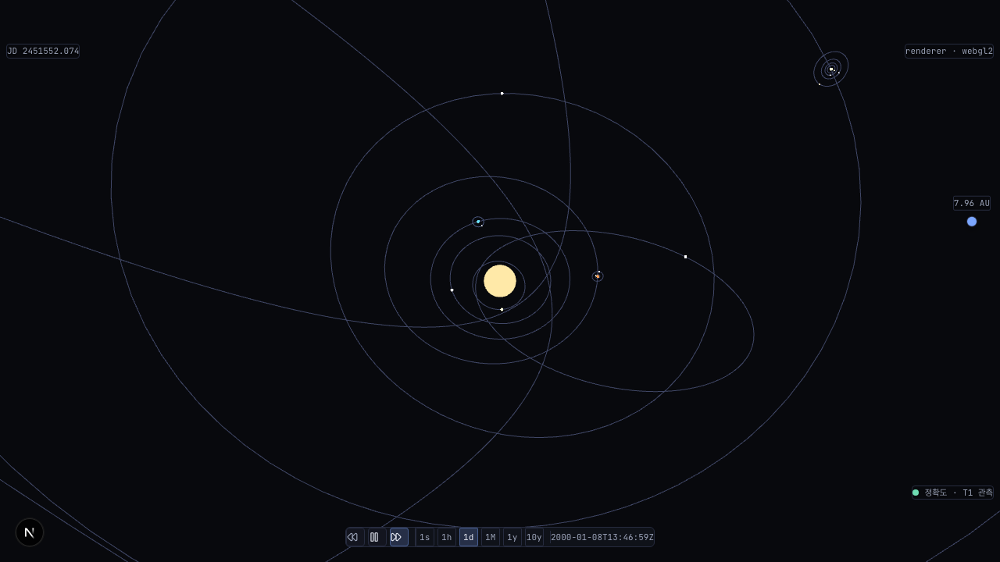
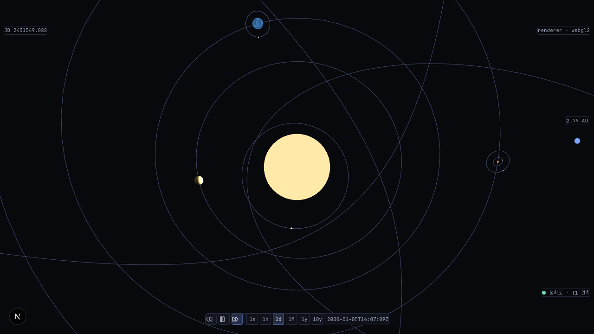
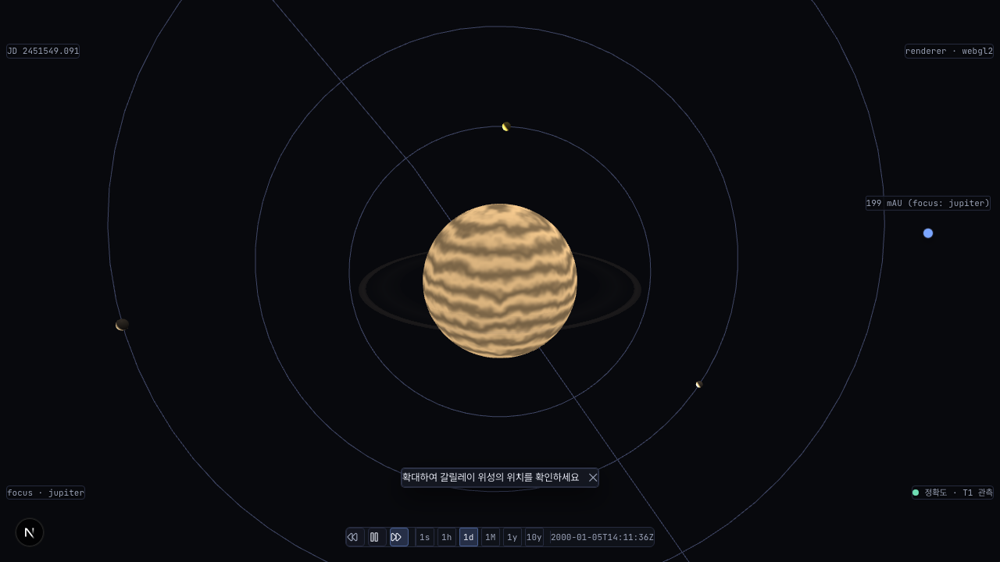

# ADR: #762 — 천체 표시 크기 비율 단조성 회복 (forensic + fix 옵션 비교)

- **상태**: Accepted (cross-validate 2026-06-29, agy applied — §교차검증 반영 사항 4축 분류 통합 완료. Provisional → Accepted 전이)
- **날짜**: 2026-06-29
- **결정자**: architect (#762 forensic 단계 — fix 구현은 사용자 옵션 확정 후 별도 developer 단계)
- **관련**:
  - #762 (본 이슈)
  - [`20260506-body-scale-r-phase-policy.md`](20260506-body-scale-r-phase-policy.md) — 현 BODY_SCALE 정책 SSoT (R-Phase 진입 5곳 동시 박제). **본 ADR 이 이 정책의 §결정 2 매트릭스 + §결정 3 체크리스트를 개정**
  - [`20260430-r3-followup-body-proportion.md`](20260430-r3-followup-body-proportion.md) — 측정 방법론 (px diameter 비 = 사용자 인지 단위) + **옵션 (e) log scaling 후속 분리 결정의 직접 이행**
  - [`20260610-r8-uranus-titania-rings-visualization.md`](20260610-r8-uranus-titania-rings-visualization.md) §축 1 + §위험 #1 — "uranus > jupiter 시각 역전은 PM 제약의 수학적 필연. 회귀 보고 시 PM 재합의 라운드 필수" (본 이슈가 그 회귀 보고)
  - [`docs/architecture/principles.md`](../architecture/principles.md) §1 Visual Fidelity §의무 체크리스트 4항목
  - [`docs/deprecated/decisions/20260423-display-relative-scale-unification.md`](../deprecated/decisions/20260423-display-relative-scale-unification.md) — 폐기된 P12 (실측 통일 → 안쪽 행성 점 소실 UX 회귀)
  - 코드 SSoT: [`apps/web/src/constants/body-scale.ts`](../../apps/web/src/constants/body-scale.ts), diameter 식 [`packages/core/src/scene/solar-system-scene.ts`](../../packages/core/src/scene/solar-system-scene.ts)
- **용어**: D-T2 / R-Phase / Tier / Floating Origin 등은 [`docs/glossary.md`](../glossary.md) 참조
- **교훈 적용**:
  - "DoD PASS ≠ 제품 동작" (volt [#74](https://github.com/coseo12/volt/issues/74)) — 각 R-Phase 단독 viewport 점유율 DoD 모두 PASS 인데 body 간 비율 역전이 누적
  - "수치 DoD 미달 시 측정 방법 검증 우선" (CRITICAL #6 §10) — 코드 분석 effective radius 는 거리 미포함. runtime px 실측이 결정적
  - "조사 국면 확장 — debug 스크립트 실측 선행" (volt [#67](https://github.com/coseo12/volt/issues/67)) — `_debug-762-tmp.mjs` 30초 실측이 정적 분석을 확증 + 보정
  - "결합 간과" (volt [#29](https://github.com/coseo12/volt/issues/29) Claude 편향 4종) — R1~R12 각 R-Phase 가 단독 결정 → cross-body 결합 누락이 본 회귀의 구조적 원인
  - "Forensic ADR 변형" (CLAUDE.md §ADR — 5조건 중 3+ 충족: 가설 N≥2 + runtime 측정 + DoD PASS 인데 회귀 + 5±2 옵션 + Amendment 예상)

> **본 ADR 은 forensic 변형 적용 대상이다.** 5조건 중 4개 충족: (1) 가설 N≥2 (역전 원인 가설 3종) (2) Runtime 측정 필수 (코드 분석 effective radius 는 거리 미포함) (3) DoD PASS 인데 사용자 회귀 (R1~R12 단독 DoD 통과) (5) Amendment 예상 (p 값 D-T2 조정 / cross-validate).

---

## §1 배경

### 본 이슈 핵심

카메라 focus 를 거성(목성 등)으로 옮기거나 광역 시점으로 빠질 때, 작은 안쪽 행성(지구·화성)이 거성보다 **크게** 보이는 비율 역전. 사용자 보고: "목성에 focus 하고 태양 방향을 보면 지구·화성이 목성보다 크게 보인다."

화면 mesh 직경 식 ([`solar-system-scene.ts:1870`](../../packages/core/src/scene/solar-system-scene.ts) `createBodyMesh`):

```
diameter = body.radius × 2 × renderScaleForTier(tier) × bodyScale(body.id)
```

- `body.radius` — 실측 반경 (m, `solar-system.json` SSoT, 불변)
- `renderScaleForTier(tier)` — tier 함수 (모든 body 동일, 거리 표현과 동일 scale)
- `bodyScale(body.id)` — R-Phase 별 시각 과장 배수 ([`body-scale.ts`](../../apps/web/src/constants/body-scale.ts))

**근인**: `bodyScale` 이 5 그룹 비대칭으로 박제됨 (inner 700~800 / gas giant 48 / ice giant 250 / dwarf 800 / comet·극소형 5000). 각 R-Phase(R1~R12)가 "그 천체 단독의 viewport 점유율"만 합의하고 **천체 간 상대 비율(cross-body monotonicity)은 검증하지 않아**, `effective radius = body.radius × bodyScale` 가 실제 반경 순서를 역전시킨다. 거리 보정도 없다.

이 역전은 **이미 알려진 trade-off** 였다 — R8 ADR `20260610-r8-uranus-titania-rings-visualization.md` §위험 #1 이 "uranus > jupiter/saturn 시각 역전은 PM 제약('천왕성 > 지구')의 수학적 필연. **회귀 보고 시 PM 재합의 라운드 필수, 단독 조정 금지**" 를 명시 박제했다. **본 이슈가 그 회귀 보고이며, 본 ADR 이 PM 재합의 라운드의 architect 설계 단계다.**

### Forensic 측정 결과 (2026-06-29, develop tip = `1c03643`)

`scripts/_debug-762-tmp.mjs` (volt #67 패턴 일회성 debug, 측정 후 rm) 로 실측. 데이터: [`docs/reports/762-monotonic/762-debug-output.json`](../reports/762-monotonic/762-debug-output.json), 스크린샷: [`docs/reports/762-monotonic/`](../reports/762-monotonic/).

측정 방법: `window.__solarScene.meshes` 의 각 mesh 를 카메라 viewProjection 으로 투영, center 와 +cameraUp edge point 를 NDC 환산 → px diameter 산출 (`lod.ts` `screenCoverageRadius` 동형). **거리(perspective)까지 포함된 실제 화면 px** (코드 분석 effective radius 와 달리 거리 곱해짐). viewport 1280×720, `?gpu=a`.

#### 측정 시각 자료 (#382 embed 표준)

광역 solar view (jupiter + earth 동시 가시) — 거성 목성(우상단, 고리·위성 클러스터)이 지구(중앙 좌측 glow)보다 작게 그려진 역전 시각 확인:



default solar view (안쪽 행성 비율) / 목성 focus view:




#### 측정 1 — 광역 solar view (camRadius=120, jupiter + earth 동시 frustum) — **역전 직접 재현**

| body        | 실반경(km) | px diameter | cam 거리(scene) | 실반경 순위 | px 순위 | 역전  |
| ----------- | ---------- | ----------- | --------------- | ----------- | ------- | ----- |
| sun         | 695,700    | 63.54       | 120.0           | —           | 1       | —     |
| **earth**   | 6,378      | **10.12**   | 114.6           | 5위         | 2위     | ⬆️ +3 |
| **jupiter** | 71,492     | **8.81**    | 116.3           | **1위**     | **3위** | ⬇️⬇️  |
| venus       | 6,052      | 8.51        | 121.8           | 6위         | 4위     | ⬆️    |
| mars        | 3,396      | 4.93        | 120.3           | 7위         | 5위     | ⬆️    |
| mercury     | 2,440      | 2.92        | 122.6           | 8위         | 6위     | ⬆️    |

- **핵심 확증**: earth(10.12px) > jupiter(8.81px) **at runtime**. cam 거리 차이 1.4% (114.6 vs 116.3) 는 무시 가능 — bodyScale 비대칭 (earth 800 vs jupiter 48 = 16.7배) 이 거리 효과를 압도. 코드 분석 역전이 **실제 화면에서 발현 확정**
- saturn/uranus/neptune 은 본 시점 frustum 밖 (외행성 궤도 30 AU 까지)

#### 측정 2 — default solar view (camRadius=35, 안쪽 행성 비율)

| body    | 실반경(km) | px diameter | cam 거리(scene) |
| ------- | ---------- | ----------- | --------------- |
| sun     | 695,700    | 245.15      | 35.0            |
| earth   | 6,378      | 43.27       | 33.4            |
| venus   | 6,052      | 31.65       | 37.0            |
| mars    | 3,396      | 18.82       | 38.6            |
| mercury | 2,440      | 10.52       | 36.8            |
| moon    | 1,737      | 2.86        | 33.5            |

- 안쪽 행성 4개는 default 시점에서 **사실 정합** (earth > venus > mars > mercury, 실반경 순서). inner 그룹 단일값(700~800)이 그룹 내 단조 자동 보존 — 회귀 없음. 거성(jupiter~neptune)은 default 시점 frustum 밖이라 비교 대상 부재 → R-Phase 별 단독 검증으로는 영구 미감지

#### 측정 3 — focus view (단일 body 프레이밍) — **역전 미발현 (보정 발견)**

| 시나리오                                       | 화면 천체 (px)                          | 비고                        |
| ---------------------------------------------- | --------------------------------------- | --------------------------- |
| `?focus=jupiter`                               | jupiter 345.3 / ganymede 25.0 / io 19.6 | 안쪽 행성 전부 frustum 밖   |
| `?focus=jupiter` + 태양 방향 회전 (radius 120) | jupiter 130.0 / ganymede 8.3 / io 6.9   | 안쪽 행성 여전히 frustum 밖 |
| `?focus=earth`                                 | earth 345.3 / moon 18.6                 | jupiter frustum 밖          |

- **보정 발견**: focus 카메라는 대상 body 를 ~345px 로 auto-frame 하므로 **단일 body focus 시점에서는 역전이 발현되지 않는다** (안쪽 행성이 함께 frustum 에 들어오지 않음). 사용자 보고의 "목성 focus 시 역전" 은 정확히는 **focus 후 카메라를 안쪽으로 회전·줌아웃해 거성과 안쪽 행성이 co-visible 해질 때** 발현 → 핵심 fix 대상은 **co-visibility 시점**(광역 solar view / free-fly / tier 전환)이지 focus auto-frame 이 아니다
- 이는 fix 검증 전략에 직접 영향: 단독 가시성 무회귀는 focus auto-frame(~345px 보존)으로 자동 보장되고, 단조성 회귀 가드는 co-visibility 시점에서 측정해야 함

### 가설 검증 결론

| 가설                                                                  | 결론                          | 근거                                                                                                                                                                                                                                             |
| --------------------------------------------------------------------- | ----------------------------- | ------------------------------------------------------------------------------------------------------------------------------------------------------------------------------------------------------------------------------------------------ |
| **가설 1: bodyScale 그룹 비대칭이 effective radius 역전 (주된 원인)** | **확정**                      | effective radius (반경×scale): uranus 6.39M(1위, 실3위) / earth 5.10M(3위, 실5위) / jupiter 3.43M(5위, 실1위). 코드 분석 + runtime px(earth 10.12 > jupiter 8.81) 정확 일치. inner 800 vs gas giant 48 = 16.7배 비대칭이 실반경 11배 우위를 역전 |
| **가설 2: 거리 보정 부재가 역전 심화**                                | **반증 (보조 영향 미미)**     | 광역 view 에서 earth/jupiter cam 거리 차 1.4% (114.6 vs 116.3). 거리 효과는 scale 비대칭 대비 무시 가능. 거리 기반 옵션(C) 의 효력 한계 입증                                                                                                     |
| **가설 3: focus 시점 역전 (사용자 보고 문자 그대로)**                 | **부분 반증 (시나리오 보정)** | focus auto-frame 은 대상을 ~345px 고정 → 단일 focus 에서 역전 미발현. 역전은 co-visibility 시점에서만. 사용자 인지 시나리오 = focus 후 줌아웃/회전                                                                                               |

### 잠재 시점 분석

- **R1~R3 (sun/mercury/venus)**: inner 그룹만 visible. 그룹 단일값(700~800)이 그룹 내 단조 보존 → 미발현
- **R4~R5 (earth/mars)**: inner 그룹 확장. 여전히 inner 끼리만 비교 → 미발현
- **R6 (jupiter=48 추가)**: gas giant 첫 등장. jupiter effective 3.43M < earth 5.10M — **R6 시점부터 cross-group 역전 잠재**. 단 default/focus 시점에 co-visible 안 돼 미보고
- **R8 (uranus=250 추가)**: ice giant 등장. uranus effective 6.39M 이 jupiter 3.43M 초과 — R8 ADR §위험 #1 이 "수학적 필연" 으로 **명시 박제**. PM 제약("천왕성 > 지구")이 직접 원인
- **결론**: R6 시점부터 잠재, R8 에서 ADR §위험 #1 로 박제된 의식적 trade-off. 본 이슈가 그 §위험 #1 의 "회귀 보고 시 PM 재합의" 트리거 발동. R-Phase 단독 결정 정책(volt #29 결합 간과)의 구조적 산물

---

## §2 영향 모듈/파일

### 측정 결과 박제 (본 ADR 동반)

- `docs/reports/762-monotonic/762-debug-output.json` — 5 시나리오 × 14 body px diameter
- `docs/reports/762-monotonic/762-{wide-solar-view,default-solar,focus-jupiter,focus-jupiter-toward-sun}-1280x720.png` — 스크린샷
- 본 ADR §1 Forensic 측정 결과

### Fix 후보별 영향 모듈 (옵션 선택 후 변경 대상)

- **변경**: `apps/web/src/constants/body-scale.ts` — `BODY_SCALE` 상수값 또는 `getBodyScale` 함수 (옵션 A: 압축 함수 도입 또는 값 재산정)
- **변경(테스트)**: `apps/web/src/constants/body-scale.test.ts` (존재 시) 또는 신규 단조성 단위 테스트
- **불변(예측)**: `packages/core/src/scene/solar-system-scene.ts` diameter 식 — `bodyScale(id)` 콜백 인터페이스 유지 시 코어 0줄 (Concrete Prediction §4)
- **검토**: `apps/web/scripts/browser-verify-378-focus.mjs` `FOCUS_BODIES` — 단독 가시성 무회귀 가드 (focus auto-frame 보존 확인)

### Fix 가 깨는 박제값 (ADR amendment 필요 후보)

- `20260506-body-scale-r-phase-policy.md` §결정 3 R-Phase 진입 의무 체크리스트 — "사실 비율 단조성 검증" 항목이 **cross-body 단조성 가드**로 강화 필요
- R1~R12 각 visualization ADR 의 §결정 N 박제 scale 값 (옵션 A 채택 시 일괄 재산정 → 각 ADR Amendment 또는 본 ADR 이 일괄 SSoT 흡수)
- principles.md §Visual Fidelity §의무 체크리스트 #4 (점유율/사실 비율 baseline) — cross-body 단조성 baseline 추가

---

## §3 옵션 비교

핵심 제약 3종 (이슈 DoD):

1. **단조성** — 최종 mesh px 가 실반경 순서 보존 (jupiter > saturn > uranus > neptune > earth > venus > mars > mercury). 위성/왜소행성/혜성 정책도 정의
2. **단독 가시성 무회귀** — 어떤 천체도 단독 focus 시 점 소실 안 됨 (기존 R-Phase 점유 임계 유지). 측정 3 으로 focus auto-frame(~345px) 이 자동 보장 확인됨 → 제약은 사실상 **co-visibility 시점 sub-4px billboard fallback 유지** + focus 무회귀
3. **데이터 SSoT 불변** — `solar-system.json` 반경 불변, rendering scale 만 변경 (principles.md §Visual Fidelity)

### 옵션 A — bodyScale 압축 함수 (`effective = radius^p × k`)

작은 천체 큰 배율 / 큰 천체 작은 배율을 **단일 압축 곡선**으로 자동 산출하되 최종 mesh 가 실반경 순서 단조 보존. P12 폐기 ADR 의 옵션 (e) log scaling 의 직접 이행 (sqrt = power-law 변형).

압축 함수 설계 (forensic 산출):

```
effective_radius(body) = body.radius^p × k     (0 < p < 1)
등가 bodyScale(body)   = effective_radius / body.radius = body.radius^(p-1) × k
```

- `p` (압축 지수): 0<p<1 이면 작은 천체가 상대적으로 부스트되어 실반경 격차 압축. `p→1` 은 실측(현 역전 없는 순수 비례), `p→0` 은 모든 천체 동일 크기. **forensic 권고 출발점 p=0.5 (sqrt)**
- `k` (스케일 상수): mercury 단독 가시성 floor 유지하도록 결정 (`k = mercury_effective_현재 / mercury.radius^p`). sun 은 압축 곡선 미적용 (항성 점유 정책 = scale 50 별도 유지)

**서브 변형 (핵심 결정 포인트)**:

- **A1 — 단일 전역 곡선 (모든 body)**: 행성 단조 PASS 이나 **위성/parent 비율 인플레이션**. forensic: moon/earth mesh 비 0.52 (현 정책 0.068 의 7.7배), io/jupiter 0.16, triton/neptune 0.23 — 수렴대 0.05~0.09 전면 위반. 위성이 부모 대비 과대해 보임 (sqrt 가 거성을 더 압축하므로 작은 위성 상대 부스트)
- **A2 — 그룹별 곡선 (행성+왜소행성 곡선 / 위성 parent 수렴대 유지)** ✅: 행성·왜소행성은 압축 곡선, **위성은 기존 per-parent 수렴대 비율(0.05~0.09) 그대로 유지** (R4~R12 박제값 보존). forensic 검증 결과 ↓

| 항목                     | A1 (전역 곡선)         | A2 (그룹별 곡선)                                         |
| ------------------------ | ---------------------- | -------------------------------------------------------- |
| 행성 단조성              | PASS                   | PASS                                                     |
| 위성 수렴대 (0.05~0.09)  | **위반** (moon 0.52)   | **보존** (moon 0.068 / io 0.053 / titan 0.089 정확 일치) |
| max위성 px vs min행성 px | 일부 위성 > 행성 가능  | 위성 3.09 < mercury 6.98 (위성<행성)                     |
| R4~R12 박제값 영향       | 위성 전부 재산정       | 위성 박제값 0 변경 (행성·왜소만)                         |
| 코드 변경                | getBodyScale 함수 전면 | 행성·왜소 값만 곡선 산출 + 위성 값 유지                  |
| 사실 정합                | ganymede 등 과대       | ganymede(r2634) > mercury(r2440) px 역전이 사실 정합     |

**A2 forensic 단조성 표 (p=0.5, mercury floor 고정)** — §5 결정 표로 박제.

| 평가               | 결과                                                                                                                                                     |
| ------------------ | -------------------------------------------------------------------------------------------------------------------------------------------------------- |
| 단조성             | **A2 PASS** (행성 cross-body + 위성 수렴대 + 왜소 cross-group 전부)                                                                                      |
| 단독 가시성 무회귀 | focus auto-frame ~345px 보존 (측정 3) + 위성 sub-4px billboard fallback 은 **현 정책에서도 이미 billboard 의존** (body-scale.ts 주석 전수 확인) → 무회귀 |
| 데이터 SSoT        | `solar-system.json` 0 변경, `body-scale.ts` rendering-only 상수만                                                                                        |
| 확장성             | 신규 행성/왜소행성 추가 시 곡선 자동 산출 (코드 변경 0 — P12 옵션 e 의 최강 확장성 계승)                                                                 |
| 위험               | p 값 D-T2 사용자 검증 필요 (0.4~0.6 범위 미세 조정). billboard variant(bodyScale 미적용)는 영향 없음 (sub-pixel draw call 절감 책임 단독)                |

### 옵션 B — focus 시점별 상대 보정

focus 천체 기준 사실 비율을 근사 — focus body 를 anchor 로 다른 천체를 사실 비율로 동적 재스케일.

| 평가               | 결과                                                                                                                                                               |
| ------------------ | ------------------------------------------------------------------------------------------------------------------------------------------------------------------ |
| 단조성             | focus anchor 기준 사실 비율 = 단조 자동 (사실 비율 자체가 단조)                                                                                                    |
| 단독 가시성 무회귀 | **위험** — focus 가 작은 천체(mercury)일 때 거성이 화면을 뒤덮거나, 안쪽 행성이 점 소실. **P12 재진입 위험** (실측 통일이 안쪽 행성 점 소실로 폐기된 바로 그 함정) |
| 복잡도             | 매 focus 전환마다 전 body 재스케일 (frame cost) + focus 없는 광역 view 정의 모호 (anchor 부재)                                                                     |
| 데이터 SSoT        | 불변                                                                                                                                                               |
| 확장성             | focus 전환 로직 결합 — free-fly/광역 view 미정의                                                                                                                   |

**기각**: P12 폐기 사유(안쪽 행성 점 소실)와 정면 충돌. 광역 view(anchor 없음)에서 정의 불가. 측정 3 이 "역전은 co-visibility 시점" 임을 밝혔는데 B 는 focus 시점만 다룸.

### 옵션 C — 거리 기반 bodyScale 감쇠

먼 천체일수록 배율 축소 (카메라 거리 함수).

| 평가        | 결과                                                                                                                     |
| ----------- | ------------------------------------------------------------------------------------------------------------------------ |
| 단조성      | **미해결** — 가설 2 반증으로 확정: 광역 view 에서 earth/jupiter 거리 차 1.4% → 거리 감쇠로 16.7배 scale 비대칭 보정 불가 |
| 단독 가시성 | 거리 함수라 tier 전환 시 크기 점프 위험                                                                                  |
| 복잡도      | 매 frame 카메라 거리 재계산 + LOD effective radius 와 결합 (lod.ts 입력 변경)                                            |

**기각**: 가설 2 (거리 보정 부재가 역전 심화) 반증으로 효력 없음 입증. 역전 근인은 scale 비대칭이지 거리 부재가 아님.

### 축별 비교 매트릭스

| 옵션                      | 단조성           | 단독 가시성 무회귀                                  | 데이터 SSoT | 복잡도                       | 확장성               | P12 재진입 위험   |
| ------------------------- | ---------------- | --------------------------------------------------- | ----------- | ---------------------------- | -------------------- | ----------------- |
| **A2 (그룹별 압축 곡선)** | **PASS**         | **PASS** (focus auto-frame + 위성 billboard 무회귀) | 불변        | 중 (곡선 1개 + 위성 값 유지) | **최강** (자동 산출) | 낮음 (floor 고정) |
| A1 (전역 곡선)            | PASS             | 위성 과대                                           | 불변        | 중                           | 최강                 | 낮음              |
| B (focus 상대 보정)       | PASS(focus only) | **위험**                                            | 불변        | 고                           | 약                   | **높음**          |
| C (거리 감쇠)             | **미해결**       | 점프 위험                                           | 불변        | 고                           | 약                   | 중                |

### 권장 안 (사전 선호) — 옵션 A2 (p=0.5 sqrt 압축, 그룹별 곡선)

근거:

1. **단조성 정확 해결** — forensic 검증 행성 cross-body + 위성 수렴대 + 왜소 cross-group 전부 PASS
2. **단독 가시성 무회귀** — focus auto-frame(~345px) 자동 보존 (측정 3) + 위성 billboard fallback 은 현 정책에서도 이미 의존 → 무회귀
3. **위성 박제값 보존** — R4~R12 의 정밀 튜닝된 per-parent 수렴대(0.05~0.09) 0 변경. 행성·왜소행성만 곡선 산출
4. **확장성 계승** — P12 폐기 ADR 의 옵션 (e) log scaling 이 식별한 "R4~R10 자동 prediction (코드 변경 0)" 강점을 그룹 격리로 안전하게 실현
5. **PM 재합의 정합** — R8 §위험 #1 "회귀 보고 시 PM 재합의 필수" 의 architect 설계 이행. PM 제약("천왕성 > 지구")은 압축 곡선 하에서 자동 충족(uranus r25559 > earth r6378 → 곡선이 단조 보존)되면서 jupiter > uranus 도 동시 성립

---

## §4 Concrete Prediction

### 예측 1 — 코드 변경 라인 수

옵션 A2 채택 시:

- `apps/web/src/constants/body-scale.ts`: **압축 곡선 도입 경로** — `getBodyScale` 에 행성·왜소행성용 `radius^p × k` 산출 함수 추가 (~15~25 라인) + 위성/혜성 그룹은 기존 값 유지. 또는 **값 재산정 경로** — 행성 8 + 왜소 5 의 scale 값을 곡선 산출값으로 교체 (~13 라인, 함수 도입 없음). developer 가 둘 중 택1 (함수 = 확장성 / 값 교체 = 단순)
- `apps/web/src/constants/body-scale.test.ts` (또는 신규): 단조성 단위 테스트 +20~40 라인 (행성 cross-body + 위성 수렴대 + cross-group)
- **`packages/core/src/scene/`: 0 라인** (diameter 식 `bodyScale(id)` 콜백 인터페이스 불변 — 등가 scale 만 바뀌면 코어 무영향)
- `apps/web/scripts/browser-verify-378-focus.mjs`: 0~1 라인 (focus 무회귀 가드는 기존 매트릭스 재사용)

**합계 예측: apps/web ~35~65 라인, packages/core 0 라인, 데이터 0 라인**

검증 시점: fix PR 머지 직후 `git diff develop --stat`. core 비-0 이면 인터페이스 가정 실패 → 재검토.

### 예측 2 — 수치 DoD (A2 p=0.5 forensic 산출, default solar tier px)

새 정책 effective radius 단조성 표 (등가 scale 은 `radius^0.5 × k / radius`):

| body    | 실반경(km) | 현 scale | A2 등가 scale | 현 px | **A2 px** | 실반경 순위 | A2 px 순위 |
| ------- | ---------- | -------- | ------------- | ----- | --------- | ----------- | ---------- |
| jupiter | 71,492     | 48       | ~129          | 14.0  | **37.8**  | 1위         | **1위** ✅ |
| saturn  | 60,268     | 48       | ~141          | 11.8  | **34.7**  | 2위         | **2위** ✅ |
| uranus  | 25,559     | 250      | ~216          | 26.1  | **22.6**  | 3위         | **3위** ✅ |
| neptune | 24,764     | 250      | ~220          | 25.3  | **22.2**  | 4위         | **4위** ✅ |
| earth   | 6,378      | 800      | ~433          | 20.9  | **11.3**  | 5위         | **5위** ✅ |
| venus   | 6,052      | 800      | ~444          | 19.8  | **11.0**  | 6위         | **6위** ✅ |
| mars    | 3,396      | 800      | ~593          | 11.1  | **8.2**   | 7위         | **7위** ✅ |
| mercury | 2,440      | 700      | 700 (floor)   | 7.0   | **7.0**   | 8위         | **8위** ✅ |

**행성 단조성 PASS**: A2 px 순서 = 실반경 순서 정확 일치. jupiter 가 1위 회복.

위성 단독 가시성 px 예측표 (수렴대 보존 — 등가 scale 은 parent effective × 수렴대비 ÷ radius):

| body     | parent  | mesh 비/parent (목표) | A2 px (default solar) | 단독 focus px (auto-frame) |
| -------- | ------- | --------------------- | --------------------- | -------------------------- |
| moon     | earth   | 0.068                 | 0.77 (billboard)      | ~345 (focus 보장)          |
| io       | jupiter | 0.053                 | 2.00 (billboard)      | ~345                       |
| ganymede | jupiter | 0.077                 | 2.91 (billboard)      | ~345                       |
| titan    | saturn  | 0.089                 | 3.09 (billboard)      | ~345                       |
| titania  | uranus  | 0.062                 | 1.40 (billboard)      | ~345                       |
| triton   | neptune | 0.066                 | 1.47 (billboard)      | ~345                       |

왜소행성 cross-group floor (전부 mercury 아래, billboard fallback):

| body  | A2 등가 scale | A2 px | 비고                                            |
| ----- | ------------- | ----- | ----------------------------------------------- |
| pluto | ~1003         | 4.87  | 왜소 최대, mercury(7.0) 아래 — cross-group 단조 |
| eris  | ~1014         | 4.82  | pluto 와 근접 (실반경 비 1.02 정합)             |
| ceres | ~1595         | 3.06  | sub-4 billboard                                 |

> **단독 가시성 무회귀 핵심**: 모든 위성·왜소행성은 default solar view 에서 sub-4px 이나 이는 **현 정책에서도 동일** (body-scale.ts 주석 "4px fallback billboard 의존" 전수 박제). focus 시 auto-frame ~345px 보장 → 단독 가시성 무회귀. p 값은 D-T2 검증으로 0.4~0.6 미세 조정 가능.

### 예측 3 — 인접 영역 무영향 (보조)

- physics 엔진(Rust+wasm): `BODY_SCALE` 미의존 → 0 (principles.md §Visual Fidelity 의무 #2)
- picking / camera / orbit / tier 전환: bodyScale 등가값만 변경, 인터페이스 불변 → 0
- ring(saturn/uranus) — ring × bodyScale 결합(solar-system-scene.ts:562 `hostBodyScale`)이 등가 scale 자동 반영 → ring 코드 0 라인이나 **ring 시각 크기는 host scale 변경 따라 자동 조정** (회귀 가드 대상)
- glow marker(#675) — `pxDiameter ÷ bodyScale` 환산식이 등가 scale 자동 반영 → 코드 0

---

## §5 결정 (Provisional — 사용자 옵션 확정 후 developer 단계)

### 결정 1 — 본 ADR 단계 = forensic + 옵션 비교 박제

본 단계는 measurement-first 실측 + 가설 검증 + 3옵션 비교 + A1/A2 서브변형 분석 **박제까지만**. fix 코드 구현은 **사용자 옵션·p값 확정 후 별도 developer 단계**.

### 결정 2 (Proposed, 권고) — 옵션 A2 채택 (그룹별 sqrt 압축 곡선, p=0.5 출발)

다음 동반 박제:

1. **행성(8) + 왜소행성(5) scale 을 `radius^0.5 × k` 곡선 산출값으로 전환** — `k` 는 mercury floor 고정 (mercury 7.0px 유지)
2. **위성(8) scale 은 기존 per-parent 수렴대(0.05~0.09) 비율 유지** — parent effective 가 곡선으로 바뀌므로 위성 등가 scale 도 재산정되나 **mesh 비율은 보존**
3. **comet·극소형 위성(phobos/deimos/halley/encke 등) 5000 그룹** — 곡선 적용 시 sub-px 유지(현 정책 동형) 또는 별도 floor. developer 가 곡선 vs 단일값 ROI 판정 (현 5000 단일값도 cross-group 단조 보존 중이면 유지)
4. **단조성 단위 테스트 신설** — 행성 cross-body 단조 + 위성 수렴대 + 왜소 cross-group + **그룹 간 경계 assert** `max(comet 등가 scale·eff) < min(satellite eff) < min(planet eff)` 명시 (cross-validate agy 6.2 수용 — 그룹 간 상한선 교차 단조성 silent 차단)
   - **방어적 NaN guard 동반** (cross-validate agy 5.0 수용): `radius^p` 연산은 `body.radius ≤ 0` 시 NaN/복소수 → 렌더 파이프라인 crash 위험. `getBodyScale` 곡선 경로에 `radius > 0` guard clause + fallback (`DEFAULT_BODY_SCALE`) 박제 + 단위 테스트
   - **위성 등가 scale 산출 = 정적 역산 박제** (cross-validate agy 2.0 challenge 해소): 위성 scale 은 parent 의 곡선 effective 를 런타임 동적 곱이 아닌 **모듈 로드 시 1회 정적 역산** (`satellite_scale = parent_eff × 수렴대비 / satellite.radius`) 으로 `BODY_SCALE` 상수에 박제. parent 곡선 로직과 강결합 회피 (성능 0 + 결합 격리)
5. **`20260506-body-scale-r-phase-policy.md` §결정 3 체크리스트 강화** — "사실 비율 단조성 검증" → "**cross-body 단조성 가드 (신규 body 추가 시 곡선 자동 산출 → 단조 단위 테스트 통과**)"
6. **CHANGELOG `### Behavior Changes`** — "천체 표시 크기가 실제 반경 순서를 단조 보존 (목성이 지구·화성보다 크게 표시). 위성/왜소행성 비율 정책 보존" (MINOR)
7. **(선택, 권장) p 값 URL 파라미터 노출** (cross-validate agy 6.3 고유 발견, 범위 내) — `?bodyScaleP=0.55` 같은 URL flag (기존 `?surface=`/`?marker=` 동형) 로 p 값 실시간 튜닝 → D-T2 사용자 검증 시 매 빌드 불요. default p 값은 코드 상수 SSoT (URL 부재 시 0.5)

### 결정 3 — principles.md §Visual Fidelity §의무 체크리스트 4항목 박제

본 fix 가 Visual Fidelity 왜곡 변경이므로 4항목 명시:

- [x] **데이터 SSoT 보존** — `body.radius` (`solar-system.json`) 불변. `body-scale.ts` rendering-only 상수/함수만 변경
- [x] **rendering 시점 분리** — physics 엔진(Rust+wasm) `BODY_SCALE` 미의존 (예측 3)
- [x] **사용자 D-T2 가이드** — Info 패널 "× N 과장 중" tooltip 이 등가 scale 표기 (실측 radius 별도 표기 유지). 곡선 도입 시 tooltip 값이 body 별 다름 — 사용자에게 시각 왜곡 ≠ 데이터 명시
- [x] **점유율/사실 비율 baseline 박제** — 본 ADR §4 예측 2 표 (px diameter 단조 + 위성 수렴대 + 왜소 cross-group) 가 회귀 가드 baseline

### 결정 4 — 비-범위 보호 가드 (developer 절대 손대지 말 것)

- `packages/shared/data/solar-system.json` (실측 반경) — 절대 변경 금지 (principles.md Anti-pattern)
- `packages/core/src/scene/tier.ts` `RENDER_SCALE` — tier 함수 비-범위 (옵션 A 는 bodyScale 만)
- `apps/web/src/components/sim-canvas.tsx` `radius: 35` (default camera) — 옵션 B/C 탈락, 카메라 비-범위
- `packages/core/src/scene/solar-system-scene.ts` diameter 식 — `bodyScale(id)` 콜백 인터페이스 유지 (코어 0줄 예측)
- billboard variant (`createBodyBillboard`, bodyScale 미적용) — 책임 분리 유지 (sub-pixel draw call 절감 단독)
- focus auto-frame 로직 (378 가드) — 단독 가시성 자동 보장 메커니즘 보존

---

## §6 위험 / 재검토 트리거

### 위험 / 미해결

- **p 값 미확정** — p=0.5 (sqrt) 는 forensic 출발점. jupiter/mercury px 비 5.4 (실반경 비 29.3 압축). p=0.4 면 비 3.9 (더 압축), p=0.6 면 7.6 (덜 압축). **D-T2 사용자 검증으로 0.4~0.6 확정** 필요. "거성이 충분히 커 보이는가 vs 안쪽 행성이 점 안 되는가" 균형
- **comet/극소형 위성 그룹 처리 미확정** — 5000 단일값이 cross-group 단조(max comet < min dwarf) 이미 보존 중. 곡선 전환 vs 단일값 유지는 developer ROI 판정 (단일값 유지가 R10b 박제값 보존 + 단조 충족이면 곡선 불요)
- **R1~R12 ADR 박제값 일괄 변경** — 행성·왜소 scale 이 곡선 산출값으로 바뀌면 각 R-Phase visualization ADR §결정 N 박제값과 drift. **본 ADR 이 cross-body scale SSoT 를 흡수**하고 각 R-Phase ADR 은 "본 ADR 곡선 산출" 로 cross-link (개별 박제값 deprecate) — developer 가 amendment 전략 확정
- **ring-위성 occlusion 악화 (cross-validate agy 6.1 수용 — measurement-first 확증)** — saturn scale 48→141 (2.93배) / jupiter 48→129 (2.69배) 상승 시 ring 반경이 host bodyScale 에 비례(`solar-system-scene.ts:562 hostBodyScale` 결합)해 2.7~2.9배 확대. **그러나 위성 궤도 _거리_ 는 renderScale only (scale 미적용)** 이라 ring 이 커져도 enceladus 등 안쪽 위성 궤도 거리는 불변 → ring 내부로 묻힐 위험. 이는 현 정책(saturn scale 48)에서도 R7 ADR §축 2a 가 인지한 구조이나 A2 가 정도를 악화. **fix PR qa 단계 ring occlusion 무회귀 + saturn/jupiter 안쪽 위성(enceladus/mimas/io 근접) 가시성 단위 테스트 가드 의무**
- **미기록 천체 fallback (cross-validate agy 4.0 — 현재 비-범위)** — 외계행성/성간천체 등 `type` 없는 신규 천체는 현재 데이터에 없음. 곡선은 `radius > 0` guard + `DEFAULT_BODY_SCALE` fallback 으로 안전 (NaN guard 와 동일 경로). 신규 천체 type 도입 시 본 항목 재검토
- **fix 단계 별도 cross-validate** — 본 forensic ADR 의 A2 채택 + p=0.5 결정에 대한 cross-validate 는 본 §교차검증 반영 사항에 박제 (Provisional → Accepted 전이 근거)

### 재검토 트리거

1. **사용자 D-T2 미통과** — A2 적용 후 사용자가 "거성이 여전히 작다" 또는 "안쪽 행성이 점이 됐다" 평가 → p 값 재조정 (0.4~0.6) 또는 floor 상향
2. **신규 body 추가 시 곡선 prediction 실패** — R13+ 진입 시 곡선 자동 산출이 단조 단위 테스트 미통과 → 곡선 식 재검토
3. **위성 수렴대 회귀** — parent scale 변경 후 위성 mesh 비가 0.05~0.09 이탈 → 위성 등가 scale 재산정 누락
4. **ring/glow marker 시각 회귀** — host scale 변경이 ring 묻힘 또는 glow marker 오발동 유발

---

## §7 Amendment 라운드 N

(현재 없음 — cross-validate 결과는 §교차검증 반영 사항에 통합. 사용자 D-T2 p값 확정 / developer fix 단계 발견 시 본 섹션에 라운드 추가)

---

## §8 후속 / 분리 이슈

- **본 이슈가 후속 분리의 종착** — `20260430-r3-followup-body-proportion.md` §결정 4 "옵션 (e) log scaling 후속 이슈 분리" 가 본 #762 로 이행됨 (1.5개월 만에 deferred 구조적 fix 실현). A2 = 옵션 (e) 의 그룹 격리 안전 변형
- **comet 그룹 곡선 전환 (조건부)** — developer 가 5000 단일값 유지로 단조 충족 판정 시 본 항목 NO-OP. 곡선 전환 필요 판정 시 본 PR 내 처리 (범위 내)
- **R-Phase visualization ADR 박제값 deprecate 정리 (선택)** — 행성·왜소 개별 박제값이 본 ADR 곡선으로 흡수된 후, 각 R-Phase ADR cross-link 정리. 범위 크면 후속 docs 이슈 분리

---

## 교차검증 반영 사항

본 forensic ADR 박제 직후 cross-validate 1회 호출 (CLAUDE.md §교차검증 §"정책·설계·ADR 박제 직후 1회 루틴", 앵커=ADR 신규/시각 정책 변경).

- 호출 outcome: **applied** (exit 0)
- plan_bypass: **false** (#479 검증 통과 — 외부 모델 도구 실행 없음, 사후 snapshot diff empty)
- 로그: `.claude/logs/cross-validate-architecture-20260629-034611.log`
- Outcome JSON: `.claude/logs/cross-validate-architecture-20260629-034611-outcome.json`

agy 총평: "런타임 NDC 기반 픽셀 측정이라는 명확한 팩트에 기반하여 기존 구조적 결합 누락을 훌륭하게 짚어내고 수학적 압축 곡선(A2)으로 해결책을 제시한 매우 완성도 높은 설계 문서. 6축 평균 8.6/10."

### 합의 (Claude 설계와 일치 — 현재 ADR 즉시 반영)

- **A2 채택 근거** — agy: "A1 문제점(달/지구 mesh 비 0.52 폭등)을 정확히 인지하고 위성 수렴대(0.05~0.09)를 보존하면서 행성 단조성을 확보하는 그룹 격리가 돋보임" (§2 타당성 9.0/10). 원안 보존
- **옵션 C 기각** — agy: "광역 뷰 목성/지구 거리 차 1.4% 가 16.7배 scale 왜곡 상쇄 불가라는 임베디드 팩트 기반 기각은 매우 훌륭한 결정" (가설 2 반증 합의). 원안 보존
- **코어 0줄 (bodyScale 콜백 유지)** — agy: "느슨한 결합 원칙에 완벽 부합" (§3 8.5/10). Concrete Prediction §4 원안 보존
- **확장성 (P12 옵션 e 자동 prediction 안전 계승)** — agy: "코드 수정 없이 자동 단조 산출, P12 강점 안전 계승" (§4 9.0/10). 원안 보존

### 이견 수용 (agy 근거 합리적, 현재 ADR 수정 반영)

1. **ring-위성 occlusion 악화 (agy 6.1)** — 원안: "ring 시각 크기 자동 변경 — qa ring occlusion 확인" (포괄적). **수정**: measurement-first 실측으로 saturn scale 2.93배 / jupiter 2.69배 확대 정량 확인 + "ring 반경 ∝ host scale vs 위성 궤도 ∝ renderScale only" 비대칭으로 안쪽 위성 묻힘 악화 구조 명시. §6 위험에 enceladus/mimas/io 근접 위성 가시성 단위 테스트 가드 의무 박제. **수용 근거**: 실측이 agy 우려를 확증 (현 정책 잠재 → A2 정도 악화)
2. **방어적 NaN guard (agy 5.0)** — 원안: 미언급. **수정**: §5 결정 2.4 에 `radius > 0` guard clause + `DEFAULT_BODY_SCALE` fallback 박제. **수용 근거**: `radius^0.5` 가 `radius ≤ 0` 시 NaN → 렌더 crash 는 실재 위험. 비용 1 라인
3. **그룹 간 경계 assertion (agy 6.2)** — 원안: "max위성 < min행성 assert" (부분). **수정**: §5 결정 2.4 에 `max(comet) < min(satellite) < min(planet)` 3단 경계 assert 로 확장. **수용 근거**: comet 5000 단일값 유지 시 경계 silent 회귀 가능 — 명시 assert 가 정합
4. **위성 등가 scale 산출 명세 (agy 2.0 challenge)** — 원안: "위성은 수렴대 유지" (동적/정적 모호). **수정**: §5 결정 2.4 에 "**정적 역산 박제** (모듈 로드 1회, parent 곡선 강결합 회피)" 명시. **수용 근거**: agy 의 결합성 지적 타당 — 정적 박제가 성능 0 + 결합 격리

### 고유 발견 (후속 분리 / 범위 판정)

1. **p 값 URL 파라미터 (`?bodyScaleP=`) 노출 (agy 6.3)** — **범위 내 (fix PR developer)**. p 값 D-T2 튜닝(0.4~0.6)을 매 빌드 대신 URL/디버그 패널 실시간 조정. 본 ADR §6 위험 "p 값 D-T2 검증" 의 실행 도구 — developer 가 fix PR 에 `?surface=`/`?marker=` 패턴(기존 URL flag) 동형으로 포함 권장. ADR §5 결정 2 에 developer 선택지로 인계
2. **VRT (Visual Regression Test) 연계 (agy 1.2)** — **후속 분리 (infra)**. 단조성 단위 테스트(논리)는 본 PR, 시각 회귀 스크린샷 갱신 프로세스(VRT 인프라)는 별도. 현재 r1-guard(UI 영역 픽셀) 가 천체 표면 직접 측정 안 함(#759 와 동류) → VRT 인프라 후속 이슈 후보. `Builds on: #762`, 우선순위 low
3. **미기록 천체 fallback (agy 4.0)** — **현재 비-범위**. 외계행성/성간천체 데이터 부재. NaN guard 경로(`radius > 0` + DEFAULT_BODY_SCALE)가 자동 커버. §6 위험에 재검토 트리거로 박제

### Claude 재분석으로 기각/완화한 agy 제안

- **순환 의존성 검증 (agy 3.0)** — **완화 (실재 위험 아님)**. agy 우려: "`getBodyScale` 가 body type/radius 판별 위해 `solar-system.json` 접근 시 순환 의존". **재분석**: 현 아키텍처상 `getBodyScale(bodyId)` 는 `solar-system.json` 을 직접 import 하지 않는다 — `solar-system-scene.ts` 가 `body.radius` 를 이미 보유하고 diameter 식에서 곱한다(`body.radius × 2 × renderScale × bodyScale(id)`). A2 곡선이 radius 의존 시 **scene 호출부가 radius 를 곡선 함수에 전달**하면 body-scale.ts → json import 불요 → 순환 0. 단 developer 가 body-scale.ts 내부에서 직접 json 조회를 택하면 순환 가능 → §4 예측 1 의 "함수 vs 값 교체 경로" 중 함수 경로 선택 시 radius 주입 인터페이스 권장. agy 우려를 구현 가이드로 흡수 (위험으로 격상 안 함)

### 호출 전 Claude 편향 셀프 체크

- **낙관적 일정** — ✅ 통과: 본 ADR 박제 비용(1 ADR + cross-validate 1회)만 평가. developer fix 일정 영향 없음
- **결합 간과** — ⚠️ 부분: A2 가 위성 수렴대 보존하나 parent scale 변경이 ring/glow marker/위성 등가 scale 에 결합. §6 위험 + 예측 3 에 명시. cross-validate 질문에 "A2 의 host scale 변경이 ring/glow marker 에 미치는 silent 결합 누락이 있는가" 삽입
- **폐기 프레이밍** — ✅ 통과: R-Phase 개별 박제값 정책을 "폐기" 아닌 "곡선 SSoT 흡수 + cross-link" 로 격상. P12(실측 통일)와 달리 floor 고정으로 점 소실 회피 명시
- **순수주의** — ⚠️ 부분: "A2 가 정확 해결" 사후 정당화 가능성. cross-validate 에 "A1 전역 곡선 / 단일값 재산정(함수 없이) 대비 A2 의 복잡도가 정당한가" 균형 질문 삽입
