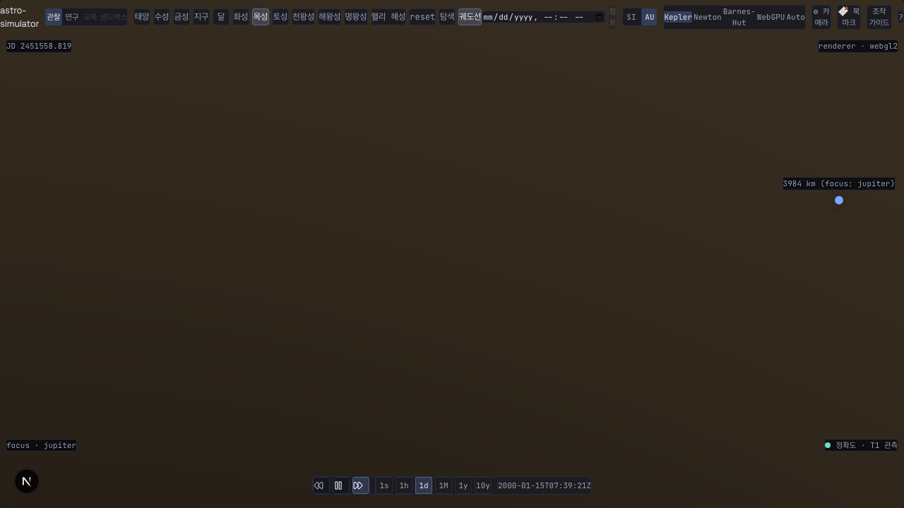
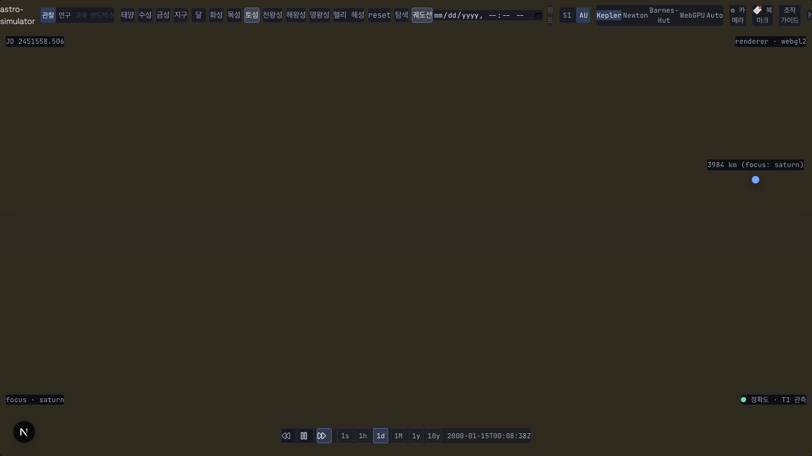

# ADR: #818 대형 body focus 휠 줌인 tier 진동(runaway) stall — apparent-size 보존 + 히스테리시스

- **상태**: Accepted (cross-validate 2026-07-17 — §7 §교차검증 반영 4분류 통합 완료. 메인 오케스트레이터 수행)
- **날짜**: 2026-07-17
- **결정자**: architect (#818 forensic 진단 — measurement-first 실측) + developer (구현·검증)
- **관련**: #818, #790 (PR [#816](https://github.com/coseo12/astro-simulator/pull/816) — 시각 반경 하한), #834 (earth inner 정착 후속 분리), [`20260509-380-zoom-camera-freeze-forensic.md`](20260509-380-zoom-camera-freeze-forensic.md), [`20260504-focus-tier-oscillate-fix.md`](20260504-focus-tier-oscillate-fix.md), [`20260423-display-relative-scale-unification.md`](../deprecated/decisions/20260423-display-relative-scale-unification.md), [`docs/templates/forensic-adr-template.md`](../templates/forensic-adr-template.md)
- **교훈 적용**:
  - "수치 DoD 미달 시 측정 방법 검증 우선" (CLAUDE.md §스프린트 계약 10) — stall 을 lowerRadiusLimit clamp 로 오진하지 않고 tier-불변 실거리(cameraFromFocusAU) 궤적 실측으로 진짜 원인(tier 진동) 확정
  - "주석 계약 vs 구현 drift" (CLAUDE.md 교훈) — `runTierTransition` focusMesh 경로가 focus-entry(V5) 와 줌 crossing 두 문맥을 한 공식으로 처리하던 계약 누락 → 문맥 분기(`preserveFocusDistance`)
  - "가드 도입 PR DoD — 4축" (volt #96/#100) — browser-verify-818 을 negative test(preserve 제거 → 전 시나리오 FAIL 실증)로 teeth 확인
  - 용어: [D-T2 / R-Phase / Tier / renderScale](../glossary.md)

---

## §1 배경

### 본 이슈 핵심

- **회귀 발화점**: #790 (PR #816) 구현·리뷰 중 developer + reviewer 공통 관찰. `?focus=jupiter` / `?focus=saturn` 대형 body focus 에서 휠 줌인 시 카메라가 `lowerRadiusLimit` 도달 **전** ~34 unit 부근에서 정지. #790 완료 조건(암전 차단)과 직교 → 스프린트 비목표라 후속 분리 (cross-validate 고유 발견 3단 프로토콜).
- **영향 범위**: 대형 body focus 전부 (jupiter/saturn 눈에 띔). earth/mars 도 동일 버그 잠복(inner boundingR < 23 unit 이라 crossing 이 덜 극적).
- **의도 vs 실제 갭**: 사용자 영향은 "암전은 아니나 더 못 들어가는" UX 마찰. 빌드/단위 테스트 PASS 인데 실 브라우저에서 최대 줌인 도달 불가.

### Forensic 측정 결과 (2026-07-17, develop tip = `af13366`)

architect 가 실 브라우저 스텝 로그로 진단. developer 가 browser-verify-818 (`radius / renderScale(tier) / AU` = tier-불변 실거리 궤적) + negative test 로 재현·확정.

> ⚠️ raw `camera.radius` 는 tier renderScale 종속(scene unit)이라 crossing 시 inner(1.54e-9)→body(2.51e-5) 로 **16,299× 불연속 점프**한다. 단조성 판정은 반드시 tier-불변 실거리(AU)로 해야 한다 — 이 측정법 전환이 "stall = clamp" 오진을 차단한 핵심.

#### 측정 시각 자료 (PNG embed 표준 — #382)

fix 후 최대 줌인 상태 (전 시나리오 body tier seamless 도달):

#### 측정 1 — architect 스텝 로그 (jupiter focus, fix 전)

| 단계         | tier           | camera.radius       | cameraFromFocus  | 관찰                                                            |
| ------------ | -------------- | ------------------- | ---------------- | --------------------------------------------------------------- |
| focus 정착   | inner          | ≈130                | ≈0.75 AU         | inner 정착 (lower=14.95, #790 정상)                             |
| 줌인         | inner          | 130 → 22.4          | 0.75 → ≈0.097 AU | 0.1 AU 경계 접근                                                |
| **crossing** | inner→**body** | 22.4 → **catapult** | —                | r≈23(0.1 AU) 에서 inner→body 전환                               |
| 재프레이밍   | body           | **≈3.35M**          | —                | `boundingR_body × 5.9` → 카메라 **2.7M unit catapult**          |
| 역판정       | body→**inner** | —                   | 0.72 AU > 0.1 AU | cameraFromFocus 가 경계 밖 → inner 역판정                       |
| 진동         | inner          | → ≈190 되돌림       | —                | 무한 진동(runaway). "34" = jupiter inner boundingSphere 시각 벽 |

#### 측정 2 — browser-verify-818 실측 (fix 전 vs fix 후, tier-불변 실거리 궤적)

| body             | 판정     | 역진동(D1) | 총전환(D2) | catapult 배율(D3) | r/lower(D4) |
| ---------------- | -------- | ---------- | ---------- | ----------------- | ----------- |
| jupiter (fix 전) | **FAIL** | 0          | 0          | **35,349×**       | **14.27**   |
| saturn (fix 전)  | **FAIL** | **2**      | **4**      | **106,564×**      | **10.41**   |
| earth (fix 전)   | **FAIL** | **2**      | **4**      | **19,923×**       | **6.78**    |
| jupiter (fix 후) | **PASS** | 0          | 1          | 1.000             | 1.000       |
| saturn (fix 후)  | **PASS** | 0          | 1          | 1.000             | 1.000       |
| earth (fix 후)   | **PASS** | 0          | 1          | 1.000             | 1.000       |

- fix 전: 실거리(AU)가 crossing 에서 **19,923~106,564 배 증가**(catapult) → 정상 줌인의 단조 감소가 완전히 깨짐. jupiter 는 catapult 후 body 에 정착하나 floor 미도달(r/lower 14.27, "34 unit stall"), saturn/earth 는 inner↔body 역진동 2회.
- fix 후: crossing 1회(inner→body, D2=1), 역진동 0, catapult 배율 1.000(완전 단조), 최종 radius = lowerRadiusLimit(r/lower 1.000, floor seamless 도달).

### 가설 검증 결론

| 가설                                                                  | 결론                 | 근거                                                                                                                                              |
| --------------------------------------------------------------------- | -------------------- | ------------------------------------------------------------------------------------------------------------------------------------------------- |
| **가설 1: lowerRadiusLimit clamp 가 34 unit 에서 막는다**             | **기각**             | clamp(#790 floor=14.95)는 34 보다 작음. raw radius 34 는 inner boundingSphere 시각 벽일 뿐, 실거리 궤적은 clamp 무관하게 진동                     |
| **가설 2: tier 진동 runaway (crossing 재프레이밍 catapult → 역판정)** | **확정 (주된 원인)** | 스텝 로그 + browser-verify 실측 catapult 배율 19,923~106,564× + 역진동 2회. negative test(preserve 제거)로 재현                                   |
| **가설 3: 경계 flip-flop (히스테리시스 부재)**                        | **부분 (2차 기여)**  | body 도달 가능해지면 경계 0.1 AU 를 매 프레임 왕복 → detachControl 반복. (c) 단독으로도 crossing 은 seamless 지만 (e) 로 경계 thrash 를 추가 차단 |

### 잠재 시점 분석

- 본 버그는 #790 이전에도 **사전 존재**(#818 이슈 본문 명시). #790 이 lowerRadiusLimit 을 시각 반경 하한으로 올린 것과 **독립** — #790 은 암전(mesh 내부 진입) 축, 본 이슈는 tier 진동 축.
- `runTierTransition` focusMesh 경로의 `boundingR × 5.9` 재프레이밍은 원래 **focus-entry(사용자 클릭/URL)** 연출용(V5 DoD 지구 세로 40%). 줌 crossing 에도 같은 공식을 재사용한 것이 잠재 결함 — focus-entry 는 crossing 후 카메라가 튀어도 사용자가 방금 진입했으므로 문제 없지만, 줌인 중 crossing 은 사용자가 이미 근접 관찰 중이라 catapult 가 진동으로 발현.

---

## §2 영향 모듈/파일

### 측정 결과 박제 (본 ADR 동반)

- `docs/reports/818-focus-zoom/818-{jupiter,saturn,earth}-max-zoom.png` — fix 후 최대 줌인 seamless 도달 스크린샷
- 본 ADR §1 측정 1/2 표 (스텝 로그 + browser-verify fix 전/후 매트릭스)

### Fix 변경 대상

- `packages/core/src/scene/tier-transition.ts` — `runTierTransition` `preserveFocusDistance` 옵션 + focusMesh 경로 targetRadius 분기 (옵션 c)
- `packages/core/src/scene/solar-system-scene.ts` — `setTier(tier, preserveFocusDistance)` 시그니처 + `updateTierByCamera → setTier(_, true)` (옵션 c)
- `packages/core/src/scene/tier.ts` — `tierFromFocus(kind, dist, currentTier?)` planet 히스테리시스 (옵션 e)
- `apps/web/scripts/browser-verify-818-focus-zoom.mjs` — 회귀 가드 (신규)

### Fix 가 깨는 박제값

- 없음. #790 floor / #380 clamp / V5 focus-entry 공식 / #629/#631 free-fly 는 전부 무회귀 (§6 무회귀 검증). `preserveFocusDistance` 는 신규 옵션(기본 false)이라 기존 focus-entry 경로 불변.

---

## §3 옵션 비교

### 옵션 (a) 줌인 중 tier 전환 억제 (crossing 자체 차단)

- **변경**: `updateTierByCamera` 가 focus 줌인 중에는 tier 전환을 막고 inner 유지.
- **장점**: 진동 원천 제거.
- **단점**: body tier 세부 관찰(표면 근접) 자체를 포기 → 대형 body 를 표면까지 못 들어감. 사용자 의도(줌인 = 세부 관찰)와 정면 충돌.
- **회귀 예측**: #790 floor 도달 불가 (body tier 진입 안 함).

### 옵션 (b) 히스테리시스 단독 (경계만 넓힘)

- **변경**: `tierFromFocus` 히스테리시스만 추가, 재프레이밍 공식은 유지.
- **장점**: 최소 변경.
- **단점**: crossing 자체의 catapult(19,923~106,564×)는 그대로 → 첫 crossing 에서 이미 카메라가 튄다. 히스테리시스는 경계 왕복만 늦출 뿐 catapult 를 못 막음.
- **회귀 예측**: 첫 crossing catapult 잔존 → stall 미해소.

### 옵션 (c) 줌 crossing 시 apparent-size(실거리) 보존 — **채택**

- **변경**: `runTierTransition` focusMesh 경로에 `preserveFocusDistance` 분기. 줌 crossing 은 `computeTargetRadius`(실거리 보존), focus-entry 는 `boundingR × 5.9`(V5) 유지.
- **장점**: crossing 후에도 cameraFromFocus 불변 → 경계 안쪽 유지 → body 안정. apparent size 불변이라 seamless. floor/target 동기화 그대로.
- **단점**: 문맥 플래그(true/false) 전파 필요 (setTier 시그니처 확장).
- **회귀 예측**: focus-entry V5 무변경 (기본 false). 산술: crossing inner r=22 → body computeTargetRadius ≈ 358,571 unit = 0.0955 AU < 0.1 → body 안정.

### 옵션 (e) tierFromFocus 히스테리시스 (동반) — **채택**

- **변경**: `tierFromFocus(kind, dist, currentTier?)` planet 분기 ±15% (tierFromCameraDistance 대칭). `updateTierByCamera` 는 activeTier 전달, `applyFocusTier` 는 non-hysteresis 초기 판정.
- **장점**: (c) 로 body 도달 가능해진 뒤 경계 0.1 AU 매 프레임 왕복(detachControl 반복) 을 차단. free-fly ±15% 와 SSoT 대칭.
- **단점**: 없음 (currentTier 미전달 시 기존 동작 불변).
- **회귀 예측**: 초기 focus 판정(applyFocusTier) 불변.

### 옵션 (f) clamp 변형 (lowerRadiusLimit 을 34 위로)

- **변경**: lowerRadiusLimit 을 조정해 34 unit 벽 제거.
- **장점**: 표면적으로 "34 stall" 해소.
- **단점**: **오진 기반**. 34 는 clamp 가 아니라 tier 진동의 시각 증상. clamp 를 만져도 진동은 그대로 → catapult 잔존.
- **회귀 예측**: #790 floor 와 충돌, 근본 원인 미해결.

### 축별 비교 매트릭스

| 축                  | (a)             | (b)              | (c)        | (e)   | (f)     |
| ------------------- | --------------- | ---------------- | ---------- | ----- | ------- |
| stall(진동) 해소    | 부분(body 포기) | ✗(catapult 잔존) | ✓          | 보조  | ✗(오진) |
| body 세부 관찰 보존 | ✗               | ✓                | ✓          | ✓     | ✓       |
| 부수 회귀 위험      | high            | low              | low        | low   | high    |
| 구현 비용           | 중              | 1곳              | 3파일 최소 | 1함수 | 1곳     |
| 근본 원인 정합      | ✗               | ✗                | ✓          | 보조  | ✗       |

### 권장 안

- **채택**: (c) 핵심 + (e) 동반. (c) 가 catapult(근본 원인)를 제거하고, (e) 가 경계 thrash(2차)를 차단. 둘은 직교 — (c) 단독으로도 crossing seamless 지만 (e) 로 방어의 깊이 확보.

---

## §4 Concrete Prediction

### 예측 1 — 코드 변경 라인 수

- (c)+(e) 채택 시: core 3파일 ~40 라인 (tier.ts 히스테리시스 ~15, tier-transition.ts 분기 ~5 + 옵션 주석, solar-system-scene.ts 시그니처+전파 ~6) + 테스트/스크립트.
- 위반 임계: core 로직 변경이 100 라인 초과 시 설계 가정 재검토.

### 예측 2 — 수치 DoD (browser-verify-818)

- **D1**: 줌인 중 body→inner 역진동 = 0 (fix 후 실측 0 → PASS)
- **D3**: 실거리 catapult 배율 < 1.2 (fix 후 실측 1.000 → PASS)
- **D4**: 최종 radius / lowerRadiusLimit ≤ 1.05 (fix 후 실측 1.000 → PASS)
- 위반 임계: D1/D3/D4 중 1개라도 fail → fix 회귀, 옵션 재선택.

### 예측 3 — 인접 영역 무영향

- #790 floor (verify:790) 불변, #629/#631 free-fly 불변, #378 focus 불변, V5 focus-entry(earth 40%) 불변.
- 위반 임계: verify:378/629/631/699/704/732/790 중 1개라도 FAIL → 부수효과 확정.

---

## §5 결정

- **채택 옵션**: (c) 줌 crossing apparent-size 보존 + (e) tierFromFocus 히스테리시스.
- **선택 근거**: (c) 가 catapult(근본 원인)를 제거, (e) 가 경계 thrash(2차)를 차단. body 세부 관찰 보존 + 근본 원인 정합 + 부수 회귀 최소.

### 구현 절차 (완료)

1. `tier.ts` — `tierFromFocus` 에 `currentTier?` 히스테리시스(±15%) 추가, `PLANET_FOCUS_BODY_BOUNDARY` 상수화.
2. `tier-transition.ts` — `TierTransitionOptions.preserveFocusDistance` + focusMesh 경로 targetRadius 분기(preserve → `computeTargetRadius`, floor 유지).
3. `solar-system-scene.ts` — `setTier(tier, preserveFocusDistance=false)` + `runTierTransition` 전파 + `updateTierByCamera → tierFromFocus(_,_,activeTier)` + `setTier(nextTier, true)`. `applyFocusTier`/`clearFocus` 기본 false 유지.
4. 단위 테스트 확장 (focus-lower-radius-floor.test.ts preserve 산술 재현 + tier.test.ts 히스테리시스) + browser-verify-818 신규.

### Fix 후 박제 의무

- 본 ADR Provisional → cross-validate(메인 수행) 후 Accepted 전이 + §교차검증 반영 4축 분류.
- CHANGELOG [Unreleased] Behavior Changes (MINOR).
- PR 본문에 §Concrete Prediction 위반 여부 명시.

---

## §6 위험 / 재검토 트리거

| 위험                                                         | 회귀 시점       | 임계 / 발동 조건                                     | 완화                                                                |
| ------------------------------------------------------------ | --------------- | ---------------------------------------------------- | ------------------------------------------------------------------- |
| preserveFocusDistance 문맥 오전파 (focus-entry 에 true 유입) | fix 머지 직후   | V5 focus-entry 재프레이밍(earth 40%) 깨짐            | applyFocusTier/clearFocus 기본 false + 단위 테스트                  |
| 히스테리시스가 초기 focus 판정 오염                          | 신규 focus 진입 | applyFocusTier 가 currentTier 전달 시 초기 tier 오판 | applyFocusTier 는 currentTier 미전달 (non-hysteresis) 계약 + 테스트 |
| headless swiftshader false-positive                          | qa 검증 시      | 실 Chrome 미검증                                     | qa 실 Chrome GUI 수동 검증 (CLAUDE.md headless 교훈)                |

### 재검토 트리거

1. verify:818 D1/D3/D4 위반
2. 인접 verify(378/629/631/790) 회귀
3. 사용자 D-T2 에서 대형 body 줌인 새 회귀 보고
4. cross-validate 고유 발견이 (c)/(e) 결정과 충돌

---

## §7 Amendment 라운드

### Amendment 라운드 1 (cross-validate 2026-07-17 — Provisional → Accepted)

cross-validate (agy, `cross_validate.sh architecture`) 로 Q1(원인 진단+preserveFocusDistance 전파)/Q2(히스테리시스 non-hysteresis 계약)/Q3(놓친 시나리오) 3 질문 검증. 로그: `.claude/logs/cross-validate-architecture-20260717-105753.log`. **Claude 재분석 핵심 — agy 우려를 맹목 수용/기각 않고 실제 구현에 전수 대조**(낙관 편향 방어):

- **합의 (수용 — 구현 대조로 이미 처리 확인)**: 원인 진단(catapult runaway)과 문맥 분기(줌 crossing=apparent-size 보존 / focus-entry=V5 framing)는 "매우 정확". agy 가 제기한 오전파/오염 우려 대부분이 **기존 가드로 이미 차단됨을 코드 실측**:
  - (Q2-1 포커스 전환 중 줌) `updateTierByCamera` 가 `tierTransitionInProgress` 시 no-op (#408 F2, `solar-system-scene.ts:1102`) — transition race 이미 차단.
  - (Q1 오전파) `setTier` 호출부 2곳뿐 — `updateTierByCamera`(`:1120` `true`=줌 crossing) / `applyFocusTier`(`:1150` **default false**=V5 framing). focus-entry V5 보존 정확.
  - (Q2 non-hysteresis) `applyFocusTier` 가 `tierFromFocus(kind, dist)` 로 `currentTier` **미전달**(`:1148`) — 초기 판정 오염 차단.
  - (Q3-b solar↔inner 일반화) `setTier(nextTier, true)` 가 **모든 tier crossing** 에 적용 — solar↔inner 포함 일반화됨.
  - (Q3-c focus-switch) 다른 body focus 전환은 `applyFocusTier`(false=reframe) 경로 — apparent-size 보존 미적용(정상).
- **고유 발견 수용 (범위 내 — test-only)**: (Q3-a) **줌아웃(body→inner) 대칭 test-gap** — `browser-verify-818` 이 줌인만 검증(줌아웃 미커버). fix 메커니즘은 대칭(`updateTierByCamera` 가 양방향 crossing 모두 `setTier(_, true)`)이나 empirical 커버 부재 → **줌아웃 왕복 시나리오 추가**(fix 로직 무변경, guard teeth 강화. Q3-a agy clamp-safe 우려 실측 포함). `test(web): #818 줌아웃 왕복 대칭` 커밋.
- **Claude 재분석 유예 (재검토 트리거 이관 — 지금 미반영)**:
  - (Q1 Enum `TierTransitionTrigger`) boolean+호출부 2곳 로 현재 안전. 유지보수성 개선이나 즉시 refactor 는 churn → **재검토 트리거**: `setTier`/preserve 문맥 호출부 ≥ 4 확장 시 Enum 승격.
  - (Q3-d 히스테리시스 cooldown/delta-time) 실측 역진동 0(±15% free-fly 대칭 SSoT). fast-wheel 이론 우려는 과최적화 → **재검토 트리거**: 실사용 경계 thrash 보고 시 cooldown 도입.
  - (Q3-c focus-switch same-tier no-reframe) jupiter(body)→saturn(body) 전환 시 tier 불변→setTier no-op→reframe 미발동은 **#818 도입 아닌 pre-existing 직교 현상** → 잠재 후속 관찰(현 계약 비목표).
- **오탐 필터링**: 없음 (agy 지적 전부 유효하나 대부분 기존 가드로 선차단, Q3-a 만 genuine gap).

---

## §8 후속 / 분리 이슈

- #834: earth inner 정착 (본 이슈 비목표 — architect 분리 완료). 본 fix (c) 로 earth 도 crossing seamless 자동 개선되나, earth 가 focus-entry 시 inner 에 정착하는 것 자체는 #834 축.

---

## 변경 이력

- 2026-07-17: 초안 작성 (developer, #818 구현·검증 동반). architect 스텝 로그 + browser-verify-818 fix 전/후 매트릭스 박제. 상태 Provisional (cross-validate 메인 수행 대기).
