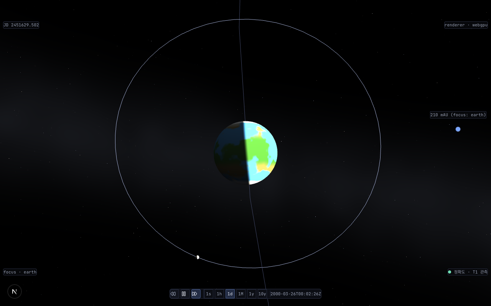
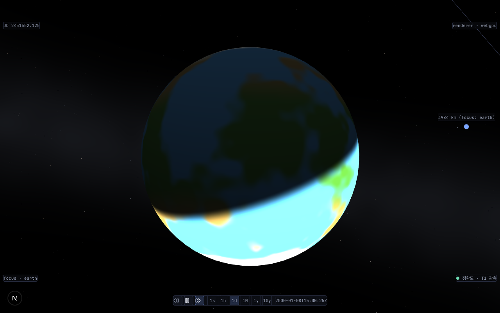

# ADR (NO-OP): planet focus-entry 의 inner 궤도 맥락 정착은 의도된 계약 — 버그 아님 (#834)

- **상태**: **Accepted** (cross-validate agy 2026-07-18 — §교차검증 반영 4축 통합 완료. [ADR Status 워크플로](../glossary.md) §Provisional→Accepted)
- **날짜**: 2026-07-18
- **결정자**: architect (measurement-first 실측 진단) + 사용자 (옵션 A 선택) + developer (문서·가드 구현)
- **관련**:
  - [#834](https://github.com/coseo12/astro-simulator/issues/834) (본 이슈 — earth focus-entry inner 정착 진단)
  - [`20260717-818-focus-zoom-tier-oscillation-forensic.md`](20260717-818-focus-zoom-tier-oscillation-forensic.md) (#818 forensic — Builds on. #818 은 줌 crossing tier 진동 stall fix, 본 이슈는 그 후속 분리 "earth inner 정착")
  - `packages/core/src/scene/tier.ts` (`PLANET_FOCUS_BODY_BOUNDARY` — #834 계약 주석 박제처)
  - `packages/core/src/scene/tier-transition.ts` (`FOCUS_RADIUS_MULTIPLIER = 5.9` — V5 40% 는 줌 crossing 전용 명시)
  - `packages/core/src/scene/camera-controller.ts` (`focusOn` `× 5` — focus-entry inner 정착 계약 박제처)
  - `packages/core/src/scene/solar-system-scene-apply-focus-tier.test.ts` (#834 회귀 가드 describe)
- **교훈 적용**: "인계 항목 실측 재검증 — NO-OP ADR 패턴" ([docs/lessons/no-op-adr-pattern.md](../lessons/no-op-adr-pattern.md), volt #14/#67) — "earth 가 40% 로 안 커진다 = 버그" 우려를 실측해보니 focus-entry 는 애초에 inner 궤도 맥락 정착이 의도된 계약이며 #818 이전부터 동일. 정적 추정 대신 runtime 측정 + #818 forensic 표 소수점 대조로 확정.
- **용어**: [D-T2 / Tier / Floating Origin / focus·focusOn](../glossary.md)

---

## §1 배경 / 질의

[#818](https://github.com/coseo12/astro-simulator/issues/818) (대형 body 줌인 tier 진동 stall fix) 완료 후, `?focus=earth` 등 focus-entry 시 카메라가 body [Tier](../glossary.md) 가 아닌 **inner** tier 에 정착 (earth 세로 20.8%) 하는 현상이 관찰됐다. 초기 우려: "폐기된 P12 regime 의 V5 DoD (지구 세로 40%) 대비 undershoot → #818 fix 가 focus-entry 를 깨뜨린 회귀 아닌가?"

architect 가 measurement-first 로 실측 → 사용자가 **옵션 A (NO-OP + 문서 재조정 + 회귀 가드)** 선택. 본 ADR 은 그 결정을 박제한다.

## §2 실측 매트릭스 (2026-07-18, viewport 1280×800, #818 fix `preserveFocusDistance` 반영)

### focus-entry 정착 프레이밍 (현행) — earth 세로 20.8%, 궤도선 + 달 동반 (의도된 궤도 맥락)



| body    | 정착 tier | camRadius(unit) | 실거리(AU) | 0.1 AU 경계 | body 세로 px | viewport % |
| ------- | --------- | --------------- | ---------- | ----------- | ------------ | ---------- |
| earth   | inner     | 48.44           | 0.2102     | 초과(inner) | 166          | 20.8%      |
| mars    | inner     | 35.76           | 0.1552     | 초과(inner) | 164          | 20.5%      |
| jupiter | inner     | 129.84          | 0.5636     | 초과(inner) | 208          | 25.9%      |
| saturn  | inner     | 152.02          | 0.6599     | 초과(inner) | 163          | 20.3%      |

### body-tier 근접 (줌인으로 도달) — V5 40% 는 이 별도 경로에서 달성



`?focus=earth` 에서 휠 줌인 시 카메라가 0.1 AU 경계를 crossing → body tier 진입 → disc 가 화면 대부분을 채우는 근접 관찰에 완전 도달 (HUD `3984 km (focus: earth)`). V5 "세로 40%" 는 이 줌인 도달 경로의 관찰 프레이밍이었으며 focus-entry 정착값이 아니다.

## §3 Mechanism 진단

focus-entry 프레이밍 실거리는 `focusOn` (`camera-controller.ts`) 의:

```
desiredRadius = boundingSphere.radiusWorld × FOCUS_USER_RADIUS_MULTIPLIER  (× 5)
```

로 결정된다. 그 정착 실거리 (0.155~0.66 AU) 가 모두 `PLANET_FOCUS_BODY_BOUNDARY = 0.1 × AU` 를 **초과** → `tierFromFocus('planet', d)` = **inner** (궤도 맥락).

undershoot (21% vs V5 40%) 의 근원은 `boundingSphere.radiusWorld ≈ 2.4 × resolveMeshVisualRadius` — box 외접구 √3 과대 + #782 자전 quaternion 위상에 따른 world AABB 진동 (이것이 #790 이 `resolveMeshVisualRadius` 회전 불변 반경을 도입한 이유) 이 프레이밍 거리 (`× 5`) 에 곱해지는 것. 즉 focus-entry 는 애초에 `tier-transition.ts` 의 V5 공식 (`FOCUS_RADIUS_MULTIPLIER = 5.9`) 을 거치지 않는다.

## §4 결정 — NO-OP (코드 거동 변경 없음)

**earth/mars/jupiter/saturn focus-entry 의 inner 궤도 맥락 정착은 버그가 아니라 의도된 프레이밍 계약이다.** 근거 4개:

1. **회귀 아님** — #818 이전부터 동일 정착값. focus-entry 정착값이 [#818 forensic ADR](20260717-818-focus-zoom-tier-oscillation-forensic.md) 측정 표와 소수점까지 일치한다. #818 fix (줌 crossing `preserveFocusDistance` apparent-size 보존) 는 줌 **crossing** 경로 전용이라 focus-entry **정착** 에 영향 0.
2. **렌더 건강** — earth 21% 는 disc + 궤도선 + 달 동반의 완결된 궤도 맥락 프레이밍 (스크린샷 §2 직접 확인). "빈 화면 / 깨진 렌더" 가 아니다.
3. **V5 40% 는 focus-entry 계약이 아니었음** — V5 세로 40% 는 폐기된 P12 regime 의 **body-tier 근접 관찰** (줌인 도달) 프레이밍이다. 40% 는 줌인으로 완전 도달됨 (§2 body-tier 실증).
4. **자동 DoD 테스트 부재** — "focus-entry earth = 40%" 를 강제하는 자동 테스트가 존재한 적 없다 → "PASS 였던 게 깨진" 상황 자체가 아니다.

### 옵션 비교 (architect a~e 요약)

| 옵션 | 내용                                                                                           | 판정                                                                                               |
| ---- | ---------------------------------------------------------------------------------------------- | -------------------------------------------------------------------------------------------------- |
| (a)  | `focusOn` 을 `boundingSphere.radiusWorld` → `resolveMeshVisualRadius` 프레이밍으로 전환 (근본) | **미채택** — 32 body 전수 프레이밍 회귀 검증 필요, 본 이슈 범위 초과                               |
| (b)  | `PLANET_FOCUS_BODY_BOUNDARY` 상향 (0.1 → 0.25 AU 등)                                           | **미채택** — earth/mars 를 body 로 밀어 focus-entry 를 근접 프레이밍화, 궤도 맥락 상실 (부분 해결) |
| (c)  | `focusOn` multiplier 축소 (× 5 → × 2 등)                                                       | **미채택** — 매직 넘버 튜닝, 근본 원인 (boundingSphere 과대) 미해소                                |
| (d)  | **NO-OP + 문서 재조정 + 회귀 가드**                                                            | **채택** — 거동은 이미 의도대로 정합. 계약 명세만 박제                                             |
| (e)  | focus-entry 를 body-tier 직행                                                                  | **비권고** — 궤도선/위성 맥락 상실, "궤도 시뮬레이터" 정체성 저해                                  |

## §5 조치 (문서/계약/가드만 — 동작 변경 0)

- **주석 계약 (3곳)** — focus-entry (inner 궤도 맥락 ~21%) vs V5 40% (body-tier 근접, 줌인 도달) 두 계약 분리 박제:
  - `tier.ts` `PLANET_FOCUS_BODY_BOUNDARY` — focus-entry `× 5` 프레이밍 → 0.1 AU 초과 → inner 궤도 맥락 계약.
  - `tier-transition.ts` `FOCUS_RADIUS_MULTIPLIER = 5.9` — V5 40% 는 줌 crossing body-tier 근접 전용, focus-entry 는 이 상수 미경유.
  - `camera-controller.ts` `focusOn` — `× 5` → inner ~21% 정착, boundingSphere 과대로 undershoot 이나 의도된 궤도 맥락.
- **회귀 가드** — `solar-system-scene-apply-focus-tier.test.ts` `#834` describe: earth/mars/jupiter/saturn 실측 실거리로 `applyFocusTier` → `inner` 단언 + 경계 상향 감지 앵커 (earth/mars < 0.25 AU 민감 앵커).
- **본 NO-OP ADR + 스크린샷 2매 (docs/reports/) 박제.**

## §6 회귀 가드 — 테스트 ROI 판정

- **단위 가드 채택** (테스트 ROI 5문): 보호 대상은 "focus-entry planet → inner 궤도 맥락 정착" 계약. (1) `tierFromFocus` 순수 함수라 fixture 비용 0 (기존 `createApplyFocusTier` mock 재사용), (2) `PLANET_FOCUS_BODY_BOUNDARY` 조용한 상향은 **조용히 퇴행** (focus-entry 가 근접 프레이밍화되어도 빌드/타입 통과) → 테스트 필수 조건 충족, (3) earth/mars 민감 앵커로 결정적 detect. → **단위 회귀 가드 채택** (volt #31/#32 ROI 패턴 — 저비용 + silent 퇴행 방지).
- **browser 프레이밍 픽셀 가드 생략**: focus-entry 픽셀 % 는 boundingSphere 진동 (#782) 에 민감해 결정적 단언 어려움 + 본 계약의 핵심은 tier 판정 (px 절대값 아님). 주석 계약 §2 실측 표 + 단위 가드로 충분.

## §7 재검토 트리거

- **제품 요구 변경** — focus-entry 를 prominent body-tier 근접 (V5 40% 등) 으로 바꾸자는 제품 요구가 발생하면 옵션 (a) `resolveMeshVisualRadius` 프레이밍 전환을 재활성화 (근본 해결, 32 body 전수 회귀 검증 동반). **이 트리거 발화 시 옵션 (a) 전용 후속 이슈를 즉시 생성**해 맥락 유실 방지 (지금은 speculative 백로그 미생성 — #769 유예 패턴 정합, cross-validate agy §2 백로그 티켓화 제안 반영).
- **boundingSphere → visualRadius 프레이밍 리팩토링 착수** 시 — `focusOn` 의 `boundingSphere.radiusWorld × 5` 를 `resolveMeshVisualRadius × N` 으로 통일하면 undershoot 이 해소되며 정착 실거리가 바뀐다 → 본 ADR 실측 매트릭스 + 회귀 가드 재측정.
- **비-1280×800 종횡비 실측 필요 시** (cross-validate agy §6 고유 발견) — 모바일 세로 / 태블릿 / 울트라와이드 등에서 `× 5` 프레이밍이 body 를 화면 밖으로 내보내거나 과소하게 만들 가능성. 현 실측은 1280×800 단일 해상도이므로 **measurement-first 실측 선행** 후에만 이슈화 (실측 없이 이슈 생성은 speculative — #769 유예 패턴).
- `PLANET_FOCUS_BODY_BOUNDARY` (0.1 AU) **경계 변경** 시 — focus-entry 정착 tier 가 바뀔 수 있어 §2 매트릭스 재측정 필요 (**회귀 가드 `#834` describe 가 1차 감지**). 단 `FOCUS_USER_RADIUS_MULTIPLIER` (× 5) / `boundingSphere` 산식 변경으로 **실제 정착 거리**가 이동하는 회귀는 #834 가드가 감지 못 하며 (하드코딩 `SETTLE_DISTANCE_AU`), `focus-multiplier.test.ts` (× 5 값 pin) + 본 트리거 수동 재측정이 담당 (reviewer 권고 C 정정 — 감지 주체 구분).

## §교차검증 반영 사항 (cross-validate agy 2026-07-18)

> cross-validate 1회 (§교차검증 박제 직후 루틴, `cross_validate.sh architecture`) 수행 후 아래 4축 통합 → **Accepted** 전이. agy 최종 의견: "수준 높은 실측 분석 기반의 훌륭한 아키텍처 결정서, 즉시 Accepted 전이 충분."

- **합의**: NO-OP (옵션 d) 는 measurement-first 실측 기반 합리적 결정. "오작동으로 오해하기 쉬운 현상을 실측으로 의도된 기획 스펙임을 규명, 무리한 상수 변경 대신 문서화 + 회귀 테스트로 묶은 것은 프로덕션 안정성 확보의 가장 합리적 결정" (agy §2 매우 우수). 실측 매트릭스 정량 지표 기반 구조적 완성도 우수 (§1).
- **이견**: 없음 — agy 도 결론 (d) 채택에 동의.
- **고유 발견 (수용 / 후속 분리)**:
  - **수용 (본 ADR §7 반영)**: (1) 옵션 (a) 기술 부채 추적 — 트리거 발화 시 전용 후속 이슈 생성 명시 (agy §2 백로그 티켓화 제안. 지금 speculative 이슈는 미생성 — #769 유예 패턴). (2) 비-1280×800 종횡비 대응 (agy §6) — measurement-first 실측 선행 조건으로 재검토 트리거 추가.
  - **기각**: (a) `× 5` ↔ `0.1 AU` static assertion (agy §3) — 회귀 가드 `#834` describe 가 이미 이 결합 (정착 실거리 → inner) 을 검증. agy 는 read-only 라 테스트 존재를 미인지 (view_file 미수행 자기 명시). (b) 스케일링 인자 DI / 설정 외부화 (agy §4, 다양한 성계 지원) — 단일 태양계 시뮬레이터 스코프 크게 초과, YAGNI (CLAUDE.md 비목표). (c) #782 자전 AABB 진동 GC/frame drop 성능 (agy §5) — focus-entry 정착과 직교 축 + speculative (실측 미검증), fps 가드 별도 존재.
- **Claude 편향 셀프 체크**: 통과 — NO-OP 결론이 "조사 회피" 가 아님을 외부 모델이 독립 확인 (agy §2 "매우 우수", measurement-first 논리 규명 평가). #818 forensic 표 소수점 대조 + focus-entry `× 5` mechanism 유도 + body-tier 줌인 도달 실증으로 "회귀 아님" 을 능동 입증.

## 변경 이력

- 2026-07-18: NO-OP ADR (Provisional). architect measurement-first 실측 → 사용자 옵션 A 선택 → developer 문서·주석 계약 3곳 + 회귀 가드 + 스크린샷 2매 박제. cross-validate 후 Accepted 전이 예정.
- 2026-07-18: **Accepted** 전이. cross-validate (agy) 4축 통합 (§교차검증) + reviewer 권고 A~D 반영 (테스트 한계 정직 명시 A / camera-controller operative 경로 B / §7 bullet 감지 주체 정정 C / CHANGELOG [Unreleased] D). 종횡비·기술부채 추적을 재검토 트리거로 반영.
