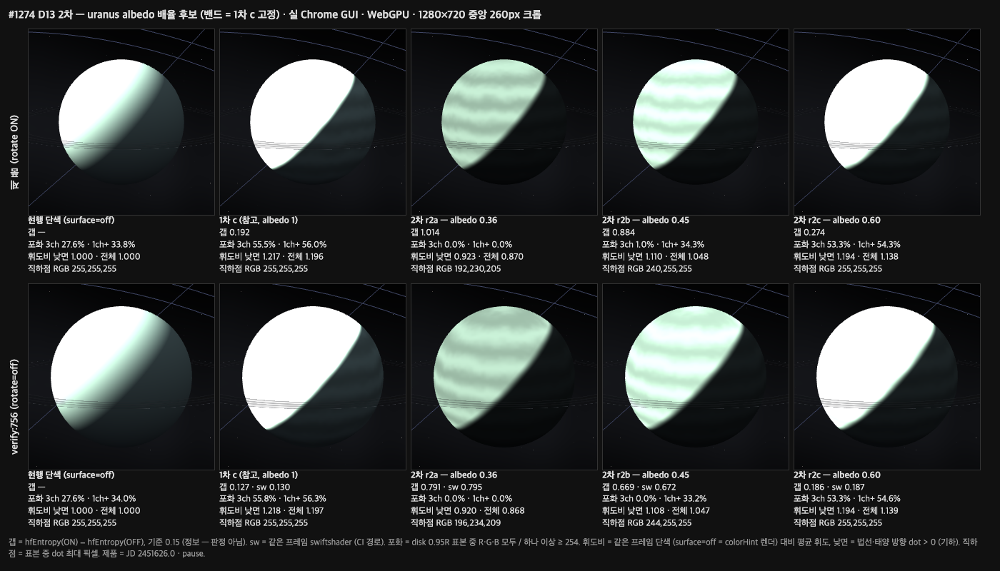
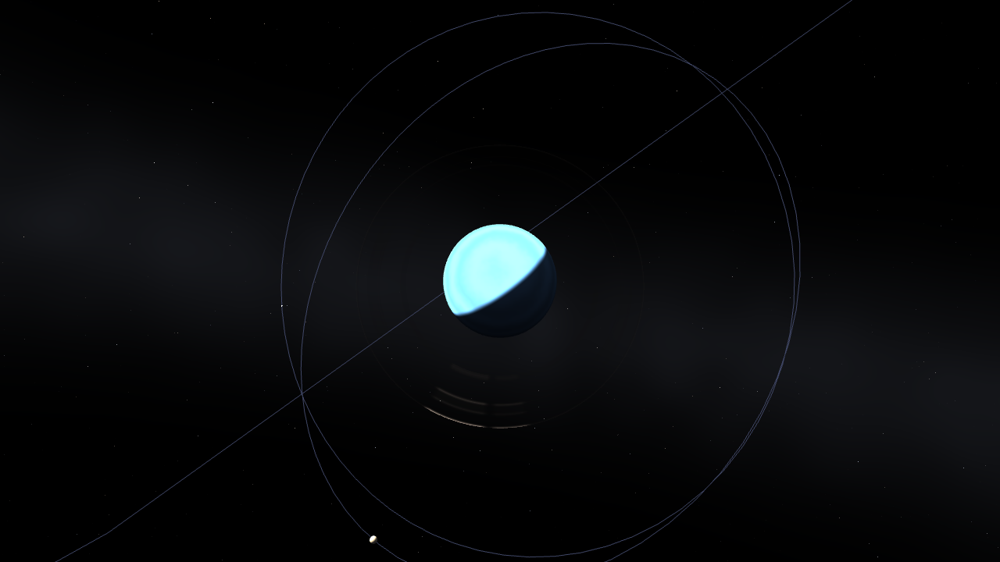
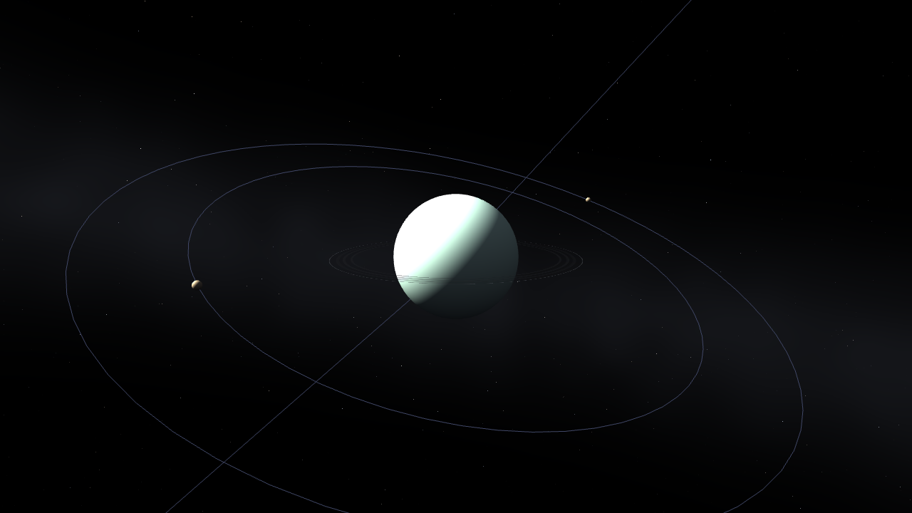
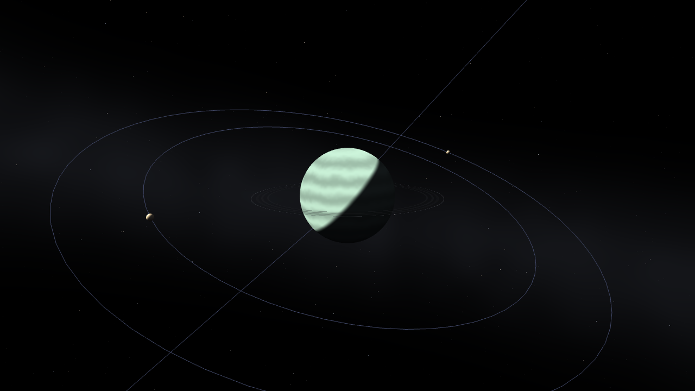
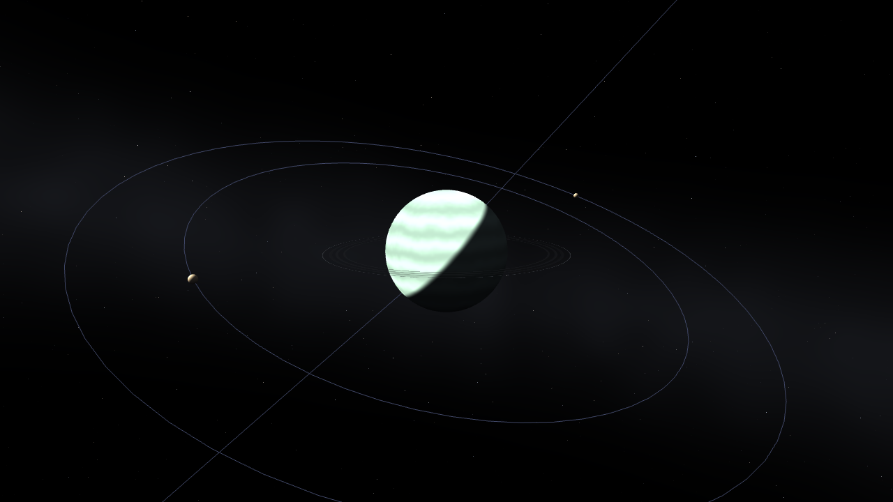
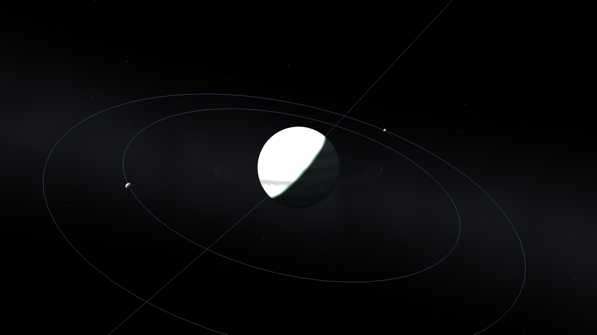
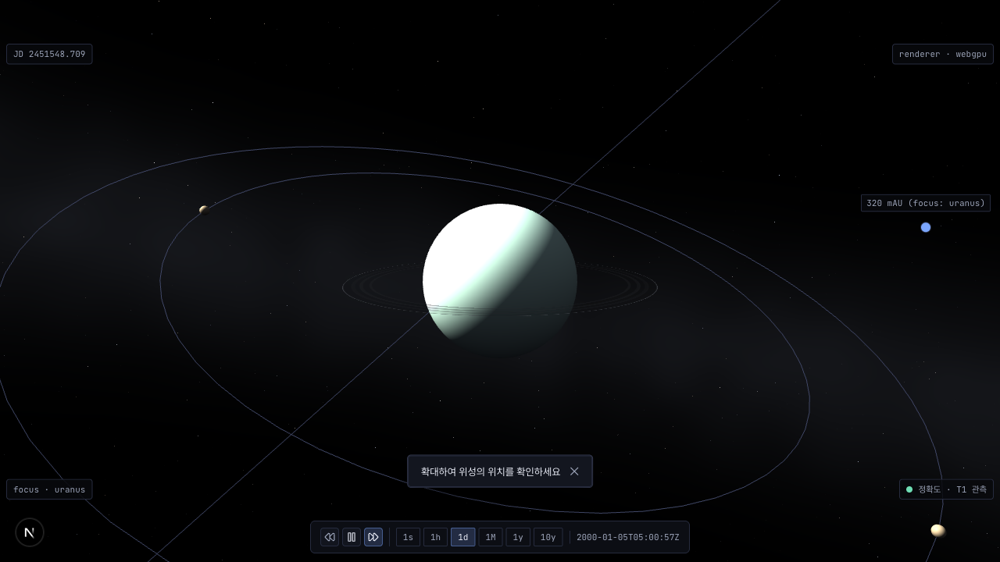
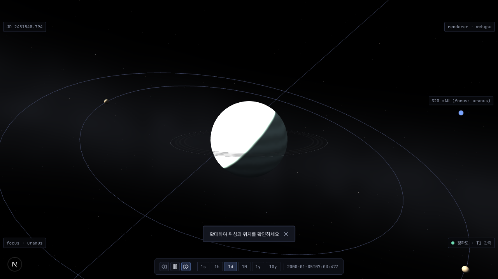
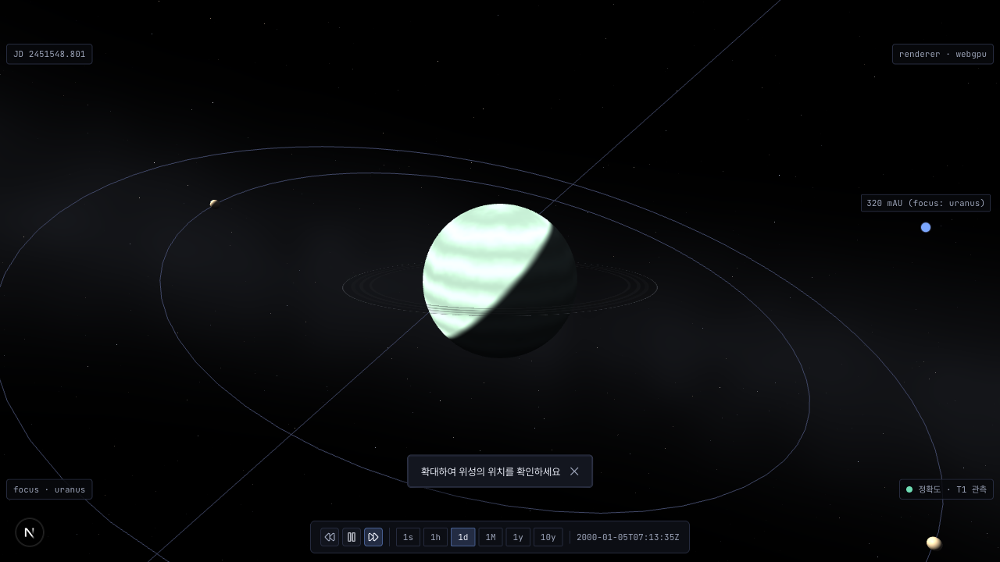
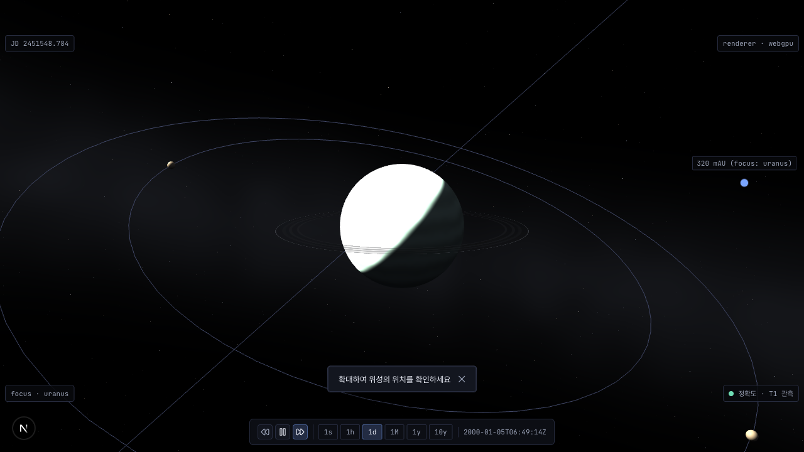

# #1274 D13 2차 — 천왕성 albedo 배율 후보

D13 1차 사용자 결정 ([#1274 코멘트 `5970959022`](https://github.com/coseo12/astro-simulator/issues/1274#issuecomment-5970959022)) 을 따른 2차 비교 자료다. **승인은 사용자가 이슈 코멘트로 한다** — 이 폴더는 준비물이고 승인 기록이 아니다. 형식은 1차 (`../d13-candidates/README.md`) 와 같다.

- neptune — 1차 후보 `a` 승인 · albedo 배율 미적용 (`1`). 2차 후보에서도 neptune 열은 이 값이다.
- uranus — U1 (b) 채택: `IceGiant` 전용 albedo 배율 (uniform `iceGiantAlbedo`, +1) 을 `uSurfaceType == 4` 분기 안에서만 `baseColor` 에 곱한다. 광원식 (`smoothstep(0, 0.12, ndl)`) 은 바꾸지 않았다.
- 아래 수치는 **판정이 아니라 정보**다. 갭으로 후보를 거르지 않는다.



## 후보 (`packages/core/src/scene/procedural-planet-shader.ts` `ICE_GIANT_CANDIDATES`)

| id              | uranus 밴드 `(amp, count, turb)` | uranus albedo | 의도                                    |
| --------------- | -------------------------------- | ------------: | --------------------------------------- |
| `c` (1차, 참고) | `(0.12, 6, 0.06)`                |           `1` | 1차 미승인 기준                         |
| `r2a`           | `(0.12, 6, 0.06)`                |        `0.36` | 낮면 전체 3채널 비포화 (밴드 정점 포함) |
| `r2b`           | `(0.12, 6, 0.06)`                |        `0.45` | 낮면 직하점 R 비포화 · G·B 부분 포화    |
| `r2c`           | `(0.12, 6, 0.06)`                |        `0.60` | 3채널 부분 포화 (단색보다 밝은 쪽)      |

**밴드를 1차 `c` 로 고정한 이유**: 1차에서 uranus 밴드가 눈에 보인 후보는 `c` 뿐이었다. 그래서 밴드는 고정하고 albedo 축 하나만 바꿔 「어두워지는 정도 ↔ 밴드 가시성」 교환만 보이게 했다.

### 배율 도출식 (낮면 중심 3채널 비포화)

절차 표면 광원식 (`procedural-planet-shader.ts` FRAGMENT `shade = ambientShade + sunShade`) 에 `DEFAULT_PLANET_LIGHTING` (`sunIntensity 2.5` · `sunDiffuse (1, 0.95, 0.8)` · `ambientIntensity 0.3` · `ambientGround (0.15, 0.15, 0.18)` · `ambientSky (1, 1, 1)`) 을 넣으면 다음과 같다.

- `ndl ≥ 0.12` 인 낮면은 `sunFactor = 1` 이다. 라이팅 계수는 `2.5 × sunDiffuse + 0.3 × mix(ground, sky, h)` 이고, `h = dot(N, up) × 0.5 + 0.5 ∈ [0, 1]`.
  - R `2.545 ~ 2.800` · G `2.420 ~ 2.675` · B `2.054 ~ 2.300` (`h = 0.5` 에서 `(2.6725, 2.5475, 2.1770)`)
- uranus `colorHint #B5E3EC` = `(0.7098, 0.8902, 0.9255)` (`hexToColor3` — 감마 변환 없음)
- 계수 × colorHint 의 채널별 최댓값 (`h = 1`): R `1.987` · G `2.381` · B `2.129` → G 가 최대
- 밴드 정점 `(1 + 0.12)` 까지 포함한 비포화 조건: `albedo × 2.381 × 1.12 < 1` → **`albedo < 0.375`** → `r2a = 0.36` (G 정점 `0.960`)
- `r2b = 0.45`: `h = 0.5` 밴드 평균에서 R `1.897 × 0.45 = 0.854` · G `2.268 × 0.45 = 1.021` · B `2.015 × 0.45 = 0.907`. R 은 정점 `0.956` 이라 비포화이고 G 는 포화다 [도출]
- `r2c = 0.60`: `h = 0.5` 밴드 평균에서 R `1.897 × 0.60 = 1.138` → 낮면 대부분 3채널 포화 [도출]

실측 확인 (아래 표):

| 후보  | 직하점 픽셀 RGB (`ndl 0.974`, 제품 프레임) | 3채널 포화 | 1채널 이상 포화 |
| ----- | ------------------------------------------ | ---------: | --------------: |
| `r2a` | `(192, 230, 205)`                          |       `0%` |            `0%` |
| `r2b` | `(240, 255, 255)`                          |    `0.96%` |        `34.28%` |
| `r2c` | `(255, 255, 255)`                          |   `53.26%` |        `54.32%` |

## 캡처 조건

1차와 같다.

- 제품 프레임: 실 Chrome GUI (`headless:false`, `channel:'chrome'`) · WebGPU · `?gpu=a&focus=uranus&lod=auto` · rotate ON · `jumpToJulianDate(2451626.0)` + `pause` · `waitForLodSettle` · HUD 숨김
- `verify:756` 프레임 (`&rotate=off`): WebGPU 캡처 + swiftshader 수치
- 공통: 1280×720 · `deviceScaleFactor 1` · 표본 = 투영 disk `0.95R` (`verify:756` `measureDisk` 식)

2차에서 추가한 측정 (판정 아님):

- **낮면**: 픽셀 광선과 구의 교차점 법선 · 태양 방향 dot `> 0` 인 표본. 기하로 정의했고 새 임계는 없다
- **휘도 비**: 같은 프레임 단색 (`surface=off` — `colorHint` 를 `StandardMaterial` 로 그린 것) 대비 평균 휘도 (Rec.601 `0.299 R + 0.587 G + 0.114 B`). 낮면 표본만 쓴 값과 전체 표본 값을 함께 적었다
- **직하점**: 표본 중 dot 이 최대인 픽셀

측정 · 시트 스크립트는 임시였고 커밋 전에 삭제했다 (volt #67). 원자료는 `capture-meta.json`.

## 후보별 수치 (uranus)

갭 = `hfEntropy(ON) − hfEntropy(OFF)`, 기준 `HF_ENTROPY_MARGIN 0.15`.

| 변형       | 갭 제품 (WebGPU) | 갭 756 (WebGPU) | 갭 756 (swiftshader) | 3채널 포화 제품 | 1채널+ 포화 제품 | 3채널 포화 756 (WebGPU / sw) | 1채널+ 포화 756 (WebGPU / sw) | 휘도비 낮면 / 전체 — 제품 | 휘도비 낮면 / 전체 — 756 |
| ---------- | ---------------: | --------------: | -------------------: | --------------: | ---------------: | ---------------------------: | ----------------------------: | ------------------------: | -----------------------: |
| 단색 `off` |                — |               — |                    — |        `27.60%` |         `33.76%` |          `27.61%` / `27.63%` |           `33.96%` / `33.96%` |         `1.000` / `1.000` |        `1.000` / `1.000` |
| `c` (1차)  |          `0.192` |         `0.127` |              `0.130` |        `55.51%` |         `56.03%` |          `55.82%` / `55.82%` |           `56.33%` / `56.33%` |         `1.217` / `1.196` |        `1.218` / `1.197` |
| `r2a`      |          `1.014` |         `0.791` |              `0.795` |         `0.00%` |          `0.00%` |            `0.00%` / `0.00%` |             `0.00%` / `0.00%` |         `0.923` / `0.870` |        `0.920` / `0.868` |
| `r2b`      |          `0.884` |         `0.669` |              `0.672` |         `0.96%` |         `34.28%` |            `0.00%` / `0.00%` |           `33.25%` / `33.25%` |         `1.110` / `1.048` |        `1.108` / `1.047` |
| `r2c`      |          `0.274` |         `0.186` |              `0.187` |        `53.26%` |         `54.32%` |          `53.32%` / `53.33%` |           `54.59%` / `54.60%` |         `1.194` / `1.138` |        `1.194` / `1.139` |

- 2차 후보 3개 모두 `verify:756` 프레임 갭이 `≥ 0.15` 다 (`r2c` 최소 `0.186`).
- `r2a` 의 낮면 평균 휘도는 단색의 `0.92` 배다. 1차 `c` (albedo `1`) 는 `1.22` 배였다. 절차 표면은 `ndl ≥ 0.12` 인 낮면 전체가 최대 세기를 받아서, 배율 `0.36` 에서도 낮면 휘도 감소는 `8%` 에 그친다 [구조 — 광원식. 단색 경로와의 차이 분해는 미실행].
- 시트에서 보이는 사실: `r2a` · `r2b` 는 낮면에 밴드가 보이고, 색이 단색보다 녹색 쪽으로 보인다 (직하점 `r2a (192, 230, 205)` — B < G). `r2c` 는 낮면이 대부분 흰색이고 밴드는 terminator 근처에서만 보인다.

## neptune 승인안 `a` — 변화 없음 확인



- 2차 빌드 (albedo 축 추가) 의 플래그 없는 제품 프레임 PNG 가 1차 `product-neptune-a.png` 와 **바이트 동일**하다 (sha256 앞 16자 `b6ec356272f9a5dd`). `r2a` · `r2b` · `r2c` 플래그도 같은 해시다.
- uranus `c` · 단색 · 플래그 없음도 1차 PNG 와 바이트 동일하다 (`7c3fe109e0e6ec13` · `b24ef70e1a2b0079` · `27de2fa7908a9677`).
- 하네스 `verify:1274-invariance` 의 1차 프리뷰 빌드 ↔ 2차 빌드 compare 는 12 시나리오 전부 diff `0`, exit `0` 이다 (PR 코멘트).

## 로컬에서 직접 보기

```text
pnpm --filter @astro-simulator/core build
pnpm --filter @astro-simulator/web dev
http://localhost:3000/?focus=uranus&iceGiantCandidate=r2a
http://localhost:3000/?focus=uranus&iceGiantCandidate=r2b
http://localhost:3000/?focus=uranus&iceGiantCandidate=r2c
http://localhost:3000/?focus=uranus&iceGiantCandidate=c
http://localhost:3000/?focus=uranus&surface=off
```

## 프레임별 원본

| 프레임 | `off`                                               | `c`                                             | `r2a`                                           | `r2b`                                           | `r2c`                                           |
| ------ | --------------------------------------------------- | ----------------------------------------------- | ----------------------------------------------- | ----------------------------------------------- | ----------------------------------------------- |
| 제품   |  |  |  |  |  |
| 756    |  |  |  |  |  |
