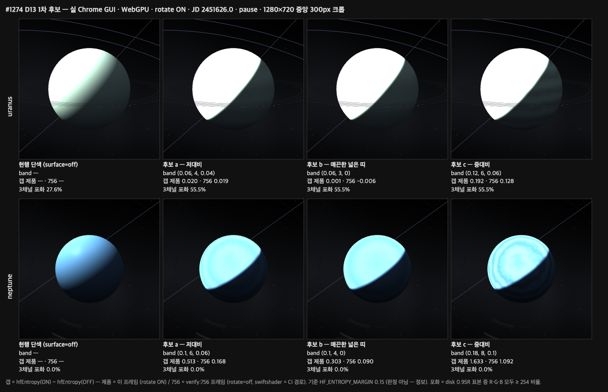
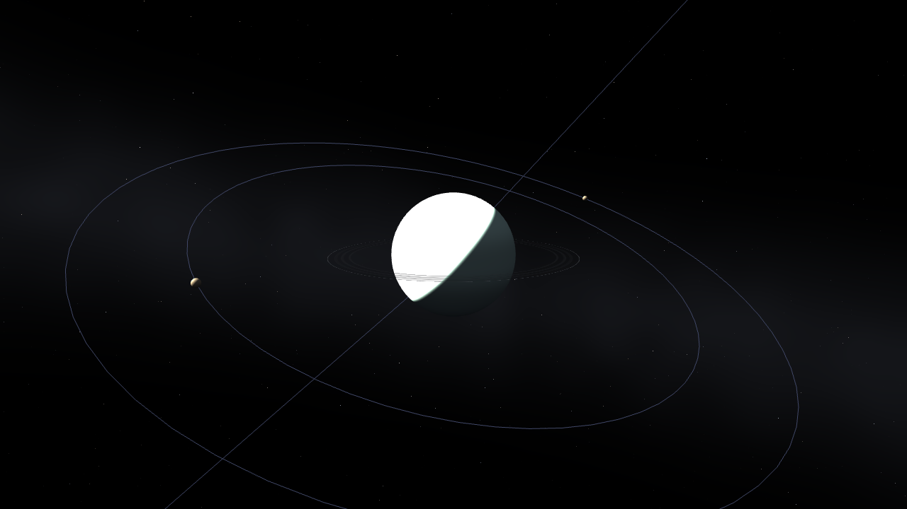
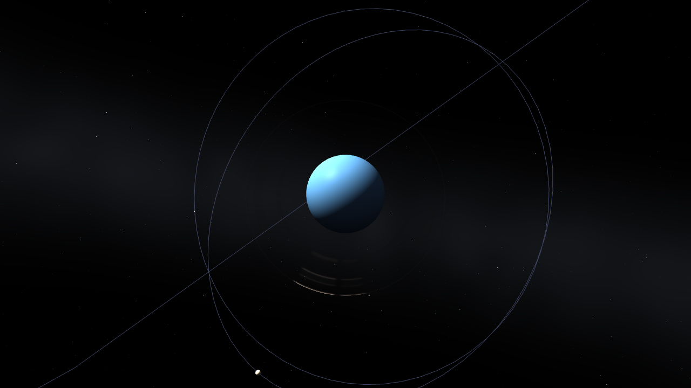
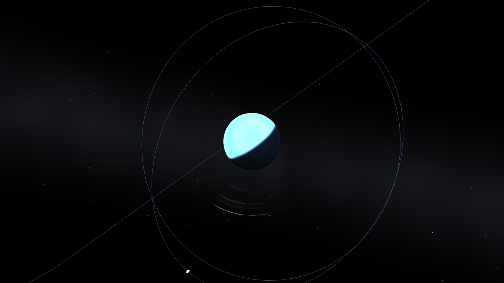
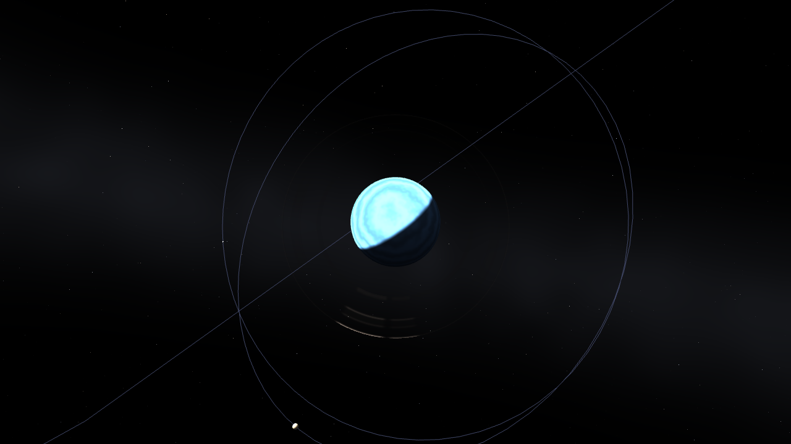
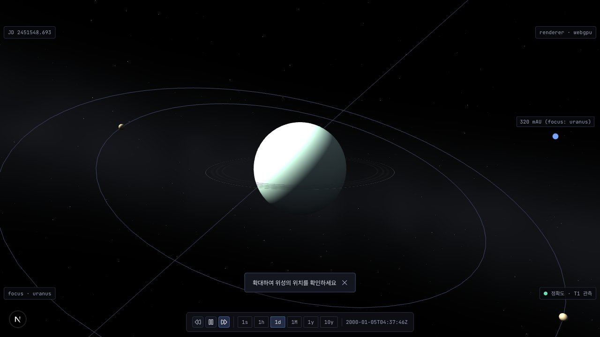
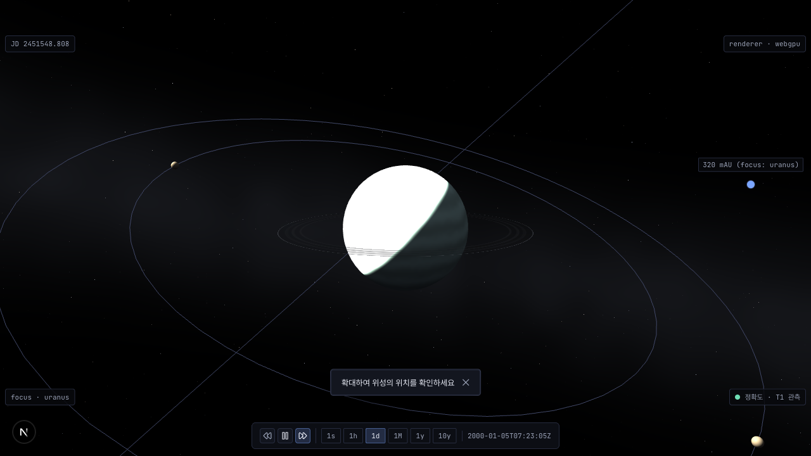
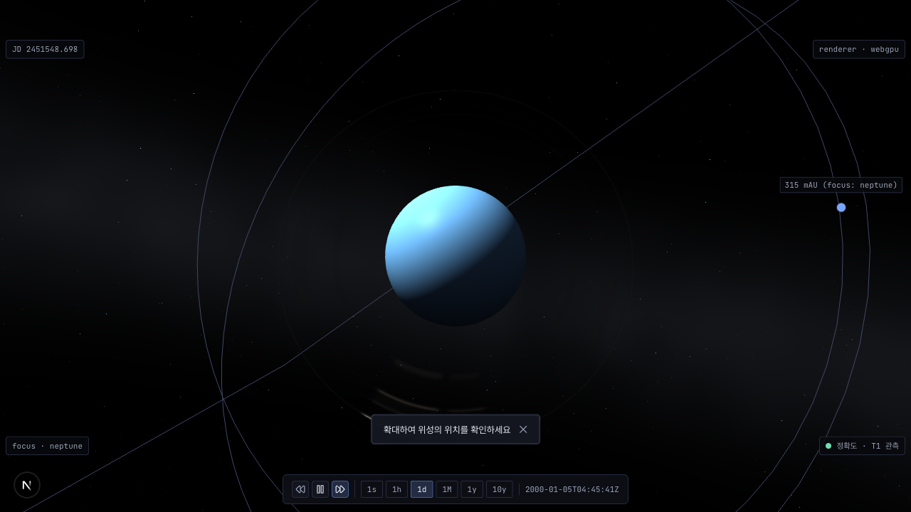
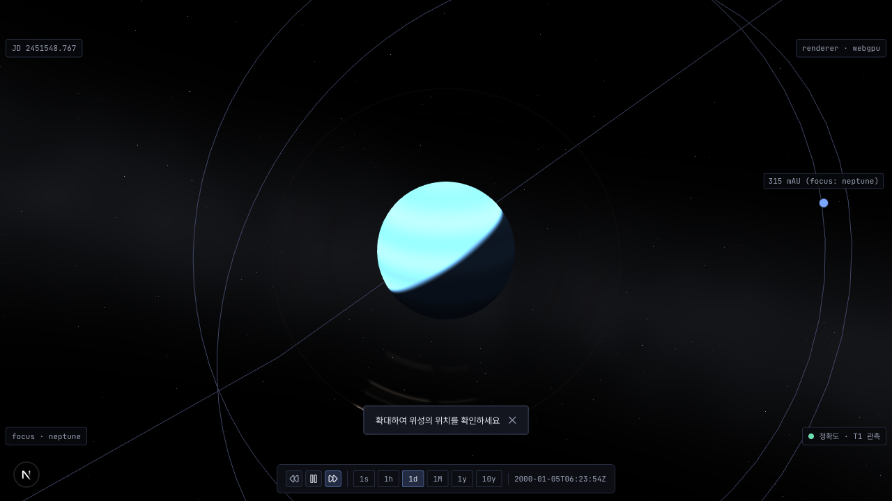

# #1274 D13 — 천왕성 · 해왕성 `IceGiant` 밴드 후보 (1차)

계약 D13 (사용자 육안 승인) 의 비교 자료다. **승인은 사용자가 이슈 코멘트로 한다** — 이 폴더는 준비물이고 승인 기록이 아니다. 형식은 #1226 D1 (`docs/reports/1226-night-lights/d1-candidates/README.md`) 을 따른다.

- 전제 — U1 (a): **현행 조명 (낮면 흰색 수용)** 으로 만들었다. albedo 배율 (U1 (b)) 은 이 자료를 본 뒤 사용자가 정한다 (ADR `20260628-756` §A12.12).
- 후보 값 — ADR §A12.10 후보 표 그대로다 (밴드 uniform 3축만, uniform 증분 `0`).
- 아래 수치는 **판정이 아니라 정보**다. 갭으로 후보를 거르지 않는다 (§A12.10). 승인 후보의 갭이 `< 0.15` 면 R1 경로 (보고 → 재합의) 로 간다.



## 캡처 조건

| 프레임                    | 렌더러                                                                                            | 쿼리 · 절차                                                                                                                                                                                | 파일                         |
| ------------------------- | ------------------------------------------------------------------------------------------------- | ------------------------------------------------------------------------------------------------------------------------------------------------------------------------------------------ | ---------------------------- |
| 제품 (rotate ON)          | 실 Chrome GUI — Playwright `chromium.launch({ headless: false, channel: 'chrome' })` · **WebGPU** | `?gpu=a&focus=<body>&lod=auto` + 변형 플래그 → 2800 ms → `hideDomOverlays` → `jumpToJulianDate(2451626.0)` + `pause` → 1000 ms → `waitForLodSettle`                                        | `product-<body>-<변형>.png`  |
| `verify:756` (rotate=off) | 같은 실 Chrome (WebGPU) · 수치는 swiftshader (WebGL, CI 경로) 로도 1회                            | `?gpu=a&focus=<body>&lod=auto&rotate=off` + 변형 플래그 → `verify:756` `setupPage` 와 같은 대기 (networkidle → 핸들 → 2600 ms) → `pause`. HUD 는 숨기지 않는다 (`verify:756` 과 같은 캡처) | `frame756-<body>-<변형>.png` |

- 공통: 1280×720 · `deviceScaleFactor 1` · `next dev` (로컬) · `packages/core` 는 `feature/1274-ice-giant` 빌드.
- 변형: `off` = `&surface=off` (현행 단색 대조) · `a` / `b` / `c` = `&iceGiantCandidate=<id>`.
- 플래그 없음 · 미지 값 (`zz`) 은 후보 `a` 와 **바이트 동일** PNG 였다 (sha256 앞 16자 uranus `27de2fa7908a9677` · neptune `b6ec356272f9a5dd`). 미지 값은 `console.warn` 2건 (high · mid 머티리얼) 을 냈다. 중복이라 두 파일은 지웠다.
- 측정 · 시트 합성 스크립트는 임시였고 커밋 전에 삭제했다 (volt #67). 위 레시피로 재현한다. 원자료는 `capture-meta.json`.
- 표본 = 투영 disk `0.95R` 안 (`verify:756` `measureDisk` 의 창 · 마스크 · `hfEntropy` 식 그대로).

## 후보 파라미터 (`packages/core/src/scene/procedural-planet-shader.ts` `ICE_GIANT_CANDIDATES`)

| id  | 의도                      | uranus `(amp, count, turb)` | neptune `(amp, count, turb)` |
| --- | ------------------------- | --------------------------- | ---------------------------- |
| `a` | 저대비 기준               | `(0.06, 4, 0.04)`           | `(0.10, 6, 0.06)`            |
| `b` | 매끈한 넓은 띠 (난류 `0`) | `(0.06, 3, 0)`              | `(0.10, 4, 0)`               |
| `c` | 중대비                    | `(0.12, 6, 0.06)`           | `(0.18, 8, 0.10)`            |

## 후보별 수치

갭 = `hfEntropy(ON) − hfEntropy(OFF)`, 기준 `HF_ENTROPY_MARGIN 0.15` (`verify:756` 기존 상수). 포화 = disk 표본 중 R · G · B 모두 `≥ 254` 비율.

| body    | 변형  | 갭 — 제품 (rotate ON, WebGPU) | 갭 — 756 (rotate=off, WebGPU) | 갭 — 756 (rotate=off, swiftshader) | 3채널 포화 — 제품 |    3채널 포화 — 756 |
| ------- | ----- | ----------------------------: | ----------------------------: | ---------------------------------: | ----------------: | ------------------: |
| uranus  | `off` |                             — |                             — |                                  — |          `27.60%` | `27.61%` / `27.62%` |
| uranus  | `a`   |                       `0.020` |                       `0.014` |                            `0.019` |          `55.52%` | `55.88%` / `55.88%` |
| uranus  | `b`   |                       `0.001` |                      `−0.009` |                           `−0.006` |          `55.52%` | `55.85%` / `55.84%` |
| uranus  | `c`   |                       `0.192` |                       `0.129` |                            `0.128` |          `55.51%` | `55.81%` / `55.82%` |
| neptune | `off` |                             — |                             — |                                  — |           `0.00%` |   `0.00%` / `0.00%` |
| neptune | `a`   |                       `0.513` |                       `0.172` |                            `0.168` |           `0.00%` |   `0.00%` / `0.00%` |
| neptune | `b`   |                       `0.303` |                       `0.092` |                            `0.090` |           `0.00%` |   `0.00%` / `0.00%` |
| neptune | `c`   |                       `1.633` |                       `1.084` |                            `1.092` |           `0.00%` |   `0.00%` / `0.00%` |

756 포화 열은 `WebGPU / swiftshader`. 1채널 이상 포화 · 표본 수 · 카메라 · JD 는 `capture-meta.json`.

- **uranus 는 후보 3개 모두 `verify:756` 프레임 갭이 `< 0.15`** 다 (`c` 가 최대 `0.129`). 제품 프레임에서는 `c` 만 `≥ 0.15` (`0.192`) 다.
- **포화 비율이 절차 표면에서 커진다** — uranus 단색 `27.6%` → 절차 표면 `55.5 ~ 55.9%` (세 후보 거의 같다). ADR §A12.12 의 R5 기준선 (`27.4%`) 은 단색 (`StandardMaterial`) 프레임 값이었다. 절차 표면의 광원식은 `smoothstep(0.0, SOFT_TERMINATOR_WIDTH = 0.12, ndl)` 이라 `ndl ≥ 0.12` 인 낮면 전체가 최대 세기를 받는다 [구조 — `procedural-planet-shader.ts` 광원식]. 단색 경로와의 이 차이가 포화 면적 차의 원인인지는 실행으로 확인하지 않았다 [추론].
- neptune 은 3채널 포화 `0%` 이다 (R 채널 비포화 — §A12.12 도출과 일치). 1채널 이상 포화는 단색 `19.8%` → 절차 표면 `60.6 ~ 60.8%` (제품 프레임).

## 고리 겹침 (Phase 0 — 판정 아님, §A12.15 · §A12.18 F1)

body 의 고리 mesh 를 `setEnabled(false)` 로 끈 같은 프레임과의 disk 표본 diff. uranus `6.51%` (756 프레임 · 두 렌더러 동일 `1784 / 27410~27412`) · `6.30%` (제품 프레임 `1362 / 21628`). neptune `0%`.

## 로컬에서 직접 보기

```text
pnpm --filter @astro-simulator/core build
pnpm --filter @astro-simulator/web dev
http://localhost:3000/?focus=uranus&iceGiantCandidate=a
http://localhost:3000/?focus=uranus&iceGiantCandidate=b
http://localhost:3000/?focus=uranus&iceGiantCandidate=c
http://localhost:3000/?focus=uranus&surface=off
http://localhost:3000/?focus=neptune&iceGiantCandidate=a
http://localhost:3000/?focus=neptune&iceGiantCandidate=b
http://localhost:3000/?focus=neptune&iceGiantCandidate=c
http://localhost:3000/?focus=neptune&surface=off
```

결정적 프레임은 `&rotate=off` 를 붙인다.

## 프레임별 원본

| body         | `off`                                             | `a`                                           | `b`                                           | `c`                                           |
| ------------ | ------------------------------------------------- | --------------------------------------------- | --------------------------------------------- | --------------------------------------------- |
| uranus 제품  |    |    |    |    |
| neptune 제품 |  |  |  |  |
| uranus 756   |    |    |    |    |
| neptune 756  |  |  |  |  |
